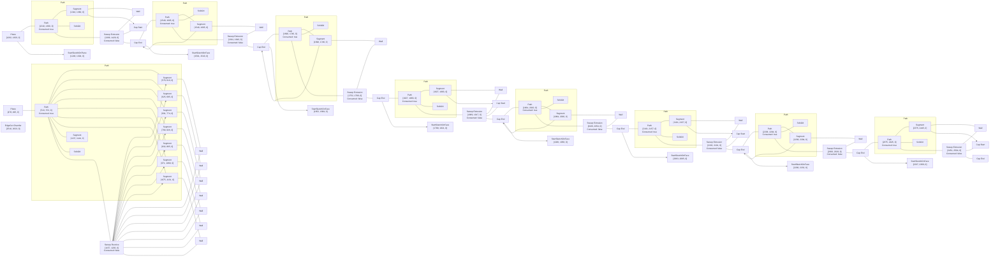

```mermaid
flowchart LR
  subgraph path2 [Path]
    2["Path<br>[513, 572, 0]<br>Consumed: true"]
      %% [ProgramBodyItem { index: 9 }, VariableDeclarationDeclaration, VariableDeclarationInit, PipeBodyItem { index: 0 }]
    3["Segment<br>[578, 619, 0]"]
      %% [ProgramBodyItem { index: 9 }, VariableDeclarationDeclaration, VariableDeclarationInit, PipeBodyItem { index: 1 }]
    4["Segment<br>[625, 685, 0]"]
      %% [ProgramBodyItem { index: 9 }, VariableDeclarationDeclaration, VariableDeclarationInit, PipeBodyItem { index: 2 }]
    5["Segment<br>[691, 774, 0]"]
      %% [ProgramBodyItem { index: 9 }, VariableDeclarationDeclaration, VariableDeclarationInit, PipeBodyItem { index: 3 }]
    6["Segment<br>[780, 826, 0]"]
      %% [ProgramBodyItem { index: 9 }, VariableDeclarationDeclaration, VariableDeclarationInit, PipeBodyItem { index: 4 }]
    7["Segment<br>[832, 865, 0]"]
      %% [ProgramBodyItem { index: 9 }, VariableDeclarationDeclaration, VariableDeclarationInit, PipeBodyItem { index: 5 }]
    8["Segment<br>[871, 1069, 0]"]
      %% [ProgramBodyItem { index: 9 }, VariableDeclarationDeclaration, VariableDeclarationInit, PipeBodyItem { index: 6 }]
    9["Segment<br>[1075, 1131, 0]"]
      %% [ProgramBodyItem { index: 9 }, VariableDeclarationDeclaration, VariableDeclarationInit, PipeBodyItem { index: 7 }]
    10["Segment<br>[1137, 1144, 0]"]
      %% [ProgramBodyItem { index: 9 }, VariableDeclarationDeclaration, VariableDeclarationInit, PipeBodyItem { index: 8 }]
    11[Solid2d]
  end
  subgraph path21 [Path]
    21["Path<br>[1310, 1360, 0]<br>Consumed: true"]
      %% [ProgramBodyItem { index: 11 }, VariableDeclarationDeclaration, VariableDeclarationInit, PipeBodyItem { index: 1 }]
    22["Segment<br>[1310, 1360, 0]"]
      %% [ProgramBodyItem { index: 11 }, VariableDeclarationDeclaration, VariableDeclarationInit, PipeBodyItem { index: 1 }]
    23[Solid2d]
  end
  subgraph path28 [Path]
    28["Path<br>[1549, 1605, 0]<br>Consumed: true"]
      %% [ProgramBodyItem { index: 13 }, VariableDeclarationDeclaration, VariableDeclarationInit, PipeBodyItem { index: 1 }]
    29["Segment<br>[1549, 1605, 0]"]
      %% [ProgramBodyItem { index: 13 }, VariableDeclarationDeclaration, VariableDeclarationInit, PipeBodyItem { index: 1 }]
    30[Solid2d]
  end
  subgraph path34 [Path]
    34["Path<br>[1690, 1746, 0]<br>Consumed: true"]
      %% [ProgramBodyItem { index: 14 }, VariableDeclarationDeclaration, VariableDeclarationInit, PipeBodyItem { index: 1 }]
    35["Segment<br>[1690, 1746, 0]"]
      %% [ProgramBodyItem { index: 14 }, VariableDeclarationDeclaration, VariableDeclarationInit, PipeBodyItem { index: 1 }]
    36[Solid2d]
  end
  subgraph path40 [Path]
    40["Path<br>[1827, 1883, 0]<br>Consumed: true"]
      %% [ProgramBodyItem { index: 15 }, VariableDeclarationDeclaration, VariableDeclarationInit, PipeBodyItem { index: 1 }]
    41["Segment<br>[1827, 1883, 0]"]
      %% [ProgramBodyItem { index: 15 }, VariableDeclarationDeclaration, VariableDeclarationInit, PipeBodyItem { index: 1 }]
    42[Solid2d]
  end
  subgraph path47 [Path]
    47["Path<br>[1964, 2020, 0]<br>Consumed: true"]
      %% [ProgramBodyItem { index: 16 }, VariableDeclarationDeclaration, VariableDeclarationInit, PipeBodyItem { index: 1 }]
    48["Segment<br>[1964, 2020, 0]"]
      %% [ProgramBodyItem { index: 16 }, VariableDeclarationDeclaration, VariableDeclarationInit, PipeBodyItem { index: 1 }]
    49[Solid2d]
  end
  subgraph path53 [Path]
    53["Path<br>[2101, 2157, 0]<br>Consumed: true"]
      %% [ProgramBodyItem { index: 17 }, VariableDeclarationDeclaration, VariableDeclarationInit, PipeBodyItem { index: 1 }]
    54["Segment<br>[2101, 2157, 0]"]
      %% [ProgramBodyItem { index: 17 }, VariableDeclarationDeclaration, VariableDeclarationInit, PipeBodyItem { index: 1 }]
    55[Solid2d]
  end
  subgraph path60 [Path]
    60["Path<br>[2238, 2294, 0]<br>Consumed: true"]
      %% [ProgramBodyItem { index: 18 }, VariableDeclarationDeclaration, VariableDeclarationInit, PipeBodyItem { index: 1 }]
    61["Segment<br>[2238, 2294, 0]"]
      %% [ProgramBodyItem { index: 18 }, VariableDeclarationDeclaration, VariableDeclarationInit, PipeBodyItem { index: 1 }]
    62[Solid2d]
  end
  subgraph path66 [Path]
    66["Path<br>[2375, 2445, 0]<br>Consumed: true"]
      %% [ProgramBodyItem { index: 19 }, VariableDeclarationDeclaration, VariableDeclarationInit, PipeBodyItem { index: 1 }]
    67["Segment<br>[2375, 2445, 0]"]
      %% [ProgramBodyItem { index: 19 }, VariableDeclarationDeclaration, VariableDeclarationInit, PipeBodyItem { index: 1 }]
    68[Solid2d]
  end
  1["Plane<br>[478, 495, 0]"]
    %% [ProgramBodyItem { index: 8 }, VariableDeclarationDeclaration, VariableDeclarationInit]
  12["Sweep Revolve<br>[1157, 1203, 0]<br>Consumed: false"]
    %% [ProgramBodyItem { index: 10 }, VariableDeclarationDeclaration, VariableDeclarationInit]
  13[Wall]
    %% face_code_ref=Missing NodePath
  14[Wall]
    %% face_code_ref=Missing NodePath
  15[Wall]
    %% face_code_ref=Missing NodePath
  16[Wall]
    %% face_code_ref=Missing NodePath
  17[Wall]
    %% face_code_ref=Missing NodePath
  18[Wall]
    %% face_code_ref=Missing NodePath
  19[Wall]
    %% face_code_ref=Missing NodePath
  20["Plane<br>[1262, 1303, 0]"]
    %% [ProgramBodyItem { index: 11 }, VariableDeclarationDeclaration, VariableDeclarationInit, PipeBodyItem { index: 0 }, CallKwUnlabeledArg]
  24["Sweep Extrusion<br>[1366, 1429, 0]<br>Consumed: false"]
    %% [ProgramBodyItem { index: 11 }, VariableDeclarationDeclaration, VariableDeclarationInit, PipeBodyItem { index: 2 }]
  25[Wall]
    %% face_code_ref=Missing NodePath
  26["Cap Start"]
    %% face_code_ref=Missing NodePath
  27["Cap End"]
    %% face_code_ref=[ProgramBodyItem { index: 13 }, VariableDeclarationDeclaration, VariableDeclarationInit, PipeBodyItem { index: 0 }]
  31["Sweep Extrusion<br>[1611, 1643, 0]<br>Consumed: false"]
    %% [ProgramBodyItem { index: 13 }, VariableDeclarationDeclaration, VariableDeclarationInit, PipeBodyItem { index: 2 }]
  32[Wall]
    %% face_code_ref=Missing NodePath
  33["Cap End"]
    %% face_code_ref=[ProgramBodyItem { index: 14 }, VariableDeclarationDeclaration, VariableDeclarationInit, PipeBodyItem { index: 0 }]
  37["Sweep Extrusion<br>[1752, 1780, 0]<br>Consumed: false"]
    %% [ProgramBodyItem { index: 14 }, VariableDeclarationDeclaration, VariableDeclarationInit, PipeBodyItem { index: 2 }]
  38[Wall]
    %% face_code_ref=Missing NodePath
  39["Cap End"]
    %% face_code_ref=[ProgramBodyItem { index: 15 }, VariableDeclarationDeclaration, VariableDeclarationInit, PipeBodyItem { index: 0 }]
  43["Sweep Extrusion<br>[1889, 1917, 0]<br>Consumed: false"]
    %% [ProgramBodyItem { index: 15 }, VariableDeclarationDeclaration, VariableDeclarationInit, PipeBodyItem { index: 2 }]
  44[Wall]
    %% face_code_ref=Missing NodePath
  45["Cap Start"]
    %% face_code_ref=Missing NodePath
  46["Cap End"]
    %% face_code_ref=[ProgramBodyItem { index: 16 }, VariableDeclarationDeclaration, VariableDeclarationInit, PipeBodyItem { index: 0 }]
  50["Sweep Extrusion<br>[2026, 2054, 0]<br>Consumed: false"]
    %% [ProgramBodyItem { index: 16 }, VariableDeclarationDeclaration, VariableDeclarationInit, PipeBodyItem { index: 2 }]
  51[Wall]
    %% face_code_ref=Missing NodePath
  52["Cap End"]
    %% face_code_ref=[ProgramBodyItem { index: 17 }, VariableDeclarationDeclaration, VariableDeclarationInit, PipeBodyItem { index: 0 }]
  56["Sweep Extrusion<br>[2163, 2191, 0]<br>Consumed: false"]
    %% [ProgramBodyItem { index: 17 }, VariableDeclarationDeclaration, VariableDeclarationInit, PipeBodyItem { index: 2 }]
  57[Wall]
    %% face_code_ref=Missing NodePath
  58["Cap Start"]
    %% face_code_ref=Missing NodePath
  59["Cap End"]
    %% face_code_ref=[ProgramBodyItem { index: 18 }, VariableDeclarationDeclaration, VariableDeclarationInit, PipeBodyItem { index: 0 }]
  63["Sweep Extrusion<br>[2300, 2328, 0]<br>Consumed: false"]
    %% [ProgramBodyItem { index: 18 }, VariableDeclarationDeclaration, VariableDeclarationInit, PipeBodyItem { index: 2 }]
  64[Wall]
    %% face_code_ref=Missing NodePath
  65["Cap End"]
    %% face_code_ref=[ProgramBodyItem { index: 19 }, VariableDeclarationDeclaration, VariableDeclarationInit, PipeBodyItem { index: 0 }]
  69["Sweep Extrusion<br>[2451, 2504, 0]<br>Consumed: false"]
    %% [ProgramBodyItem { index: 19 }, VariableDeclarationDeclaration, VariableDeclarationInit, PipeBodyItem { index: 2 }]
  70[Wall]
    %% face_code_ref=Missing NodePath
  71["Cap Start"]
    %% face_code_ref=Missing NodePath
  72["Cap End"]
    %% face_code_ref=Missing NodePath
  73["EdgeCut Chamfer<br>[2510, 2623, 0]"]
    %% [ProgramBodyItem { index: 19 }, VariableDeclarationDeclaration, VariableDeclarationInit, PipeBodyItem { index: 3 }]
  74["StartSketchOnPlane<br>[1248, 1304, 0]"]
    %% [ProgramBodyItem { index: 11 }, VariableDeclarationDeclaration, VariableDeclarationInit, PipeBodyItem { index: 0 }]
  75["StartSketchOnFace<br>[1501, 1543, 0]"]
    %% [ProgramBodyItem { index: 13 }, VariableDeclarationDeclaration, VariableDeclarationInit, PipeBodyItem { index: 0 }]
  76["StartSketchOnFace<br>[1652, 1684, 0]"]
    %% [ProgramBodyItem { index: 14 }, VariableDeclarationDeclaration, VariableDeclarationInit, PipeBodyItem { index: 0 }]
  77["StartSketchOnFace<br>[1789, 1821, 0]"]
    %% [ProgramBodyItem { index: 15 }, VariableDeclarationDeclaration, VariableDeclarationInit, PipeBodyItem { index: 0 }]
  78["StartSketchOnFace<br>[1926, 1958, 0]"]
    %% [ProgramBodyItem { index: 16 }, VariableDeclarationDeclaration, VariableDeclarationInit, PipeBodyItem { index: 0 }]
  79["StartSketchOnFace<br>[2063, 2095, 0]"]
    %% [ProgramBodyItem { index: 17 }, VariableDeclarationDeclaration, VariableDeclarationInit, PipeBodyItem { index: 0 }]
  80["StartSketchOnFace<br>[2200, 2232, 0]"]
    %% [ProgramBodyItem { index: 18 }, VariableDeclarationDeclaration, VariableDeclarationInit, PipeBodyItem { index: 0 }]
  81["StartSketchOnFace<br>[2337, 2369, 0]"]
    %% [ProgramBodyItem { index: 19 }, VariableDeclarationDeclaration, VariableDeclarationInit, PipeBodyItem { index: 0 }]
  1 --- 2
  2 --- 3
  2 --- 4
  2 --- 5
  2 --- 6
  2 --- 7
  2 --- 8
  2 --- 9
  2 --- 10
  2 --- 11
  2 ---- 12
  12 <--x 3
  3 --- 13
  12 <--x 4
  4 --- 14
  12 <--x 5
  5 --- 15
  12 <--x 6
  6 --- 16
  12 <--x 7
  7 --- 17
  12 <--x 8
  8 --- 18
  12 <--x 9
  9 --- 19
  12 --- 13
  12 --- 14
  12 --- 15
  12 --- 16
  12 --- 17
  12 --- 18
  12 --- 19
  20 --- 21
  20 <--x 74
  21 --- 22
  21 --- 23
  21 ---- 24
  22 --- 25
  22 x--> 26
  24 --- 25
  24 --- 26
  24 --- 27
  27 --- 28
  29 <--x 27
  27 <--x 75
  28 --- 29
  28 --- 30
  28 ---- 31
  29 --- 32
  31 --- 32
  31 --- 33
  33 --- 34
  35 <--x 33
  33 <--x 76
  34 --- 35
  34 --- 36
  34 ---- 37
  35 --- 38
  37 --- 38
  37 --- 39
  39 --- 40
  39 <--x 77
  40 --- 41
  40 --- 42
  40 ---- 43
  41 --- 44
  41 x--> 45
  43 --- 44
  43 --- 45
  43 --- 46
  46 --- 47
  48 <--x 46
  46 <--x 78
  47 --- 48
  47 --- 49
  47 ---- 50
  48 --- 51
  50 --- 51
  50 --- 52
  52 --- 53
  52 <--x 79
  53 --- 54
  53 --- 55
  53 ---- 56
  54 --- 57
  54 x--> 58
  56 --- 57
  56 --- 58
  56 --- 59
  59 --- 60
  61 <--x 59
  59 <--x 80
  60 --- 61
  60 --- 62
  60 ---- 63
  61 --- 64
  63 --- 64
  63 --- 65
  65 --- 66
  65 <--x 81
  66 --- 67
  66 --- 68
  66 ---- 69
  67 --- 70
  67 x--> 71
  69 --- 70
  69 --- 71
  69 --- 72
```
