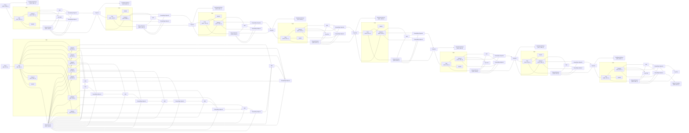

```mermaid
flowchart LR
  subgraph path11 [Path]
    11["Path<br>[490, 549, 0]"]
      %% [ProgramBodyItem { index: 9 }, VariableDeclarationDeclaration, VariableDeclarationInit, PipeBodyItem { index: 0 }]
    20["Segment<br>[555, 596, 0]"]
      %% [ProgramBodyItem { index: 9 }, VariableDeclarationDeclaration, VariableDeclarationInit, PipeBodyItem { index: 1 }]
    21["Segment<br>[602, 662, 0]"]
      %% [ProgramBodyItem { index: 9 }, VariableDeclarationDeclaration, VariableDeclarationInit, PipeBodyItem { index: 2 }]
    22["Segment<br>[668, 751, 0]"]
      %% [ProgramBodyItem { index: 9 }, VariableDeclarationDeclaration, VariableDeclarationInit, PipeBodyItem { index: 3 }]
    23["Segment<br>[757, 803, 0]"]
      %% [ProgramBodyItem { index: 9 }, VariableDeclarationDeclaration, VariableDeclarationInit, PipeBodyItem { index: 4 }]
    24["Segment<br>[809, 842, 0]"]
      %% [ProgramBodyItem { index: 9 }, VariableDeclarationDeclaration, VariableDeclarationInit, PipeBodyItem { index: 5 }]
    25["Segment<br>[848, 1046, 0]"]
      %% [ProgramBodyItem { index: 9 }, VariableDeclarationDeclaration, VariableDeclarationInit, PipeBodyItem { index: 6 }]
    26["Segment<br>[1052, 1108, 0]"]
      %% [ProgramBodyItem { index: 9 }, VariableDeclarationDeclaration, VariableDeclarationInit, PipeBodyItem { index: 7 }]
    27["Segment<br>[1114, 1121, 0]"]
      %% [ProgramBodyItem { index: 9 }, VariableDeclarationDeclaration, VariableDeclarationInit, PipeBodyItem { index: 8 }]
    40[Solid2d]
  end
  subgraph path12 [Path]
    12["Path<br>[1287, 1337, 0]"]
      %% [ProgramBodyItem { index: 11 }, VariableDeclarationDeclaration, VariableDeclarationInit, PipeBodyItem { index: 1 }]
    28["Segment<br>[1287, 1337, 0]"]
      %% [ProgramBodyItem { index: 11 }, VariableDeclarationDeclaration, VariableDeclarationInit, PipeBodyItem { index: 1 }]
    43[Solid2d]
  end
  subgraph path13 [Path]
    13["Path<br>[1526, 1585, 0]"]
      %% [ProgramBodyItem { index: 13 }, VariableDeclarationDeclaration, VariableDeclarationInit, PipeBodyItem { index: 1 }]
    29["Segment<br>[1526, 1585, 0]"]
      %% [ProgramBodyItem { index: 13 }, VariableDeclarationDeclaration, VariableDeclarationInit, PipeBodyItem { index: 1 }]
    42[Solid2d]
  end
  subgraph path14 [Path]
    14["Path<br>[1673, 1732, 0]"]
      %% [ProgramBodyItem { index: 14 }, VariableDeclarationDeclaration, VariableDeclarationInit, PipeBodyItem { index: 1 }]
    30["Segment<br>[1673, 1732, 0]"]
      %% [ProgramBodyItem { index: 14 }, VariableDeclarationDeclaration, VariableDeclarationInit, PipeBodyItem { index: 1 }]
    37[Solid2d]
  end
  subgraph path15 [Path]
    15["Path<br>[1816, 1875, 0]"]
      %% [ProgramBodyItem { index: 15 }, VariableDeclarationDeclaration, VariableDeclarationInit, PipeBodyItem { index: 1 }]
    31["Segment<br>[1816, 1875, 0]"]
      %% [ProgramBodyItem { index: 15 }, VariableDeclarationDeclaration, VariableDeclarationInit, PipeBodyItem { index: 1 }]
    44[Solid2d]
  end
  subgraph path16 [Path]
    16["Path<br>[1959, 2018, 0]"]
      %% [ProgramBodyItem { index: 16 }, VariableDeclarationDeclaration, VariableDeclarationInit, PipeBodyItem { index: 1 }]
    32["Segment<br>[1959, 2018, 0]"]
      %% [ProgramBodyItem { index: 16 }, VariableDeclarationDeclaration, VariableDeclarationInit, PipeBodyItem { index: 1 }]
    41[Solid2d]
  end
  subgraph path17 [Path]
    17["Path<br>[2102, 2161, 0]"]
      %% [ProgramBodyItem { index: 17 }, VariableDeclarationDeclaration, VariableDeclarationInit, PipeBodyItem { index: 1 }]
    33["Segment<br>[2102, 2161, 0]"]
      %% [ProgramBodyItem { index: 17 }, VariableDeclarationDeclaration, VariableDeclarationInit, PipeBodyItem { index: 1 }]
    38[Solid2d]
  end
  subgraph path18 [Path]
    18["Path<br>[2245, 2304, 0]"]
      %% [ProgramBodyItem { index: 18 }, VariableDeclarationDeclaration, VariableDeclarationInit, PipeBodyItem { index: 1 }]
    34["Segment<br>[2245, 2304, 0]"]
      %% [ProgramBodyItem { index: 18 }, VariableDeclarationDeclaration, VariableDeclarationInit, PipeBodyItem { index: 1 }]
    39[Solid2d]
  end
  subgraph path19 [Path]
    19["Path<br>[2388, 2497, 0]"]
      %% [ProgramBodyItem { index: 19 }, VariableDeclarationDeclaration, VariableDeclarationInit, PipeBodyItem { index: 1 }]
    35["Segment<br>[2388, 2497, 0]"]
      %% [ProgramBodyItem { index: 19 }, VariableDeclarationDeclaration, VariableDeclarationInit, PipeBodyItem { index: 1 }]
    36[Solid2d]
  end
  1["Plane<br>[455, 472, 0]"]
    %% [ProgramBodyItem { index: 8 }, VariableDeclarationDeclaration, VariableDeclarationInit]
  2["Plane<br>[1239, 1280, 0]"]
    %% [ProgramBodyItem { index: 11 }, VariableDeclarationDeclaration, VariableDeclarationInit, PipeBodyItem { index: 0 }, CallKwUnlabeledArg]
  3["StartSketchOnPlane<br>[1225, 1281, 0]"]
    %% [ProgramBodyItem { index: 11 }, VariableDeclarationDeclaration, VariableDeclarationInit, PipeBodyItem { index: 0 }]
  4["StartSketchOnFace<br>[1921, 1953, 0]"]
    %% [ProgramBodyItem { index: 16 }, VariableDeclarationDeclaration, VariableDeclarationInit, PipeBodyItem { index: 0 }]
  5["StartSketchOnFace<br>[2064, 2096, 0]"]
    %% [ProgramBodyItem { index: 17 }, VariableDeclarationDeclaration, VariableDeclarationInit, PipeBodyItem { index: 0 }]
  6["StartSketchOnFace<br>[2207, 2239, 0]"]
    %% [ProgramBodyItem { index: 18 }, VariableDeclarationDeclaration, VariableDeclarationInit, PipeBodyItem { index: 0 }]
  7["StartSketchOnFace<br>[2350, 2382, 0]"]
    %% [ProgramBodyItem { index: 19 }, VariableDeclarationDeclaration, VariableDeclarationInit, PipeBodyItem { index: 0 }]
  8["StartSketchOnFace<br>[1778, 1810, 0]"]
    %% [ProgramBodyItem { index: 15 }, VariableDeclarationDeclaration, VariableDeclarationInit, PipeBodyItem { index: 0 }]
  9["StartSketchOnFace<br>[1635, 1667, 0]"]
    %% [ProgramBodyItem { index: 14 }, VariableDeclarationDeclaration, VariableDeclarationInit, PipeBodyItem { index: 0 }]
  10["StartSketchOnFace<br>[1478, 1520, 0]"]
    %% [ProgramBodyItem { index: 13 }, VariableDeclarationDeclaration, VariableDeclarationInit, PipeBodyItem { index: 0 }]
  45["Sweep Revolve<br>[1134, 1180, 0]"]
    %% [ProgramBodyItem { index: 10 }, VariableDeclarationDeclaration, VariableDeclarationInit]
  46["Sweep Extrusion<br>[1343, 1406, 0]"]
    %% [ProgramBodyItem { index: 11 }, VariableDeclarationDeclaration, VariableDeclarationInit, PipeBodyItem { index: 2 }]
  47["Sweep Extrusion<br>[1591, 1626, 0]"]
    %% [ProgramBodyItem { index: 13 }, VariableDeclarationDeclaration, VariableDeclarationInit, PipeBodyItem { index: 2 }]
  48["Sweep Extrusion<br>[1738, 1769, 0]"]
    %% [ProgramBodyItem { index: 14 }, VariableDeclarationDeclaration, VariableDeclarationInit, PipeBodyItem { index: 2 }]
  49["Sweep Extrusion<br>[1881, 1912, 0]"]
    %% [ProgramBodyItem { index: 15 }, VariableDeclarationDeclaration, VariableDeclarationInit, PipeBodyItem { index: 2 }]
  50["Sweep Extrusion<br>[2024, 2055, 0]"]
    %% [ProgramBodyItem { index: 16 }, VariableDeclarationDeclaration, VariableDeclarationInit, PipeBodyItem { index: 2 }]
  51["Sweep Extrusion<br>[2167, 2198, 0]"]
    %% [ProgramBodyItem { index: 17 }, VariableDeclarationDeclaration, VariableDeclarationInit, PipeBodyItem { index: 2 }]
  52["Sweep Extrusion<br>[2310, 2341, 0]"]
    %% [ProgramBodyItem { index: 18 }, VariableDeclarationDeclaration, VariableDeclarationInit, PipeBodyItem { index: 2 }]
  53["Sweep Extrusion<br>[2503, 2559, 0]"]
    %% [ProgramBodyItem { index: 19 }, VariableDeclarationDeclaration, VariableDeclarationInit, PipeBodyItem { index: 2 }]
  54[Wall]
    %% face_code_ref=Missing NodePath
  55[Wall]
    %% face_code_ref=Missing NodePath
  56[Wall]
    %% face_code_ref=Missing NodePath
  57[Wall]
    %% face_code_ref=Missing NodePath
  58[Wall]
    %% face_code_ref=Missing NodePath
  59[Wall]
    %% face_code_ref=Missing NodePath
  60[Wall]
    %% face_code_ref=Missing NodePath
  61[Wall]
    %% face_code_ref=Missing NodePath
  62[Wall]
    %% face_code_ref=Missing NodePath
  63[Wall]
    %% face_code_ref=Missing NodePath
  64[Wall]
    %% face_code_ref=Missing NodePath
  65[Wall]
    %% face_code_ref=Missing NodePath
  66[Wall]
    %% face_code_ref=Missing NodePath
  67[Wall]
    %% face_code_ref=Missing NodePath
  68[Wall]
    %% face_code_ref=Missing NodePath
  69["Cap Start"]
    %% face_code_ref=Missing NodePath
  70["Cap Start"]
    %% face_code_ref=Missing NodePath
  71["Cap Start"]
    %% face_code_ref=Missing NodePath
  72["Cap Start"]
    %% face_code_ref=Missing NodePath
  73["Cap End"]
    %% face_code_ref=[ProgramBodyItem { index: 17 }, VariableDeclarationDeclaration, VariableDeclarationInit, PipeBodyItem { index: 0 }]
  74["Cap End"]
    %% face_code_ref=Missing NodePath
  75["Cap End"]
    %% face_code_ref=[ProgramBodyItem { index: 13 }, VariableDeclarationDeclaration, VariableDeclarationInit, PipeBodyItem { index: 0 }]
  76["Cap End"]
    %% face_code_ref=[ProgramBodyItem { index: 14 }, VariableDeclarationDeclaration, VariableDeclarationInit, PipeBodyItem { index: 0 }]
  77["Cap End"]
    %% face_code_ref=[ProgramBodyItem { index: 18 }, VariableDeclarationDeclaration, VariableDeclarationInit, PipeBodyItem { index: 0 }]
  78["Cap End"]
    %% face_code_ref=[ProgramBodyItem { index: 19 }, VariableDeclarationDeclaration, VariableDeclarationInit, PipeBodyItem { index: 0 }]
  79["Cap End"]
    %% face_code_ref=[ProgramBodyItem { index: 15 }, VariableDeclarationDeclaration, VariableDeclarationInit, PipeBodyItem { index: 0 }]
  80["Cap End"]
    %% face_code_ref=[ProgramBodyItem { index: 16 }, VariableDeclarationDeclaration, VariableDeclarationInit, PipeBodyItem { index: 0 }]
  81["SweepEdge Opposite"]
  82["SweepEdge Opposite"]
  83["SweepEdge Opposite"]
  84["SweepEdge Opposite"]
  85["SweepEdge Opposite"]
  86["SweepEdge Opposite"]
  87["SweepEdge Opposite"]
  88["SweepEdge Opposite"]
  89["SweepEdge Adjacent"]
  90["SweepEdge Adjacent"]
  91["SweepEdge Adjacent"]
  92["SweepEdge Adjacent"]
  93["SweepEdge Adjacent"]
  94["SweepEdge Adjacent"]
  95["SweepEdge Adjacent"]
  96["SweepEdge Adjacent"]
  97["SweepEdge Adjacent"]
  98["SweepEdge Adjacent"]
  99["SweepEdge Adjacent"]
  100["SweepEdge Adjacent"]
  101["SweepEdge Adjacent"]
  102["SweepEdge Adjacent"]
  103["EdgeCut Chamfer<br>[2565, 2678, 0]"]
    %% [ProgramBodyItem { index: 19 }, VariableDeclarationDeclaration, VariableDeclarationInit, PipeBodyItem { index: 3 }]
  1 --- 11
  2 <--x 3
  2 --- 12
  80 x--> 4
  73 x--> 5
  77 x--> 6
  78 x--> 7
  79 x--> 8
  76 x--> 9
  75 x--> 10
  11 --- 20
  11 --- 21
  11 --- 22
  11 --- 23
  11 --- 24
  11 --- 25
  11 --- 26
  11 --- 27
  11 --- 40
  11 ---- 45
  12 --- 28
  12 --- 43
  12 ---- 46
  13 --- 29
  13 --- 42
  13 ---- 47
  75 --- 13
  14 --- 30
  14 --- 37
  14 ---- 48
  76 --- 14
  15 --- 31
  15 --- 44
  15 ---- 49
  79 --- 15
  16 --- 32
  16 --- 41
  16 ---- 50
  80 --- 16
  17 --- 33
  17 --- 38
  17 ---- 51
  73 --- 17
  18 --- 34
  18 --- 39
  18 ---- 52
  77 --- 18
  19 --- 35
  19 --- 36
  19 ---- 53
  78 --- 19
  45 <--x 20
  20 --- 68
  20 x--> 97
  45 <--x 21
  21 --- 65
  21 --- 97
  45 <--x 22
  22 --- 64
  22 --- 98
  45 <--x 23
  23 --- 66
  23 --- 99
  45 <--x 24
  24 --- 63
  24 --- 100
  45 <--x 25
  25 --- 62
  25 --- 101
  45 <--x 26
  26 --- 67
  26 --- 102
  28 --- 57
  28 x--> 70
  28 --- 84
  28 --- 92
  29 --- 56
  29 x--> 75
  29 --- 83
  29 --- 91
  30 --- 61
  30 x--> 76
  30 --- 88
  30 --- 96
  31 --- 58
  31 x--> 72
  31 --- 85
  31 --- 93
  32 --- 59
  32 x--> 80
  32 --- 86
  32 --- 94
  33 --- 55
  33 x--> 71
  33 --- 82
  33 --- 90
  34 --- 60
  34 x--> 77
  34 --- 87
  34 --- 95
  35 --- 54
  35 x--> 69
  35 --- 81
  35 --- 89
  45 --- 62
  45 --- 63
  45 --- 64
  45 --- 65
  45 --- 66
  45 --- 67
  45 --- 68
  45 --- 97
  45 --- 98
  45 --- 99
  45 --- 100
  45 --- 101
  45 --- 102
  46 --- 57
  46 --- 70
  46 --- 75
  46 --- 84
  46 --- 92
  47 --- 56
  47 --- 76
  47 --- 83
  47 --- 91
  48 --- 61
  48 --- 79
  48 --- 88
  48 --- 96
  49 --- 58
  49 --- 72
  49 --- 80
  49 --- 85
  49 --- 93
  50 --- 59
  50 --- 73
  50 --- 86
  50 --- 94
  51 --- 55
  51 --- 71
  51 --- 77
  51 --- 82
  51 --- 90
  52 --- 60
  52 --- 78
  52 --- 87
  52 --- 95
  53 --- 54
  53 --- 69
  53 --- 74
  53 --- 81
  53 --- 89
  54 --- 81
  54 --- 89
  55 --- 82
  55 --- 90
  56 --- 83
  56 --- 91
  57 --- 84
  57 --- 92
  58 --- 85
  58 --- 93
  59 --- 86
  59 --- 94
  60 --- 87
  60 --- 95
  61 --- 88
  61 --- 96
  100 <--x 62
  62 --- 101
  99 <--x 63
  63 --- 100
  64 --- 98
  65 --- 97
  98 <--x 66
  66 --- 99
  101 <--x 67
  67 --- 102
  68 --- 97
  102 <--x 68
  86 <--x 73
  81 <--x 74
  84 <--x 75
  83 <--x 76
  82 <--x 77
  87 <--x 78
  88 <--x 79
  85 <--x 80
  81 <--x 103
```
