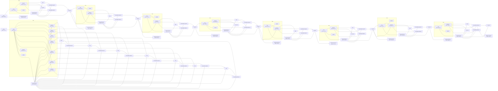

```mermaid
flowchart LR
  subgraph path2 [Path]
    2["Path<br>[490, 549, 0]"]
      %% [ProgramBodyItem { index: 9 }, VariableDeclarationDeclaration, VariableDeclarationInit, PipeBodyItem { index: 0 }]
    3["Segment<br>[555, 596, 0]"]
      %% [ProgramBodyItem { index: 9 }, VariableDeclarationDeclaration, VariableDeclarationInit, PipeBodyItem { index: 1 }]
    4["Segment<br>[602, 662, 0]"]
      %% [ProgramBodyItem { index: 9 }, VariableDeclarationDeclaration, VariableDeclarationInit, PipeBodyItem { index: 2 }]
    5["Segment<br>[668, 751, 0]"]
      %% [ProgramBodyItem { index: 9 }, VariableDeclarationDeclaration, VariableDeclarationInit, PipeBodyItem { index: 3 }]
    6["Segment<br>[757, 803, 0]"]
      %% [ProgramBodyItem { index: 9 }, VariableDeclarationDeclaration, VariableDeclarationInit, PipeBodyItem { index: 4 }]
    7["Segment<br>[809, 842, 0]"]
      %% [ProgramBodyItem { index: 9 }, VariableDeclarationDeclaration, VariableDeclarationInit, PipeBodyItem { index: 5 }]
    8["Segment<br>[848, 1046, 0]"]
      %% [ProgramBodyItem { index: 9 }, VariableDeclarationDeclaration, VariableDeclarationInit, PipeBodyItem { index: 6 }]
    9["Segment<br>[1052, 1108, 0]"]
      %% [ProgramBodyItem { index: 9 }, VariableDeclarationDeclaration, VariableDeclarationInit, PipeBodyItem { index: 7 }]
    10["Segment<br>[1114, 1121, 0]"]
      %% [ProgramBodyItem { index: 9 }, VariableDeclarationDeclaration, VariableDeclarationInit, PipeBodyItem { index: 8 }]
    11[Solid2d]
  end
  subgraph path28 [Path]
    28["Path<br>[1287, 1337, 0]"]
      %% [ProgramBodyItem { index: 11 }, VariableDeclarationDeclaration, VariableDeclarationInit, PipeBodyItem { index: 1 }]
    29["Segment<br>[1287, 1337, 0]"]
      %% [ProgramBodyItem { index: 11 }, VariableDeclarationDeclaration, VariableDeclarationInit, PipeBodyItem { index: 1 }]
    30[Solid2d]
  end
  subgraph path37 [Path]
    37["Path<br>[1526, 1582, 0]"]
      %% [ProgramBodyItem { index: 13 }, VariableDeclarationDeclaration, VariableDeclarationInit, PipeBodyItem { index: 1 }]
    38["Segment<br>[1526, 1582, 0]"]
      %% [ProgramBodyItem { index: 13 }, VariableDeclarationDeclaration, VariableDeclarationInit, PipeBodyItem { index: 1 }]
    39[Solid2d]
  end
  subgraph path45 [Path]
    45["Path<br>[1667, 1723, 0]"]
      %% [ProgramBodyItem { index: 14 }, VariableDeclarationDeclaration, VariableDeclarationInit, PipeBodyItem { index: 1 }]
    46["Segment<br>[1667, 1723, 0]"]
      %% [ProgramBodyItem { index: 14 }, VariableDeclarationDeclaration, VariableDeclarationInit, PipeBodyItem { index: 1 }]
    47[Solid2d]
  end
  subgraph path53 [Path]
    53["Path<br>[1804, 1860, 0]"]
      %% [ProgramBodyItem { index: 15 }, VariableDeclarationDeclaration, VariableDeclarationInit, PipeBodyItem { index: 1 }]
    54["Segment<br>[1804, 1860, 0]"]
      %% [ProgramBodyItem { index: 15 }, VariableDeclarationDeclaration, VariableDeclarationInit, PipeBodyItem { index: 1 }]
    55[Solid2d]
  end
  subgraph path62 [Path]
    62["Path<br>[1941, 1997, 0]"]
      %% [ProgramBodyItem { index: 16 }, VariableDeclarationDeclaration, VariableDeclarationInit, PipeBodyItem { index: 1 }]
    63["Segment<br>[1941, 1997, 0]"]
      %% [ProgramBodyItem { index: 16 }, VariableDeclarationDeclaration, VariableDeclarationInit, PipeBodyItem { index: 1 }]
    64[Solid2d]
  end
  subgraph path70 [Path]
    70["Path<br>[2078, 2134, 0]"]
      %% [ProgramBodyItem { index: 17 }, VariableDeclarationDeclaration, VariableDeclarationInit, PipeBodyItem { index: 1 }]
    71["Segment<br>[2078, 2134, 0]"]
      %% [ProgramBodyItem { index: 17 }, VariableDeclarationDeclaration, VariableDeclarationInit, PipeBodyItem { index: 1 }]
    72[Solid2d]
  end
  subgraph path79 [Path]
    79["Path<br>[2215, 2271, 0]"]
      %% [ProgramBodyItem { index: 18 }, VariableDeclarationDeclaration, VariableDeclarationInit, PipeBodyItem { index: 1 }]
    80["Segment<br>[2215, 2271, 0]"]
      %% [ProgramBodyItem { index: 18 }, VariableDeclarationDeclaration, VariableDeclarationInit, PipeBodyItem { index: 1 }]
    81[Solid2d]
  end
  subgraph path87 [Path]
    87["Path<br>[2352, 2461, 0]"]
      %% [ProgramBodyItem { index: 19 }, VariableDeclarationDeclaration, VariableDeclarationInit, PipeBodyItem { index: 1 }]
    88["Segment<br>[2352, 2461, 0]"]
      %% [ProgramBodyItem { index: 19 }, VariableDeclarationDeclaration, VariableDeclarationInit, PipeBodyItem { index: 1 }]
    89[Solid2d]
  end
  1["Plane<br>[455, 472, 0]"]
    %% [ProgramBodyItem { index: 8 }, VariableDeclarationDeclaration, VariableDeclarationInit]
  12["Sweep Revolve<br>[1134, 1180, 0]"]
    %% [ProgramBodyItem { index: 10 }, VariableDeclarationDeclaration, VariableDeclarationInit]
  13[Wall]
    %% face_code_ref=Missing NodePath
  14[Wall]
    %% face_code_ref=Missing NodePath
  15[Wall]
    %% face_code_ref=Missing NodePath
  16[Wall]
    %% face_code_ref=Missing NodePath
  17[Wall]
    %% face_code_ref=Missing NodePath
  18[Wall]
    %% face_code_ref=Missing NodePath
  19[Wall]
    %% face_code_ref=Missing NodePath
  20["SweepEdge Adjacent"]
  21["SweepEdge Adjacent"]
  22["SweepEdge Adjacent"]
  23["SweepEdge Adjacent"]
  24["SweepEdge Adjacent"]
  25["SweepEdge Adjacent"]
  26["SweepEdge Adjacent"]
  27["Plane<br>[1239, 1280, 0]"]
    %% [ProgramBodyItem { index: 11 }, VariableDeclarationDeclaration, VariableDeclarationInit, PipeBodyItem { index: 0 }, CallKwUnlabeledArg]
  31["Sweep Extrusion<br>[1343, 1406, 0]"]
    %% [ProgramBodyItem { index: 11 }, VariableDeclarationDeclaration, VariableDeclarationInit, PipeBodyItem { index: 2 }]
  32[Wall]
    %% face_code_ref=Missing NodePath
  33["Cap Start"]
    %% face_code_ref=Missing NodePath
  34["Cap End"]
    %% face_code_ref=[ProgramBodyItem { index: 13 }, VariableDeclarationDeclaration, VariableDeclarationInit, PipeBodyItem { index: 0 }]
  35["SweepEdge Opposite"]
  36["SweepEdge Adjacent"]
  40["Sweep Extrusion<br>[1588, 1620, 0]"]
    %% [ProgramBodyItem { index: 13 }, VariableDeclarationDeclaration, VariableDeclarationInit, PipeBodyItem { index: 2 }]
  41[Wall]
    %% face_code_ref=Missing NodePath
  42["Cap End"]
    %% face_code_ref=[ProgramBodyItem { index: 14 }, VariableDeclarationDeclaration, VariableDeclarationInit, PipeBodyItem { index: 0 }]
  43["SweepEdge Opposite"]
  44["SweepEdge Adjacent"]
  48["Sweep Extrusion<br>[1729, 1757, 0]"]
    %% [ProgramBodyItem { index: 14 }, VariableDeclarationDeclaration, VariableDeclarationInit, PipeBodyItem { index: 2 }]
  49[Wall]
    %% face_code_ref=Missing NodePath
  50["Cap End"]
    %% face_code_ref=[ProgramBodyItem { index: 15 }, VariableDeclarationDeclaration, VariableDeclarationInit, PipeBodyItem { index: 0 }]
  51["SweepEdge Opposite"]
  52["SweepEdge Adjacent"]
  56["Sweep Extrusion<br>[1866, 1894, 0]"]
    %% [ProgramBodyItem { index: 15 }, VariableDeclarationDeclaration, VariableDeclarationInit, PipeBodyItem { index: 2 }]
  57[Wall]
    %% face_code_ref=Missing NodePath
  58["Cap Start"]
    %% face_code_ref=Missing NodePath
  59["Cap End"]
    %% face_code_ref=[ProgramBodyItem { index: 16 }, VariableDeclarationDeclaration, VariableDeclarationInit, PipeBodyItem { index: 0 }]
  60["SweepEdge Opposite"]
  61["SweepEdge Adjacent"]
  65["Sweep Extrusion<br>[2003, 2031, 0]"]
    %% [ProgramBodyItem { index: 16 }, VariableDeclarationDeclaration, VariableDeclarationInit, PipeBodyItem { index: 2 }]
  66[Wall]
    %% face_code_ref=Missing NodePath
  67["Cap End"]
    %% face_code_ref=[ProgramBodyItem { index: 17 }, VariableDeclarationDeclaration, VariableDeclarationInit, PipeBodyItem { index: 0 }]
  68["SweepEdge Opposite"]
  69["SweepEdge Adjacent"]
  73["Sweep Extrusion<br>[2140, 2168, 0]"]
    %% [ProgramBodyItem { index: 17 }, VariableDeclarationDeclaration, VariableDeclarationInit, PipeBodyItem { index: 2 }]
  74[Wall]
    %% face_code_ref=Missing NodePath
  75["Cap Start"]
    %% face_code_ref=Missing NodePath
  76["Cap End"]
    %% face_code_ref=[ProgramBodyItem { index: 18 }, VariableDeclarationDeclaration, VariableDeclarationInit, PipeBodyItem { index: 0 }]
  77["SweepEdge Opposite"]
  78["SweepEdge Adjacent"]
  82["Sweep Extrusion<br>[2277, 2305, 0]"]
    %% [ProgramBodyItem { index: 18 }, VariableDeclarationDeclaration, VariableDeclarationInit, PipeBodyItem { index: 2 }]
  83[Wall]
    %% face_code_ref=Missing NodePath
  84["Cap End"]
    %% face_code_ref=[ProgramBodyItem { index: 19 }, VariableDeclarationDeclaration, VariableDeclarationInit, PipeBodyItem { index: 0 }]
  85["SweepEdge Opposite"]
  86["SweepEdge Adjacent"]
  90["Sweep Extrusion<br>[2467, 2520, 0]"]
    %% [ProgramBodyItem { index: 19 }, VariableDeclarationDeclaration, VariableDeclarationInit, PipeBodyItem { index: 2 }]
  91[Wall]
    %% face_code_ref=Missing NodePath
  92["Cap Start"]
    %% face_code_ref=Missing NodePath
  93["Cap End"]
    %% face_code_ref=Missing NodePath
  94["SweepEdge Opposite"]
  95["SweepEdge Adjacent"]
  96["EdgeCut Chamfer<br>[2526, 2639, 0]"]
    %% [ProgramBodyItem { index: 19 }, VariableDeclarationDeclaration, VariableDeclarationInit, PipeBodyItem { index: 3 }]
  97["StartSketchOnPlane<br>[1225, 1281, 0]"]
    %% [ProgramBodyItem { index: 11 }, VariableDeclarationDeclaration, VariableDeclarationInit, PipeBodyItem { index: 0 }]
  98["StartSketchOnFace<br>[1478, 1520, 0]"]
    %% [ProgramBodyItem { index: 13 }, VariableDeclarationDeclaration, VariableDeclarationInit, PipeBodyItem { index: 0 }]
  99["StartSketchOnFace<br>[1629, 1661, 0]"]
    %% [ProgramBodyItem { index: 14 }, VariableDeclarationDeclaration, VariableDeclarationInit, PipeBodyItem { index: 0 }]
  100["StartSketchOnFace<br>[1766, 1798, 0]"]
    %% [ProgramBodyItem { index: 15 }, VariableDeclarationDeclaration, VariableDeclarationInit, PipeBodyItem { index: 0 }]
  101["StartSketchOnFace<br>[1903, 1935, 0]"]
    %% [ProgramBodyItem { index: 16 }, VariableDeclarationDeclaration, VariableDeclarationInit, PipeBodyItem { index: 0 }]
  102["StartSketchOnFace<br>[2040, 2072, 0]"]
    %% [ProgramBodyItem { index: 17 }, VariableDeclarationDeclaration, VariableDeclarationInit, PipeBodyItem { index: 0 }]
  103["StartSketchOnFace<br>[2177, 2209, 0]"]
    %% [ProgramBodyItem { index: 18 }, VariableDeclarationDeclaration, VariableDeclarationInit, PipeBodyItem { index: 0 }]
  104["StartSketchOnFace<br>[2314, 2346, 0]"]
    %% [ProgramBodyItem { index: 19 }, VariableDeclarationDeclaration, VariableDeclarationInit, PipeBodyItem { index: 0 }]
  1 --- 2
  2 --- 3
  2 --- 4
  2 --- 5
  2 --- 6
  2 --- 7
  2 --- 8
  2 --- 9
  2 --- 10
  2 --- 11
  2 ---- 12
  12 <--x 3
  3 --- 13
  3 --- 20
  12 <--x 4
  4 --- 14
  4 --- 21
  12 <--x 5
  5 --- 15
  5 --- 22
  12 <--x 6
  6 --- 16
  6 --- 23
  12 <--x 7
  7 --- 17
  7 --- 24
  12 <--x 8
  8 --- 18
  8 --- 25
  12 <--x 9
  9 --- 19
  9 --- 26
  12 --- 13
  12 --- 14
  12 --- 15
  12 --- 16
  12 --- 17
  12 --- 18
  12 --- 19
  12 --- 20
  12 --- 21
  12 --- 22
  12 --- 23
  12 --- 24
  12 --- 25
  12 --- 26
  13 --- 20
  26 <--x 13
  20 <--x 14
  14 --- 21
  21 <--x 15
  15 --- 22
  22 <--x 16
  16 --- 23
  23 <--x 17
  17 --- 24
  24 <--x 18
  18 --- 25
  25 <--x 19
  19 --- 26
  27 --- 28
  27 <--x 97
  28 --- 29
  28 --- 30
  28 ---- 31
  29 --- 32
  29 x--> 33
  29 --- 35
  29 --- 36
  31 --- 32
  31 --- 33
  31 --- 34
  31 --- 35
  31 --- 36
  32 --- 35
  32 --- 36
  35 <--x 34
  34 --- 37
  38 <--x 34
  34 <--x 98
  37 --- 38
  37 --- 39
  37 ---- 40
  38 --- 41
  38 --- 43
  38 --- 44
  40 --- 41
  40 --- 42
  40 --- 43
  40 --- 44
  41 --- 43
  41 --- 44
  43 <--x 42
  42 --- 45
  46 <--x 42
  42 <--x 99
  45 --- 46
  45 --- 47
  45 ---- 48
  46 --- 49
  46 --- 51
  46 --- 52
  48 --- 49
  48 --- 50
  48 --- 51
  48 --- 52
  49 --- 51
  49 --- 52
  51 <--x 50
  50 --- 53
  50 <--x 100
  53 --- 54
  53 --- 55
  53 ---- 56
  54 --- 57
  54 x--> 58
  54 --- 60
  54 --- 61
  56 --- 57
  56 --- 58
  56 --- 59
  56 --- 60
  56 --- 61
  57 --- 60
  57 --- 61
  60 <--x 59
  59 --- 62
  63 <--x 59
  59 <--x 101
  62 --- 63
  62 --- 64
  62 ---- 65
  63 --- 66
  63 --- 68
  63 --- 69
  65 --- 66
  65 --- 67
  65 --- 68
  65 --- 69
  66 --- 68
  66 --- 69
  68 <--x 67
  67 --- 70
  67 <--x 102
  70 --- 71
  70 --- 72
  70 ---- 73
  71 --- 74
  71 x--> 75
  71 --- 77
  71 --- 78
  73 --- 74
  73 --- 75
  73 --- 76
  73 --- 77
  73 --- 78
  74 --- 77
  74 --- 78
  77 <--x 76
  76 --- 79
  80 <--x 76
  76 <--x 103
  79 --- 80
  79 --- 81
  79 ---- 82
  80 --- 83
  80 --- 85
  80 --- 86
  82 --- 83
  82 --- 84
  82 --- 85
  82 --- 86
  83 --- 85
  83 --- 86
  85 <--x 84
  84 --- 87
  84 <--x 104
  87 --- 88
  87 --- 89
  87 ---- 90
  88 --- 91
  88 x--> 92
  88 --- 94
  88 --- 95
  90 --- 91
  90 --- 92
  90 --- 93
  90 --- 94
  90 --- 95
  91 --- 94
  91 --- 95
  94 <--x 93
  94 <--x 96
```
