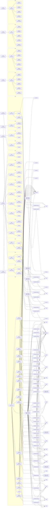

```mermaid
flowchart LR
  subgraph path10 [Path]
    10["Path<br>[748, 783, 0]"]
    33["Segment<br>[791, 817, 0]"]
    36["Segment<br>[825, 886, 0]"]
    41["Segment<br>[894, 953, 0]"]
    45["Segment<br>[961, 1021, 0]"]
    48["Segment<br>[1029, 1088, 0]"]
  end
  subgraph path11 [Path]
    11["Path<br>[748, 783, 0]"]
    31["Segment<br>[791, 817, 0]"]
    35["Segment<br>[825, 886, 0]"]
    39["Segment<br>[894, 953, 0]"]
    44["Segment<br>[961, 1021, 0]"]
    47["Segment<br>[1029, 1088, 0]"]
  end
  subgraph path12 [Path]
    12["Path<br>[748, 783, 0]"]
    32["Segment<br>[791, 817, 0]"]
    38["Segment<br>[825, 886, 0]"]
    42["Segment<br>[894, 953, 0]"]
    43["Segment<br>[961, 1021, 0]"]
    49["Segment<br>[1029, 1088, 0]"]
  end
  subgraph path13 [Path]
    13["Path<br>[748, 783, 0]"]
    34["Segment<br>[791, 817, 0]"]
    37["Segment<br>[825, 886, 0]"]
    40["Segment<br>[894, 953, 0]"]
    46["Segment<br>[961, 1021, 0]"]
    50["Segment<br>[1029, 1088, 0]"]
  end
  subgraph path14 [Path]
    14["Path<br>[1190, 1252, 0]"]
    53["Segment<br>[1190, 1252, 0]"]
    85[Solid2d]
  end
  subgraph path15 [Path]
    15["Path<br>[1190, 1252, 0]"]
    52["Segment<br>[1190, 1252, 0]"]
    89[Solid2d]
  end
  subgraph path16 [Path]
    16["Path<br>[1190, 1252, 0]"]
    54["Segment<br>[1190, 1252, 0]"]
    95[Solid2d]
  end
  subgraph path17 [Path]
    17["Path<br>[1190, 1252, 0]"]
    51["Segment<br>[1190, 1252, 0]"]
    98[Solid2d]
  end
  subgraph path18 [Path]
    18["Path<br>[1278, 1356, 0]"]
    58["Segment<br>[1278, 1356, 0]"]
    87[Solid2d]
  end
  subgraph path19 [Path]
    19["Path<br>[1278, 1356, 0]"]
    56["Segment<br>[1278, 1356, 0]"]
    88[Solid2d]
  end
  subgraph path20 [Path]
    20["Path<br>[1278, 1356, 0]"]
    57["Segment<br>[1278, 1356, 0]"]
    92[Solid2d]
  end
  subgraph path21 [Path]
    21["Path<br>[1278, 1356, 0]"]
    55["Segment<br>[1278, 1356, 0]"]
    96[Solid2d]
  end
  subgraph path22 [Path]
    22["Path<br>[1680, 1715, 0]"]
    59["Segment<br>[1721, 1755, 0]"]
    60["Segment<br>[1761, 1800, 0]"]
    61["Segment<br>[1806, 1844, 0]"]
    62["Segment<br>[1850, 1889, 0]"]
    63["Segment<br>[1895, 1929, 0]"]
    64["Segment<br>[1935, 1978, 0]"]
    65["Segment<br>[1984, 2017, 0]"]
    66["Segment<br>[2023, 2062, 0]"]
    67["Segment<br>[2068, 2107, 0]"]
    68["Segment<br>[2113, 2152, 0]"]
    69["Segment<br>[2158, 2201, 0]"]
    70["Segment<br>[2207, 2258, 0]"]
    71["Segment<br>[2264, 2308, 0]"]
    72["Segment<br>[2314, 2353, 0]"]
    73["Segment<br>[2359, 2397, 0]"]
    74["Segment<br>[2403, 2468, 0]"]
    75["Segment<br>[2474, 2481, 0]"]
    84[Solid2d]
  end
  subgraph path23 [Path]
    23["Path<br>[2566, 2639, 0]"]
    76["Segment<br>[2566, 2639, 0]"]
    91[Solid2d]
  end
  subgraph path24 [Path]
    24["Path<br>[2664, 2737, 0]"]
    77["Segment<br>[2664, 2737, 0]"]
    86[Solid2d]
  end
  subgraph path25 [Path]
    25["Path<br>[2762, 2835, 0]"]
    78["Segment<br>[2762, 2835, 0]"]
    94[Solid2d]
  end
  subgraph path26 [Path]
    26["Path<br>[2860, 2933, 0]"]
    79["Segment<br>[2860, 2933, 0]"]
    99[Solid2d]
  end
  subgraph path27 [Path]
    27["Path<br>[2997, 3136, 0]"]
    80["Segment<br>[2997, 3136, 0]"]
    100[Solid2d]
  end
  subgraph path28 [Path]
    28["Path<br>[3161, 3298, 0]"]
    81["Segment<br>[3161, 3298, 0]"]
    97[Solid2d]
  end
  subgraph path29 [Path]
    29["Path<br>[3323, 3470, 0]"]
    82["Segment<br>[3323, 3470, 0]"]
    93[Solid2d]
  end
  subgraph path30 [Path]
    30["Path<br>[3495, 3641, 0]"]
    83["Segment<br>[3495, 3641, 0]"]
    90[Solid2d]
  end
  1["Plane<br>[715, 740, 0]"]
  2["Plane<br>[715, 740, 0]"]
  3["Plane<br>[715, 740, 0]"]
  4["Plane<br>[715, 740, 0]"]
  5["Plane<br>[1165, 1182, 0]"]
  6["Plane<br>[1165, 1182, 0]"]
  7["Plane<br>[1165, 1182, 0]"]
  8["Plane<br>[1165, 1182, 0]"]
  9["Plane<br>[1657, 1674, 0]"]
  101["Sweep Sweep<br>[1365, 1388, 0]"]
  102["Sweep Sweep<br>[1365, 1388, 0]"]
  103["Sweep Sweep<br>[1365, 1388, 0]"]
  104["Sweep Sweep<br>[1365, 1388, 0]"]
  105["Sweep Extrusion<br>[3694, 3723, 0]"]
  106[Wall]
  107[Wall]
  108[Wall]
  109[Wall]
  110[Wall]
  111[Wall]
  112[Wall]
  113[Wall]
  114[Wall]
  115[Wall]
  116[Wall]
  117[Wall]
  118[Wall]
  119[Wall]
  120[Wall]
  121[Wall]
  122[Wall]
  123[Wall]
  124[Wall]
  125[Wall]
  126["Cap Start"]
  127["Cap Start"]
  128["Cap Start"]
  129["Cap Start"]
  130["Cap Start"]
  131["Cap End"]
  132["Cap End"]
  133["Cap End"]
  134["Cap End"]
  135["Cap End"]
  136["SweepEdge Opposite"]
  137["SweepEdge Adjacent"]
  138["SweepEdge Opposite"]
  139["SweepEdge Adjacent"]
  140["SweepEdge Opposite"]
  141["SweepEdge Adjacent"]
  142["SweepEdge Opposite"]
  143["SweepEdge Adjacent"]
  144["SweepEdge Opposite"]
  145["SweepEdge Adjacent"]
  146["SweepEdge Opposite"]
  147["SweepEdge Adjacent"]
  148["SweepEdge Opposite"]
  149["SweepEdge Adjacent"]
  150["SweepEdge Opposite"]
  151["SweepEdge Adjacent"]
  152["SweepEdge Opposite"]
  153["SweepEdge Adjacent"]
  154["SweepEdge Opposite"]
  155["SweepEdge Adjacent"]
  156["SweepEdge Opposite"]
  157["SweepEdge Adjacent"]
  158["SweepEdge Opposite"]
  159["SweepEdge Adjacent"]
  160["SweepEdge Opposite"]
  161["SweepEdge Adjacent"]
  162["SweepEdge Opposite"]
  163["SweepEdge Adjacent"]
  164["SweepEdge Opposite"]
  165["SweepEdge Adjacent"]
  166["SweepEdge Opposite"]
  167["SweepEdge Adjacent"]
  168["SweepEdge Opposite"]
  169["SweepEdge Adjacent"]
  170["SweepEdge Opposite"]
  171["SweepEdge Adjacent"]
  172["SweepEdge Opposite"]
  173["SweepEdge Adjacent"]
  174["SweepEdge Opposite"]
  175["SweepEdge Adjacent"]
  176["EdgeCut Fillet<br>[3729, 3863, 0]"]
  177["EdgeCut Fillet<br>[3729, 3863, 0]"]
  178["EdgeCut Fillet<br>[3869, 4003, 0]"]
  179["EdgeCut Fillet<br>[3869, 4003, 0]"]
  1 --- 11
  2 --- 10
  3 --- 13
  4 --- 12
  5 --- 14
  5 --- 20
  6 --- 17
  6 --- 18
  7 --- 16
  7 --- 19
  8 --- 15
  8 --- 21
  9 --- 22
  9 --- 23
  9 --- 24
  9 --- 25
  9 --- 26
  9 --- 27
  9 --- 28
  9 --- 29
  9 --- 30
  10 --- 33
  10 --- 36
  10 --- 41
  10 --- 45
  10 --- 48
  11 --- 31
  11 --- 35
  11 --- 39
  11 --- 44
  11 --- 47
  12 --- 32
  12 --- 38
  12 --- 42
  12 --- 43
  12 --- 49
  13 --- 34
  13 --- 37
  13 --- 40
  13 --- 46
  13 --- 50
  14 --- 53
  14 --- 85
  14 ---- 101
  15 --- 52
  15 --- 89
  15 ---- 104
  16 --- 54
  16 --- 95
  16 ---- 103
  17 --- 51
  17 --- 98
  17 ---- 102
  18 --- 58
  18 --- 87
  19 --- 56
  19 --- 88
  20 --- 57
  20 --- 92
  21 --- 55
  21 --- 96
  22 --- 59
  22 --- 60
  22 --- 61
  22 --- 62
  22 --- 63
  22 --- 64
  22 --- 65
  22 --- 66
  22 --- 67
  22 --- 68
  22 --- 69
  22 --- 70
  22 --- 71
  22 --- 72
  22 --- 73
  22 --- 74
  22 --- 75
  22 --- 84
  22 ---- 105
  23 --- 76
  23 --- 91
  24 --- 77
  24 --- 86
  25 --- 78
  25 --- 94
  26 --- 79
  26 --- 99
  27 --- 80
  27 --- 100
  28 --- 81
  28 --- 97
  29 --- 82
  29 --- 93
  30 --- 83
  30 --- 90
  51 --- 107
  51 x--> 127
  51 --- 138
  51 --- 139
  52 --- 109
  52 x--> 129
  52 --- 142
  52 --- 143
  53 --- 106
  53 x--> 126
  53 --- 136
  53 --- 137
  54 --- 108
  54 x--> 128
  54 --- 140
  54 --- 141
  59 --- 119
  59 x--> 130
  59 --- 162
  59 --- 163
  60 --- 114
  60 x--> 130
  60 --- 152
  60 --- 153
  61 --- 121
  61 x--> 130
  61 --- 166
  61 --- 167
  62 --- 117
  62 x--> 130
  62 --- 158
  62 --- 159
  63 --- 111
  63 x--> 130
  63 --- 146
  63 --- 147
  64 --- 116
  64 x--> 130
  64 --- 156
  64 --- 157
  65 --- 113
  65 x--> 130
  65 --- 150
  65 --- 151
  66 --- 112
  66 x--> 130
  66 --- 148
  66 --- 149
  67 --- 124
  67 x--> 130
  67 --- 172
  67 --- 173
  68 --- 125
  68 x--> 130
  68 --- 174
  68 --- 175
  69 --- 122
  69 x--> 130
  69 --- 168
  69 --- 169
  70 --- 115
  70 x--> 130
  70 --- 154
  70 --- 155
  71 --- 120
  71 x--> 130
  71 --- 164
  71 --- 165
  72 --- 123
  72 x--> 130
  72 --- 170
  72 --- 171
  73 --- 110
  73 x--> 130
  73 --- 144
  73 --- 145
  74 --- 118
  74 x--> 130
  74 --- 160
  74 --- 161
  101 --- 106
  101 --- 126
  101 --- 131
  101 --- 136
  101 --- 137
  102 --- 107
  102 --- 127
  102 --- 132
  102 --- 138
  102 --- 139
  103 --- 108
  103 --- 128
  103 --- 133
  103 --- 140
  103 --- 141
  104 --- 109
  104 --- 129
  104 --- 134
  104 --- 142
  104 --- 143
  105 --- 110
  105 --- 111
  105 --- 112
  105 --- 113
  105 --- 114
  105 --- 115
  105 --- 116
  105 --- 117
  105 --- 118
  105 --- 119
  105 --- 120
  105 --- 121
  105 --- 122
  105 --- 123
  105 --- 124
  105 --- 125
  105 --- 130
  105 --- 135
  105 --- 144
  105 --- 145
  105 --- 146
  105 --- 147
  105 --- 148
  105 --- 149
  105 --- 150
  105 --- 151
  105 --- 152
  105 --- 153
  105 --- 154
  105 --- 155
  105 --- 156
  105 --- 157
  105 --- 158
  105 --- 159
  105 --- 160
  105 --- 161
  105 --- 162
  105 --- 163
  105 --- 164
  105 --- 165
  105 --- 166
  105 --- 167
  105 --- 168
  105 --- 169
  105 --- 170
  105 --- 171
  105 --- 172
  105 --- 173
  105 --- 174
  105 --- 175
  136 <--x 106
  137 <--x 106
  138 <--x 107
  139 <--x 107
  140 <--x 108
  141 <--x 108
  142 <--x 109
  143 <--x 109
  144 <--x 110
  145 <--x 110
  171 <--x 110
  146 <--x 111
  159 <--x 111
  148 <--x 112
  149 <--x 112
  151 <--x 112
  150 <--x 113
  151 <--x 113
  157 <--x 113
  152 <--x 114
  153 <--x 114
  163 <--x 114
  154 <--x 115
  156 <--x 116
  157 <--x 116
  158 <--x 117
  159 <--x 117
  167 <--x 117
  145 <--x 118
  160 <--x 118
  161 <--x 118
  161 <--x 119
  162 <--x 119
  163 <--x 119
  164 <--x 120
  165 <--x 120
  153 <--x 121
  166 <--x 121
  167 <--x 121
  168 <--x 122
  175 <--x 122
  165 <--x 123
  170 <--x 123
  171 <--x 123
  149 <--x 124
  172 <--x 124
  173 <--x 124
  173 <--x 125
  174 <--x 125
  175 <--x 125
  136 <--x 131
  138 <--x 132
  140 <--x 133
  142 <--x 134
  144 <--x 135
  146 <--x 135
  148 <--x 135
  150 <--x 135
  152 <--x 135
  154 <--x 135
  156 <--x 135
  158 <--x 135
  160 <--x 135
  162 <--x 135
  164 <--x 135
  166 <--x 135
  168 <--x 135
  170 <--x 135
  172 <--x 135
  174 <--x 135
  147 <--x 178
  155 <--x 179
  157 <--x 176
  169 <--x 177
```
