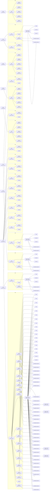

```mermaid
flowchart LR
  subgraph path2 [Path]
    2["Path<br>[816, 851, 0]"]
    3["Segment<br>[859, 885, 0]"]
    4["Segment<br>[893, 956, 0]"]
    5["Segment<br>[964, 1050, 0]"]
    6["Segment<br>[1058, 1120, 0]"]
    7["Segment<br>[1128, 1214, 0]"]
  end
  subgraph path9 [Path]
    9["Path<br>[1318, 1407, 0]"]
    10["Segment<br>[1318, 1407, 0]"]
    11[Solid2d]
  end
  subgraph path12 [Path]
    12["Path<br>[1420, 1525, 0]"]
    13["Segment<br>[1420, 1525, 0]"]
    14[Solid2d]
  end
  subgraph path22 [Path]
    22["Path<br>[816, 851, 0]"]
    23["Segment<br>[859, 885, 0]"]
    24["Segment<br>[893, 956, 0]"]
    25["Segment<br>[964, 1050, 0]"]
    26["Segment<br>[1058, 1120, 0]"]
    27["Segment<br>[1128, 1214, 0]"]
  end
  subgraph path29 [Path]
    29["Path<br>[1318, 1407, 0]"]
    30["Segment<br>[1318, 1407, 0]"]
    31[Solid2d]
  end
  subgraph path32 [Path]
    32["Path<br>[1420, 1525, 0]"]
    33["Segment<br>[1420, 1525, 0]"]
    34[Solid2d]
  end
  subgraph path42 [Path]
    42["Path<br>[816, 851, 0]"]
    43["Segment<br>[859, 885, 0]"]
    44["Segment<br>[893, 956, 0]"]
    45["Segment<br>[964, 1050, 0]"]
    46["Segment<br>[1058, 1120, 0]"]
    47["Segment<br>[1128, 1214, 0]"]
  end
  subgraph path49 [Path]
    49["Path<br>[1318, 1407, 0]"]
    50["Segment<br>[1318, 1407, 0]"]
    51[Solid2d]
  end
  subgraph path52 [Path]
    52["Path<br>[1420, 1525, 0]"]
    53["Segment<br>[1420, 1525, 0]"]
    54[Solid2d]
  end
  subgraph path62 [Path]
    62["Path<br>[816, 851, 0]"]
    63["Segment<br>[859, 885, 0]"]
    64["Segment<br>[893, 956, 0]"]
    65["Segment<br>[964, 1050, 0]"]
    66["Segment<br>[1058, 1120, 0]"]
    67["Segment<br>[1128, 1214, 0]"]
  end
  subgraph path69 [Path]
    69["Path<br>[1318, 1407, 0]"]
    70["Segment<br>[1318, 1407, 0]"]
    71[Solid2d]
  end
  subgraph path72 [Path]
    72["Path<br>[1420, 1525, 0]"]
    73["Segment<br>[1420, 1525, 0]"]
    74[Solid2d]
  end
  subgraph path82 [Path]
    82["Path<br>[1854, 1889, 0]"]
    83["Segment<br>[1895, 1929, 0]"]
    84["Segment<br>[1935, 1982, 0]"]
    85["Segment<br>[1988, 2034, 0]"]
    86["Segment<br>[2040, 2087, 0]"]
    87["Segment<br>[2093, 2127, 0]"]
    88["Segment<br>[2133, 2176, 0]"]
    89["Segment<br>[2182, 2215, 0]"]
    90["Segment<br>[2221, 2268, 0]"]
    91["Segment<br>[2274, 2321, 0]"]
    92["Segment<br>[2327, 2374, 0]"]
    93["Segment<br>[2380, 2423, 0]"]
    94["Segment<br>[2429, 2480, 0]"]
    95["Segment<br>[2486, 2530, 0]"]
    96["Segment<br>[2536, 2583, 0]"]
    97["Segment<br>[2589, 2635, 0]"]
    98["Segment<br>[2641, 2697, 0]"]
    99["Segment<br>[2703, 2710, 0]"]
    100[Solid2d]
  end
  subgraph path101 [Path]
    101["Path<br>[2782, 2876, 0]"]
    102["Segment<br>[2782, 2876, 0]"]
    103[Solid2d]
  end
  subgraph path104 [Path]
    104["Path<br>[2891, 2985, 0]"]
    105["Segment<br>[2891, 2985, 0]"]
    106[Solid2d]
  end
  subgraph path107 [Path]
    107["Path<br>[3000, 3094, 0]"]
    108["Segment<br>[3000, 3094, 0]"]
    109[Solid2d]
  end
  subgraph path110 [Path]
    110["Path<br>[3109, 3203, 0]"]
    111["Segment<br>[3109, 3203, 0]"]
    112[Solid2d]
  end
  subgraph path113 [Path]
    113["Path<br>[3257, 3395, 0]"]
    114["Segment<br>[3257, 3395, 0]"]
    115[Solid2d]
  end
  subgraph path116 [Path]
    116["Path<br>[3410, 3546, 0]"]
    117["Segment<br>[3410, 3546, 0]"]
    118[Solid2d]
  end
  subgraph path119 [Path]
    119["Path<br>[3561, 3707, 0]"]
    120["Segment<br>[3561, 3707, 0]"]
    121[Solid2d]
  end
  subgraph path122 [Path]
    122["Path<br>[3722, 3867, 0]"]
    123["Segment<br>[3722, 3867, 0]"]
    124[Solid2d]
  end
  1["Plane<br>[783, 808, 0]"]
  8["Plane<br>[1291, 1310, 0]"]
  15["Sweep Sweep<br>[1537, 1560, 0]"]
  16[Wall]
  17["Cap Start"]
  18["Cap End"]
  19["SweepEdge Opposite"]
  20["SweepEdge Adjacent"]
  21["Plane<br>[783, 808, 0]"]
  28["Plane<br>[1291, 1310, 0]"]
  35["Sweep Sweep<br>[1537, 1560, 0]"]
  36[Wall]
  37["Cap Start"]
  38["Cap End"]
  39["SweepEdge Opposite"]
  40["SweepEdge Adjacent"]
  41["Plane<br>[783, 808, 0]"]
  48["Plane<br>[1291, 1310, 0]"]
  55["Sweep Sweep<br>[1537, 1560, 0]"]
  56[Wall]
  57["Cap Start"]
  58["Cap End"]
  59["SweepEdge Opposite"]
  60["SweepEdge Adjacent"]
  61["Plane<br>[783, 808, 0]"]
  68["Plane<br>[1291, 1310, 0]"]
  75["Sweep Sweep<br>[1537, 1560, 0]"]
  76[Wall]
  77["Cap Start"]
  78["Cap End"]
  79["SweepEdge Opposite"]
  80["SweepEdge Adjacent"]
  81["Plane<br>[1829, 1848, 0]"]
  125["Sweep Extrusion<br>[3923, 3952, 0]"]
  126[Wall]
  127[Wall]
  128[Wall]
  129[Wall]
  130[Wall]
  131[Wall]
  132[Wall]
  133[Wall]
  134[Wall]
  135[Wall]
  136[Wall]
  137[Wall]
  138[Wall]
  139[Wall]
  140[Wall]
  141[Wall]
  142["Cap Start"]
  143["Cap End"]
  144["SweepEdge Opposite"]
  145["SweepEdge Adjacent"]
  146["SweepEdge Opposite"]
  147["SweepEdge Adjacent"]
  148["SweepEdge Opposite"]
  149["SweepEdge Adjacent"]
  150["SweepEdge Opposite"]
  151["SweepEdge Adjacent"]
  152["SweepEdge Opposite"]
  153["SweepEdge Adjacent"]
  154["SweepEdge Opposite"]
  155["SweepEdge Adjacent"]
  156["SweepEdge Opposite"]
  157["SweepEdge Adjacent"]
  158["SweepEdge Opposite"]
  159["SweepEdge Adjacent"]
  160["SweepEdge Opposite"]
  161["SweepEdge Adjacent"]
  162["SweepEdge Opposite"]
  163["SweepEdge Adjacent"]
  164["SweepEdge Opposite"]
  165["SweepEdge Adjacent"]
  166["SweepEdge Opposite"]
  167["SweepEdge Adjacent"]
  168["SweepEdge Opposite"]
  169["SweepEdge Adjacent"]
  170["SweepEdge Opposite"]
  171["SweepEdge Adjacent"]
  172["SweepEdge Opposite"]
  173["SweepEdge Adjacent"]
  174["SweepEdge Opposite"]
  175["SweepEdge Adjacent"]
  176["EdgeCut Fillet<br>[3958, 4091, 0]"]
  177["EdgeCut Fillet<br>[3958, 4091, 0]"]
  178["EdgeCut Fillet<br>[4097, 4230, 0]"]
  179["EdgeCut Fillet<br>[4097, 4230, 0]"]
  1 --- 2
  2 --- 3
  2 --- 4
  2 --- 5
  2 --- 6
  2 --- 7
  8 --- 9
  8 --- 12
  9 --- 10
  9 ---- 15
  9 --- 11
  10 --- 16
  10 --- 19
  10 --- 20
  12 --- 13
  12 --- 14
  15 --- 16
  15 --- 17
  15 --- 18
  15 --- 19
  15 --- 20
  21 --- 22
  22 --- 23
  22 --- 24
  22 --- 25
  22 --- 26
  22 --- 27
  28 --- 29
  28 --- 32
  29 --- 30
  29 ---- 35
  29 --- 31
  30 --- 36
  30 --- 39
  30 --- 40
  32 --- 33
  32 --- 34
  35 --- 36
  35 --- 37
  35 --- 38
  35 --- 39
  35 --- 40
  41 --- 42
  42 --- 43
  42 --- 44
  42 --- 45
  42 --- 46
  42 --- 47
  48 --- 49
  48 --- 52
  49 --- 50
  49 ---- 55
  49 --- 51
  50 --- 56
  50 --- 59
  50 --- 60
  52 --- 53
  52 --- 54
  55 --- 56
  55 --- 57
  55 --- 58
  55 --- 59
  55 --- 60
  61 --- 62
  62 --- 63
  62 --- 64
  62 --- 65
  62 --- 66
  62 --- 67
  68 --- 69
  68 --- 72
  69 --- 70
  69 ---- 75
  69 --- 71
  70 --- 76
  70 --- 79
  70 --- 80
  72 --- 73
  72 --- 74
  75 --- 76
  75 --- 77
  75 --- 78
  75 --- 79
  75 --- 80
  81 --- 82
  81 --- 101
  81 --- 104
  81 --- 107
  81 --- 110
  81 --- 113
  81 --- 116
  81 --- 119
  81 --- 122
  82 --- 83
  82 --- 84
  82 --- 85
  82 --- 86
  82 --- 87
  82 --- 88
  82 --- 89
  82 --- 90
  82 --- 91
  82 --- 92
  82 --- 93
  82 --- 94
  82 --- 95
  82 --- 96
  82 --- 97
  82 --- 98
  82 --- 99
  82 ---- 125
  82 --- 100
  83 --- 141
  83 --- 174
  83 --- 175
  84 --- 140
  84 --- 172
  84 --- 173
  85 --- 139
  85 --- 170
  85 --- 171
  86 --- 138
  86 --- 168
  86 --- 169
  87 --- 137
  87 --- 166
  87 --- 167
  88 --- 136
  88 --- 164
  88 --- 165
  89 --- 135
  89 --- 162
  89 --- 163
  90 --- 134
  90 --- 160
  90 --- 161
  91 --- 133
  91 --- 158
  91 --- 159
  92 --- 132
  92 --- 156
  92 --- 157
  93 --- 131
  93 --- 154
  93 --- 155
  94 --- 130
  94 --- 152
  94 --- 153
  95 --- 129
  95 --- 150
  95 --- 151
  96 --- 128
  96 --- 148
  96 --- 149
  97 --- 127
  97 --- 146
  97 --- 147
  98 --- 126
  98 --- 144
  98 --- 145
  101 --- 102
  101 --- 103
  104 --- 105
  104 --- 106
  107 --- 108
  107 --- 109
  110 --- 111
  110 --- 112
  113 --- 114
  113 --- 115
  116 --- 117
  116 --- 118
  119 --- 120
  119 --- 121
  122 --- 123
  122 --- 124
  125 --- 126
  125 --- 127
  125 --- 128
  125 --- 129
  125 --- 130
  125 --- 131
  125 --- 132
  125 --- 133
  125 --- 134
  125 --- 135
  125 --- 136
  125 --- 137
  125 --- 138
  125 --- 139
  125 --- 140
  125 --- 141
  125 --- 142
  125 --- 143
  125 --- 144
  125 --- 145
  125 --- 146
  125 --- 147
  125 --- 148
  125 --- 149
  125 --- 150
  125 --- 151
  125 --- 152
  125 --- 153
  125 --- 154
  125 --- 155
  125 --- 156
  125 --- 157
  125 --- 158
  125 --- 159
  125 --- 160
  125 --- 161
  125 --- 162
  125 --- 163
  125 --- 164
  125 --- 165
  125 --- 166
  125 --- 167
  125 --- 168
  125 --- 169
  125 --- 170
  125 --- 171
  125 --- 172
  125 --- 173
  125 --- 174
  125 --- 175
  165 <--x 176
  155 <--x 177
  167 <--x 178
  153 <--x 179
```
