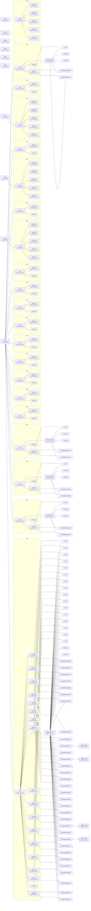

```mermaid
flowchart LR
  subgraph path8 [Path]
    8["Path<br>[816, 851, 0]"]
    9["Segment<br>[859, 885, 0]"]
    10["Segment<br>[893, 956, 0]"]
    11["Segment<br>[964, 1055, 0]"]
    12["Segment<br>[1063, 1125, 0]"]
    13["Segment<br>[1133, 1224, 0]"]
  end
  subgraph path14 [Path]
    14["Path<br>[1328, 1417, 0]"]
    15["Segment<br>[1328, 1417, 0]"]
    16[Solid2d]
  end
  subgraph path17 [Path]
    17["Path<br>[1430, 1535, 0]"]
    18["Segment<br>[1430, 1535, 0]"]
    19[Solid2d]
  end
  subgraph path27 [Path]
    27["Path<br>[816, 851, 0]"]
    28["Segment<br>[859, 885, 0]"]
    29["Segment<br>[893, 956, 0]"]
    30["Segment<br>[964, 1055, 0]"]
    31["Segment<br>[1063, 1125, 0]"]
    32["Segment<br>[1133, 1224, 0]"]
  end
  subgraph path33 [Path]
    33["Path<br>[1328, 1417, 0]"]
    34["Segment<br>[1328, 1417, 0]"]
    35[Solid2d]
  end
  subgraph path36 [Path]
    36["Path<br>[1430, 1535, 0]"]
    37["Segment<br>[1430, 1535, 0]"]
    38[Solid2d]
  end
  subgraph path46 [Path]
    46["Path<br>[816, 851, 0]"]
    47["Segment<br>[859, 885, 0]"]
    48["Segment<br>[893, 956, 0]"]
    49["Segment<br>[964, 1055, 0]"]
    50["Segment<br>[1063, 1125, 0]"]
    51["Segment<br>[1133, 1224, 0]"]
  end
  subgraph path52 [Path]
    52["Path<br>[1328, 1417, 0]"]
    53["Segment<br>[1328, 1417, 0]"]
    54[Solid2d]
  end
  subgraph path55 [Path]
    55["Path<br>[1430, 1535, 0]"]
    56["Segment<br>[1430, 1535, 0]"]
    57[Solid2d]
  end
  subgraph path65 [Path]
    65["Path<br>[816, 851, 0]"]
    66["Segment<br>[859, 885, 0]"]
    67["Segment<br>[893, 956, 0]"]
    68["Segment<br>[964, 1055, 0]"]
    69["Segment<br>[1063, 1125, 0]"]
    70["Segment<br>[1133, 1224, 0]"]
  end
  subgraph path71 [Path]
    71["Path<br>[1328, 1417, 0]"]
    72["Segment<br>[1328, 1417, 0]"]
    73[Solid2d]
  end
  subgraph path74 [Path]
    74["Path<br>[1430, 1535, 0]"]
    75["Segment<br>[1430, 1535, 0]"]
    76[Solid2d]
  end
  subgraph path83 [Path]
    83["Path<br>[1864, 1899, 0]"]
    84["Segment<br>[1905, 1939, 0]"]
    85["Segment<br>[1945, 1992, 0]"]
    86["Segment<br>[1998, 2044, 0]"]
    87["Segment<br>[2050, 2097, 0]"]
    88["Segment<br>[2103, 2137, 0]"]
    89["Segment<br>[2143, 2186, 0]"]
    90["Segment<br>[2192, 2225, 0]"]
    91["Segment<br>[2231, 2278, 0]"]
    92["Segment<br>[2284, 2331, 0]"]
    93["Segment<br>[2337, 2384, 0]"]
    94["Segment<br>[2390, 2433, 0]"]
    95["Segment<br>[2439, 2490, 0]"]
    96["Segment<br>[2496, 2540, 0]"]
    97["Segment<br>[2546, 2593, 0]"]
    98["Segment<br>[2599, 2645, 0]"]
    99["Segment<br>[2651, 2707, 0]"]
    100["Segment<br>[2713, 2720, 0]"]
    101[Solid2d]
  end
  subgraph path102 [Path]
    102["Path<br>[2792, 2886, 0]"]
    103["Segment<br>[2792, 2886, 0]"]
    104[Solid2d]
  end
  subgraph path105 [Path]
    105["Path<br>[2901, 2995, 0]"]
    106["Segment<br>[2901, 2995, 0]"]
    107[Solid2d]
  end
  subgraph path108 [Path]
    108["Path<br>[3010, 3104, 0]"]
    109["Segment<br>[3010, 3104, 0]"]
    110[Solid2d]
  end
  subgraph path111 [Path]
    111["Path<br>[3119, 3213, 0]"]
    112["Segment<br>[3119, 3213, 0]"]
    113[Solid2d]
  end
  subgraph path114 [Path]
    114["Path<br>[3267, 3405, 0]"]
    115["Segment<br>[3267, 3405, 0]"]
    116[Solid2d]
  end
  subgraph path117 [Path]
    117["Path<br>[3420, 3556, 0]"]
    118["Segment<br>[3420, 3556, 0]"]
    119[Solid2d]
  end
  subgraph path120 [Path]
    120["Path<br>[3571, 3717, 0]"]
    121["Segment<br>[3571, 3717, 0]"]
    122[Solid2d]
  end
  subgraph path123 [Path]
    123["Path<br>[3732, 3877, 0]"]
    124["Segment<br>[3732, 3877, 0]"]
    125[Solid2d]
  end
  1["Plane<br>[783, 808, 0]"]
  2["Plane<br>[783, 808, 0]"]
  3["Plane<br>[783, 808, 0]"]
  4["Plane<br>[783, 808, 0]"]
  5["Plane<br>[783, 808, 0]"]
  6["Plane<br>[783, 808, 0]"]
  7["Plane<br>[783, 808, 0]"]
  20["Sweep Sweep<br>[1547, 1570, 0]"]
  21[Wall]
  22["Cap Start"]
  23["Cap End"]
  24["SweepEdge Opposite"]
  25["SweepEdge Adjacent"]
  26["Plane<br>[783, 808, 0]"]
  39["Sweep Sweep<br>[1547, 1570, 0]"]
  40[Wall]
  41["Cap Start"]
  42["Cap End"]
  43["SweepEdge Opposite"]
  44["SweepEdge Adjacent"]
  45["Plane<br>[783, 808, 0]"]
  58["Sweep Sweep<br>[1547, 1570, 0]"]
  59[Wall]
  60["Cap Start"]
  61["Cap End"]
  62["SweepEdge Opposite"]
  63["SweepEdge Adjacent"]
  64["Plane<br>[783, 808, 0]"]
  77["Sweep Sweep<br>[1547, 1570, 0]"]
  78[Wall]
  79["Cap Start"]
  80["Cap End"]
  81["SweepEdge Opposite"]
  82["SweepEdge Adjacent"]
  126["Sweep Extrusion<br>[3933, 3962, 0]"]
  127[Wall]
  128[Wall]
  129[Wall]
  130[Wall]
  131[Wall]
  132[Wall]
  133[Wall]
  134[Wall]
  135[Wall]
  136[Wall]
  137[Wall]
  138[Wall]
  139[Wall]
  140[Wall]
  141[Wall]
  142[Wall]
  143["Cap Start"]
  144["Cap End"]
  145["SweepEdge Opposite"]
  146["SweepEdge Adjacent"]
  147["SweepEdge Opposite"]
  148["SweepEdge Adjacent"]
  149["SweepEdge Opposite"]
  150["SweepEdge Adjacent"]
  151["SweepEdge Opposite"]
  152["SweepEdge Adjacent"]
  153["SweepEdge Opposite"]
  154["SweepEdge Adjacent"]
  155["SweepEdge Opposite"]
  156["SweepEdge Adjacent"]
  157["SweepEdge Opposite"]
  158["SweepEdge Adjacent"]
  159["SweepEdge Opposite"]
  160["SweepEdge Adjacent"]
  161["SweepEdge Opposite"]
  162["SweepEdge Adjacent"]
  163["SweepEdge Opposite"]
  164["SweepEdge Adjacent"]
  165["SweepEdge Opposite"]
  166["SweepEdge Adjacent"]
  167["SweepEdge Opposite"]
  168["SweepEdge Adjacent"]
  169["SweepEdge Opposite"]
  170["SweepEdge Adjacent"]
  171["SweepEdge Opposite"]
  172["SweepEdge Adjacent"]
  173["SweepEdge Opposite"]
  174["SweepEdge Adjacent"]
  175["SweepEdge Opposite"]
  176["SweepEdge Adjacent"]
  177["EdgeCut Fillet<br>[3968, 4101, 0]"]
  178["EdgeCut Fillet<br>[3968, 4101, 0]"]
  179["EdgeCut Fillet<br>[4107, 4240, 0]"]
  180["EdgeCut Fillet<br>[4107, 4240, 0]"]
  1 --- 14
  1 --- 17
  1 --- 33
  1 --- 36
  1 --- 52
  1 --- 55
  1 --- 71
  1 --- 74
  1 --- 83
  1 --- 102
  1 --- 105
  1 --- 108
  1 --- 111
  1 --- 114
  1 --- 117
  1 --- 120
  1 --- 123
  7 --- 8
  8 --- 9
  8 --- 10
  8 --- 11
  8 --- 12
  8 --- 13
  14 --- 15
  14 ---- 20
  14 --- 16
  15 --- 21
  15 --- 24
  15 --- 25
  17 --- 18
  17 --- 19
  20 --- 21
  20 --- 22
  20 --- 23
  20 --- 24
  20 --- 25
  26 --- 27
  27 --- 28
  27 --- 29
  27 --- 30
  27 --- 31
  27 --- 32
  33 --- 34
  33 ---- 39
  33 --- 35
  34 --- 40
  34 --- 43
  34 --- 44
  36 --- 37
  36 --- 38
  39 --- 40
  39 --- 41
  39 --- 42
  39 --- 43
  39 --- 44
  45 --- 46
  46 --- 47
  46 --- 48
  46 --- 49
  46 --- 50
  46 --- 51
  52 --- 53
  52 ---- 58
  52 --- 54
  53 --- 59
  53 --- 62
  53 --- 63
  55 --- 56
  55 --- 57
  58 --- 59
  58 --- 60
  58 --- 61
  58 --- 62
  58 --- 63
  64 --- 65
  65 --- 66
  65 --- 67
  65 --- 68
  65 --- 69
  65 --- 70
  71 --- 72
  71 ---- 77
  71 --- 73
  72 --- 78
  72 --- 81
  72 --- 82
  74 --- 75
  74 --- 76
  77 --- 78
  77 --- 79
  77 --- 80
  77 --- 81
  77 --- 82
  83 --- 84
  83 --- 85
  83 --- 86
  83 --- 87
  83 --- 88
  83 --- 89
  83 --- 90
  83 --- 91
  83 --- 92
  83 --- 93
  83 --- 94
  83 --- 95
  83 --- 96
  83 --- 97
  83 --- 98
  83 --- 99
  83 --- 100
  83 ---- 126
  83 --- 101
  84 --- 142
  84 --- 175
  84 --- 176
  85 --- 141
  85 --- 173
  85 --- 174
  86 --- 140
  86 --- 171
  86 --- 172
  87 --- 139
  87 --- 169
  87 --- 170
  88 --- 138
  88 --- 167
  88 --- 168
  89 --- 137
  89 --- 165
  89 --- 166
  90 --- 136
  90 --- 163
  90 --- 164
  91 --- 135
  91 --- 161
  91 --- 162
  92 --- 134
  92 --- 159
  92 --- 160
  93 --- 133
  93 --- 157
  93 --- 158
  94 --- 132
  94 --- 155
  94 --- 156
  95 --- 131
  95 --- 153
  95 --- 154
  96 --- 130
  96 --- 151
  96 --- 152
  97 --- 129
  97 --- 149
  97 --- 150
  98 --- 128
  98 --- 147
  98 --- 148
  99 --- 127
  99 --- 145
  99 --- 146
  102 --- 103
  102 --- 104
  105 --- 106
  105 --- 107
  108 --- 109
  108 --- 110
  111 --- 112
  111 --- 113
  114 --- 115
  114 --- 116
  117 --- 118
  117 --- 119
  120 --- 121
  120 --- 122
  123 --- 124
  123 --- 125
  126 --- 127
  126 --- 128
  126 --- 129
  126 --- 130
  126 --- 131
  126 --- 132
  126 --- 133
  126 --- 134
  126 --- 135
  126 --- 136
  126 --- 137
  126 --- 138
  126 --- 139
  126 --- 140
  126 --- 141
  126 --- 142
  126 --- 143
  126 --- 144
  126 --- 145
  126 --- 146
  126 --- 147
  126 --- 148
  126 --- 149
  126 --- 150
  126 --- 151
  126 --- 152
  126 --- 153
  126 --- 154
  126 --- 155
  126 --- 156
  126 --- 157
  126 --- 158
  126 --- 159
  126 --- 160
  126 --- 161
  126 --- 162
  126 --- 163
  126 --- 164
  126 --- 165
  126 --- 166
  126 --- 167
  126 --- 168
  126 --- 169
  126 --- 170
  126 --- 171
  126 --- 172
  126 --- 173
  126 --- 174
  126 --- 175
  126 --- 176
  166 <--x 177
  156 <--x 178
  168 <--x 179
  154 <--x 180
```
