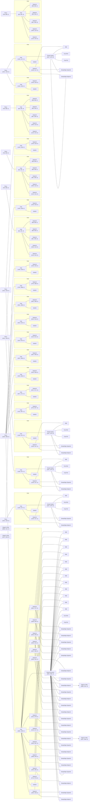

```mermaid
flowchart LR
  subgraph path2 [Path]
    2["Path<br>[816, 851, 0]"]
    3["Segment<br>[859, 885, 0]"]
    4["Segment<br>[893, 956, 0]"]
    5["Segment<br>[964, 1055, 0]"]
    6["Segment<br>[1063, 1125, 0]"]
    7["Segment<br>[1133, 1224, 0]"]
  end
  subgraph path9 [Path]
    9["Path<br>[1328, 1417, 0]"]
    10["Segment<br>[1328, 1417, 0]"]
    11[Solid2d]
  end
  subgraph path12 [Path]
    12["Path<br>[1430, 1535, 0]"]
    13["Segment<br>[1430, 1535, 0]"]
    14[Solid2d]
  end
  subgraph path22 [Path]
    22["Path<br>[816, 851, 0]"]
    23["Segment<br>[859, 885, 0]"]
    24["Segment<br>[893, 956, 0]"]
    25["Segment<br>[964, 1055, 0]"]
    26["Segment<br>[1063, 1125, 0]"]
    27["Segment<br>[1133, 1224, 0]"]
  end
  subgraph path29 [Path]
    29["Path<br>[1328, 1417, 0]"]
    30["Segment<br>[1328, 1417, 0]"]
    31[Solid2d]
  end
  subgraph path32 [Path]
    32["Path<br>[1430, 1535, 0]"]
    33["Segment<br>[1430, 1535, 0]"]
    34[Solid2d]
  end
  subgraph path42 [Path]
    42["Path<br>[816, 851, 0]"]
    43["Segment<br>[859, 885, 0]"]
    44["Segment<br>[893, 956, 0]"]
    45["Segment<br>[964, 1055, 0]"]
    46["Segment<br>[1063, 1125, 0]"]
    47["Segment<br>[1133, 1224, 0]"]
  end
  subgraph path49 [Path]
    49["Path<br>[1328, 1417, 0]"]
    50["Segment<br>[1328, 1417, 0]"]
    51[Solid2d]
  end
  subgraph path52 [Path]
    52["Path<br>[1430, 1535, 0]"]
    53["Segment<br>[1430, 1535, 0]"]
    54[Solid2d]
  end
  subgraph path62 [Path]
    62["Path<br>[816, 851, 0]"]
    63["Segment<br>[859, 885, 0]"]
    64["Segment<br>[893, 956, 0]"]
    65["Segment<br>[964, 1055, 0]"]
    66["Segment<br>[1063, 1125, 0]"]
    67["Segment<br>[1133, 1224, 0]"]
  end
  subgraph path69 [Path]
    69["Path<br>[1328, 1417, 0]"]
    70["Segment<br>[1328, 1417, 0]"]
    71[Solid2d]
  end
  subgraph path72 [Path]
    72["Path<br>[1430, 1535, 0]"]
    73["Segment<br>[1430, 1535, 0]"]
    74[Solid2d]
  end
  subgraph path82 [Path]
    82["Path<br>[1864, 1899, 0]"]
    83["Segment<br>[1905, 1939, 0]"]
    84["Segment<br>[1945, 1992, 0]"]
    85["Segment<br>[1998, 2044, 0]"]
    86["Segment<br>[2050, 2097, 0]"]
    87["Segment<br>[2103, 2137, 0]"]
    88["Segment<br>[2231, 2278, 0]"]
    89["Segment<br>[2284, 2331, 0]"]
    90["Segment<br>[2337, 2384, 0]"]
    91["Segment<br>[2390, 2433, 0]"]
    92["Segment<br>[2546, 2593, 0]"]
    93["Segment<br>[2599, 2645, 0]"]
    94["Segment<br>[2651, 2707, 0]"]
    95["Segment<br>[2713, 2720, 0]"]
    96[Solid2d]
  end
  subgraph path97 [Path]
    97["Path<br>[2792, 2886, 0]"]
    98["Segment<br>[2792, 2886, 0]"]
    99[Solid2d]
  end
  subgraph path100 [Path]
    100["Path<br>[2901, 2995, 0]"]
    101["Segment<br>[2901, 2995, 0]"]
    102[Solid2d]
  end
  subgraph path103 [Path]
    103["Path<br>[3010, 3104, 0]"]
    104["Segment<br>[3010, 3104, 0]"]
    105[Solid2d]
  end
  subgraph path106 [Path]
    106["Path<br>[3119, 3213, 0]"]
    107["Segment<br>[3119, 3213, 0]"]
    108[Solid2d]
  end
  subgraph path109 [Path]
    109["Path<br>[3267, 3405, 0]"]
    110["Segment<br>[3267, 3405, 0]"]
    111[Solid2d]
  end
  subgraph path112 [Path]
    112["Path<br>[3420, 3556, 0]"]
    113["Segment<br>[3420, 3556, 0]"]
    114[Solid2d]
  end
  subgraph path115 [Path]
    115["Path<br>[3571, 3717, 0]"]
    116["Segment<br>[3571, 3717, 0]"]
    117[Solid2d]
  end
  subgraph path118 [Path]
    118["Path<br>[3732, 3877, 0]"]
    119["Segment<br>[3732, 3877, 0]"]
    120[Solid2d]
  end
  1["Plane<br>[783, 808, 0]"]
  8["Plane<br>[1301, 1320, 0]"]
  15["Sweep Sweep<br>[1547, 1570, 0]"]
  16[Wall]
  17["Cap Start"]
  18["Cap End"]
  19["SweepEdge Opposite"]
  20["SweepEdge Adjacent"]
  21["Plane<br>[783, 808, 0]"]
  28["Plane<br>[1301, 1320, 0]"]
  35["Sweep Sweep<br>[1547, 1570, 0]"]
  36[Wall]
  37["Cap Start"]
  38["Cap End"]
  39["SweepEdge Opposite"]
  40["SweepEdge Adjacent"]
  41["Plane<br>[783, 808, 0]"]
  48["Plane<br>[1301, 1320, 0]"]
  55["Sweep Sweep<br>[1547, 1570, 0]"]
  56[Wall]
  57["Cap Start"]
  58["Cap End"]
  59["SweepEdge Opposite"]
  60["SweepEdge Adjacent"]
  61["Plane<br>[783, 808, 0]"]
  68["Plane<br>[1301, 1320, 0]"]
  75["Sweep Sweep<br>[1547, 1570, 0]"]
  76[Wall]
  77["Cap Start"]
  78["Cap End"]
  79["SweepEdge Opposite"]
  80["SweepEdge Adjacent"]
  81["Plane<br>[1839, 1858, 0]"]
  121["Sweep Extrusion<br>[3933, 3962, 0]"]
  122[Wall]
  123[Wall]
  124[Wall]
  125[Wall]
  126[Wall]
  127[Wall]
  128[Wall]
  129[Wall]
  130[Wall]
  131[Wall]
  132[Wall]
  133[Wall]
  134["Cap Start"]
  135["Cap End"]
  136["SweepEdge Opposite"]
  137["SweepEdge Adjacent"]
  138["SweepEdge Opposite"]
  139["SweepEdge Adjacent"]
  140["SweepEdge Opposite"]
  141["SweepEdge Adjacent"]
  142["SweepEdge Opposite"]
  143["SweepEdge Adjacent"]
  144["SweepEdge Opposite"]
  145["SweepEdge Adjacent"]
  146["SweepEdge Opposite"]
  147["SweepEdge Adjacent"]
  148["SweepEdge Opposite"]
  149["SweepEdge Adjacent"]
  150["SweepEdge Opposite"]
  151["SweepEdge Adjacent"]
  152["SweepEdge Opposite"]
  153["SweepEdge Adjacent"]
  154["SweepEdge Opposite"]
  155["SweepEdge Adjacent"]
  156["SweepEdge Opposite"]
  157["SweepEdge Adjacent"]
  158["SweepEdge Opposite"]
  159["SweepEdge Adjacent"]
  160["EdgeCut Fillet<br>[3968, 4101, 0]"]
  161["EdgeCut Fillet<br>[3968, 4101, 0]"]
  162["EdgeCut Fillet<br>[4107, 4240, 0]"]
  163["EdgeCut Fillet<br>[4107, 4240, 0]"]
  1 --- 2
  2 --- 3
  2 --- 4
  2 --- 5
  2 --- 6
  2 --- 7
  8 --- 9
  8 --- 12
  9 --- 10
  9 ---- 15
  9 --- 11
  10 --- 16
  10 --- 19
  10 --- 20
  12 --- 13
  12 --- 14
  15 --- 16
  15 --- 17
  15 --- 18
  15 --- 19
  15 --- 20
  21 --- 22
  22 --- 23
  22 --- 24
  22 --- 25
  22 --- 26
  22 --- 27
  28 --- 29
  28 --- 32
  29 --- 30
  29 ---- 35
  29 --- 31
  30 --- 36
  30 --- 39
  30 --- 40
  32 --- 33
  32 --- 34
  35 --- 36
  35 --- 37
  35 --- 38
  35 --- 39
  35 --- 40
  41 --- 42
  42 --- 43
  42 --- 44
  42 --- 45
  42 --- 46
  42 --- 47
  48 --- 49
  48 --- 52
  49 --- 50
  49 ---- 55
  49 --- 51
  50 --- 56
  50 --- 59
  50 --- 60
  52 --- 53
  52 --- 54
  55 --- 56
  55 --- 57
  55 --- 58
  55 --- 59
  55 --- 60
  61 --- 62
  62 --- 63
  62 --- 64
  62 --- 65
  62 --- 66
  62 --- 67
  68 --- 69
  68 --- 72
  69 --- 70
  69 ---- 75
  69 --- 71
  70 --- 76
  70 --- 79
  70 --- 80
  72 --- 73
  72 --- 74
  75 --- 76
  75 --- 77
  75 --- 78
  75 --- 79
  75 --- 80
  81 --- 82
  81 --- 97
  81 --- 100
  81 --- 103
  81 --- 106
  81 --- 109
  81 --- 112
  81 --- 115
  81 --- 118
  82 --- 83
  82 --- 84
  82 --- 85
  82 --- 86
  82 --- 87
  82 --- 88
  82 --- 89
  82 --- 90
  82 --- 91
  82 --- 92
  82 --- 93
  82 --- 94
  82 --- 95
  82 ---- 121
  82 --- 96
  83 --- 133
  83 --- 158
  83 --- 159
  84 --- 132
  84 --- 156
  84 --- 157
  85 --- 131
  85 --- 154
  85 --- 155
  86 --- 130
  86 --- 152
  86 --- 153
  87 --- 129
  87 --- 150
  87 --- 151
  88 --- 128
  88 --- 148
  88 --- 149
  89 --- 127
  89 --- 146
  89 --- 147
  90 --- 126
  90 --- 144
  90 --- 145
  91 --- 125
  91 --- 142
  91 --- 143
  92 --- 124
  92 --- 140
  92 --- 141
  93 --- 123
  93 --- 138
  93 --- 139
  94 --- 122
  94 --- 136
  94 --- 137
  97 --- 98
  97 --- 99
  100 --- 101
  100 --- 102
  103 --- 104
  103 --- 105
  106 --- 107
  106 --- 108
  109 --- 110
  109 --- 111
  112 --- 113
  112 --- 114
  115 --- 116
  115 --- 117
  118 --- 119
  118 --- 120
  121 --- 122
  121 --- 123
  121 --- 124
  121 --- 125
  121 --- 126
  121 --- 127
  121 --- 128
  121 --- 129
  121 --- 130
  121 --- 131
  121 --- 132
  121 --- 133
  121 --- 134
  121 --- 135
  121 --- 136
  121 --- 137
  121 --- 138
  121 --- 139
  121 --- 140
  121 --- 141
  121 --- 142
  121 --- 143
  121 --- 144
  121 --- 145
  121 --- 146
  121 --- 147
  121 --- 148
  121 --- 149
  121 --- 150
  121 --- 151
  121 --- 152
  121 --- 153
  121 --- 154
  121 --- 155
  121 --- 156
  121 --- 157
  121 --- 158
  121 --- 159
  143 <--x 161
  151 <--x 162
```
