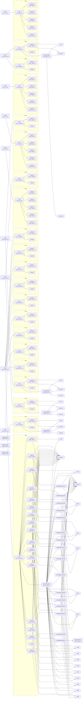

```mermaid
flowchart LR
  subgraph path2 [Path]
    2["Path<br>[781, 816, 0]"]
    3["Segment<br>[824, 850, 0]"]
    4["Segment<br>[858, 919, 0]"]
    5["Segment<br>[927, 986, 0]"]
    6["Segment<br>[994, 1054, 0]"]
    7["Segment<br>[1062, 1121, 0]"]
  end
  subgraph path9 [Path]
    9["Path<br>[1223, 1285, 0]"]
    10["Segment<br>[1223, 1285, 0]"]
    11[Solid2d]
  end
  subgraph path12 [Path]
    12["Path<br>[1311, 1389, 0]"]
    13["Segment<br>[1311, 1389, 0]"]
    14[Solid2d]
  end
  subgraph path20 [Path]
    20["Path<br>[781, 816, 0]"]
    21["Segment<br>[824, 850, 0]"]
    22["Segment<br>[858, 919, 0]"]
    23["Segment<br>[927, 986, 0]"]
    24["Segment<br>[994, 1054, 0]"]
    25["Segment<br>[1062, 1121, 0]"]
  end
  subgraph path27 [Path]
    27["Path<br>[1223, 1285, 0]"]
    28["Segment<br>[1223, 1285, 0]"]
    29[Solid2d]
  end
  subgraph path30 [Path]
    30["Path<br>[1311, 1389, 0]"]
    31["Segment<br>[1311, 1389, 0]"]
    32[Solid2d]
  end
  subgraph path38 [Path]
    38["Path<br>[781, 816, 0]"]
    39["Segment<br>[824, 850, 0]"]
    40["Segment<br>[858, 919, 0]"]
    41["Segment<br>[927, 986, 0]"]
    42["Segment<br>[994, 1054, 0]"]
    43["Segment<br>[1062, 1121, 0]"]
  end
  subgraph path45 [Path]
    45["Path<br>[1223, 1285, 0]"]
    46["Segment<br>[1223, 1285, 0]"]
    47[Solid2d]
  end
  subgraph path48 [Path]
    48["Path<br>[1311, 1389, 0]"]
    49["Segment<br>[1311, 1389, 0]"]
    50[Solid2d]
  end
  subgraph path56 [Path]
    56["Path<br>[781, 816, 0]"]
    57["Segment<br>[824, 850, 0]"]
    58["Segment<br>[858, 919, 0]"]
    59["Segment<br>[927, 986, 0]"]
    60["Segment<br>[994, 1054, 0]"]
    61["Segment<br>[1062, 1121, 0]"]
  end
  subgraph path63 [Path]
    63["Path<br>[1223, 1285, 0]"]
    64["Segment<br>[1223, 1285, 0]"]
    65[Solid2d]
  end
  subgraph path66 [Path]
    66["Path<br>[1311, 1389, 0]"]
    67["Segment<br>[1311, 1389, 0]"]
    68[Solid2d]
  end
  subgraph path74 [Path]
    74["Path<br>[1713, 1748, 0]"]
    75["Segment<br>[1754, 1788, 0]"]
    76["Segment<br>[1794, 1833, 0]"]
    77["Segment<br>[1839, 1877, 0]"]
    78["Segment<br>[1883, 1922, 0]"]
    79["Segment<br>[1928, 1962, 0]"]
    80["Segment<br>[1968, 2011, 0]"]
    81["Segment<br>[2017, 2050, 0]"]
    82["Segment<br>[2056, 2095, 0]"]
    83["Segment<br>[2101, 2140, 0]"]
    84["Segment<br>[2146, 2185, 0]"]
    85["Segment<br>[2191, 2234, 0]"]
    86["Segment<br>[2240, 2291, 0]"]
    87["Segment<br>[2297, 2341, 0]"]
    88["Segment<br>[2347, 2386, 0]"]
    89["Segment<br>[2392, 2430, 0]"]
    90["Segment<br>[2436, 2501, 0]"]
    91["Segment<br>[2507, 2514, 0]"]
    92[Solid2d]
  end
  subgraph path93 [Path]
    93["Path<br>[2599, 2672, 0]"]
    94["Segment<br>[2599, 2672, 0]"]
    95[Solid2d]
  end
  subgraph path96 [Path]
    96["Path<br>[2697, 2770, 0]"]
    97["Segment<br>[2697, 2770, 0]"]
    98[Solid2d]
  end
  subgraph path99 [Path]
    99["Path<br>[2795, 2868, 0]"]
    100["Segment<br>[2795, 2868, 0]"]
    101[Solid2d]
  end
  subgraph path102 [Path]
    102["Path<br>[2893, 2966, 0]"]
    103["Segment<br>[2893, 2966, 0]"]
    104[Solid2d]
  end
  subgraph path105 [Path]
    105["Path<br>[3030, 3169, 0]"]
    106["Segment<br>[3030, 3169, 0]"]
    107[Solid2d]
  end
  subgraph path108 [Path]
    108["Path<br>[3194, 3331, 0]"]
    109["Segment<br>[3194, 3331, 0]"]
    110[Solid2d]
  end
  subgraph path111 [Path]
    111["Path<br>[3356, 3503, 0]"]
    112["Segment<br>[3356, 3503, 0]"]
    113[Solid2d]
  end
  subgraph path114 [Path]
    114["Path<br>[3528, 3674, 0]"]
    115["Segment<br>[3528, 3674, 0]"]
    116[Solid2d]
  end
  1["Plane<br>[748, 773, 0]"]
  8["Plane<br>[1198, 1215, 0]"]
  15["Sweep Sweep<br>[1398, 1421, 0]"]
  16[Wall]
  17["Cap Start"]
  18["Cap End"]
  19["Plane<br>[748, 773, 0]"]
  26["Plane<br>[1198, 1215, 0]"]
  33["Sweep Sweep<br>[1398, 1421, 0]"]
  34[Wall]
  35["Cap Start"]
  36["Cap End"]
  37["Plane<br>[748, 773, 0]"]
  44["Plane<br>[1198, 1215, 0]"]
  51["Sweep Sweep<br>[1398, 1421, 0]"]
  52[Wall]
  53["Cap Start"]
  54["Cap End"]
  55["Plane<br>[748, 773, 0]"]
  62["Plane<br>[1198, 1215, 0]"]
  69["Sweep Sweep<br>[1398, 1421, 0]"]
  70[Wall]
  71["Cap Start"]
  72["Cap End"]
  73["Plane<br>[1690, 1707, 0]"]
  117["Sweep Extrusion<br>[3727, 3756, 0]"]
  118[Wall]
  119[Wall]
  120[Wall]
  121[Wall]
  122[Wall]
  123[Wall]
  124[Wall]
  125[Wall]
  126[Wall]
  127[Wall]
  128[Wall]
  129[Wall]
  130[Wall]
  131[Wall]
  132[Wall]
  133[Wall]
  134["Cap Start"]
  135["Cap End"]
  136["SweepEdge Opposite"]
  137["SweepEdge Opposite"]
  138["SweepEdge Opposite"]
  139["SweepEdge Opposite"]
  140["SweepEdge Opposite"]
  141["SweepEdge Opposite"]
  142["SweepEdge Opposite"]
  143["SweepEdge Opposite"]
  144["SweepEdge Opposite"]
  145["SweepEdge Opposite"]
  146["SweepEdge Opposite"]
  147["SweepEdge Opposite"]
  148["SweepEdge Opposite"]
  149["SweepEdge Opposite"]
  150["SweepEdge Opposite"]
  151["SweepEdge Adjacent"]
  152["EdgeCut Fillet<br>[3762, 3896, 0]"]
  153["EdgeCut Fillet<br>[3762, 3896, 0]"]
  154["EdgeCut Fillet<br>[3902, 4036, 0]"]
  155["EdgeCut Fillet<br>[3902, 4036, 0]"]
  1 --- 2
  2 --- 3
  2 --- 4
  2 --- 5
  2 --- 6
  2 --- 7
  8 --- 9
  8 --- 12
  9 --- 10
  9 ---- 15
  9 --- 11
  10 --- 16
  10 x--> 17
  12 --- 13
  12 --- 14
  15 --- 16
  15 --- 17
  15 --- 18
  19 --- 20
  20 --- 21
  20 --- 22
  20 --- 23
  20 --- 24
  20 --- 25
  26 --- 27
  26 --- 30
  27 --- 28
  27 ---- 33
  27 --- 29
  28 --- 34
  28 x--> 35
  30 --- 31
  30 --- 32
  33 --- 34
  33 --- 35
  33 --- 36
  37 --- 38
  38 --- 39
  38 --- 40
  38 --- 41
  38 --- 42
  38 --- 43
  44 --- 45
  44 --- 48
  45 --- 46
  45 ---- 51
  45 --- 47
  46 --- 52
  46 x--> 53
  48 --- 49
  48 --- 50
  51 --- 52
  51 --- 53
  51 --- 54
  55 --- 56
  56 --- 57
  56 --- 58
  56 --- 59
  56 --- 60
  56 --- 61
  62 --- 63
  62 --- 66
  63 --- 64
  63 ---- 69
  63 --- 65
  64 --- 70
  64 x--> 71
  66 --- 67
  66 --- 68
  69 --- 70
  69 --- 71
  69 --- 72
  73 --- 74
  73 --- 93
  73 --- 96
  73 --- 99
  73 --- 102
  73 --- 105
  73 --- 108
  73 --- 111
  73 --- 114
  74 --- 75
  74 --- 76
  74 --- 77
  74 --- 78
  74 --- 79
  74 --- 80
  74 --- 81
  74 --- 82
  74 --- 83
  74 --- 84
  74 --- 85
  74 --- 86
  74 --- 87
  74 --- 88
  74 --- 89
  74 --- 90
  74 --- 91
  74 ---- 117
  74 --- 92
  75 --- 133
  75 --- 150
  75 x--> 134
  76 --- 132
  76 --- 149
  76 x--> 134
  77 --- 131
  77 --- 148
  77 x--> 134
  78 --- 130
  78 --- 147
  78 x--> 134
  79 --- 129
  79 --- 146
  79 x--> 134
  80 --- 128
  80 --- 145
  80 --- 151
  80 x--> 134
  81 --- 127
  81 --- 144
  81 x--> 134
  82 --- 126
  82 --- 143
  82 x--> 134
  83 --- 125
  83 --- 142
  83 x--> 134
  84 --- 124
  84 --- 141
  84 x--> 134
  85 --- 123
  85 --- 140
  85 x--> 134
  86 --- 122
  86 --- 139
  86 x--> 134
  87 --- 121
  87 --- 138
  87 x--> 134
  88 --- 120
  88 --- 137
  88 x--> 134
  89 --- 119
  89 --- 136
  89 x--> 134
  90 --- 118
  90 x--> 134
  93 --- 94
  93 --- 95
  96 --- 97
  96 --- 98
  99 --- 100
  99 --- 101
  102 --- 103
  102 --- 104
  105 --- 106
  105 --- 107
  108 --- 109
  108 --- 110
  111 --- 112
  111 --- 113
  114 --- 115
  114 --- 116
  117 --- 118
  117 --- 119
  117 --- 120
  117 --- 121
  117 --- 122
  117 --- 123
  117 --- 124
  117 --- 125
  117 --- 126
  117 --- 127
  117 --- 128
  117 --- 129
  117 --- 130
  117 --- 131
  117 --- 132
  117 --- 133
  117 --- 134
  117 --- 135
  117 --- 136
  117 --- 137
  117 --- 138
  117 --- 139
  117 --- 140
  117 --- 141
  117 --- 142
  117 --- 143
  117 --- 144
  117 --- 145
  117 --- 146
  117 --- 147
  117 --- 148
  117 --- 149
  117 --- 150
  117 --- 151
  136 <--x 119
  136 <--x 135
  137 <--x 120
  137 <--x 135
  138 <--x 121
  138 <--x 135
  139 <--x 122
  139 <--x 135
  140 <--x 123
  140 <--x 135
  141 <--x 124
  141 <--x 135
  142 <--x 125
  142 <--x 135
  143 <--x 126
  143 <--x 135
  144 <--x 127
  144 <--x 135
  145 <--x 128
  145 <--x 135
  146 <--x 129
  146 <--x 135
  147 <--x 130
  147 <--x 135
  148 <--x 131
  148 <--x 135
  149 <--x 132
  149 <--x 135
  150 <--x 133
  150 <--x 135
  151 <--x 152
```
