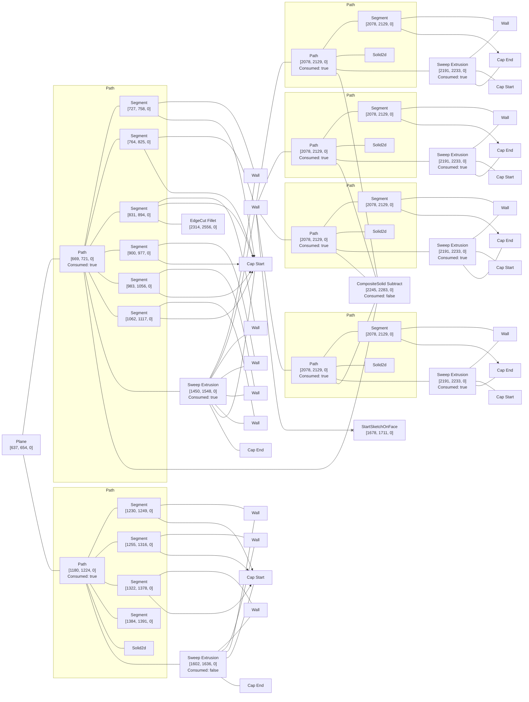

```mermaid
flowchart LR
  subgraph path2 [Path]
    2["Path<br>[669, 721, 0]<br>Consumed: true"]
      %% [ProgramBodyItem { index: 13 }, VariableDeclarationDeclaration, VariableDeclarationInit, PipeBodyItem { index: 0 }]
    3["Segment<br>[727, 758, 0]"]
      %% [ProgramBodyItem { index: 13 }, VariableDeclarationDeclaration, VariableDeclarationInit, PipeBodyItem { index: 1 }]
    4["Segment<br>[764, 825, 0]"]
      %% [ProgramBodyItem { index: 13 }, VariableDeclarationDeclaration, VariableDeclarationInit, PipeBodyItem { index: 2 }]
    5["Segment<br>[831, 894, 0]"]
      %% [ProgramBodyItem { index: 13 }, VariableDeclarationDeclaration, VariableDeclarationInit, PipeBodyItem { index: 3 }]
    6["Segment<br>[900, 977, 0]"]
      %% [ProgramBodyItem { index: 13 }, VariableDeclarationDeclaration, VariableDeclarationInit, PipeBodyItem { index: 4 }]
    7["Segment<br>[983, 1056, 0]"]
      %% [ProgramBodyItem { index: 13 }, VariableDeclarationDeclaration, VariableDeclarationInit, PipeBodyItem { index: 5 }]
    8["Segment<br>[1062, 1117, 0]"]
      %% [ProgramBodyItem { index: 13 }, VariableDeclarationDeclaration, VariableDeclarationInit, PipeBodyItem { index: 6 }]
  end
  subgraph path9 [Path]
    9["Path<br>[1180, 1224, 0]<br>Consumed: true"]
      %% [ProgramBodyItem { index: 14 }, VariableDeclarationDeclaration, VariableDeclarationInit, PipeBodyItem { index: 0 }]
    10["Segment<br>[1230, 1249, 0]"]
      %% [ProgramBodyItem { index: 14 }, VariableDeclarationDeclaration, VariableDeclarationInit, PipeBodyItem { index: 1 }]
    11["Segment<br>[1255, 1316, 0]"]
      %% [ProgramBodyItem { index: 14 }, VariableDeclarationDeclaration, VariableDeclarationInit, PipeBodyItem { index: 2 }]
    12["Segment<br>[1322, 1378, 0]"]
      %% [ProgramBodyItem { index: 14 }, VariableDeclarationDeclaration, VariableDeclarationInit, PipeBodyItem { index: 3 }]
    13["Segment<br>[1384, 1391, 0]"]
      %% [ProgramBodyItem { index: 14 }, VariableDeclarationDeclaration, VariableDeclarationInit, PipeBodyItem { index: 4 }]
    14[Solid2d]
  end
  subgraph path30 [Path]
    30["Path<br>[2078, 2129, 0]<br>Consumed: true"]
      %% [ProgramBodyItem { index: 19 }, VariableDeclarationDeclaration, VariableDeclarationInit, CallKwArg { index: 0 }, FunctionExpressionBody, FunctionExpressionBodyItem { index: 0 }, ReturnStatementArg]
    31["Segment<br>[2078, 2129, 0]"]
      %% [ProgramBodyItem { index: 19 }, VariableDeclarationDeclaration, VariableDeclarationInit, CallKwArg { index: 0 }, FunctionExpressionBody, FunctionExpressionBodyItem { index: 0 }, ReturnStatementArg]
    32[Solid2d]
  end
  subgraph path33 [Path]
    33["Path<br>[2078, 2129, 0]<br>Consumed: true"]
      %% [ProgramBodyItem { index: 19 }, VariableDeclarationDeclaration, VariableDeclarationInit, CallKwArg { index: 0 }, FunctionExpressionBody, FunctionExpressionBodyItem { index: 0 }, ReturnStatementArg]
    34["Segment<br>[2078, 2129, 0]"]
      %% [ProgramBodyItem { index: 19 }, VariableDeclarationDeclaration, VariableDeclarationInit, CallKwArg { index: 0 }, FunctionExpressionBody, FunctionExpressionBodyItem { index: 0 }, ReturnStatementArg]
    35[Solid2d]
  end
  subgraph path36 [Path]
    36["Path<br>[2078, 2129, 0]<br>Consumed: true"]
      %% [ProgramBodyItem { index: 19 }, VariableDeclarationDeclaration, VariableDeclarationInit, CallKwArg { index: 0 }, FunctionExpressionBody, FunctionExpressionBodyItem { index: 0 }, ReturnStatementArg]
    37["Segment<br>[2078, 2129, 0]"]
      %% [ProgramBodyItem { index: 19 }, VariableDeclarationDeclaration, VariableDeclarationInit, CallKwArg { index: 0 }, FunctionExpressionBody, FunctionExpressionBodyItem { index: 0 }, ReturnStatementArg]
    38[Solid2d]
  end
  subgraph path39 [Path]
    39["Path<br>[2078, 2129, 0]<br>Consumed: true"]
      %% [ProgramBodyItem { index: 19 }, VariableDeclarationDeclaration, VariableDeclarationInit, CallKwArg { index: 0 }, FunctionExpressionBody, FunctionExpressionBodyItem { index: 0 }, ReturnStatementArg]
    40["Segment<br>[2078, 2129, 0]"]
      %% [ProgramBodyItem { index: 19 }, VariableDeclarationDeclaration, VariableDeclarationInit, CallKwArg { index: 0 }, FunctionExpressionBody, FunctionExpressionBodyItem { index: 0 }, ReturnStatementArg]
    41[Solid2d]
  end
  1["Plane<br>[637, 654, 0]"]
    %% [ProgramBodyItem { index: 12 }, VariableDeclarationDeclaration, VariableDeclarationInit]
  15["Sweep Extrusion<br>[1450, 1548, 0]<br>Consumed: true"]
    %% [ProgramBodyItem { index: 15 }, VariableDeclarationDeclaration, VariableDeclarationInit]
  16[Wall]
    %% face_code_ref=Missing NodePath
  17[Wall]
    %% face_code_ref=[ProgramBodyItem { index: 17 }, VariableDeclarationDeclaration, VariableDeclarationInit]
  18[Wall]
    %% face_code_ref=Missing NodePath
  19[Wall]
    %% face_code_ref=Missing NodePath
  20[Wall]
    %% face_code_ref=Missing NodePath
  21[Wall]
    %% face_code_ref=Missing NodePath
  22["Cap Start"]
    %% face_code_ref=Missing NodePath
  23["Cap End"]
    %% face_code_ref=Missing NodePath
  24["Sweep Extrusion<br>[1602, 1636, 0]<br>Consumed: false"]
    %% [ProgramBodyItem { index: 16 }, VariableDeclarationDeclaration, VariableDeclarationInit]
  25[Wall]
    %% face_code_ref=Missing NodePath
  26[Wall]
    %% face_code_ref=Missing NodePath
  27[Wall]
    %% face_code_ref=Missing NodePath
  28["Cap Start"]
    %% face_code_ref=Missing NodePath
  29["Cap End"]
    %% face_code_ref=Missing NodePath
  42["Sweep Extrusion<br>[2191, 2233, 0]<br>Consumed: true"]
    %% [ProgramBodyItem { index: 20 }, VariableDeclarationDeclaration, VariableDeclarationInit]
  43[Wall]
    %% face_code_ref=Missing NodePath
  44["Cap Start"]
    %% face_code_ref=Missing NodePath
  45["Cap End"]
    %% face_code_ref=Missing NodePath
  46["Sweep Extrusion<br>[2191, 2233, 0]<br>Consumed: true"]
    %% [ProgramBodyItem { index: 20 }, VariableDeclarationDeclaration, VariableDeclarationInit]
  47[Wall]
    %% face_code_ref=Missing NodePath
  48["Cap Start"]
    %% face_code_ref=Missing NodePath
  49["Cap End"]
    %% face_code_ref=Missing NodePath
  50["Sweep Extrusion<br>[2191, 2233, 0]<br>Consumed: true"]
    %% [ProgramBodyItem { index: 20 }, VariableDeclarationDeclaration, VariableDeclarationInit]
  51[Wall]
    %% face_code_ref=Missing NodePath
  52["Cap Start"]
    %% face_code_ref=Missing NodePath
  53["Cap End"]
    %% face_code_ref=Missing NodePath
  54["Sweep Extrusion<br>[2191, 2233, 0]<br>Consumed: true"]
    %% [ProgramBodyItem { index: 20 }, VariableDeclarationDeclaration, VariableDeclarationInit]
  55[Wall]
    %% face_code_ref=Missing NodePath
  56["Cap Start"]
    %% face_code_ref=Missing NodePath
  57["Cap End"]
    %% face_code_ref=Missing NodePath
  58["CompositeSolid Subtract<br>[2245, 2283, 0]<br>Consumed: false"]
    %% [ProgramBodyItem { index: 21 }, VariableDeclarationDeclaration, VariableDeclarationInit]
  59["EdgeCut Fillet<br>[2314, 2556, 0]"]
    %% [ProgramBodyItem { index: 22 }, ExpressionStatementExpr]
  60["StartSketchOnFace<br>[1678, 1711, 0]"]
    %% [ProgramBodyItem { index: 17 }, VariableDeclarationDeclaration, VariableDeclarationInit]
  1 --- 2
  1 --- 9
  2 --- 3
  2 --- 4
  2 --- 5
  2 --- 6
  2 --- 7
  2 --- 8
  2 ---- 15
  2 --- 58
  3 --- 16
  3 x--> 22
  4 --- 17
  4 x--> 22
  5 --- 18
  5 x--> 22
  5 --- 59
  6 --- 19
  6 x--> 22
  7 --- 20
  7 x--> 22
  8 --- 21
  8 x--> 22
  9 --- 10
  9 --- 11
  9 --- 12
  9 --- 13
  9 --- 14
  9 ---- 24
  10 --- 27
  10 x--> 28
  11 --- 26
  11 x--> 28
  12 --- 25
  12 x--> 28
  15 --- 16
  15 --- 17
  15 --- 18
  15 --- 19
  15 --- 20
  15 --- 21
  15 --- 22
  15 --- 23
  17 --- 30
  17 --- 33
  17 --- 36
  17 --- 39
  17 <--x 60
  24 --- 25
  24 --- 26
  24 --- 27
  24 --- 28
  24 --- 29
  30 --- 31
  30 --- 32
  30 ---- 42
  30 --- 58
  31 --- 43
  31 x--> 45
  33 --- 34
  33 --- 35
  33 ---- 46
  33 --- 58
  34 --- 47
  34 x--> 49
  36 --- 37
  36 --- 38
  36 ---- 50
  36 --- 58
  37 --- 51
  37 x--> 53
  39 --- 40
  39 --- 41
  39 ---- 54
  39 --- 58
  40 --- 55
  40 x--> 57
  42 --- 43
  42 --- 44
  42 --- 45
  46 --- 47
  46 --- 48
  46 --- 49
  50 --- 51
  50 --- 52
  50 --- 53
  54 --- 55
  54 --- 56
  54 --- 57
```
