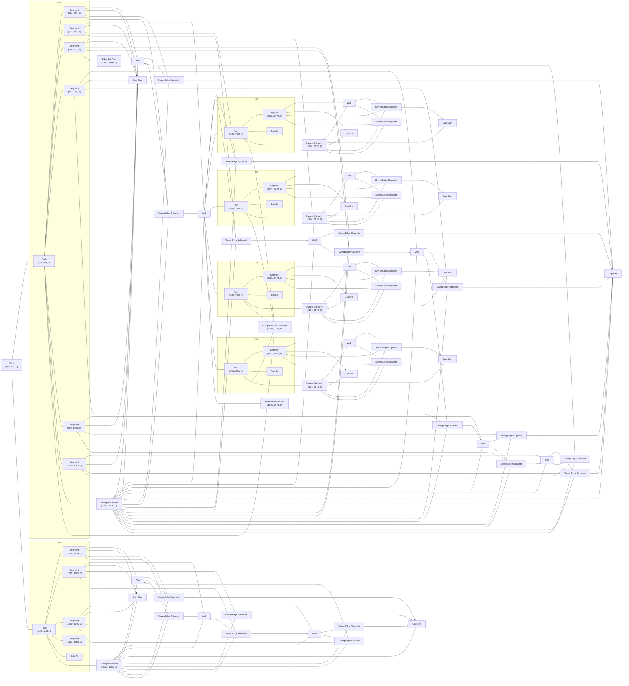

```mermaid
flowchart LR
  subgraph path2 [Path]
    2["Path<br>[636, 688, 0]"]
      %% [ProgramBodyItem { index: 13 }, VariableDeclarationDeclaration, VariableDeclarationInit, PipeBodyItem { index: 0 }]
    3["Segment<br>[694, 725, 0]"]
      %% [ProgramBodyItem { index: 13 }, VariableDeclarationDeclaration, VariableDeclarationInit, PipeBodyItem { index: 1 }]
    4["Segment<br>[731, 792, 0]"]
      %% [ProgramBodyItem { index: 13 }, VariableDeclarationDeclaration, VariableDeclarationInit, PipeBodyItem { index: 2 }]
    5["Segment<br>[798, 861, 0]"]
      %% [ProgramBodyItem { index: 13 }, VariableDeclarationDeclaration, VariableDeclarationInit, PipeBodyItem { index: 3 }]
    6["Segment<br>[867, 944, 0]"]
      %% [ProgramBodyItem { index: 13 }, VariableDeclarationDeclaration, VariableDeclarationInit, PipeBodyItem { index: 4 }]
    7["Segment<br>[950, 1023, 0]"]
      %% [ProgramBodyItem { index: 13 }, VariableDeclarationDeclaration, VariableDeclarationInit, PipeBodyItem { index: 5 }]
    8["Segment<br>[1029, 1084, 0]"]
      %% [ProgramBodyItem { index: 13 }, VariableDeclarationDeclaration, VariableDeclarationInit, PipeBodyItem { index: 6 }]
  end
  subgraph path9 [Path]
    9["Path<br>[1147, 1191, 0]"]
      %% [ProgramBodyItem { index: 14 }, VariableDeclarationDeclaration, VariableDeclarationInit, PipeBodyItem { index: 0 }]
    10["Segment<br>[1197, 1216, 0]"]
      %% [ProgramBodyItem { index: 14 }, VariableDeclarationDeclaration, VariableDeclarationInit, PipeBodyItem { index: 1 }]
    11["Segment<br>[1222, 1283, 0]"]
      %% [ProgramBodyItem { index: 14 }, VariableDeclarationDeclaration, VariableDeclarationInit, PipeBodyItem { index: 2 }]
    12["Segment<br>[1289, 1345, 0]"]
      %% [ProgramBodyItem { index: 14 }, VariableDeclarationDeclaration, VariableDeclarationInit, PipeBodyItem { index: 3 }]
    13["Segment<br>[1351, 1358, 0]"]
      %% [ProgramBodyItem { index: 14 }, VariableDeclarationDeclaration, VariableDeclarationInit, PipeBodyItem { index: 4 }]
    14[Solid2d]
  end
  subgraph path48 [Path]
    48["Path<br>[2021, 2072, 0]"]
      %% [ProgramBodyItem { index: 19 }, VariableDeclarationDeclaration, VariableDeclarationInit, CallKwArg { index: 0 }, FunctionExpressionBody, FunctionExpressionBodyItem { index: 0 }, ReturnStatementArg]
    49["Segment<br>[2021, 2072, 0]"]
      %% [ProgramBodyItem { index: 19 }, VariableDeclarationDeclaration, VariableDeclarationInit, CallKwArg { index: 0 }, FunctionExpressionBody, FunctionExpressionBodyItem { index: 0 }, ReturnStatementArg]
    50[Solid2d]
  end
  subgraph path51 [Path]
    51["Path<br>[2021, 2072, 0]"]
      %% [ProgramBodyItem { index: 19 }, VariableDeclarationDeclaration, VariableDeclarationInit, CallKwArg { index: 0 }, FunctionExpressionBody, FunctionExpressionBodyItem { index: 0 }, ReturnStatementArg]
    52["Segment<br>[2021, 2072, 0]"]
      %% [ProgramBodyItem { index: 19 }, VariableDeclarationDeclaration, VariableDeclarationInit, CallKwArg { index: 0 }, FunctionExpressionBody, FunctionExpressionBodyItem { index: 0 }, ReturnStatementArg]
    53[Solid2d]
  end
  subgraph path54 [Path]
    54["Path<br>[2021, 2072, 0]"]
      %% [ProgramBodyItem { index: 19 }, VariableDeclarationDeclaration, VariableDeclarationInit, CallKwArg { index: 0 }, FunctionExpressionBody, FunctionExpressionBodyItem { index: 0 }, ReturnStatementArg]
    55["Segment<br>[2021, 2072, 0]"]
      %% [ProgramBodyItem { index: 19 }, VariableDeclarationDeclaration, VariableDeclarationInit, CallKwArg { index: 0 }, FunctionExpressionBody, FunctionExpressionBodyItem { index: 0 }, ReturnStatementArg]
    56[Solid2d]
  end
  subgraph path57 [Path]
    57["Path<br>[2021, 2072, 0]"]
      %% [ProgramBodyItem { index: 19 }, VariableDeclarationDeclaration, VariableDeclarationInit, CallKwArg { index: 0 }, FunctionExpressionBody, FunctionExpressionBodyItem { index: 0 }, ReturnStatementArg]
    58["Segment<br>[2021, 2072, 0]"]
      %% [ProgramBodyItem { index: 19 }, VariableDeclarationDeclaration, VariableDeclarationInit, CallKwArg { index: 0 }, FunctionExpressionBody, FunctionExpressionBodyItem { index: 0 }, ReturnStatementArg]
    59[Solid2d]
  end
  1["Plane<br>[604, 621, 0]"]
    %% [ProgramBodyItem { index: 12 }, VariableDeclarationDeclaration, VariableDeclarationInit]
  15["Sweep Extrusion<br>[1417, 1515, 0]"]
    %% [ProgramBodyItem { index: 15 }, VariableDeclarationDeclaration, VariableDeclarationInit]
  16[Wall]
    %% face_code_ref=Missing NodePath
  17[Wall]
    %% face_code_ref=[ProgramBodyItem { index: 17 }, VariableDeclarationDeclaration, VariableDeclarationInit]
  18[Wall]
    %% face_code_ref=Missing NodePath
  19[Wall]
    %% face_code_ref=Missing NodePath
  20[Wall]
    %% face_code_ref=Missing NodePath
  21[Wall]
    %% face_code_ref=Missing NodePath
  22["Cap Start"]
    %% face_code_ref=Missing NodePath
  23["Cap End"]
    %% face_code_ref=Missing NodePath
  24["SweepEdge Opposite"]
  25["SweepEdge Adjacent"]
  26["SweepEdge Opposite"]
  27["SweepEdge Adjacent"]
  28["SweepEdge Opposite"]
  29["SweepEdge Adjacent"]
  30["SweepEdge Opposite"]
  31["SweepEdge Adjacent"]
  32["SweepEdge Opposite"]
  33["SweepEdge Adjacent"]
  34["SweepEdge Opposite"]
  35["SweepEdge Adjacent"]
  36["Sweep Extrusion<br>[1569, 1603, 0]"]
    %% [ProgramBodyItem { index: 16 }, VariableDeclarationDeclaration, VariableDeclarationInit]
  37[Wall]
    %% face_code_ref=Missing NodePath
  38[Wall]
    %% face_code_ref=Missing NodePath
  39[Wall]
    %% face_code_ref=Missing NodePath
  40["Cap Start"]
    %% face_code_ref=Missing NodePath
  41["Cap End"]
    %% face_code_ref=Missing NodePath
  42["SweepEdge Opposite"]
  43["SweepEdge Adjacent"]
  44["SweepEdge Opposite"]
  45["SweepEdge Adjacent"]
  46["SweepEdge Opposite"]
  47["SweepEdge Adjacent"]
  60["Sweep Extrusion<br>[2134, 2176, 0]"]
    %% [ProgramBodyItem { index: 20 }, VariableDeclarationDeclaration, VariableDeclarationInit]
  61[Wall]
    %% face_code_ref=Missing NodePath
  62["Cap Start"]
    %% face_code_ref=Missing NodePath
  63["Cap End"]
    %% face_code_ref=Missing NodePath
  64["SweepEdge Opposite"]
  65["SweepEdge Adjacent"]
  66["Sweep Extrusion<br>[2134, 2176, 0]"]
    %% [ProgramBodyItem { index: 20 }, VariableDeclarationDeclaration, VariableDeclarationInit]
  67[Wall]
    %% face_code_ref=Missing NodePath
  68["Cap Start"]
    %% face_code_ref=Missing NodePath
  69["Cap End"]
    %% face_code_ref=Missing NodePath
  70["SweepEdge Opposite"]
  71["SweepEdge Adjacent"]
  72["Sweep Extrusion<br>[2134, 2176, 0]"]
    %% [ProgramBodyItem { index: 20 }, VariableDeclarationDeclaration, VariableDeclarationInit]
  73[Wall]
    %% face_code_ref=Missing NodePath
  74["Cap Start"]
    %% face_code_ref=Missing NodePath
  75["Cap End"]
    %% face_code_ref=Missing NodePath
  76["SweepEdge Opposite"]
  77["SweepEdge Adjacent"]
  78["Sweep Extrusion<br>[2134, 2176, 0]"]
    %% [ProgramBodyItem { index: 20 }, VariableDeclarationDeclaration, VariableDeclarationInit]
  79[Wall]
    %% face_code_ref=Missing NodePath
  80["Cap Start"]
    %% face_code_ref=Missing NodePath
  81["Cap End"]
    %% face_code_ref=Missing NodePath
  82["SweepEdge Opposite"]
  83["SweepEdge Adjacent"]
  84["CompositeSolid Subtract<br>[2188, 2226, 0]"]
    %% [ProgramBodyItem { index: 21 }, VariableDeclarationDeclaration, VariableDeclarationInit]
  85["EdgeCut Fillet<br>[2257, 2499, 0]"]
    %% [ProgramBodyItem { index: 22 }, ExpressionStatementExpr]
  86["StartSketchOnFace<br>[1645, 1678, 0]"]
    %% [ProgramBodyItem { index: 17 }, VariableDeclarationDeclaration, VariableDeclarationInit]
  1 --- 2
  1 --- 9
  2 --- 3
  2 --- 4
  2 --- 5
  2 --- 6
  2 --- 7
  2 --- 8
  2 ---- 15
  2 --- 84
  3 --- 16
  3 x--> 22
  3 --- 24
  3 --- 25
  4 --- 17
  4 x--> 22
  4 --- 26
  4 --- 27
  5 --- 18
  5 x--> 22
  5 --- 28
  5 --- 29
  5 --- 85
  6 --- 19
  6 x--> 22
  6 --- 30
  6 --- 31
  7 --- 20
  7 x--> 22
  7 --- 32
  7 --- 33
  8 --- 21
  8 x--> 22
  8 --- 34
  8 --- 35
  9 --- 10
  9 --- 11
  9 --- 12
  9 --- 13
  9 --- 14
  9 ---- 36
  10 --- 39
  10 x--> 40
  10 --- 46
  10 --- 47
  11 --- 38
  11 x--> 40
  11 --- 44
  11 --- 45
  12 --- 37
  12 x--> 40
  12 --- 42
  12 --- 43
  15 --- 16
  15 --- 17
  15 --- 18
  15 --- 19
  15 --- 20
  15 --- 21
  15 --- 22
  15 --- 23
  15 --- 24
  15 --- 25
  15 --- 26
  15 --- 27
  15 --- 28
  15 --- 29
  15 --- 30
  15 --- 31
  15 --- 32
  15 --- 33
  15 --- 34
  15 --- 35
  16 --- 24
  16 --- 25
  35 <--x 16
  25 <--x 17
  17 --- 26
  17 --- 27
  17 --- 48
  17 --- 51
  17 --- 54
  17 --- 57
  17 <--x 86
  27 <--x 18
  18 --- 28
  18 --- 29
  29 <--x 19
  19 --- 30
  19 --- 31
  31 <--x 20
  20 --- 32
  20 --- 33
  33 <--x 21
  21 --- 34
  21 --- 35
  24 <--x 23
  26 <--x 23
  28 <--x 23
  30 <--x 23
  32 <--x 23
  34 <--x 23
  36 --- 37
  36 --- 38
  36 --- 39
  36 --- 40
  36 --- 41
  36 --- 42
  36 --- 43
  36 --- 44
  36 --- 45
  36 --- 46
  36 --- 47
  37 --- 42
  37 --- 43
  45 <--x 37
  38 --- 44
  38 --- 45
  47 <--x 38
  43 <--x 39
  39 --- 46
  39 --- 47
  42 <--x 41
  44 <--x 41
  46 <--x 41
  48 --- 49
  48 --- 50
  48 ---- 60
  48 --- 84
  49 --- 61
  49 x--> 63
  49 --- 64
  49 --- 65
  51 --- 52
  51 --- 53
  51 ---- 66
  51 --- 84
  52 --- 67
  52 x--> 69
  52 --- 70
  52 --- 71
  54 --- 55
  54 --- 56
  54 ---- 72
  54 --- 84
  55 --- 73
  55 x--> 75
  55 --- 76
  55 --- 77
  57 --- 58
  57 --- 59
  57 ---- 78
  57 --- 84
  58 --- 79
  58 x--> 81
  58 --- 82
  58 --- 83
  60 --- 61
  60 --- 62
  60 --- 63
  60 --- 64
  60 --- 65
  61 --- 64
  61 --- 65
  64 <--x 62
  66 --- 67
  66 --- 68
  66 --- 69
  66 --- 70
  66 --- 71
  67 --- 70
  67 --- 71
  70 <--x 68
  72 --- 73
  72 --- 74
  72 --- 75
  72 --- 76
  72 --- 77
  73 --- 76
  73 --- 77
  76 <--x 74
  78 --- 79
  78 --- 80
  78 --- 81
  78 --- 82
  78 --- 83
  79 --- 82
  79 --- 83
  82 <--x 80
```
