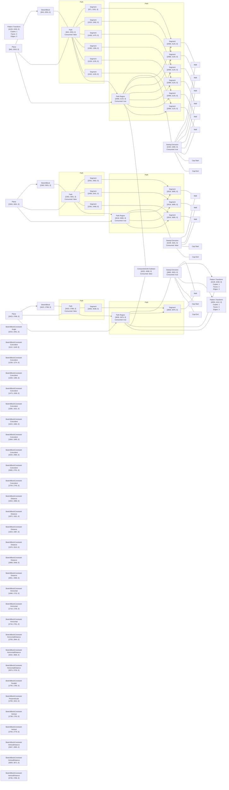

```mermaid
flowchart LR
  subgraph path8 [Path]
    8["Path Region<br>[2068, 2125, 0]<br>Consumed: true"]
      %% [ProgramBodyItem { index: 23 }, VariableDeclarationDeclaration, VariableDeclarationInit]
    25["Segment<br>[2068, 2125, 0]"]
      %% [ProgramBodyItem { index: 23 }, VariableDeclarationDeclaration, VariableDeclarationInit]
    26["Segment<br>[2068, 2125, 0]"]
      %% [ProgramBodyItem { index: 23 }, VariableDeclarationDeclaration, VariableDeclarationInit]
    27["Segment<br>[2068, 2125, 0]"]
      %% [ProgramBodyItem { index: 23 }, VariableDeclarationDeclaration, VariableDeclarationInit]
    28["Segment<br>[2068, 2125, 0]"]
      %% [ProgramBodyItem { index: 23 }, VariableDeclarationDeclaration, VariableDeclarationInit]
    29["Segment<br>[2068, 2125, 0]"]
      %% [ProgramBodyItem { index: 23 }, VariableDeclarationDeclaration, VariableDeclarationInit]
    30["Segment<br>[2068, 2125, 0]"]
      %% [ProgramBodyItem { index: 23 }, VariableDeclarationDeclaration, VariableDeclarationInit]
  end
  subgraph path9 [Path]
    9["Path Region<br>[3018, 3085, 0]<br>Consumed: true"]
      %% [ProgramBodyItem { index: 27 }, VariableDeclarationDeclaration, VariableDeclarationInit]
    34["Segment<br>[3018, 3085, 0]"]
      %% [ProgramBodyItem { index: 27 }, VariableDeclarationDeclaration, VariableDeclarationInit]
    35["Segment<br>[3018, 3085, 0]"]
      %% [ProgramBodyItem { index: 27 }, VariableDeclarationDeclaration, VariableDeclarationInit]
    36["Segment<br>[3018, 3085, 0]"]
      %% [ProgramBodyItem { index: 27 }, VariableDeclarationDeclaration, VariableDeclarationInit]
  end
  subgraph path10 [Path]
    10["Path Region<br>[3839, 3876, 0]<br>Consumed: true"]
      %% [ProgramBodyItem { index: 32 }, VariableDeclarationDeclaration, VariableDeclarationInit]
    38["Segment<br>[3839, 3876, 0]"]
      %% [ProgramBodyItem { index: 32 }, VariableDeclarationDeclaration, VariableDeclarationInit]
  end
  subgraph path11 [Path]
    11["Path<br>[2363, 3001, 0]<br>Consumed: false"]
      %% [ProgramBodyItem { index: 26 }, VariableDeclarationDeclaration, VariableDeclarationInit]
    31["Segment<br>[2391, 2458, 0]"]
      %% [ProgramBodyItem { index: 26 }, VariableDeclarationDeclaration, VariableDeclarationInit, SketchBlockBody, SketchBlockBodyItem { index: 0 }, VariableDeclarationDeclaration, VariableDeclarationInit]
    32["Segment<br>[2469, 2541, 0]"]
      %% [ProgramBodyItem { index: 26 }, VariableDeclarationDeclaration, VariableDeclarationInit, SketchBlockBody, SketchBlockBodyItem { index: 1 }, VariableDeclarationDeclaration, VariableDeclarationInit]
    33["Segment<br>[2591, 2662, 0]"]
      %% [ProgramBodyItem { index: 26 }, VariableDeclarationDeclaration, VariableDeclarationInit, SketchBlockBody, SketchBlockBodyItem { index: 3 }, VariableDeclarationDeclaration, VariableDeclarationInit]
  end
  subgraph path12 [Path]
    12["Path<br>[3423, 3788, 0]<br>Consumed: false"]
      %% [ProgramBodyItem { index: 31 }, VariableDeclarationDeclaration, VariableDeclarationInit]
    37["Segment<br>[3463, 3538, 0]"]
      %% [ProgramBodyItem { index: 31 }, VariableDeclarationDeclaration, VariableDeclarationInit, SketchBlockBody, SketchBlockBodyItem { index: 0 }, VariableDeclarationDeclaration, VariableDeclarationInit]
  end
  subgraph path13 [Path]
    13["Path<br>[943, 2053, 0]<br>Consumed: false"]
      %% [ProgramBodyItem { index: 22 }, VariableDeclarationDeclaration, VariableDeclarationInit]
    20["Segment<br>[1042, 1109, 0]"]
      %% [ProgramBodyItem { index: 22 }, VariableDeclarationDeclaration, VariableDeclarationInit, SketchBlockBody, SketchBlockBodyItem { index: 1 }, VariableDeclarationDeclaration, VariableDeclarationInit]
    21["Segment<br>[1159, 1235, 0]"]
      %% [ProgramBodyItem { index: 22 }, VariableDeclarationDeclaration, VariableDeclarationInit, SketchBlockBody, SketchBlockBodyItem { index: 3 }, VariableDeclarationDeclaration, VariableDeclarationInit]
    22["Segment<br>[1285, 1356, 0]"]
      %% [ProgramBodyItem { index: 22 }, VariableDeclarationDeclaration, VariableDeclarationInit, SketchBlockBody, SketchBlockBodyItem { index: 5 }, VariableDeclarationDeclaration, VariableDeclarationInit]
    23["Segment<br>[1406, 1470, 0]"]
      %% [ProgramBodyItem { index: 22 }, VariableDeclarationDeclaration, VariableDeclarationInit, SketchBlockBody, SketchBlockBodyItem { index: 7 }, VariableDeclarationDeclaration, VariableDeclarationInit]
    24["Segment<br>[1520, 1582, 0]"]
      %% [ProgramBodyItem { index: 22 }, VariableDeclarationDeclaration, VariableDeclarationInit, SketchBlockBody, SketchBlockBodyItem { index: 9 }, VariableDeclarationDeclaration, VariableDeclarationInit]
    39["Segment<br>[971, 1031, 0]"]
      %% [ProgramBodyItem { index: 22 }, VariableDeclarationDeclaration, VariableDeclarationInit, SketchBlockBody, SketchBlockBodyItem { index: 0 }, VariableDeclarationDeclaration, VariableDeclarationInit]
  end
  1["Cap End"]
    %% face_code_ref=Missing NodePath
  2["Cap End"]
    %% face_code_ref=Missing NodePath
  3["Cap End"]
    %% face_code_ref=Missing NodePath
  4["Cap Start"]
    %% face_code_ref=Missing NodePath
  5["Cap Start"]
    %% face_code_ref=Missing NodePath
  6["Cap Start"]
    %% face_code_ref=Missing NodePath
  7["CompositeSolid Subtract<br>[4252, 4308, 0]<br>Consumed: false"]
    %% [ProgramBodyItem { index: 37 }, VariableDeclarationDeclaration, VariableDeclarationInit]
  14["Pattern Transform<br>[4004, 4112, 0]<br>Copies: 1<br>Faces: 3<br>Edges: 3"]
    %% [ProgramBodyItem { index: 35 }, VariableDeclarationDeclaration, VariableDeclarationInit]
  15["Pattern Transform<br>[4128, 4240, 0]<br>Copies: 1<br>Faces: 3<br>Edges: 3"]
    %% [ProgramBodyItem { index: 36 }, VariableDeclarationDeclaration, VariableDeclarationInit]
  16["Pattern Transform<br>[4128, 4240, 0]<br>Copies: 1<br>Faces: 3<br>Edges: 3"]
    %% [ProgramBodyItem { index: 36 }, VariableDeclarationDeclaration, VariableDeclarationInit]
  17["Plane<br>[2363, 3001, 0]"]
    %% [ProgramBodyItem { index: 26 }, VariableDeclarationDeclaration, VariableDeclarationInit]
  18["Plane<br>[3423, 3788, 0]"]
    %% [ProgramBodyItem { index: 31 }, VariableDeclarationDeclaration, VariableDeclarationInit]
  19["Plane<br>[943, 2053, 0]"]
    %% [ProgramBodyItem { index: 22 }, VariableDeclarationDeclaration, VariableDeclarationInit]
  40["SketchBlock<br>[2363, 3001, 0]"]
    %% [ProgramBodyItem { index: 26 }, VariableDeclarationDeclaration, VariableDeclarationInit]
  41["SketchBlock<br>[3423, 3788, 0]"]
    %% [ProgramBodyItem { index: 31 }, VariableDeclarationDeclaration, VariableDeclarationInit]
  42["SketchBlock<br>[943, 2053, 0]"]
    %% [ProgramBodyItem { index: 22 }, VariableDeclarationDeclaration, VariableDeclarationInit]
  43["SketchBlockConstraint Angle<br>[2016, 2051, 0]"]
    %% [ProgramBodyItem { index: 22 }, VariableDeclarationDeclaration, VariableDeclarationInit, SketchBlockBody, SketchBlockBodyItem { index: 22 }, ExpressionStatementExpr]
  44["SketchBlockConstraint Coincident<br>[1112, 1148, 0]"]
    %% [ProgramBodyItem { index: 22 }, VariableDeclarationDeclaration, VariableDeclarationInit, SketchBlockBody, SketchBlockBodyItem { index: 2 }, ExpressionStatementExpr]
  45["SketchBlockConstraint Coincident<br>[1238, 1274, 0]"]
    %% [ProgramBodyItem { index: 22 }, VariableDeclarationDeclaration, VariableDeclarationInit, SketchBlockBody, SketchBlockBodyItem { index: 4 }, ExpressionStatementExpr]
  46["SketchBlockConstraint Coincident<br>[1359, 1395, 0]"]
    %% [ProgramBodyItem { index: 22 }, VariableDeclarationDeclaration, VariableDeclarationInit, SketchBlockBody, SketchBlockBodyItem { index: 6 }, ExpressionStatementExpr]
  47["SketchBlockConstraint Coincident<br>[1473, 1509, 0]"]
    %% [ProgramBodyItem { index: 22 }, VariableDeclarationDeclaration, VariableDeclarationInit, SketchBlockBody, SketchBlockBodyItem { index: 8 }, ExpressionStatementExpr]
  48["SketchBlockConstraint Coincident<br>[1585, 1621, 0]"]
    %% [ProgramBodyItem { index: 22 }, VariableDeclarationDeclaration, VariableDeclarationInit, SketchBlockBody, SketchBlockBodyItem { index: 10 }, ExpressionStatementExpr]
  49["SketchBlockConstraint Coincident<br>[1624, 1660, 0]"]
    %% [ProgramBodyItem { index: 22 }, VariableDeclarationDeclaration, VariableDeclarationInit, SketchBlockBody, SketchBlockBodyItem { index: 11 }, ExpressionStatementExpr]
  50["SketchBlockConstraint Coincident<br>[1664, 1695, 0]"]
    %% [ProgramBodyItem { index: 22 }, VariableDeclarationDeclaration, VariableDeclarationInit, SketchBlockBody, SketchBlockBodyItem { index: 12 }, ExpressionStatementExpr]
  51["SketchBlockConstraint Coincident<br>[2544, 2580, 0]"]
    %% [ProgramBodyItem { index: 26 }, VariableDeclarationDeclaration, VariableDeclarationInit, SketchBlockBody, SketchBlockBodyItem { index: 2 }, ExpressionStatementExpr]
  52["SketchBlockConstraint Coincident<br>[2665, 2701, 0]"]
    %% [ProgramBodyItem { index: 26 }, VariableDeclarationDeclaration, VariableDeclarationInit, SketchBlockBody, SketchBlockBodyItem { index: 4 }, ExpressionStatementExpr]
  53["SketchBlockConstraint Coincident<br>[2704, 2740, 0]"]
    %% [ProgramBodyItem { index: 26 }, VariableDeclarationDeclaration, VariableDeclarationInit, SketchBlockBody, SketchBlockBodyItem { index: 5 }, ExpressionStatementExpr]
  54["SketchBlockConstraint Distance<br>[1816, 1869, 0]"]
    %% [ProgramBodyItem { index: 22 }, VariableDeclarationDeclaration, VariableDeclarationInit, SketchBlockBody, SketchBlockBodyItem { index: 18 }, ExpressionStatementExpr]
  55["SketchBlockConstraint Distance<br>[1872, 1921, 0]"]
    %% [ProgramBodyItem { index: 22 }, VariableDeclarationDeclaration, VariableDeclarationInit, SketchBlockBody, SketchBlockBodyItem { index: 19 }, ExpressionStatementExpr]
  56["SketchBlockConstraint Distance<br>[1924, 1967, 0]"]
    %% [ProgramBodyItem { index: 22 }, VariableDeclarationDeclaration, VariableDeclarationInit, SketchBlockBody, SketchBlockBodyItem { index: 20 }, ExpressionStatementExpr]
  57["SketchBlockConstraint Distance<br>[1970, 2013, 0]"]
    %% [ProgramBodyItem { index: 22 }, VariableDeclarationDeclaration, VariableDeclarationInit, SketchBlockBody, SketchBlockBodyItem { index: 21 }, ExpressionStatementExpr]
  58["SketchBlockConstraint Distance<br>[2898, 2948, 0]"]
    %% [ProgramBodyItem { index: 26 }, VariableDeclarationDeclaration, VariableDeclarationInit, SketchBlockBody, SketchBlockBodyItem { index: 10 }, ExpressionStatementExpr]
  59["SketchBlockConstraint Distance<br>[2951, 2999, 0]"]
    %% [ProgramBodyItem { index: 26 }, VariableDeclarationDeclaration, VariableDeclarationInit, SketchBlockBody, SketchBlockBodyItem { index: 11 }, ExpressionStatementExpr]
  60["SketchBlockConstraint Horizontal<br>[1698, 1715, 0]"]
    %% [ProgramBodyItem { index: 22 }, VariableDeclarationDeclaration, VariableDeclarationInit, SketchBlockBody, SketchBlockBodyItem { index: 13 }, ExpressionStatementExpr]
  61["SketchBlockConstraint Horizontal<br>[1718, 1735, 0]"]
    %% [ProgramBodyItem { index: 22 }, VariableDeclarationDeclaration, VariableDeclarationInit, SketchBlockBody, SketchBlockBodyItem { index: 14 }, ExpressionStatementExpr]
  62["SketchBlockConstraint Horizontal<br>[2744, 2761, 0]"]
    %% [ProgramBodyItem { index: 26 }, VariableDeclarationDeclaration, VariableDeclarationInit, SketchBlockBody, SketchBlockBodyItem { index: 6 }, ExpressionStatementExpr]
  63["SketchBlockConstraint HorizontalDistance<br>[2783, 2844, 0]"]
    %% [ProgramBodyItem { index: 26 }, VariableDeclarationDeclaration, VariableDeclarationInit, SketchBlockBody, SketchBlockBodyItem { index: 8 }, ExpressionStatementExpr]
  64["SketchBlockConstraint HorizontalDistance<br>[3542, 3606, 0]"]
    %% [ProgramBodyItem { index: 31 }, VariableDeclarationDeclaration, VariableDeclarationInit, SketchBlockBody, SketchBlockBodyItem { index: 1 }, ExpressionStatementExpr]
  65["SketchBlockConstraint HorizontalDistance<br>[3674, 3733, 0]"]
    %% [ProgramBodyItem { index: 31 }, VariableDeclarationDeclaration, VariableDeclarationInit, SketchBlockBody, SketchBlockBodyItem { index: 3 }, ExpressionStatementExpr]
  66["SketchBlockConstraint Parallel<br>[1756, 1780, 0]"]
    %% [ProgramBodyItem { index: 22 }, VariableDeclarationDeclaration, VariableDeclarationInit, SketchBlockBody, SketchBlockBodyItem { index: 16 }, ExpressionStatementExpr]
  67["SketchBlockConstraint Perpendicular<br>[1783, 1812, 0]"]
    %% [ProgramBodyItem { index: 22 }, VariableDeclarationDeclaration, VariableDeclarationInit, SketchBlockBody, SketchBlockBodyItem { index: 17 }, ExpressionStatementExpr]
  68["SketchBlockConstraint Vertical<br>[1738, 1753, 0]"]
    %% [ProgramBodyItem { index: 22 }, VariableDeclarationDeclaration, VariableDeclarationInit, SketchBlockBody, SketchBlockBodyItem { index: 15 }, ExpressionStatementExpr]
  69["SketchBlockConstraint Vertical<br>[2764, 2779, 0]"]
    %% [ProgramBodyItem { index: 26 }, VariableDeclarationDeclaration, VariableDeclarationInit, SketchBlockBody, SketchBlockBodyItem { index: 7 }, ExpressionStatementExpr]
  70["SketchBlockConstraint VerticalDistance<br>[2847, 2895, 0]"]
    %% [ProgramBodyItem { index: 26 }, VariableDeclarationDeclaration, VariableDeclarationInit, SketchBlockBody, SketchBlockBodyItem { index: 9 }, ExpressionStatementExpr]
  71["SketchBlockConstraint VerticalDistance<br>[3609, 3671, 0]"]
    %% [ProgramBodyItem { index: 31 }, VariableDeclarationDeclaration, VariableDeclarationInit, SketchBlockBody, SketchBlockBodyItem { index: 2 }, ExpressionStatementExpr]
  72["SketchBlockConstraint VerticalDistance<br>[3736, 3786, 0]"]
    %% [ProgramBodyItem { index: 31 }, VariableDeclarationDeclaration, VariableDeclarationInit, SketchBlockBody, SketchBlockBodyItem { index: 4 }, ExpressionStatementExpr]
  73["Sweep Extrusion<br>[2183, 2280, 0]<br>Consumed: true"]
    %% [ProgramBodyItem { index: 24 }, VariableDeclarationDeclaration, VariableDeclarationInit]
  74["Sweep Extrusion<br>[3138, 3181, 0]<br>Consumed: false"]
    %% [ProgramBodyItem { index: 28 }, VariableDeclarationDeclaration, VariableDeclarationInit]
  75["Sweep Extrusion<br>[3890, 3933, 0]<br>Consumed: true"]
    %% [ProgramBodyItem { index: 33 }, VariableDeclarationDeclaration, VariableDeclarationInit]
  76[Wall]
    %% face_code_ref=Missing NodePath
  77[Wall]
    %% face_code_ref=Missing NodePath
  78[Wall]
    %% face_code_ref=Missing NodePath
  79[Wall]
    %% face_code_ref=Missing NodePath
  80[Wall]
    %% face_code_ref=Missing NodePath
  81[Wall]
    %% face_code_ref=Missing NodePath
  82[Wall]
    %% face_code_ref=Missing NodePath
  83[Wall]
    %% face_code_ref=Missing NodePath
  84[Wall]
    %% face_code_ref=Missing NodePath
  85[Wall]
    %% face_code_ref=Missing NodePath
  73 --- 1
  74 --- 2
  75 --- 3
  73 --- 4
  74 --- 5
  75 --- 6
  8 --- 7
  10 --- 7
  13 x--> 8
  19 x--> 8
  8 <--x 25
  8 <--x 26
  8 <--x 27
  8 <--x 28
  8 <--x 29
  8 <--x 30
  8 ---- 73
  11 x--> 9
  17 x--> 9
  9 <--x 34
  9 <--x 35
  9 <--x 36
  9 ---- 74
  12 x--> 10
  10 --- 14
  10 --- 16
  18 x--> 10
  10 <--x 38
  10 ---- 75
  17 --- 11
  11 --- 31
  11 --- 32
  11 --- 33
  40 --- 11
  18 --- 12
  12 --- 37
  41 --- 12
  19 --- 13
  13 --- 20
  13 --- 21
  13 --- 22
  13 --- 23
  13 --- 24
  13 --- 39
  42 --- 13
  75 <--x 14
  75 <--x 16
  17 <--x 40
  18 <--x 41
  19 <--x 42
  20 <--x 25
  21 <--x 26
  22 <--x 27
  23 <--x 28
  24 <--x 29
  25 --- 76
  26 --- 77
  27 --- 78
  28 --- 79
  29 --- 80
  39 x--> 30
  30 --- 81
  31 <--x 34
  32 <--x 35
  33 <--x 36
  34 --- 82
  35 --- 83
  36 --- 84
  37 <--x 38
  38 --- 85
  73 --- 76
  73 --- 77
  73 --- 78
  73 --- 79
  73 --- 80
  73 --- 81
  74 --- 82
  74 --- 83
  74 --- 84
  75 --- 85
```
