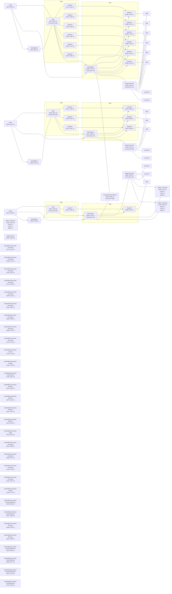

```mermaid
flowchart LR
  subgraph path2 [Path]
    2["Path<br>[943, 2053, 0]<br>Consumed: false"]
      %% [ProgramBodyItem { index: 22 }, VariableDeclarationDeclaration, VariableDeclarationInit]
    3["Segment<br>[971, 1031, 0]"]
      %% [ProgramBodyItem { index: 22 }, VariableDeclarationDeclaration, VariableDeclarationInit, SketchBlockBody, SketchBlockBodyItem { index: 0 }, VariableDeclarationDeclaration, VariableDeclarationInit]
    4["Segment<br>[1042, 1109, 0]"]
      %% [ProgramBodyItem { index: 22 }, VariableDeclarationDeclaration, VariableDeclarationInit, SketchBlockBody, SketchBlockBodyItem { index: 1 }, VariableDeclarationDeclaration, VariableDeclarationInit]
    5["Segment<br>[1159, 1235, 0]"]
      %% [ProgramBodyItem { index: 22 }, VariableDeclarationDeclaration, VariableDeclarationInit, SketchBlockBody, SketchBlockBodyItem { index: 3 }, VariableDeclarationDeclaration, VariableDeclarationInit]
    6["Segment<br>[1285, 1356, 0]"]
      %% [ProgramBodyItem { index: 22 }, VariableDeclarationDeclaration, VariableDeclarationInit, SketchBlockBody, SketchBlockBodyItem { index: 5 }, VariableDeclarationDeclaration, VariableDeclarationInit]
    7["Segment<br>[1406, 1470, 0]"]
      %% [ProgramBodyItem { index: 22 }, VariableDeclarationDeclaration, VariableDeclarationInit, SketchBlockBody, SketchBlockBodyItem { index: 7 }, VariableDeclarationDeclaration, VariableDeclarationInit]
    8["Segment<br>[1520, 1582, 0]"]
      %% [ProgramBodyItem { index: 22 }, VariableDeclarationDeclaration, VariableDeclarationInit, SketchBlockBody, SketchBlockBodyItem { index: 9 }, VariableDeclarationDeclaration, VariableDeclarationInit]
  end
  subgraph path9 [Path]
    9["Path Region<br>[2068, 2125, 0]<br>Consumed: true"]
      %% [ProgramBodyItem { index: 23 }, VariableDeclarationDeclaration, VariableDeclarationInit]
    10["Segment<br>[2068, 2125, 0]"]
      %% [ProgramBodyItem { index: 23 }, VariableDeclarationDeclaration, VariableDeclarationInit]
    11["Segment<br>[2068, 2125, 0]"]
      %% [ProgramBodyItem { index: 23 }, VariableDeclarationDeclaration, VariableDeclarationInit]
    12["Segment<br>[2068, 2125, 0]"]
      %% [ProgramBodyItem { index: 23 }, VariableDeclarationDeclaration, VariableDeclarationInit]
    13["Segment<br>[2068, 2125, 0]"]
      %% [ProgramBodyItem { index: 23 }, VariableDeclarationDeclaration, VariableDeclarationInit]
    14["Segment<br>[2068, 2125, 0]"]
      %% [ProgramBodyItem { index: 23 }, VariableDeclarationDeclaration, VariableDeclarationInit]
    15["Segment<br>[2068, 2125, 0]"]
      %% [ProgramBodyItem { index: 23 }, VariableDeclarationDeclaration, VariableDeclarationInit]
  end
  subgraph path26 [Path]
    26["Path<br>[2363, 3001, 0]<br>Consumed: false"]
      %% [ProgramBodyItem { index: 26 }, VariableDeclarationDeclaration, VariableDeclarationInit]
    27["Segment<br>[2391, 2458, 0]"]
      %% [ProgramBodyItem { index: 26 }, VariableDeclarationDeclaration, VariableDeclarationInit, SketchBlockBody, SketchBlockBodyItem { index: 0 }, VariableDeclarationDeclaration, VariableDeclarationInit]
    28["Segment<br>[2469, 2541, 0]"]
      %% [ProgramBodyItem { index: 26 }, VariableDeclarationDeclaration, VariableDeclarationInit, SketchBlockBody, SketchBlockBodyItem { index: 1 }, VariableDeclarationDeclaration, VariableDeclarationInit]
    29["Segment<br>[2591, 2662, 0]"]
      %% [ProgramBodyItem { index: 26 }, VariableDeclarationDeclaration, VariableDeclarationInit, SketchBlockBody, SketchBlockBodyItem { index: 3 }, VariableDeclarationDeclaration, VariableDeclarationInit]
  end
  subgraph path30 [Path]
    30["Path Region<br>[3018, 3085, 0]<br>Consumed: true"]
      %% [ProgramBodyItem { index: 27 }, VariableDeclarationDeclaration, VariableDeclarationInit]
    31["Segment<br>[3018, 3085, 0]"]
      %% [ProgramBodyItem { index: 27 }, VariableDeclarationDeclaration, VariableDeclarationInit]
    32["Segment<br>[3018, 3085, 0]"]
      %% [ProgramBodyItem { index: 27 }, VariableDeclarationDeclaration, VariableDeclarationInit]
    33["Segment<br>[3018, 3085, 0]"]
      %% [ProgramBodyItem { index: 27 }, VariableDeclarationDeclaration, VariableDeclarationInit]
  end
  subgraph path41 [Path]
    41["Path<br>[3423, 3788, 0]<br>Consumed: false"]
      %% [ProgramBodyItem { index: 31 }, VariableDeclarationDeclaration, VariableDeclarationInit]
    42["Segment<br>[3463, 3538, 0]"]
      %% [ProgramBodyItem { index: 31 }, VariableDeclarationDeclaration, VariableDeclarationInit, SketchBlockBody, SketchBlockBodyItem { index: 0 }, VariableDeclarationDeclaration, VariableDeclarationInit]
  end
  subgraph path43 [Path]
    43["Path Region<br>[3839, 3876, 0]<br>Consumed: true"]
      %% [ProgramBodyItem { index: 32 }, VariableDeclarationDeclaration, VariableDeclarationInit]
    44["Segment<br>[3839, 3876, 0]"]
      %% [ProgramBodyItem { index: 32 }, VariableDeclarationDeclaration, VariableDeclarationInit]
  end
  1["Plane<br>[943, 2053, 0]"]
    %% [ProgramBodyItem { index: 22 }, VariableDeclarationDeclaration, VariableDeclarationInit]
  16["Sweep Extrusion<br>[2183, 2280, 0]<br>Consumed: true"]
    %% [ProgramBodyItem { index: 24 }, VariableDeclarationDeclaration, VariableDeclarationInit]
  17[Wall]
    %% face_code_ref=Missing NodePath
  18[Wall]
    %% face_code_ref=Missing NodePath
  19[Wall]
    %% face_code_ref=Missing NodePath
  20[Wall]
    %% face_code_ref=Missing NodePath
  21[Wall]
    %% face_code_ref=Missing NodePath
  22[Wall]
    %% face_code_ref=Missing NodePath
  23["Cap Start"]
    %% face_code_ref=Missing NodePath
  24["Cap End"]
    %% face_code_ref=Missing NodePath
  25["Plane<br>[2363, 3001, 0]"]
    %% [ProgramBodyItem { index: 26 }, VariableDeclarationDeclaration, VariableDeclarationInit]
  34["Sweep Extrusion<br>[3138, 3181, 0]<br>Consumed: false"]
    %% [ProgramBodyItem { index: 28 }, VariableDeclarationDeclaration, VariableDeclarationInit]
  35[Wall]
    %% face_code_ref=Missing NodePath
  36[Wall]
    %% face_code_ref=Missing NodePath
  37[Wall]
    %% face_code_ref=Missing NodePath
  38["Cap Start"]
    %% face_code_ref=Missing NodePath
  39["Cap End"]
    %% face_code_ref=Missing NodePath
  40["Plane<br>[3423, 3788, 0]"]
    %% [ProgramBodyItem { index: 31 }, VariableDeclarationDeclaration, VariableDeclarationInit]
  45["Sweep Extrusion<br>[3890, 3933, 0]<br>Consumed: true"]
    %% [ProgramBodyItem { index: 33 }, VariableDeclarationDeclaration, VariableDeclarationInit]
  46[Wall]
    %% face_code_ref=Missing NodePath
  47["Cap Start"]
    %% face_code_ref=Missing NodePath
  48["Cap End"]
    %% face_code_ref=Missing NodePath
  49["Pattern Transform<br>[4004, 4112, 0]<br>Copies: 1<br>Faces: 3<br>Edges: 3"]
    %% [ProgramBodyItem { index: 35 }, VariableDeclarationDeclaration, VariableDeclarationInit]
  50["Pattern Transform<br>[4128, 4240, 0]<br>Copies: 1<br>Faces: 3<br>Edges: 3"]
    %% [ProgramBodyItem { index: 36 }, VariableDeclarationDeclaration, VariableDeclarationInit]
  51["Pattern Transform<br>[4128, 4240, 0]<br>Copies: 1<br>Faces: 3<br>Edges: 3"]
    %% [ProgramBodyItem { index: 36 }, VariableDeclarationDeclaration, VariableDeclarationInit]
  52["CompositeSolid Subtract<br>[4252, 4308, 0]<br>Consumed: false"]
    %% [ProgramBodyItem { index: 37 }, VariableDeclarationDeclaration, VariableDeclarationInit]
  53["EdgeCut Fillet<br>[4351, 4680, 0]"]
    %% [ProgramBodyItem { index: 38 }, VariableDeclarationDeclaration, VariableDeclarationInit]
  54["SketchBlock<br>[943, 2053, 0]"]
    %% [ProgramBodyItem { index: 22 }, VariableDeclarationDeclaration, VariableDeclarationInit]
  55["SketchBlockConstraint Coincident<br>[1112, 1148, 0]"]
    %% [ProgramBodyItem { index: 22 }, VariableDeclarationDeclaration, VariableDeclarationInit, SketchBlockBody, SketchBlockBodyItem { index: 2 }, ExpressionStatementExpr]
  56["SketchBlockConstraint Coincident<br>[1238, 1274, 0]"]
    %% [ProgramBodyItem { index: 22 }, VariableDeclarationDeclaration, VariableDeclarationInit, SketchBlockBody, SketchBlockBodyItem { index: 4 }, ExpressionStatementExpr]
  57["SketchBlockConstraint Coincident<br>[1359, 1395, 0]"]
    %% [ProgramBodyItem { index: 22 }, VariableDeclarationDeclaration, VariableDeclarationInit, SketchBlockBody, SketchBlockBodyItem { index: 6 }, ExpressionStatementExpr]
  58["SketchBlockConstraint Coincident<br>[1473, 1509, 0]"]
    %% [ProgramBodyItem { index: 22 }, VariableDeclarationDeclaration, VariableDeclarationInit, SketchBlockBody, SketchBlockBodyItem { index: 8 }, ExpressionStatementExpr]
  59["SketchBlockConstraint Coincident<br>[1585, 1621, 0]"]
    %% [ProgramBodyItem { index: 22 }, VariableDeclarationDeclaration, VariableDeclarationInit, SketchBlockBody, SketchBlockBodyItem { index: 10 }, ExpressionStatementExpr]
  60["SketchBlockConstraint Coincident<br>[1624, 1660, 0]"]
    %% [ProgramBodyItem { index: 22 }, VariableDeclarationDeclaration, VariableDeclarationInit, SketchBlockBody, SketchBlockBodyItem { index: 11 }, ExpressionStatementExpr]
  61["SketchBlockConstraint Coincident<br>[1664, 1695, 0]"]
    %% [ProgramBodyItem { index: 22 }, VariableDeclarationDeclaration, VariableDeclarationInit, SketchBlockBody, SketchBlockBodyItem { index: 12 }, ExpressionStatementExpr]
  62["SketchBlockConstraint Horizontal<br>[1698, 1715, 0]"]
    %% [ProgramBodyItem { index: 22 }, VariableDeclarationDeclaration, VariableDeclarationInit, SketchBlockBody, SketchBlockBodyItem { index: 13 }, ExpressionStatementExpr]
  63["SketchBlockConstraint Horizontal<br>[1718, 1735, 0]"]
    %% [ProgramBodyItem { index: 22 }, VariableDeclarationDeclaration, VariableDeclarationInit, SketchBlockBody, SketchBlockBodyItem { index: 14 }, ExpressionStatementExpr]
  64["SketchBlockConstraint Vertical<br>[1738, 1753, 0]"]
    %% [ProgramBodyItem { index: 22 }, VariableDeclarationDeclaration, VariableDeclarationInit, SketchBlockBody, SketchBlockBodyItem { index: 15 }, ExpressionStatementExpr]
  65["SketchBlockConstraint Parallel<br>[1756, 1780, 0]"]
    %% [ProgramBodyItem { index: 22 }, VariableDeclarationDeclaration, VariableDeclarationInit, SketchBlockBody, SketchBlockBodyItem { index: 16 }, ExpressionStatementExpr]
  66["SketchBlockConstraint Perpendicular<br>[1783, 1812, 0]"]
    %% [ProgramBodyItem { index: 22 }, VariableDeclarationDeclaration, VariableDeclarationInit, SketchBlockBody, SketchBlockBodyItem { index: 17 }, ExpressionStatementExpr]
  67["SketchBlockConstraint Distance<br>[1816, 1869, 0]"]
    %% [ProgramBodyItem { index: 22 }, VariableDeclarationDeclaration, VariableDeclarationInit, SketchBlockBody, SketchBlockBodyItem { index: 18 }, ExpressionStatementExpr]
  68["SketchBlockConstraint Distance<br>[1872, 1921, 0]"]
    %% [ProgramBodyItem { index: 22 }, VariableDeclarationDeclaration, VariableDeclarationInit, SketchBlockBody, SketchBlockBodyItem { index: 19 }, ExpressionStatementExpr]
  69["SketchBlockConstraint Distance<br>[1924, 1967, 0]"]
    %% [ProgramBodyItem { index: 22 }, VariableDeclarationDeclaration, VariableDeclarationInit, SketchBlockBody, SketchBlockBodyItem { index: 20 }, ExpressionStatementExpr]
  70["SketchBlockConstraint Distance<br>[1970, 2013, 0]"]
    %% [ProgramBodyItem { index: 22 }, VariableDeclarationDeclaration, VariableDeclarationInit, SketchBlockBody, SketchBlockBodyItem { index: 21 }, ExpressionStatementExpr]
  71["SketchBlockConstraint Angle<br>[2016, 2051, 0]"]
    %% [ProgramBodyItem { index: 22 }, VariableDeclarationDeclaration, VariableDeclarationInit, SketchBlockBody, SketchBlockBodyItem { index: 22 }, ExpressionStatementExpr]
  72["SketchBlock<br>[2363, 3001, 0]"]
    %% [ProgramBodyItem { index: 26 }, VariableDeclarationDeclaration, VariableDeclarationInit]
  73["SketchBlockConstraint Coincident<br>[2544, 2580, 0]"]
    %% [ProgramBodyItem { index: 26 }, VariableDeclarationDeclaration, VariableDeclarationInit, SketchBlockBody, SketchBlockBodyItem { index: 2 }, ExpressionStatementExpr]
  74["SketchBlockConstraint Coincident<br>[2665, 2701, 0]"]
    %% [ProgramBodyItem { index: 26 }, VariableDeclarationDeclaration, VariableDeclarationInit, SketchBlockBody, SketchBlockBodyItem { index: 4 }, ExpressionStatementExpr]
  75["SketchBlockConstraint Coincident<br>[2704, 2740, 0]"]
    %% [ProgramBodyItem { index: 26 }, VariableDeclarationDeclaration, VariableDeclarationInit, SketchBlockBody, SketchBlockBodyItem { index: 5 }, ExpressionStatementExpr]
  76["SketchBlockConstraint Horizontal<br>[2744, 2761, 0]"]
    %% [ProgramBodyItem { index: 26 }, VariableDeclarationDeclaration, VariableDeclarationInit, SketchBlockBody, SketchBlockBodyItem { index: 6 }, ExpressionStatementExpr]
  77["SketchBlockConstraint Vertical<br>[2764, 2779, 0]"]
    %% [ProgramBodyItem { index: 26 }, VariableDeclarationDeclaration, VariableDeclarationInit, SketchBlockBody, SketchBlockBodyItem { index: 7 }, ExpressionStatementExpr]
  78["SketchBlockConstraint HorizontalDistance<br>[2783, 2844, 0]"]
    %% [ProgramBodyItem { index: 26 }, VariableDeclarationDeclaration, VariableDeclarationInit, SketchBlockBody, SketchBlockBodyItem { index: 8 }, ExpressionStatementExpr]
  79["SketchBlockConstraint VerticalDistance<br>[2847, 2895, 0]"]
    %% [ProgramBodyItem { index: 26 }, VariableDeclarationDeclaration, VariableDeclarationInit, SketchBlockBody, SketchBlockBodyItem { index: 9 }, ExpressionStatementExpr]
  80["SketchBlockConstraint Distance<br>[2898, 2948, 0]"]
    %% [ProgramBodyItem { index: 26 }, VariableDeclarationDeclaration, VariableDeclarationInit, SketchBlockBody, SketchBlockBodyItem { index: 10 }, ExpressionStatementExpr]
  81["SketchBlockConstraint Distance<br>[2951, 2999, 0]"]
    %% [ProgramBodyItem { index: 26 }, VariableDeclarationDeclaration, VariableDeclarationInit, SketchBlockBody, SketchBlockBodyItem { index: 11 }, ExpressionStatementExpr]
  82["SketchBlock<br>[3423, 3788, 0]"]
    %% [ProgramBodyItem { index: 31 }, VariableDeclarationDeclaration, VariableDeclarationInit]
  83["SketchBlockConstraint HorizontalDistance<br>[3542, 3606, 0]"]
    %% [ProgramBodyItem { index: 31 }, VariableDeclarationDeclaration, VariableDeclarationInit, SketchBlockBody, SketchBlockBodyItem { index: 1 }, ExpressionStatementExpr]
  84["SketchBlockConstraint VerticalDistance<br>[3609, 3671, 0]"]
    %% [ProgramBodyItem { index: 31 }, VariableDeclarationDeclaration, VariableDeclarationInit, SketchBlockBody, SketchBlockBodyItem { index: 2 }, ExpressionStatementExpr]
  85["SketchBlockConstraint HorizontalDistance<br>[3674, 3733, 0]"]
    %% [ProgramBodyItem { index: 31 }, VariableDeclarationDeclaration, VariableDeclarationInit, SketchBlockBody, SketchBlockBodyItem { index: 3 }, ExpressionStatementExpr]
  86["SketchBlockConstraint VerticalDistance<br>[3736, 3786, 0]"]
    %% [ProgramBodyItem { index: 31 }, VariableDeclarationDeclaration, VariableDeclarationInit, SketchBlockBody, SketchBlockBodyItem { index: 4 }, ExpressionStatementExpr]
  1 --- 2
  1 <--x 9
  1 <--x 54
  2 --- 3
  2 --- 4
  2 --- 5
  2 --- 6
  2 --- 7
  2 --- 8
  2 <--x 9
  54 --- 2
  3 <--x 10
  4 <--x 11
  5 <--x 12
  6 <--x 13
  7 <--x 14
  8 <--x 15
  9 <--x 10
  9 <--x 11
  9 <--x 12
  9 <--x 13
  9 <--x 14
  9 <--x 15
  9 ---- 16
  9 --- 52
  10 --- 17
  11 --- 18
  12 --- 19
  13 --- 20
  14 --- 21
  15 --- 22
  16 --- 17
  16 --- 18
  16 --- 19
  16 --- 20
  16 --- 21
  16 --- 22
  16 --- 23
  16 --- 24
  25 --- 26
  25 <--x 30
  25 <--x 72
  26 --- 27
  26 --- 28
  26 --- 29
  26 <--x 30
  72 --- 26
  27 <--x 31
  28 <--x 32
  29 <--x 33
  30 <--x 31
  30 <--x 32
  30 <--x 33
  30 ---- 34
  31 --- 35
  32 --- 36
  33 --- 37
  34 --- 35
  34 --- 36
  34 --- 37
  34 --- 38
  34 --- 39
  40 --- 41
  40 <--x 43
  40 <--x 82
  41 --- 42
  41 <--x 43
  82 --- 41
  42 <--x 44
  43 <--x 44
  43 ---- 45
  43 --- 49
  43 --- 50
  43 --- 52
  44 --- 46
  45 --- 46
  45 --- 47
  45 --- 48
  45 x--> 49
  45 x--> 50
```
