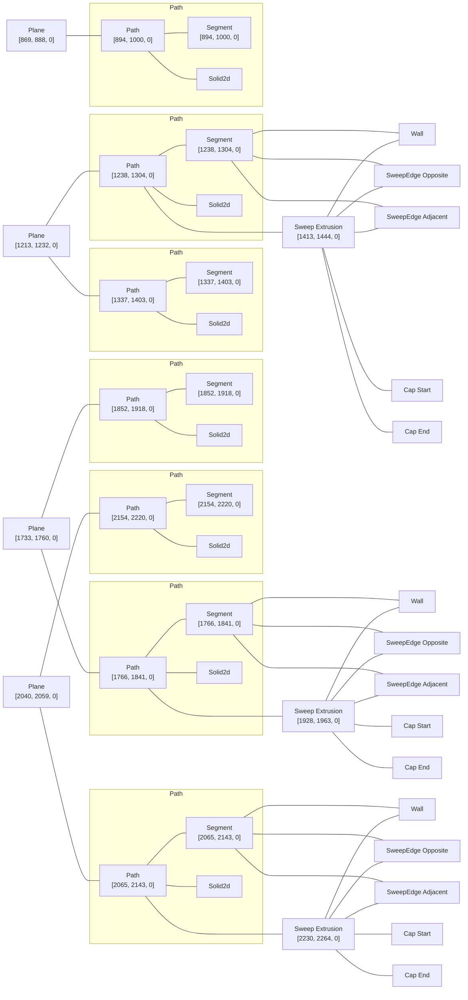

```mermaid
flowchart LR
  subgraph path2 [Path]
    2["Path<br>[894, 1000, 0]"]
    3["Segment<br>[894, 1000, 0]"]
    4[Solid2d]
  end
  subgraph path6 [Path]
    6["Path<br>[1238, 1304, 0]"]
    7["Segment<br>[1238, 1304, 0]"]
    8[Solid2d]
  end
  subgraph path9 [Path]
    9["Path<br>[1337, 1403, 0]"]
    10["Segment<br>[1337, 1403, 0]"]
    11[Solid2d]
  end
  subgraph path19 [Path]
    19["Path<br>[1766, 1841, 0]"]
    20["Segment<br>[1766, 1841, 0]"]
    21[Solid2d]
  end
  subgraph path22 [Path]
    22["Path<br>[1852, 1918, 0]"]
    23["Segment<br>[1852, 1918, 0]"]
    24[Solid2d]
  end
  subgraph path32 [Path]
    32["Path<br>[2065, 2143, 0]"]
    33["Segment<br>[2065, 2143, 0]"]
    34[Solid2d]
  end
  subgraph path35 [Path]
    35["Path<br>[2154, 2220, 0]"]
    36["Segment<br>[2154, 2220, 0]"]
    37[Solid2d]
  end
  1["Plane<br>[869, 888, 0]"]
  5["Plane<br>[1213, 1232, 0]"]
  12["Sweep Extrusion<br>[1413, 1444, 0]"]
  13[Wall]
  14["Cap Start"]
  15["Cap End"]
  16["SweepEdge Opposite"]
  17["SweepEdge Adjacent"]
  18["Plane<br>[1733, 1760, 0]"]
  25["Sweep Extrusion<br>[1928, 1963, 0]"]
  26[Wall]
  27["Cap Start"]
  28["Cap End"]
  29["SweepEdge Opposite"]
  30["SweepEdge Adjacent"]
  31["Plane<br>[2040, 2059, 0]"]
  38["Sweep Extrusion<br>[2230, 2264, 0]"]
  39[Wall]
  40["Cap Start"]
  41["Cap End"]
  42["SweepEdge Opposite"]
  43["SweepEdge Adjacent"]
  1 --- 2
  2 --- 3
  2 --- 4
  5 --- 6
  5 --- 9
  6 --- 7
  6 ---- 12
  6 --- 8
  7 --- 13
  7 --- 16
  7 --- 17
  9 --- 10
  9 --- 11
  12 --- 13
  12 --- 14
  12 --- 15
  12 --- 16
  12 --- 17
  18 --- 19
  18 --- 22
  19 --- 20
  19 ---- 25
  19 --- 21
  20 --- 26
  20 --- 29
  20 --- 30
  22 --- 23
  22 --- 24
  25 --- 26
  25 --- 27
  25 --- 28
  25 --- 29
  25 --- 30
  31 --- 32
  31 --- 35
  32 --- 33
  32 ---- 38
  32 --- 34
  33 --- 39
  33 --- 42
  33 --- 43
  35 --- 36
  35 --- 37
  38 --- 39
  38 --- 40
  38 --- 41
  38 --- 42
  38 --- 43
```
