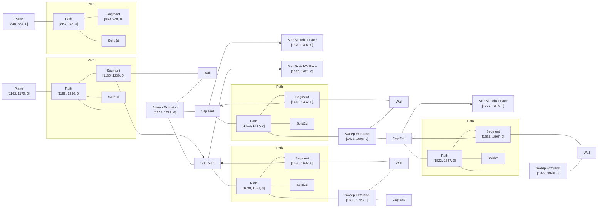

```mermaid
flowchart LR
  subgraph path2 [Path]
    2["Path<br>[863, 948, 0]"]
    3["Segment<br>[863, 948, 0]"]
    4[Solid2d]
  end
  subgraph path6 [Path]
    6["Path<br>[1185, 1230, 0]"]
    7["Segment<br>[1185, 1230, 0]"]
    8[Solid2d]
  end
  subgraph path13 [Path]
    13["Path<br>[1413, 1467, 0]"]
    14["Segment<br>[1413, 1467, 0]"]
    15[Solid2d]
  end
  subgraph path19 [Path]
    19["Path<br>[1630, 1687, 0]"]
    20["Segment<br>[1630, 1687, 0]"]
    21[Solid2d]
  end
  subgraph path25 [Path]
    25["Path<br>[1822, 1867, 0]"]
    26["Segment<br>[1822, 1867, 0]"]
    27[Solid2d]
  end
  1["Plane<br>[840, 857, 0]"]
  5["Plane<br>[1162, 1179, 0]"]
  9["Sweep Extrusion<br>[1268, 1299, 0]"]
  10[Wall]
  11["Cap Start"]
  12["Cap End"]
  16["Sweep Extrusion<br>[1473, 1508, 0]"]
  17[Wall]
  18["Cap End"]
  22["Sweep Extrusion<br>[1693, 1726, 0]"]
  23[Wall]
  24["Cap End"]
  28["Sweep Extrusion<br>[1873, 1948, 0]"]
  29[Wall]
  30["StartSketchOnFace<br>[1370, 1407, 0]"]
  31["StartSketchOnFace<br>[1585, 1624, 0]"]
  32["StartSketchOnFace<br>[1777, 1816, 0]"]
  1 --- 2
  2 --- 3
  2 --- 4
  5 --- 6
  6 --- 7
  6 ---- 9
  6 --- 8
  7 --- 10
  7 x--> 11
  9 --- 10
  9 --- 11
  9 --- 12
  11 --- 19
  12 --- 13
  13 --- 14
  13 ---- 16
  13 --- 15
  14 --- 17
  14 <--x 12
  16 --- 17
  16 --- 18
  18 --- 25
  19 --- 20
  19 ---- 22
  19 --- 21
  20 --- 23
  20 <--x 11
  22 --- 23
  22 --- 24
  25 --- 26
  25 ---- 28
  25 --- 27
  26 --- 29
  26 <--x 18
  28 --- 29
  12 <--x 30
  11 <--x 31
  18 <--x 32
```
