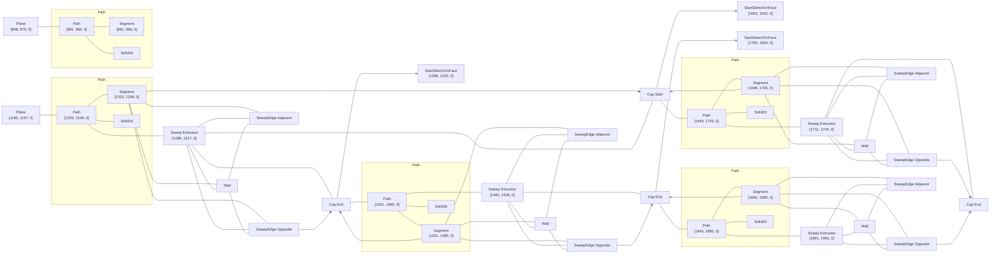

```mermaid
flowchart LR
  subgraph path2 [Path]
    2["Path<br>[881, 966, 0]"]
      %% [ProgramBodyItem { index: 12 }, VariableDeclarationDeclaration, VariableDeclarationInit, PipeBodyItem { index: 1 }]
    3["Segment<br>[881, 966, 0]"]
      %% [ProgramBodyItem { index: 12 }, VariableDeclarationDeclaration, VariableDeclarationInit, PipeBodyItem { index: 1 }]
    4[Solid2d]
  end
  subgraph path6 [Path]
    6["Path<br>[1203, 1248, 0]"]
      %% [ProgramBodyItem { index: 13 }, VariableDeclarationDeclaration, VariableDeclarationInit, PipeBodyItem { index: 1 }]
    7["Segment<br>[1203, 1248, 0]"]
      %% [ProgramBodyItem { index: 13 }, VariableDeclarationDeclaration, VariableDeclarationInit, PipeBodyItem { index: 1 }]
    8[Solid2d]
  end
  subgraph path15 [Path]
    15["Path<br>[1431, 1485, 0]"]
      %% [ProgramBodyItem { index: 14 }, VariableDeclarationDeclaration, VariableDeclarationInit, PipeBodyItem { index: 1 }]
    16["Segment<br>[1431, 1485, 0]"]
      %% [ProgramBodyItem { index: 14 }, VariableDeclarationDeclaration, VariableDeclarationInit, PipeBodyItem { index: 1 }]
    17[Solid2d]
  end
  subgraph path23 [Path]
    23["Path<br>[1648, 1705, 0]"]
      %% [ProgramBodyItem { index: 15 }, VariableDeclarationDeclaration, VariableDeclarationInit, PipeBodyItem { index: 1 }]
    24["Segment<br>[1648, 1705, 0]"]
      %% [ProgramBodyItem { index: 15 }, VariableDeclarationDeclaration, VariableDeclarationInit, PipeBodyItem { index: 1 }]
    25[Solid2d]
  end
  subgraph path31 [Path]
    31["Path<br>[1840, 1885, 0]"]
      %% [ProgramBodyItem { index: 16 }, VariableDeclarationDeclaration, VariableDeclarationInit, PipeBodyItem { index: 1 }]
    32["Segment<br>[1840, 1885, 0]"]
      %% [ProgramBodyItem { index: 16 }, VariableDeclarationDeclaration, VariableDeclarationInit, PipeBodyItem { index: 1 }]
    33[Solid2d]
  end
  1["Plane<br>[858, 875, 0]"]
    %% [ProgramBodyItem { index: 12 }, VariableDeclarationDeclaration, VariableDeclarationInit, PipeBodyItem { index: 0 }]
  5["Plane<br>[1180, 1197, 0]"]
    %% [ProgramBodyItem { index: 13 }, VariableDeclarationDeclaration, VariableDeclarationInit, PipeBodyItem { index: 0 }]
  9["Sweep Extrusion<br>[1286, 1317, 0]"]
    %% [ProgramBodyItem { index: 13 }, VariableDeclarationDeclaration, VariableDeclarationInit, PipeBodyItem { index: 3 }]
  10[Wall]
    %% face_code_ref=Missing NodePath
  11["Cap Start"]
    %% face_code_ref=[ProgramBodyItem { index: 15 }, VariableDeclarationDeclaration, VariableDeclarationInit, PipeBodyItem { index: 0 }]
  12["Cap End"]
    %% face_code_ref=[ProgramBodyItem { index: 14 }, VariableDeclarationDeclaration, VariableDeclarationInit, PipeBodyItem { index: 0 }]
  13["SweepEdge Opposite"]
  14["SweepEdge Adjacent"]
  18["Sweep Extrusion<br>[1491, 1526, 0]"]
    %% [ProgramBodyItem { index: 14 }, VariableDeclarationDeclaration, VariableDeclarationInit, PipeBodyItem { index: 2 }]
  19[Wall]
    %% face_code_ref=Missing NodePath
  20["Cap End"]
    %% face_code_ref=[ProgramBodyItem { index: 16 }, VariableDeclarationDeclaration, VariableDeclarationInit, PipeBodyItem { index: 0 }]
  21["SweepEdge Opposite"]
  22["SweepEdge Adjacent"]
  26["Sweep Extrusion<br>[1711, 1744, 0]"]
    %% [ProgramBodyItem { index: 15 }, VariableDeclarationDeclaration, VariableDeclarationInit, PipeBodyItem { index: 2 }]
  27[Wall]
    %% face_code_ref=Missing NodePath
  28["Cap End"]
    %% face_code_ref=Missing NodePath
  29["SweepEdge Opposite"]
  30["SweepEdge Adjacent"]
  34["Sweep Extrusion<br>[1891, 1963, 0]"]
    %% [ProgramBodyItem { index: 16 }, VariableDeclarationDeclaration, VariableDeclarationInit, PipeBodyItem { index: 2 }]
  35[Wall]
    %% face_code_ref=Missing NodePath
  36["SweepEdge Opposite"]
  37["SweepEdge Adjacent"]
  38["StartSketchOnFace<br>[1388, 1425, 0]"]
    %% [ProgramBodyItem { index: 14 }, VariableDeclarationDeclaration, VariableDeclarationInit, PipeBodyItem { index: 0 }]
  39["StartSketchOnFace<br>[1603, 1642, 0]"]
    %% [ProgramBodyItem { index: 15 }, VariableDeclarationDeclaration, VariableDeclarationInit, PipeBodyItem { index: 0 }]
  40["StartSketchOnFace<br>[1795, 1834, 0]"]
    %% [ProgramBodyItem { index: 16 }, VariableDeclarationDeclaration, VariableDeclarationInit, PipeBodyItem { index: 0 }]
  1 --- 2
  2 --- 3
  2 --- 4
  5 --- 6
  6 --- 7
  6 --- 8
  6 ---- 9
  7 --- 10
  7 x--> 11
  7 --- 13
  7 --- 14
  9 --- 10
  9 --- 11
  9 --- 12
  9 --- 13
  9 --- 14
  10 --- 13
  10 --- 14
  11 --- 23
  24 <--x 11
  11 <--x 39
  13 <--x 12
  12 --- 15
  16 <--x 12
  12 <--x 38
  15 --- 16
  15 --- 17
  15 ---- 18
  16 --- 19
  16 --- 21
  16 --- 22
  18 --- 19
  18 --- 20
  18 --- 21
  18 --- 22
  19 --- 21
  19 --- 22
  21 <--x 20
  20 --- 31
  32 <--x 20
  20 <--x 40
  23 --- 24
  23 --- 25
  23 ---- 26
  24 --- 27
  24 --- 29
  24 --- 30
  26 --- 27
  26 --- 28
  26 --- 29
  26 --- 30
  27 --- 29
  27 --- 30
  29 <--x 28
  36 <--x 28
  31 --- 32
  31 --- 33
  31 ---- 34
  32 --- 35
  32 --- 36
  32 --- 37
  34 --- 35
  34 --- 36
  34 --- 37
  35 --- 36
  35 --- 37
```
