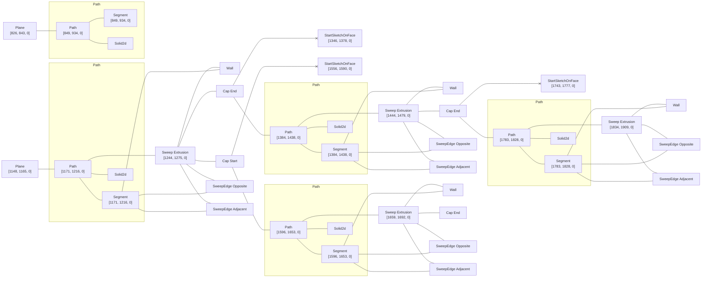

```mermaid
flowchart LR
  subgraph path2 [Path]
    2["Path<br>[849, 934, 0]"]
    3["Segment<br>[849, 934, 0]"]
    4[Solid2d]
  end
  subgraph path6 [Path]
    6["Path<br>[1171, 1216, 0]"]
    7["Segment<br>[1171, 1216, 0]"]
    8[Solid2d]
  end
  subgraph path15 [Path]
    15["Path<br>[1384, 1438, 0]"]
    16["Segment<br>[1384, 1438, 0]"]
    17[Solid2d]
  end
  subgraph path23 [Path]
    23["Path<br>[1596, 1653, 0]"]
    24["Segment<br>[1596, 1653, 0]"]
    25[Solid2d]
  end
  subgraph path31 [Path]
    31["Path<br>[1783, 1828, 0]"]
    32["Segment<br>[1783, 1828, 0]"]
    33[Solid2d]
  end
  1["Plane<br>[826, 843, 0]"]
  5["Plane<br>[1148, 1165, 0]"]
  9["Sweep Extrusion<br>[1244, 1275, 0]"]
  10[Wall]
  11["Cap Start"]
  12["Cap End"]
  13["SweepEdge Opposite"]
  14["SweepEdge Adjacent"]
  18["Sweep Extrusion<br>[1444, 1479, 0]"]
  19[Wall]
  20["Cap End"]
  21["SweepEdge Opposite"]
  22["SweepEdge Adjacent"]
  26["Sweep Extrusion<br>[1659, 1692, 0]"]
  27[Wall]
  28["Cap End"]
  29["SweepEdge Opposite"]
  30["SweepEdge Adjacent"]
  34["Sweep Extrusion<br>[1834, 1909, 0]"]
  35[Wall]
  36["SweepEdge Opposite"]
  37["SweepEdge Adjacent"]
  38["StartSketchOnFace<br>[1346, 1378, 0]"]
  39["StartSketchOnFace<br>[1556, 1590, 0]"]
  40["StartSketchOnFace<br>[1743, 1777, 0]"]
  1 --- 2
  2 --- 3
  2 --- 4
  5 --- 6
  6 --- 7
  6 ---- 9
  6 --- 8
  7 --- 10
  7 --- 13
  7 --- 14
  9 --- 10
  9 --- 11
  9 --- 12
  9 --- 13
  9 --- 14
  11 --- 23
  12 --- 15
  15 --- 16
  15 ---- 18
  15 --- 17
  16 --- 19
  16 --- 21
  16 --- 22
  18 --- 19
  18 --- 20
  18 --- 21
  18 --- 22
  20 --- 31
  23 --- 24
  23 ---- 26
  23 --- 25
  24 --- 27
  24 --- 29
  24 --- 30
  26 --- 27
  26 --- 28
  26 --- 29
  26 --- 30
  31 --- 32
  31 ---- 34
  31 --- 33
  32 --- 35
  32 --- 36
  32 --- 37
  34 --- 35
  34 --- 36
  34 --- 37
  12 <--x 38
  11 <--x 39
  20 <--x 40
```
