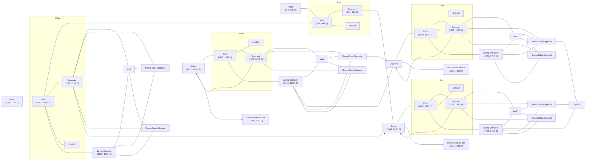

```mermaid
flowchart LR
  subgraph path2 [Path]
    2["Path<br>[881, 964, 0]"]
      %% [ProgramBodyItem { index: 12 }, VariableDeclarationDeclaration, VariableDeclarationInit, PipeBodyItem { index: 1 }]
    3["Segment<br>[881, 964, 0]"]
      %% [ProgramBodyItem { index: 12 }, VariableDeclarationDeclaration, VariableDeclarationInit, PipeBodyItem { index: 1 }]
    4[Solid2d]
  end
  subgraph path6 [Path]
    6["Path<br>[1201, 1244, 0]"]
      %% [ProgramBodyItem { index: 13 }, VariableDeclarationDeclaration, VariableDeclarationInit, PipeBodyItem { index: 1 }]
    7["Segment<br>[1201, 1244, 0]"]
      %% [ProgramBodyItem { index: 13 }, VariableDeclarationDeclaration, VariableDeclarationInit, PipeBodyItem { index: 1 }]
    8[Solid2d]
  end
  subgraph path14 [Path]
    14["Path<br>[1427, 1479, 0]"]
      %% [ProgramBodyItem { index: 14 }, VariableDeclarationDeclaration, VariableDeclarationInit, PipeBodyItem { index: 1 }]
    15["Segment<br>[1427, 1479, 0]"]
      %% [ProgramBodyItem { index: 14 }, VariableDeclarationDeclaration, VariableDeclarationInit, PipeBodyItem { index: 1 }]
    16[Solid2d]
  end
  subgraph path23 [Path]
    23["Path<br>[1642, 1697, 0]"]
      %% [ProgramBodyItem { index: 15 }, VariableDeclarationDeclaration, VariableDeclarationInit, PipeBodyItem { index: 1 }]
    24["Segment<br>[1642, 1697, 0]"]
      %% [ProgramBodyItem { index: 15 }, VariableDeclarationDeclaration, VariableDeclarationInit, PipeBodyItem { index: 1 }]
    25[Solid2d]
  end
  subgraph path31 [Path]
    31["Path<br>[1832, 1875, 0]"]
      %% [ProgramBodyItem { index: 16 }, VariableDeclarationDeclaration, VariableDeclarationInit, PipeBodyItem { index: 1 }]
    32["Segment<br>[1832, 1875, 0]"]
      %% [ProgramBodyItem { index: 16 }, VariableDeclarationDeclaration, VariableDeclarationInit, PipeBodyItem { index: 1 }]
    33[Solid2d]
  end
  1["Plane<br>[858, 875, 0]"]
    %% [ProgramBodyItem { index: 12 }, VariableDeclarationDeclaration, VariableDeclarationInit, PipeBodyItem { index: 0 }]
  5["Plane<br>[1178, 1195, 0]"]
    %% [ProgramBodyItem { index: 13 }, VariableDeclarationDeclaration, VariableDeclarationInit, PipeBodyItem { index: 0 }]
  9["Sweep Extrusion<br>[1282, 1313, 0]"]
    %% [ProgramBodyItem { index: 13 }, VariableDeclarationDeclaration, VariableDeclarationInit, PipeBodyItem { index: 3 }]
  10[Wall]
    %% face_code_ref=Missing NodePath
  11["SweepEdge Opposite"]
  12["SweepEdge Adjacent"]
  13["Plane<br>[1427, 1479, 0]"]
    %% [ProgramBodyItem { index: 14 }, VariableDeclarationDeclaration, VariableDeclarationInit, PipeBodyItem { index: 1 }]
  17["Sweep Extrusion<br>[1485, 1520, 0]"]
    %% [ProgramBodyItem { index: 14 }, VariableDeclarationDeclaration, VariableDeclarationInit, PipeBodyItem { index: 2 }]
  18[Wall]
    %% face_code_ref=Missing NodePath
  19["Cap End"]
    %% face_code_ref=[ProgramBodyItem { index: 16 }, VariableDeclarationDeclaration, VariableDeclarationInit, PipeBodyItem { index: 0 }]
  20["SweepEdge Opposite"]
  21["SweepEdge Adjacent"]
  22["Plane<br>[1642, 1697, 0]"]
    %% [ProgramBodyItem { index: 15 }, VariableDeclarationDeclaration, VariableDeclarationInit, PipeBodyItem { index: 1 }]
  26["Sweep Extrusion<br>[1703, 1736, 0]"]
    %% [ProgramBodyItem { index: 15 }, VariableDeclarationDeclaration, VariableDeclarationInit, PipeBodyItem { index: 2 }]
  27[Wall]
    %% face_code_ref=Missing NodePath
  28["Cap End"]
    %% face_code_ref=Missing NodePath
  29["SweepEdge Opposite"]
  30["SweepEdge Adjacent"]
  34["Sweep Extrusion<br>[1881, 1953, 0]"]
    %% [ProgramBodyItem { index: 16 }, VariableDeclarationDeclaration, VariableDeclarationInit, PipeBodyItem { index: 2 }]
  35[Wall]
    %% face_code_ref=Missing NodePath
  36["SweepEdge Opposite"]
  37["SweepEdge Adjacent"]
  38["StartSketchOnFace<br>[1384, 1421, 0]"]
    %% [ProgramBodyItem { index: 14 }, VariableDeclarationDeclaration, VariableDeclarationInit, PipeBodyItem { index: 0 }]
  39["StartSketchOnFace<br>[1597, 1636, 0]"]
    %% [ProgramBodyItem { index: 15 }, VariableDeclarationDeclaration, VariableDeclarationInit, PipeBodyItem { index: 0 }]
  40["StartSketchOnFace<br>[1787, 1826, 0]"]
    %% [ProgramBodyItem { index: 16 }, VariableDeclarationDeclaration, VariableDeclarationInit, PipeBodyItem { index: 0 }]
  1 --- 2
  2 --- 3
  2 --- 4
  6 x--> 2
  3 x--> 22
  5 --- 6
  6 --- 7
  6 --- 8
  6 ---- 9
  7 --- 10
  7 --- 11
  7 --- 12
  7 x--> 22
  9 --- 10
  9 --- 11
  9 --- 12
  10 --- 11
  10 --- 12
  11 x--> 13
  13 --- 14
  15 <--x 13
  13 <--x 38
  14 --- 15
  14 --- 16
  14 ---- 17
  15 --- 18
  15 --- 20
  15 --- 21
  17 --- 18
  17 --- 19
  17 --- 20
  17 --- 21
  18 --- 20
  18 --- 21
  20 <--x 19
  19 --- 31
  32 <--x 19
  19 <--x 40
  22 --- 23
  24 <--x 22
  22 <--x 39
  23 --- 24
  23 --- 25
  23 ---- 26
  24 --- 27
  24 --- 29
  24 --- 30
  26 --- 27
  26 --- 28
  26 --- 29
  26 --- 30
  27 --- 29
  27 --- 30
  29 <--x 28
  36 <--x 28
  31 --- 32
  31 --- 33
  31 ---- 34
  32 --- 35
  32 --- 36
  32 --- 37
  34 --- 35
  34 --- 36
  34 --- 37
  35 --- 36
  35 --- 37
```
