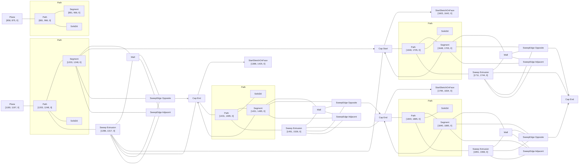

```mermaid
flowchart LR
  subgraph path6 [Path]
    6["Path<br>[881, 966, 0]"]
      %% [ProgramBodyItem { index: 12 }, VariableDeclarationDeclaration, VariableDeclarationInit, PipeBodyItem { index: 1 }]
    11["Segment<br>[881, 966, 0]"]
      %% [ProgramBodyItem { index: 12 }, VariableDeclarationDeclaration, VariableDeclarationInit, PipeBodyItem { index: 1 }]
    19[Solid2d]
  end
  subgraph path7 [Path]
    7["Path<br>[1203, 1248, 0]"]
      %% [ProgramBodyItem { index: 13 }, VariableDeclarationDeclaration, VariableDeclarationInit, PipeBodyItem { index: 1 }]
    12["Segment<br>[1203, 1248, 0]"]
      %% [ProgramBodyItem { index: 13 }, VariableDeclarationDeclaration, VariableDeclarationInit, PipeBodyItem { index: 1 }]
    17[Solid2d]
  end
  subgraph path8 [Path]
    8["Path<br>[1431, 1485, 0]"]
      %% [ProgramBodyItem { index: 14 }, VariableDeclarationDeclaration, VariableDeclarationInit, PipeBodyItem { index: 1 }]
    13["Segment<br>[1431, 1485, 0]"]
      %% [ProgramBodyItem { index: 14 }, VariableDeclarationDeclaration, VariableDeclarationInit, PipeBodyItem { index: 1 }]
    16[Solid2d]
  end
  subgraph path9 [Path]
    9["Path<br>[1648, 1705, 0]"]
      %% [ProgramBodyItem { index: 15 }, VariableDeclarationDeclaration, VariableDeclarationInit, PipeBodyItem { index: 1 }]
    14["Segment<br>[1648, 1705, 0]"]
      %% [ProgramBodyItem { index: 15 }, VariableDeclarationDeclaration, VariableDeclarationInit, PipeBodyItem { index: 1 }]
    20[Solid2d]
  end
  subgraph path10 [Path]
    10["Path<br>[1840, 1885, 0]"]
      %% [ProgramBodyItem { index: 16 }, VariableDeclarationDeclaration, VariableDeclarationInit, PipeBodyItem { index: 1 }]
    15["Segment<br>[1840, 1885, 0]"]
      %% [ProgramBodyItem { index: 16 }, VariableDeclarationDeclaration, VariableDeclarationInit, PipeBodyItem { index: 1 }]
    18[Solid2d]
  end
  1["Plane<br>[858, 875, 0]"]
    %% [ProgramBodyItem { index: 12 }, VariableDeclarationDeclaration, VariableDeclarationInit, PipeBodyItem { index: 0 }]
  2["Plane<br>[1180, 1197, 0]"]
    %% [ProgramBodyItem { index: 13 }, VariableDeclarationDeclaration, VariableDeclarationInit, PipeBodyItem { index: 0 }]
  3["StartSketchOnFace<br>[1388, 1425, 0]"]
    %% [ProgramBodyItem { index: 14 }, VariableDeclarationDeclaration, VariableDeclarationInit, PipeBodyItem { index: 0 }]
  4["StartSketchOnFace<br>[1795, 1834, 0]"]
    %% [ProgramBodyItem { index: 16 }, VariableDeclarationDeclaration, VariableDeclarationInit, PipeBodyItem { index: 0 }]
  5["StartSketchOnFace<br>[1603, 1642, 0]"]
    %% [ProgramBodyItem { index: 15 }, VariableDeclarationDeclaration, VariableDeclarationInit, PipeBodyItem { index: 0 }]
  21["Sweep Extrusion<br>[1286, 1317, 0]"]
    %% [ProgramBodyItem { index: 13 }, VariableDeclarationDeclaration, VariableDeclarationInit, PipeBodyItem { index: 3 }]
  22["Sweep Extrusion<br>[1491, 1526, 0]"]
    %% [ProgramBodyItem { index: 14 }, VariableDeclarationDeclaration, VariableDeclarationInit, PipeBodyItem { index: 2 }]
  23["Sweep Extrusion<br>[1711, 1744, 0]"]
    %% [ProgramBodyItem { index: 15 }, VariableDeclarationDeclaration, VariableDeclarationInit, PipeBodyItem { index: 2 }]
  24["Sweep Extrusion<br>[1891, 1966, 0]"]
    %% [ProgramBodyItem { index: 16 }, VariableDeclarationDeclaration, VariableDeclarationInit, PipeBodyItem { index: 2 }]
  25[Wall]
    %% face_code_ref=Missing NodePath
  26[Wall]
    %% face_code_ref=Missing NodePath
  27[Wall]
    %% face_code_ref=Missing NodePath
  28[Wall]
    %% face_code_ref=Missing NodePath
  29["Cap Start"]
    %% face_code_ref=[ProgramBodyItem { index: 15 }, VariableDeclarationDeclaration, VariableDeclarationInit, PipeBodyItem { index: 0 }]
  30["Cap End"]
    %% face_code_ref=Missing NodePath
  31["Cap End"]
    %% face_code_ref=[ProgramBodyItem { index: 16 }, VariableDeclarationDeclaration, VariableDeclarationInit, PipeBodyItem { index: 0 }]
  32["Cap End"]
    %% face_code_ref=[ProgramBodyItem { index: 14 }, VariableDeclarationDeclaration, VariableDeclarationInit, PipeBodyItem { index: 0 }]
  33["SweepEdge Opposite"]
  34["SweepEdge Opposite"]
  35["SweepEdge Opposite"]
  36["SweepEdge Opposite"]
  37["SweepEdge Adjacent"]
  38["SweepEdge Adjacent"]
  39["SweepEdge Adjacent"]
  40["SweepEdge Adjacent"]
  1 --- 6
  2 --- 7
  32 x--> 3
  31 x--> 4
  29 x--> 5
  6 --- 11
  6 --- 19
  7 --- 12
  7 --- 17
  7 ---- 21
  8 --- 13
  8 --- 16
  8 ---- 22
  32 --- 8
  9 --- 14
  9 --- 20
  9 ---- 23
  29 --- 9
  10 --- 15
  10 --- 18
  10 ---- 24
  31 --- 10
  12 --- 26
  12 x--> 29
  12 --- 34
  12 --- 38
  13 --- 25
  13 x--> 32
  13 --- 33
  13 --- 37
  14 --- 28
  14 x--> 29
  14 --- 36
  14 --- 40
  15 --- 27
  15 x--> 31
  15 --- 35
  15 --- 39
  21 --- 26
  21 --- 29
  21 --- 32
  21 --- 34
  21 --- 38
  22 --- 25
  22 --- 31
  22 --- 33
  22 --- 37
  23 --- 28
  23 --- 30
  23 --- 36
  23 --- 40
  24 --- 27
  24 --- 35
  24 --- 39
  25 --- 33
  25 --- 37
  26 --- 34
  26 --- 38
  27 --- 35
  27 --- 39
  28 --- 36
  28 --- 40
  35 <--x 30
  36 <--x 30
  33 <--x 31
  34 <--x 32
```
