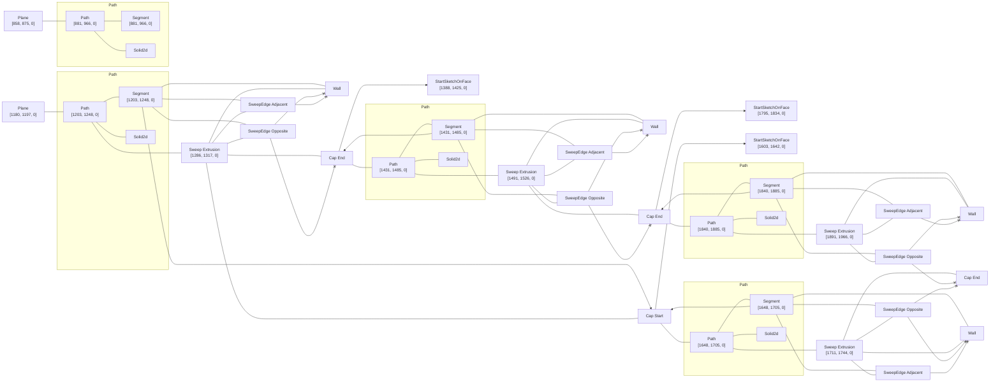

```mermaid
flowchart LR
  subgraph path6 [Path]
    6["Path<br>[881, 966, 0]"]
    11["Segment<br>[881, 966, 0]"]
    20[Solid2d]
  end
  subgraph path7 [Path]
    7["Path<br>[1203, 1248, 0]"]
    12["Segment<br>[1203, 1248, 0]"]
    18[Solid2d]
  end
  subgraph path8 [Path]
    8["Path<br>[1431, 1485, 0]"]
    13["Segment<br>[1431, 1485, 0]"]
    19[Solid2d]
  end
  subgraph path9 [Path]
    9["Path<br>[1648, 1705, 0]"]
    14["Segment<br>[1648, 1705, 0]"]
    17[Solid2d]
  end
  subgraph path10 [Path]
    10["Path<br>[1840, 1885, 0]"]
    15["Segment<br>[1840, 1885, 0]"]
    16[Solid2d]
  end
  1["Plane<br>[858, 875, 0]"]
  2["Plane<br>[1180, 1197, 0]"]
  3["StartSketchOnFace<br>[1795, 1834, 0]"]
  4["StartSketchOnFace<br>[1388, 1425, 0]"]
  5["StartSketchOnFace<br>[1603, 1642, 0]"]
  21["Sweep Extrusion<br>[1286, 1317, 0]"]
  22["Sweep Extrusion<br>[1491, 1526, 0]"]
  23["Sweep Extrusion<br>[1711, 1744, 0]"]
  24["Sweep Extrusion<br>[1891, 1966, 0]"]
  25[Wall]
  26[Wall]
  27[Wall]
  28[Wall]
  29["Cap Start"]
  30["Cap End"]
  31["Cap End"]
  32["Cap End"]
  33["SweepEdge Opposite"]
  34["SweepEdge Opposite"]
  35["SweepEdge Opposite"]
  36["SweepEdge Opposite"]
  37["SweepEdge Adjacent"]
  38["SweepEdge Adjacent"]
  39["SweepEdge Adjacent"]
  40["SweepEdge Adjacent"]
  1 --- 6
  2 --- 7
  30 x--> 3
  31 x--> 4
  29 x--> 5
  6 --- 11
  6 --- 20
  7 --- 12
  7 --- 18
  7 ---- 21
  8 --- 13
  8 --- 19
  8 ---- 22
  31 --- 8
  9 --- 14
  9 --- 17
  9 ---- 23
  29 --- 9
  10 --- 15
  10 --- 16
  10 ---- 24
  30 --- 10
  12 --- 26
  12 x--> 29
  12 --- 34
  12 --- 38
  13 --- 28
  13 x--> 31
  13 --- 36
  13 --- 40
  14 --- 27
  14 x--> 29
  14 --- 35
  14 --- 39
  15 --- 25
  15 x--> 30
  15 --- 33
  15 --- 37
  21 --- 26
  21 --- 29
  21 --- 31
  21 --- 34
  21 --- 38
  22 --- 28
  22 --- 30
  22 --- 36
  22 --- 40
  23 --- 27
  23 --- 32
  23 --- 35
  23 --- 39
  24 --- 25
  24 --- 33
  24 --- 37
  33 <--x 25
  37 <--x 25
  34 <--x 26
  38 <--x 26
  35 <--x 27
  39 <--x 27
  36 <--x 28
  40 <--x 28
  36 <--x 30
  34 <--x 31
  33 <--x 32
  35 <--x 32
```
