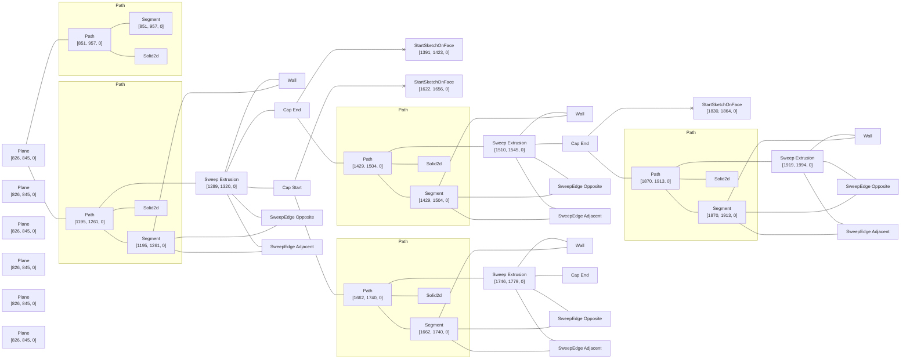

```mermaid
flowchart LR
  subgraph path7 [Path]
    7["Path<br>[851, 957, 0]"]
    8["Segment<br>[851, 957, 0]"]
    9[Solid2d]
  end
  subgraph path10 [Path]
    10["Path<br>[1195, 1261, 0]"]
    11["Segment<br>[1195, 1261, 0]"]
    12[Solid2d]
  end
  subgraph path19 [Path]
    19["Path<br>[1429, 1504, 0]"]
    20["Segment<br>[1429, 1504, 0]"]
    21[Solid2d]
  end
  subgraph path27 [Path]
    27["Path<br>[1662, 1740, 0]"]
    28["Segment<br>[1662, 1740, 0]"]
    29[Solid2d]
  end
  subgraph path35 [Path]
    35["Path<br>[1870, 1913, 0]"]
    36["Segment<br>[1870, 1913, 0]"]
    37[Solid2d]
  end
  1["Plane<br>[826, 845, 0]"]
  2["Plane<br>[826, 845, 0]"]
  3["Plane<br>[826, 845, 0]"]
  4["Plane<br>[826, 845, 0]"]
  5["Plane<br>[826, 845, 0]"]
  6["Plane<br>[826, 845, 0]"]
  13["Sweep Extrusion<br>[1289, 1320, 0]"]
  14[Wall]
  15["Cap Start"]
  16["Cap End"]
  17["SweepEdge Opposite"]
  18["SweepEdge Adjacent"]
  22["Sweep Extrusion<br>[1510, 1545, 0]"]
  23[Wall]
  24["Cap End"]
  25["SweepEdge Opposite"]
  26["SweepEdge Adjacent"]
  30["Sweep Extrusion<br>[1746, 1779, 0]"]
  31[Wall]
  32["Cap End"]
  33["SweepEdge Opposite"]
  34["SweepEdge Adjacent"]
  38["Sweep Extrusion<br>[1919, 1994, 0]"]
  39[Wall]
  40["SweepEdge Opposite"]
  41["SweepEdge Adjacent"]
  42["StartSketchOnFace<br>[1391, 1423, 0]"]
  43["StartSketchOnFace<br>[1622, 1656, 0]"]
  44["StartSketchOnFace<br>[1830, 1864, 0]"]
  1 --- 7
  1 --- 10
  7 --- 8
  7 --- 9
  10 --- 11
  10 ---- 13
  10 --- 12
  11 --- 14
  11 --- 17
  11 --- 18
  13 --- 14
  13 --- 15
  13 --- 16
  13 --- 17
  13 --- 18
  15 --- 27
  16 --- 19
  19 --- 20
  19 ---- 22
  19 --- 21
  20 --- 23
  20 --- 25
  20 --- 26
  22 --- 23
  22 --- 24
  22 --- 25
  22 --- 26
  24 --- 35
  27 --- 28
  27 ---- 30
  27 --- 29
  28 --- 31
  28 --- 33
  28 --- 34
  30 --- 31
  30 --- 32
  30 --- 33
  30 --- 34
  35 --- 36
  35 ---- 38
  35 --- 37
  36 --- 39
  36 --- 40
  36 --- 41
  38 --- 39
  38 --- 40
  38 --- 41
  16 <--x 42
  15 <--x 43
  24 <--x 44
```
