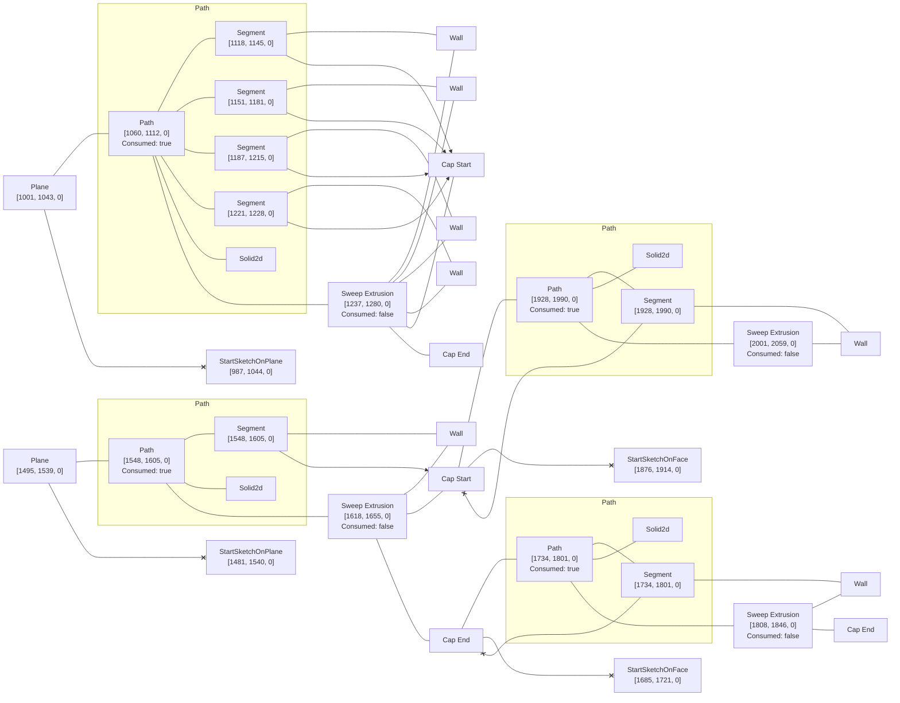

```mermaid
flowchart LR
  subgraph path2 [Path]
    2["Path<br>[1060, 1112, 0]<br>Consumed: true"]
      %% [ProgramBodyItem { index: 13 }, VariableDeclarationDeclaration, VariableDeclarationInit, PipeBodyItem { index: 0 }]
    3["Segment<br>[1118, 1145, 0]"]
      %% [ProgramBodyItem { index: 13 }, VariableDeclarationDeclaration, VariableDeclarationInit, PipeBodyItem { index: 1 }]
    4["Segment<br>[1151, 1181, 0]"]
      %% [ProgramBodyItem { index: 13 }, VariableDeclarationDeclaration, VariableDeclarationInit, PipeBodyItem { index: 2 }]
    5["Segment<br>[1187, 1215, 0]"]
      %% [ProgramBodyItem { index: 13 }, VariableDeclarationDeclaration, VariableDeclarationInit, PipeBodyItem { index: 3 }]
    6["Segment<br>[1221, 1228, 0]"]
      %% [ProgramBodyItem { index: 13 }, VariableDeclarationDeclaration, VariableDeclarationInit, PipeBodyItem { index: 4 }]
    7[Solid2d]
  end
  subgraph path16 [Path]
    16["Path<br>[1548, 1605, 0]<br>Consumed: true"]
      %% [ProgramBodyItem { index: 17 }, VariableDeclarationDeclaration, VariableDeclarationInit]
    17["Segment<br>[1548, 1605, 0]"]
      %% [ProgramBodyItem { index: 17 }, VariableDeclarationDeclaration, VariableDeclarationInit]
    18[Solid2d]
  end
  subgraph path23 [Path]
    23["Path<br>[1734, 1801, 0]<br>Consumed: true"]
      %% [ProgramBodyItem { index: 20 }, VariableDeclarationDeclaration, VariableDeclarationInit]
    24["Segment<br>[1734, 1801, 0]"]
      %% [ProgramBodyItem { index: 20 }, VariableDeclarationDeclaration, VariableDeclarationInit]
    25[Solid2d]
  end
  subgraph path29 [Path]
    29["Path<br>[1928, 1990, 0]<br>Consumed: true"]
      %% [ProgramBodyItem { index: 23 }, VariableDeclarationDeclaration, VariableDeclarationInit]
    30["Segment<br>[1928, 1990, 0]"]
      %% [ProgramBodyItem { index: 23 }, VariableDeclarationDeclaration, VariableDeclarationInit]
    31[Solid2d]
  end
  1["Plane<br>[1001, 1043, 0]"]
    %% [ProgramBodyItem { index: 12 }, VariableDeclarationDeclaration, VariableDeclarationInit, CallKwUnlabeledArg]
  8["Sweep Extrusion<br>[1237, 1280, 0]<br>Consumed: false"]
    %% [ProgramBodyItem { index: 14 }, VariableDeclarationDeclaration, VariableDeclarationInit]
  9[Wall]
    %% face_code_ref=Missing NodePath
  10[Wall]
    %% face_code_ref=Missing NodePath
  11[Wall]
    %% face_code_ref=Missing NodePath
  12[Wall]
    %% face_code_ref=Missing NodePath
  13["Cap Start"]
    %% face_code_ref=Missing NodePath
  14["Cap End"]
    %% face_code_ref=Missing NodePath
  15["Plane<br>[1495, 1539, 0]"]
    %% [ProgramBodyItem { index: 16 }, VariableDeclarationDeclaration, VariableDeclarationInit, CallKwUnlabeledArg]
  19["Sweep Extrusion<br>[1618, 1655, 0]<br>Consumed: false"]
    %% [ProgramBodyItem { index: 18 }, VariableDeclarationDeclaration, VariableDeclarationInit]
  20[Wall]
    %% face_code_ref=Missing NodePath
  21["Cap Start"]
    %% face_code_ref=[ProgramBodyItem { index: 22 }, VariableDeclarationDeclaration, VariableDeclarationInit]
  22["Cap End"]
    %% face_code_ref=[ProgramBodyItem { index: 19 }, VariableDeclarationDeclaration, VariableDeclarationInit]
  26["Sweep Extrusion<br>[1808, 1846, 0]<br>Consumed: false"]
    %% [ProgramBodyItem { index: 21 }, VariableDeclarationDeclaration, VariableDeclarationInit]
  27[Wall]
    %% face_code_ref=Missing NodePath
  28["Cap End"]
    %% face_code_ref=Missing NodePath
  32["Sweep Extrusion<br>[2001, 2059, 0]<br>Consumed: false"]
    %% [ProgramBodyItem { index: 24 }, VariableDeclarationDeclaration, VariableDeclarationInit]
  33[Wall]
    %% face_code_ref=Missing NodePath
  34["StartSketchOnPlane<br>[987, 1044, 0]"]
    %% [ProgramBodyItem { index: 12 }, VariableDeclarationDeclaration, VariableDeclarationInit]
  35["StartSketchOnPlane<br>[1481, 1540, 0]"]
    %% [ProgramBodyItem { index: 16 }, VariableDeclarationDeclaration, VariableDeclarationInit]
  36["StartSketchOnFace<br>[1685, 1721, 0]"]
    %% [ProgramBodyItem { index: 19 }, VariableDeclarationDeclaration, VariableDeclarationInit]
  37["StartSketchOnFace<br>[1876, 1914, 0]"]
    %% [ProgramBodyItem { index: 22 }, VariableDeclarationDeclaration, VariableDeclarationInit]
  1 --- 2
  1 <--x 34
  2 --- 3
  2 --- 4
  2 --- 5
  2 --- 6
  2 --- 7
  2 ---- 8
  3 --- 9
  3 x--> 13
  4 --- 10
  4 x--> 13
  5 --- 11
  5 x--> 13
  6 --- 12
  6 x--> 13
  8 --- 9
  8 --- 10
  8 --- 11
  8 --- 12
  8 --- 13
  8 --- 14
  15 --- 16
  15 <--x 35
  16 --- 17
  16 --- 18
  16 ---- 19
  17 --- 20
  17 x--> 21
  19 --- 20
  19 --- 21
  19 --- 22
  21 --- 29
  30 <--x 21
  21 <--x 37
  22 --- 23
  24 <--x 22
  22 <--x 36
  23 --- 24
  23 --- 25
  23 ---- 26
  24 --- 27
  26 --- 27
  26 --- 28
  29 --- 30
  29 --- 31
  29 ---- 32
  30 --- 33
  32 --- 33
```
