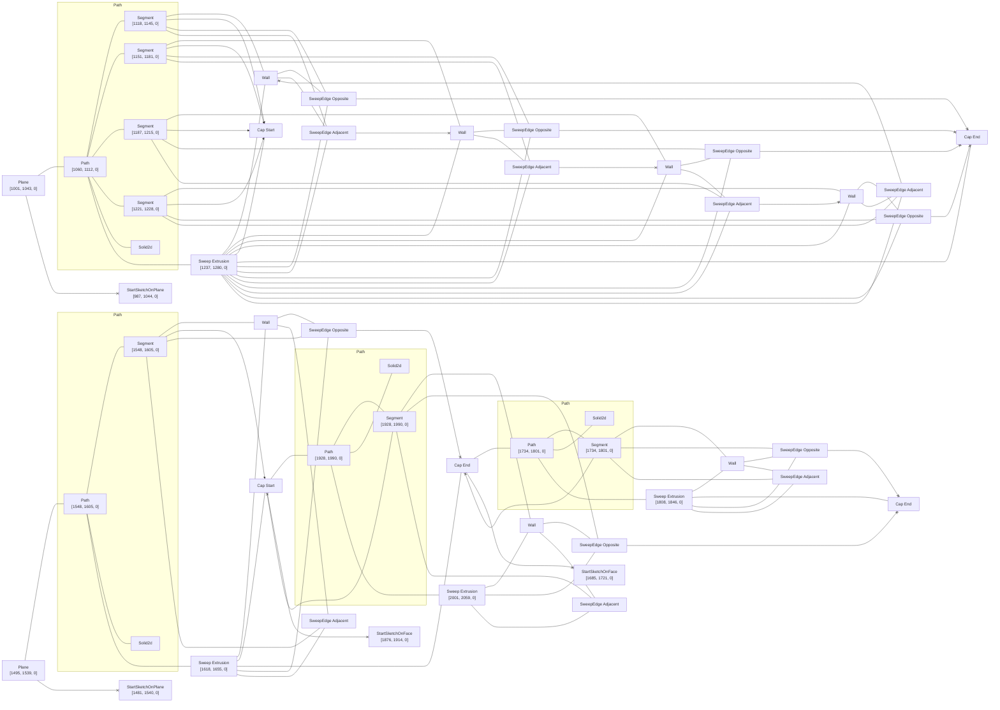

```mermaid
flowchart LR
  subgraph path2 [Path]
    2["Path<br>[1060, 1112, 0]"]
      %% [ProgramBodyItem { index: 13 }, VariableDeclarationDeclaration, VariableDeclarationInit, PipeBodyItem { index: 0 }]
    3["Segment<br>[1118, 1145, 0]"]
      %% [ProgramBodyItem { index: 13 }, VariableDeclarationDeclaration, VariableDeclarationInit, PipeBodyItem { index: 1 }]
    4["Segment<br>[1151, 1181, 0]"]
      %% [ProgramBodyItem { index: 13 }, VariableDeclarationDeclaration, VariableDeclarationInit, PipeBodyItem { index: 2 }]
    5["Segment<br>[1187, 1215, 0]"]
      %% [ProgramBodyItem { index: 13 }, VariableDeclarationDeclaration, VariableDeclarationInit, PipeBodyItem { index: 3 }]
    6["Segment<br>[1221, 1228, 0]"]
      %% [ProgramBodyItem { index: 13 }, VariableDeclarationDeclaration, VariableDeclarationInit, PipeBodyItem { index: 4 }]
    7[Solid2d]
  end
  subgraph path24 [Path]
    24["Path<br>[1548, 1605, 0]"]
      %% [ProgramBodyItem { index: 17 }, VariableDeclarationDeclaration, VariableDeclarationInit]
    25["Segment<br>[1548, 1605, 0]"]
      %% [ProgramBodyItem { index: 17 }, VariableDeclarationDeclaration, VariableDeclarationInit]
    26[Solid2d]
  end
  subgraph path33 [Path]
    33["Path<br>[1734, 1801, 0]"]
      %% [ProgramBodyItem { index: 20 }, VariableDeclarationDeclaration, VariableDeclarationInit]
    34["Segment<br>[1734, 1801, 0]"]
      %% [ProgramBodyItem { index: 20 }, VariableDeclarationDeclaration, VariableDeclarationInit]
    35[Solid2d]
  end
  subgraph path41 [Path]
    41["Path<br>[1928, 1990, 0]"]
      %% [ProgramBodyItem { index: 23 }, VariableDeclarationDeclaration, VariableDeclarationInit]
    42["Segment<br>[1928, 1990, 0]"]
      %% [ProgramBodyItem { index: 23 }, VariableDeclarationDeclaration, VariableDeclarationInit]
    43[Solid2d]
  end
  1["Plane<br>[1001, 1043, 0]"]
    %% [ProgramBodyItem { index: 12 }, VariableDeclarationDeclaration, VariableDeclarationInit, CallKwUnlabeledArg]
  8["Sweep Extrusion<br>[1237, 1280, 0]"]
    %% [ProgramBodyItem { index: 14 }, VariableDeclarationDeclaration, VariableDeclarationInit]
  9[Wall]
    %% face_code_ref=Missing NodePath
  10[Wall]
    %% face_code_ref=Missing NodePath
  11[Wall]
    %% face_code_ref=Missing NodePath
  12[Wall]
    %% face_code_ref=Missing NodePath
  13["Cap Start"]
    %% face_code_ref=Missing NodePath
  14["Cap End"]
    %% face_code_ref=Missing NodePath
  15["SweepEdge Opposite"]
  16["SweepEdge Adjacent"]
  17["SweepEdge Opposite"]
  18["SweepEdge Adjacent"]
  19["SweepEdge Opposite"]
  20["SweepEdge Adjacent"]
  21["SweepEdge Opposite"]
  22["SweepEdge Adjacent"]
  23["Plane<br>[1495, 1539, 0]"]
    %% [ProgramBodyItem { index: 16 }, VariableDeclarationDeclaration, VariableDeclarationInit, CallKwUnlabeledArg]
  27["Sweep Extrusion<br>[1618, 1655, 0]"]
    %% [ProgramBodyItem { index: 18 }, VariableDeclarationDeclaration, VariableDeclarationInit]
  28[Wall]
    %% face_code_ref=Missing NodePath
  29["Cap Start"]
    %% face_code_ref=[ProgramBodyItem { index: 22 }, VariableDeclarationDeclaration, VariableDeclarationInit]
  30["Cap End"]
    %% face_code_ref=[ProgramBodyItem { index: 19 }, VariableDeclarationDeclaration, VariableDeclarationInit]
  31["SweepEdge Opposite"]
  32["SweepEdge Adjacent"]
  36["Sweep Extrusion<br>[1808, 1846, 0]"]
    %% [ProgramBodyItem { index: 21 }, VariableDeclarationDeclaration, VariableDeclarationInit]
  37[Wall]
    %% face_code_ref=Missing NodePath
  38["Cap End"]
    %% face_code_ref=Missing NodePath
  39["SweepEdge Opposite"]
  40["SweepEdge Adjacent"]
  44["Sweep Extrusion<br>[2001, 2059, 0]"]
    %% [ProgramBodyItem { index: 24 }, VariableDeclarationDeclaration, VariableDeclarationInit]
  45[Wall]
    %% face_code_ref=Missing NodePath
  46["SweepEdge Opposite"]
  47["SweepEdge Adjacent"]
  48["StartSketchOnPlane<br>[987, 1044, 0]"]
    %% [ProgramBodyItem { index: 12 }, VariableDeclarationDeclaration, VariableDeclarationInit]
  49["StartSketchOnPlane<br>[1481, 1540, 0]"]
    %% [ProgramBodyItem { index: 16 }, VariableDeclarationDeclaration, VariableDeclarationInit]
  50["StartSketchOnFace<br>[1685, 1721, 0]"]
    %% [ProgramBodyItem { index: 19 }, VariableDeclarationDeclaration, VariableDeclarationInit]
  51["StartSketchOnFace<br>[1876, 1914, 0]"]
    %% [ProgramBodyItem { index: 22 }, VariableDeclarationDeclaration, VariableDeclarationInit]
  1 --- 2
  1 <--x 48
  2 --- 3
  2 --- 4
  2 --- 5
  2 --- 6
  2 --- 7
  2 ---- 8
  3 --- 9
  3 x--> 13
  3 --- 15
  3 --- 16
  4 --- 10
  4 x--> 13
  4 --- 17
  4 --- 18
  5 --- 11
  5 x--> 13
  5 --- 19
  5 --- 20
  6 --- 12
  6 x--> 13
  6 --- 21
  6 --- 22
  8 --- 9
  8 --- 10
  8 --- 11
  8 --- 12
  8 --- 13
  8 --- 14
  8 --- 15
  8 --- 16
  8 --- 17
  8 --- 18
  8 --- 19
  8 --- 20
  8 --- 21
  8 --- 22
  9 --- 15
  9 --- 16
  22 <--x 9
  16 <--x 10
  10 --- 17
  10 --- 18
  18 <--x 11
  11 --- 19
  11 --- 20
  20 <--x 12
  12 --- 21
  12 --- 22
  15 <--x 14
  17 <--x 14
  19 <--x 14
  21 <--x 14
  23 --- 24
  23 <--x 49
  24 --- 25
  24 --- 26
  24 ---- 27
  25 --- 28
  25 x--> 29
  25 --- 31
  25 --- 32
  27 --- 28
  27 --- 29
  27 --- 30
  27 --- 31
  27 --- 32
  28 --- 31
  28 --- 32
  29 --- 41
  42 <--x 29
  29 <--x 51
  31 <--x 30
  30 --- 33
  34 <--x 30
  30 <--x 50
  33 --- 34
  33 --- 35
  33 ---- 36
  34 --- 37
  34 --- 39
  34 --- 40
  36 --- 37
  36 --- 38
  36 --- 39
  36 --- 40
  37 --- 39
  37 --- 40
  39 <--x 38
  46 <--x 38
  41 --- 42
  41 --- 43
  41 ---- 44
  42 --- 45
  42 --- 46
  42 --- 47
  44 --- 45
  44 --- 46
  44 --- 47
  45 --- 46
  45 --- 47
```
