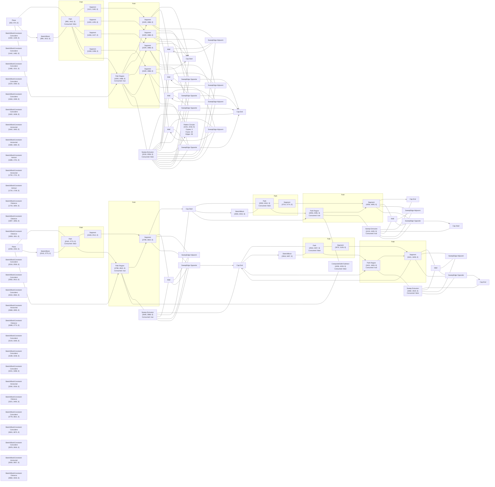

```mermaid
flowchart LR
  subgraph path16 [Path]
    16["Path<br>[990, 1913, 0]<br>Consumed: false"]
      %% [ProgramBodyItem { index: 12 }, VariableDeclarationDeclaration, VariableDeclarationInit]
    18["Segment<br>[1121, 1182, 0]"]
      %% [ProgramBodyItem { index: 12 }, VariableDeclarationDeclaration, VariableDeclarationInit, SketchBlockBody, SketchBlockBodyItem { index: 1 }, VariableDeclarationDeclaration, VariableDeclarationInit]
    19["Segment<br>[1193, 1255, 0]"]
      %% [ProgramBodyItem { index: 12 }, VariableDeclarationDeclaration, VariableDeclarationInit, SketchBlockBody, SketchBlockBodyItem { index: 2 }, VariableDeclarationDeclaration, VariableDeclarationInit]
    20["Segment<br>[1266, 1327, 0]"]
      %% [ProgramBodyItem { index: 12 }, VariableDeclarationDeclaration, VariableDeclarationInit, SketchBlockBody, SketchBlockBodyItem { index: 3 }, VariableDeclarationDeclaration, VariableDeclarationInit]
    21["Segment<br>[1338, 1398, 0]"]
      %% [ProgramBodyItem { index: 12 }, VariableDeclarationDeclaration, VariableDeclarationInit, SketchBlockBody, SketchBlockBodyItem { index: 4 }, VariableDeclarationDeclaration, VariableDeclarationInit]
  end
  subgraph path36 [Path]
    36["Path Region<br>[1929, 1988, 0]<br>Consumed: true"]
      %% [ProgramBodyItem { index: 13 }, VariableDeclarationDeclaration, VariableDeclarationInit]
    37["Segment<br>[1929, 1988, 0]"]
      %% [ProgramBodyItem { index: 13 }, VariableDeclarationDeclaration, VariableDeclarationInit]
    38["Segment<br>[1929, 1988, 0]"]
      %% [ProgramBodyItem { index: 13 }, VariableDeclarationDeclaration, VariableDeclarationInit]
    39["Segment<br>[1929, 1988, 0]"]
      %% [ProgramBodyItem { index: 13 }, VariableDeclarationDeclaration, VariableDeclarationInit]
    40["Segment<br>[1929, 1988, 0]"]
      %% [ProgramBodyItem { index: 13 }, VariableDeclarationDeclaration, VariableDeclarationInit]
  end
  subgraph path44 [Path]
    44["Path<br>[2310, 2775, 0]<br>Consumed: false"]
      %% [ProgramBodyItem { index: 18 }, VariableDeclarationDeclaration, VariableDeclarationInit]
    46["Segment<br>[2448, 2512, 0]"]
      %% [ProgramBodyItem { index: 18 }, VariableDeclarationDeclaration, VariableDeclarationInit, SketchBlockBody, SketchBlockBodyItem { index: 1 }, VariableDeclarationDeclaration, VariableDeclarationInit]
  end
  subgraph path52 [Path]
    52["Path Region<br>[2789, 2822, 0]<br>Consumed: true"]
      %% [ProgramBodyItem { index: 19 }, VariableDeclarationDeclaration, VariableDeclarationInit]
    53["Segment<br>[2789, 2822, 0]"]
      %% [ProgramBodyItem { index: 19 }, VariableDeclarationDeclaration, VariableDeclarationInit]
  end
  subgraph path55 [Path]
    55["Path<br>[2918, 3407, 0]<br>Consumed: false"]
      %% [ProgramBodyItem { index: 22 }, VariableDeclarationDeclaration, VariableDeclarationInit]
    57["Segment<br>[3075, 3139, 0]"]
      %% [ProgramBodyItem { index: 22 }, VariableDeclarationDeclaration, VariableDeclarationInit, SketchBlockBody, SketchBlockBodyItem { index: 1 }, VariableDeclarationDeclaration, VariableDeclarationInit]
  end
  subgraph path63 [Path]
    63["Path Region<br>[3421, 3459, 0]<br>Consumed: true"]
      %% [ProgramBodyItem { index: 23 }, VariableDeclarationDeclaration, VariableDeclarationInit]
    64["Segment<br>[3421, 3459, 0]"]
      %% [ProgramBodyItem { index: 23 }, VariableDeclarationDeclaration, VariableDeclarationInit]
  end
  subgraph path66 [Path]
    66["Path<br>[3550, 4042, 0]<br>Consumed: false"]
      %% [ProgramBodyItem { index: 26 }, VariableDeclarationDeclaration, VariableDeclarationInit]
    68["Segment<br>[3710, 3774, 0]"]
      %% [ProgramBodyItem { index: 26 }, VariableDeclarationDeclaration, VariableDeclarationInit, SketchBlockBody, SketchBlockBodyItem { index: 1 }, VariableDeclarationDeclaration, VariableDeclarationInit]
  end
  subgraph path74 [Path]
    74["Path Region<br>[4056, 4095, 0]<br>Consumed: true"]
      %% [ProgramBodyItem { index: 27 }, VariableDeclarationDeclaration, VariableDeclarationInit]
    75["Segment<br>[4056, 4095, 0]"]
      %% [ProgramBodyItem { index: 27 }, VariableDeclarationDeclaration, VariableDeclarationInit]
  end
  1["Cap End"]
    %% face_code_ref=Missing NodePath
  2["Cap End"]
    %% face_code_ref=Missing NodePath
  3["Cap End"]
    %% face_code_ref=Missing NodePath
  4["Cap End"]
    %% face_code_ref=Missing NodePath
  5["Cap Start"]
    %% face_code_ref=Missing NodePath
  6["Cap Start"]
    %% face_code_ref=Missing NodePath
  7["Cap Start"]
    %% face_code_ref=Missing NodePath
  8[Wall]
    %% face_code_ref=Missing NodePath
  9[Wall]
    %% face_code_ref=Missing NodePath
  10[Wall]
    %% face_code_ref=Missing NodePath
  11[Wall]
    %% face_code_ref=Missing NodePath
  12[Wall]
    %% face_code_ref=Missing NodePath
  13[Wall]
    %% face_code_ref=Missing NodePath
  14[Wall]
    %% face_code_ref=Missing NodePath
  15["Plane<br>[932, 974, 0]"]
    %% [ProgramBodyItem { index: 11 }, VariableDeclarationDeclaration, VariableDeclarationInit]
  17["SketchBlock<br>[990, 1913, 0]"]
    %% [ProgramBodyItem { index: 12 }, VariableDeclarationDeclaration, VariableDeclarationInit]
  22["SketchBlockConstraint Coincident<br>[1402, 1439, 0]"]
    %% [ProgramBodyItem { index: 12 }, VariableDeclarationDeclaration, VariableDeclarationInit, SketchBlockBody, SketchBlockBodyItem { index: 5 }, ExpressionStatementExpr]
  23["SketchBlockConstraint Coincident<br>[1442, 1482, 0]"]
    %% [ProgramBodyItem { index: 12 }, VariableDeclarationDeclaration, VariableDeclarationInit, SketchBlockBody, SketchBlockBodyItem { index: 6 }, ExpressionStatementExpr]
  24["SketchBlockConstraint Coincident<br>[1485, 1521, 0]"]
    %% [ProgramBodyItem { index: 12 }, VariableDeclarationDeclaration, VariableDeclarationInit, SketchBlockBody, SketchBlockBodyItem { index: 7 }, ExpressionStatementExpr]
  25["SketchBlockConstraint Coincident<br>[1524, 1560, 0]"]
    %% [ProgramBodyItem { index: 12 }, VariableDeclarationDeclaration, VariableDeclarationInit, SketchBlockBody, SketchBlockBodyItem { index: 8 }, ExpressionStatementExpr]
  26["SketchBlockConstraint Coincident<br>[1563, 1599, 0]"]
    %% [ProgramBodyItem { index: 12 }, VariableDeclarationDeclaration, VariableDeclarationInit, SketchBlockBody, SketchBlockBodyItem { index: 9 }, ExpressionStatementExpr]
  27["SketchBlockConstraint Coincident<br>[1602, 1638, 0]"]
    %% [ProgramBodyItem { index: 12 }, VariableDeclarationDeclaration, VariableDeclarationInit, SketchBlockBody, SketchBlockBodyItem { index: 10 }, ExpressionStatementExpr]
  28["SketchBlockConstraint Horizontal<br>[1642, 1663, 0]"]
    %% [ProgramBodyItem { index: 12 }, VariableDeclarationDeclaration, VariableDeclarationInit, SketchBlockBody, SketchBlockBodyItem { index: 11 }, ExpressionStatementExpr]
  29["SketchBlockConstraint Horizontal<br>[1666, 1683, 0]"]
    %% [ProgramBodyItem { index: 12 }, VariableDeclarationDeclaration, VariableDeclarationInit, SketchBlockBody, SketchBlockBodyItem { index: 12 }, ExpressionStatementExpr]
  30["SketchBlockConstraint Vertical<br>[1686, 1701, 0]"]
    %% [ProgramBodyItem { index: 12 }, VariableDeclarationDeclaration, VariableDeclarationInit, SketchBlockBody, SketchBlockBodyItem { index: 13 }, ExpressionStatementExpr]
  31["SketchBlockConstraint Horizontal<br>[1704, 1721, 0]"]
    %% [ProgramBodyItem { index: 12 }, VariableDeclarationDeclaration, VariableDeclarationInit, SketchBlockBody, SketchBlockBodyItem { index: 14 }, ExpressionStatementExpr]
  32["SketchBlockConstraint Vertical<br>[1724, 1739, 0]"]
    %% [ProgramBodyItem { index: 12 }, VariableDeclarationDeclaration, VariableDeclarationInit, SketchBlockBody, SketchBlockBodyItem { index: 15 }, ExpressionStatementExpr]
  33["SketchBlockConstraint Distance<br>[1743, 1804, 0]"]
    %% [ProgramBodyItem { index: 12 }, VariableDeclarationDeclaration, VariableDeclarationInit, SketchBlockBody, SketchBlockBodyItem { index: 16 }, ExpressionStatementExpr]
  34["SketchBlockConstraint Distance<br>[1807, 1856, 0]"]
    %% [ProgramBodyItem { index: 12 }, VariableDeclarationDeclaration, VariableDeclarationInit, SketchBlockBody, SketchBlockBodyItem { index: 17 }, ExpressionStatementExpr]
  35["SketchBlockConstraint Distance<br>[1859, 1911, 0]"]
    %% [ProgramBodyItem { index: 12 }, VariableDeclarationDeclaration, VariableDeclarationInit, SketchBlockBody, SketchBlockBodyItem { index: 18 }, ExpressionStatementExpr]
  41["Sweep Extrusion<br>[2016, 2058, 0]<br>Consumed: false"]
    %% [ProgramBodyItem { index: 15 }, VariableDeclarationDeclaration, VariableDeclarationInit]
  42["Pattern Circular<br>[2101, 2218, 0]<br>Copies: 3<br>Faces: 18<br>Edges: 36"]
    %% [ProgramBodyItem { index: 16 }, VariableDeclarationDeclaration, VariableDeclarationInit]
  43["Plane<br>[2258, 2302, 0]"]
    %% [ProgramBodyItem { index: 17 }, VariableDeclarationDeclaration, VariableDeclarationInit]
  45["SketchBlock<br>[2310, 2775, 0]"]
    %% [ProgramBodyItem { index: 18 }, VariableDeclarationDeclaration, VariableDeclarationInit]
  47["SketchBlockConstraint Coincident<br>[2516, 2559, 0]"]
    %% [ProgramBodyItem { index: 18 }, VariableDeclarationDeclaration, VariableDeclarationInit, SketchBlockBody, SketchBlockBodyItem { index: 2 }, ExpressionStatementExpr]
  48["SketchBlockConstraint Coincident<br>[2562, 2613, 0]"]
    %% [ProgramBodyItem { index: 18 }, VariableDeclarationDeclaration, VariableDeclarationInit, SketchBlockBody, SketchBlockBodyItem { index: 3 }, ExpressionStatementExpr]
  49["SketchBlockConstraint Coincident<br>[2616, 2664, 0]"]
    %% [ProgramBodyItem { index: 18 }, VariableDeclarationDeclaration, VariableDeclarationInit, SketchBlockBody, SketchBlockBodyItem { index: 4 }, ExpressionStatementExpr]
  50["SketchBlockConstraint Horizontal<br>[2668, 2695, 0]"]
    %% [ProgramBodyItem { index: 18 }, VariableDeclarationDeclaration, VariableDeclarationInit, SketchBlockBody, SketchBlockBodyItem { index: 5 }, ExpressionStatementExpr]
  51["SketchBlockConstraint Distance<br>[2698, 2773, 0]"]
    %% [ProgramBodyItem { index: 18 }, VariableDeclarationDeclaration, VariableDeclarationInit, SketchBlockBody, SketchBlockBodyItem { index: 6 }, ExpressionStatementExpr]
  54["Sweep Extrusion<br>[2846, 2888, 0]<br>Consumed: true"]
    %% [ProgramBodyItem { index: 21 }, VariableDeclarationDeclaration, VariableDeclarationInit]
  56["SketchBlock<br>[2918, 3407, 0]"]
    %% [ProgramBodyItem { index: 22 }, VariableDeclarationDeclaration, VariableDeclarationInit]
  58["SketchBlockConstraint Coincident<br>[3143, 3185, 0]"]
    %% [ProgramBodyItem { index: 22 }, VariableDeclarationDeclaration, VariableDeclarationInit, SketchBlockBody, SketchBlockBodyItem { index: 2 }, ExpressionStatementExpr]
  59["SketchBlockConstraint Coincident<br>[3188, 3238, 0]"]
    %% [ProgramBodyItem { index: 22 }, VariableDeclarationDeclaration, VariableDeclarationInit, SketchBlockBody, SketchBlockBodyItem { index: 3 }, ExpressionStatementExpr]
  60["SketchBlockConstraint Coincident<br>[3241, 3288, 0]"]
    %% [ProgramBodyItem { index: 22 }, VariableDeclarationDeclaration, VariableDeclarationInit, SketchBlockBody, SketchBlockBodyItem { index: 4 }, ExpressionStatementExpr]
  61["SketchBlockConstraint Horizontal<br>[3292, 3318, 0]"]
    %% [ProgramBodyItem { index: 22 }, VariableDeclarationDeclaration, VariableDeclarationInit, SketchBlockBody, SketchBlockBodyItem { index: 5 }, ExpressionStatementExpr]
  62["SketchBlockConstraint Distance<br>[3321, 3405, 0]"]
    %% [ProgramBodyItem { index: 22 }, VariableDeclarationDeclaration, VariableDeclarationInit, SketchBlockBody, SketchBlockBodyItem { index: 6 }, ExpressionStatementExpr]
  65["Sweep Extrusion<br>[3482, 3520, 0]<br>Consumed: false"]
    %% [ProgramBodyItem { index: 25 }, VariableDeclarationDeclaration, VariableDeclarationInit]
  67["SketchBlock<br>[3550, 4042, 0]"]
    %% [ProgramBodyItem { index: 26 }, VariableDeclarationDeclaration, VariableDeclarationInit]
  69["SketchBlockConstraint Coincident<br>[3778, 3821, 0]"]
    %% [ProgramBodyItem { index: 26 }, VariableDeclarationDeclaration, VariableDeclarationInit, SketchBlockBody, SketchBlockBodyItem { index: 2 }, ExpressionStatementExpr]
  70["SketchBlockConstraint Coincident<br>[3824, 3875, 0]"]
    %% [ProgramBodyItem { index: 26 }, VariableDeclarationDeclaration, VariableDeclarationInit, SketchBlockBody, SketchBlockBodyItem { index: 3 }, ExpressionStatementExpr]
  71["SketchBlockConstraint Coincident<br>[3878, 3926, 0]"]
    %% [ProgramBodyItem { index: 26 }, VariableDeclarationDeclaration, VariableDeclarationInit, SketchBlockBody, SketchBlockBodyItem { index: 4 }, ExpressionStatementExpr]
  72["SketchBlockConstraint Horizontal<br>[3930, 3957, 0]"]
    %% [ProgramBodyItem { index: 26 }, VariableDeclarationDeclaration, VariableDeclarationInit, SketchBlockBody, SketchBlockBodyItem { index: 5 }, ExpressionStatementExpr]
  73["SketchBlockConstraint Distance<br>[3960, 4040, 0]"]
    %% [ProgramBodyItem { index: 26 }, VariableDeclarationDeclaration, VariableDeclarationInit, SketchBlockBody, SketchBlockBodyItem { index: 6 }, ExpressionStatementExpr]
  76["Sweep Extrusion<br>[4124, 4195, 0]<br>Consumed: true"]
    %% [ProgramBodyItem { index: 29 }, VariableDeclarationDeclaration, VariableDeclarationInit]
  77["CompositeSolid Subtract<br>[4206, 4239, 0]<br>Consumed: false"]
    %% [ProgramBodyItem { index: 30 }, VariableDeclarationDeclaration, VariableDeclarationInit]
  78["SweepEdge Adjacent"]
  79["SweepEdge Adjacent"]
  80["SweepEdge Adjacent"]
  81["SweepEdge Adjacent"]
  82["SweepEdge Adjacent"]
  83["SweepEdge Adjacent"]
  84["SweepEdge Adjacent"]
  85["SweepEdge Opposite"]
  86["SweepEdge Opposite"]
  87["SweepEdge Opposite"]
  88["SweepEdge Opposite"]
  89["SweepEdge Opposite"]
  90["SweepEdge Opposite"]
  91["SweepEdge Opposite"]
  54 --- 1
  1 --- 55
  1 <--x 56
  1 <--x 63
  64 <--x 1
  89 <--x 1
  41 --- 2
  85 <--x 2
  86 <--x 2
  87 <--x 2
  88 <--x 2
  65 --- 3
  90 <--x 3
  75 <--x 4
  76 --- 4
  53 <--x 5
  54 --- 5
  5 --- 66
  5 <--x 67
  5 <--x 74
  37 <--x 6
  38 <--x 6
  39 <--x 6
  40 <--x 6
  41 --- 6
  76 --- 7
  91 <--x 7
  37 --- 8
  41 --- 8
  8 --- 78
  78 <--x 8
  8 --- 85
  38 --- 9
  41 --- 9
  9 --- 79
  79 <--x 9
  9 --- 86
  39 --- 10
  41 --- 10
  10 --- 80
  80 <--x 10
  10 --- 87
  40 --- 11
  41 --- 11
  11 --- 81
  81 <--x 11
  11 --- 88
  53 --- 12
  54 --- 12
  12 --- 82
  12 --- 89
  64 --- 13
  65 --- 13
  13 --- 83
  13 --- 90
  75 --- 14
  76 --- 14
  14 --- 84
  14 --- 91
  15 --- 16
  15 <--x 17
  15 <--x 36
  17 --- 16
  16 --- 18
  16 --- 19
  16 --- 20
  16 --- 21
  16 <--x 36
  18 <--x 37
  19 <--x 38
  20 <--x 39
  21 <--x 40
  36 <--x 37
  36 <--x 38
  36 <--x 39
  36 <--x 40
  36 ---- 41
  36 --- 42
  37 --- 78
  37 --- 85
  38 --- 79
  38 --- 86
  39 --- 80
  39 --- 87
  40 --- 81
  40 --- 88
  41 x--> 42
  41 --- 78
  41 --- 79
  41 --- 80
  41 --- 81
  41 --- 85
  41 --- 86
  41 --- 87
  41 --- 88
  43 --- 44
  43 <--x 45
  43 <--x 52
  45 --- 44
  44 --- 46
  44 <--x 52
  46 <--x 53
  52 <--x 53
  52 ---- 54
  52 --- 77
  53 --- 82
  53 --- 89
  54 --- 82
  54 --- 89
  56 --- 55
  55 --- 57
  55 <--x 63
  57 <--x 64
  63 <--x 64
  63 ---- 65
  64 --- 83
  64 --- 90
  65 --- 83
  65 --- 90
  67 --- 66
  66 --- 68
  66 <--x 74
  68 <--x 75
  74 <--x 75
  74 ---- 76
  74 --- 77
  75 --- 84
  75 --- 91
  76 --- 84
  76 --- 91
```
