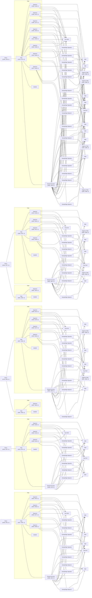

```mermaid
flowchart LR
  subgraph path6 [Path]
    6["Path<br>[1234, 1272, 0]"]
    13["Segment<br>[1280, 1330, 0]"]
    14["Segment<br>[1338, 1387, 0]"]
    15["Segment<br>[1395, 1447, 0]"]
    16["Segment<br>[1455, 1503, 0]"]
    17["Segment<br>[1511, 1555, 0]"]
    18["Segment<br>[1563, 1608, 0]"]
    19["Segment<br>[1616, 1665, 0]"]
    20["Segment<br>[1673, 1692, 0]"]
    43[Solid2d]
  end
  subgraph path7 [Path]
    7["Path<br>[2383, 2437, 0]"]
    21["Segment<br>[2443, 2496, 0]"]
    22["Segment<br>[2502, 2552, 0]"]
    23["Segment<br>[2558, 2612, 0]"]
    24["Segment<br>[2618, 2638, 0]"]
    42[Solid2d]
  end
  subgraph path8 [Path]
    8["Path<br>[2662, 2825, 0]"]
    25["Segment<br>[2662, 2825, 0]"]
    39[Solid2d]
  end
  subgraph path9 [Path]
    9["Path<br>[3207, 3262, 0]"]
    26["Segment<br>[3268, 3322, 0]"]
    27["Segment<br>[3328, 3378, 0]"]
    28["Segment<br>[3384, 3437, 0]"]
    29["Segment<br>[3443, 3463, 0]"]
    38[Solid2d]
  end
  subgraph path10 [Path]
    10["Path<br>[3487, 3653, 0]"]
    30["Segment<br>[3487, 3653, 0]"]
    40[Solid2d]
  end
  subgraph path11 [Path]
    11["Path<br>[4233, 4274, 0]"]
    31["Segment<br>[4280, 4300, 0]"]
    32["Segment<br>[4306, 4329, 0]"]
    33["Segment<br>[4335, 4342, 0]"]
    44[Solid2d]
  end
  subgraph path12 [Path]
    12["Path<br>[4457, 4497, 0]"]
    34["Segment<br>[4503, 4523, 0]"]
    35["Segment<br>[4529, 4550, 0]"]
    36["Segment<br>[4556, 4577, 0]"]
    37["Segment<br>[4583, 4590, 0]"]
    41[Solid2d]
  end
  1["Plane<br>[1199, 1226, 0]"]
  2["Plane<br>[2354, 2377, 0]"]
  3["Plane<br>[3178, 3201, 0]"]
  4["Plane<br>[4204, 4227, 0]"]
  5["Plane<br>[4428, 4451, 0]"]
  45["Sweep Extrusion<br>[1800, 1834, 0]"]
  46["Sweep Extrusion<br>[2832, 2857, 0]"]
  47["Sweep Extrusion<br>[3660, 3685, 0]"]
  48["Sweep Extrusion<br>[4348, 4376, 0]"]
  49["Sweep Extrusion<br>[4596, 4624, 0]"]
  50[Wall]
  51[Wall]
  52[Wall]
  53[Wall]
  54[Wall]
  55[Wall]
  56[Wall]
  57[Wall]
  58[Wall]
  59[Wall]
  60[Wall]
  61[Wall]
  62[Wall]
  63[Wall]
  64[Wall]
  65[Wall]
  66[Wall]
  67[Wall]
  68[Wall]
  69[Wall]
  70[Wall]
  71[Wall]
  72[Wall]
  73["Cap Start"]
  74["Cap Start"]
  75["Cap Start"]
  76["Cap Start"]
  77["Cap Start"]
  78["Cap End"]
  79["Cap End"]
  80["Cap End"]
  81["Cap End"]
  82["Cap End"]
  83["SweepEdge Opposite"]
  84["SweepEdge Opposite"]
  85["SweepEdge Opposite"]
  86["SweepEdge Opposite"]
  87["SweepEdge Opposite"]
  88["SweepEdge Opposite"]
  89["SweepEdge Opposite"]
  90["SweepEdge Opposite"]
  91["SweepEdge Opposite"]
  92["SweepEdge Opposite"]
  93["SweepEdge Opposite"]
  94["SweepEdge Opposite"]
  95["SweepEdge Opposite"]
  96["SweepEdge Opposite"]
  97["SweepEdge Opposite"]
  98["SweepEdge Opposite"]
  99["SweepEdge Opposite"]
  100["SweepEdge Opposite"]
  101["SweepEdge Opposite"]
  102["SweepEdge Opposite"]
  103["SweepEdge Opposite"]
  104["SweepEdge Opposite"]
  105["SweepEdge Opposite"]
  106["SweepEdge Adjacent"]
  107["SweepEdge Adjacent"]
  108["SweepEdge Adjacent"]
  109["SweepEdge Adjacent"]
  110["SweepEdge Adjacent"]
  111["SweepEdge Adjacent"]
  112["SweepEdge Adjacent"]
  113["SweepEdge Adjacent"]
  114["SweepEdge Adjacent"]
  115["SweepEdge Adjacent"]
  116["SweepEdge Adjacent"]
  117["SweepEdge Adjacent"]
  118["SweepEdge Adjacent"]
  119["SweepEdge Adjacent"]
  120["SweepEdge Adjacent"]
  121["SweepEdge Adjacent"]
  122["SweepEdge Adjacent"]
  123["SweepEdge Adjacent"]
  124["SweepEdge Adjacent"]
  125["SweepEdge Adjacent"]
  126["SweepEdge Adjacent"]
  127["SweepEdge Adjacent"]
  128["SweepEdge Adjacent"]
  129["EdgeCut Fillet<br>[1840, 2099, 0]"]
  130["EdgeCut Fillet<br>[1840, 2099, 0]"]
  131["EdgeCut Fillet<br>[1840, 2099, 0]"]
  132["EdgeCut Fillet<br>[1840, 2099, 0]"]
  133["EdgeCut Fillet<br>[2863, 3008, 0]"]
  134["EdgeCut Fillet<br>[2863, 3008, 0]"]
  135["EdgeCut Fillet<br>[3691, 3836, 0]"]
  136["EdgeCut Fillet<br>[3691, 3836, 0]"]
  1 --- 6
  2 --- 7
  2 --- 8
  3 --- 9
  3 --- 10
  4 --- 11
  5 --- 12
  6 --- 13
  6 --- 14
  6 --- 15
  6 --- 16
  6 --- 17
  6 --- 18
  6 --- 19
  6 --- 20
  6 --- 43
  6 ---- 45
  7 --- 21
  7 --- 22
  7 --- 23
  7 --- 24
  7 --- 42
  7 ---- 46
  8 --- 25
  8 --- 39
  9 --- 26
  9 --- 27
  9 --- 28
  9 --- 29
  9 --- 38
  9 ---- 47
  10 --- 30
  10 --- 40
  11 --- 31
  11 --- 32
  11 --- 33
  11 --- 44
  11 ---- 48
  12 --- 34
  12 --- 35
  12 --- 36
  12 --- 37
  12 --- 41
  12 ---- 49
  13 --- 69
  13 x--> 77
  13 --- 99
  13 --- 128
  14 --- 68
  14 x--> 77
  14 --- 103
  14 --- 123
  15 --- 67
  15 x--> 77
  15 --- 98
  15 --- 127
  16 --- 70
  16 x--> 77
  16 --- 101
  16 --- 124
  17 --- 72
  17 x--> 77
  17 --- 104
  17 --- 122
  18 --- 71
  18 x--> 77
  18 --- 100
  18 --- 126
  19 --- 65
  19 x--> 77
  19 --- 105
  19 --- 121
  20 --- 66
  20 x--> 77
  20 --- 102
  20 --- 125
  21 --- 53
  21 x--> 78
  21 --- 86
  21 --- 107
  22 --- 50
  22 x--> 78
  22 --- 84
  22 --- 108
  23 --- 51
  23 x--> 78
  23 --- 83
  23 --- 109
  24 --- 52
  24 x--> 78
  24 --- 85
  24 --- 106
  26 --- 62
  26 x--> 81
  26 --- 96
  26 --- 120
  27 --- 63
  27 x--> 81
  27 --- 97
  27 --- 117
  28 --- 61
  28 x--> 81
  28 --- 95
  28 --- 119
  29 --- 64
  29 x--> 81
  29 --- 94
  29 --- 118
  31 --- 58
  31 x--> 75
  31 --- 93
  31 --- 116
  32 --- 60
  32 x--> 75
  32 --- 91
  32 --- 115
  33 --- 59
  33 x--> 75
  33 --- 92
  33 --- 114
  34 --- 56
  34 x--> 74
  34 --- 87
  34 --- 111
  35 --- 55
  35 x--> 74
  35 --- 90
  35 --- 113
  36 --- 54
  36 x--> 74
  36 --- 88
  36 --- 110
  37 --- 57
  37 x--> 74
  37 --- 89
  37 --- 112
  45 --- 65
  45 --- 66
  45 --- 67
  45 --- 68
  45 --- 69
  45 --- 70
  45 --- 71
  45 --- 72
  45 --- 77
  45 --- 82
  45 --- 98
  45 --- 99
  45 --- 100
  45 --- 101
  45 --- 102
  45 --- 103
  45 --- 104
  45 --- 105
  45 --- 121
  45 --- 122
  45 --- 123
  45 --- 124
  45 --- 125
  45 --- 126
  45 --- 127
  45 --- 128
  46 --- 50
  46 --- 51
  46 --- 52
  46 --- 53
  46 --- 73
  46 --- 78
  46 --- 83
  46 --- 84
  46 --- 85
  46 --- 86
  46 --- 106
  46 --- 107
  46 --- 108
  46 --- 109
  47 --- 61
  47 --- 62
  47 --- 63
  47 --- 64
  47 --- 76
  47 --- 81
  47 --- 94
  47 --- 95
  47 --- 96
  47 --- 97
  47 --- 117
  47 --- 118
  47 --- 119
  47 --- 120
  48 --- 58
  48 --- 59
  48 --- 60
  48 --- 75
  48 --- 80
  48 --- 91
  48 --- 92
  48 --- 93
  48 --- 114
  48 --- 115
  48 --- 116
  49 --- 54
  49 --- 55
  49 --- 56
  49 --- 57
  49 --- 74
  49 --- 79
  49 --- 87
  49 --- 88
  49 --- 89
  49 --- 90
  49 --- 110
  49 --- 111
  49 --- 112
  49 --- 113
  84 <--x 50
  83 <--x 51
  109 <--x 51
  85 <--x 52
  106 <--x 52
  109 <--x 52
  86 <--x 53
  106 <--x 53
  88 <--x 54
  110 <--x 54
  113 <--x 54
  90 <--x 55
  111 <--x 55
  113 <--x 55
  87 <--x 56
  111 <--x 56
  112 <--x 56
  89 <--x 57
  110 <--x 57
  112 <--x 57
  93 <--x 58
  114 <--x 58
  116 <--x 58
  92 <--x 59
  114 <--x 59
  115 <--x 59
  91 <--x 60
  115 <--x 60
  116 <--x 60
  95 <--x 61
  119 <--x 61
  96 <--x 62
  118 <--x 62
  97 <--x 63
  94 <--x 64
  118 <--x 64
  119 <--x 64
  105 <--x 65
  121 <--x 65
  126 <--x 65
  102 <--x 66
  121 <--x 66
  125 <--x 66
  98 <--x 67
  123 <--x 67
  127 <--x 67
  103 <--x 68
  123 <--x 68
  128 <--x 68
  99 <--x 69
  125 <--x 69
  128 <--x 69
  101 <--x 70
  124 <--x 70
  127 <--x 70
  100 <--x 71
  122 <--x 71
  126 <--x 71
  104 <--x 72
  122 <--x 72
  124 <--x 72
  83 <--x 73
  84 <--x 73
  85 <--x 73
  86 <--x 73
  94 <--x 76
  95 <--x 76
  96 <--x 76
  97 <--x 76
  87 <--x 79
  88 <--x 79
  89 <--x 79
  90 <--x 79
  91 <--x 80
  92 <--x 80
  93 <--x 80
  98 <--x 82
  99 <--x 82
  100 <--x 82
  101 <--x 82
  102 <--x 82
  103 <--x 82
  104 <--x 82
  105 <--x 82
  107 <--x 134
  108 <--x 133
  117 <--x 136
  120 <--x 135
  122 <--x 129
  123 <--x 131
  126 <--x 132
  128 <--x 130
```
