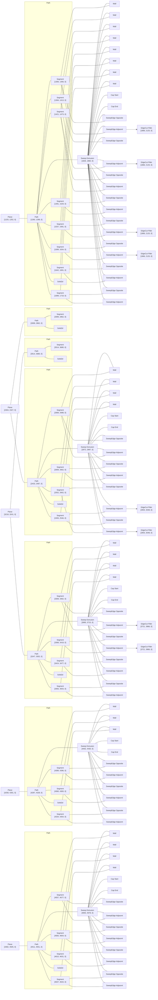

```mermaid
flowchart LR
  subgraph path2 [Path]
    2["Path<br>[1260, 1298, 0]"]
    3["Segment<br>[1306, 1356, 0]"]
    4["Segment<br>[1364, 1413, 0]"]
    5["Segment<br>[1421, 1473, 0]"]
    6["Segment<br>[1481, 1529, 0]"]
    7["Segment<br>[1537, 1581, 0]"]
    8["Segment<br>[1589, 1634, 0]"]
    9["Segment<br>[1642, 1691, 0]"]
    10["Segment<br>[1699, 1718, 0]"]
    11[Solid2d]
  end
  subgraph path40 [Path]
    40["Path<br>[2433, 2487, 0]"]
    41["Segment<br>[2493, 2546, 0]"]
    42["Segment<br>[2552, 2602, 0]"]
    43["Segment<br>[2608, 2662, 0]"]
    44["Segment<br>[2668, 2688, 0]"]
    45[Solid2d]
  end
  subgraph path46 [Path]
    46["Path<br>[2699, 2862, 0]"]
    47["Segment<br>[2699, 2862, 0]"]
    48[Solid2d]
  end
  subgraph path67 [Path]
    67["Path<br>[3247, 3302, 0]"]
    68["Segment<br>[3308, 3362, 0]"]
    69["Segment<br>[3368, 3418, 0]"]
    70["Segment<br>[3424, 3477, 0]"]
    71["Segment<br>[3483, 3503, 0]"]
    72[Solid2d]
  end
  subgraph path73 [Path]
    73["Path<br>[3514, 3680, 0]"]
    74["Segment<br>[3514, 3680, 0]"]
    75[Solid2d]
  end
  subgraph path94 [Path]
    94["Path<br>[4287, 4328, 0]"]
    95["Segment<br>[4334, 4354, 0]"]
    96["Segment<br>[4360, 4383, 0]"]
    97["Segment<br>[4389, 4396, 0]"]
    98[Solid2d]
  end
  subgraph path112 [Path]
    112["Path<br>[4511, 4551, 0]"]
    113["Segment<br>[4557, 4577, 0]"]
    114["Segment<br>[4583, 4604, 0]"]
    115["Segment<br>[4610, 4631, 0]"]
    116["Segment<br>[4637, 4644, 0]"]
    117[Solid2d]
  end
  1["Plane<br>[1225, 1252, 0]"]
  12["Sweep Extrusion<br>[1826, 1860, 0]"]
  13[Wall]
  14[Wall]
  15[Wall]
  16[Wall]
  17[Wall]
  18[Wall]
  19[Wall]
  20[Wall]
  21["Cap Start"]
  22["Cap End"]
  23["SweepEdge Opposite"]
  24["SweepEdge Adjacent"]
  25["SweepEdge Opposite"]
  26["SweepEdge Adjacent"]
  27["SweepEdge Opposite"]
  28["SweepEdge Adjacent"]
  29["SweepEdge Opposite"]
  30["SweepEdge Adjacent"]
  31["SweepEdge Opposite"]
  32["SweepEdge Adjacent"]
  33["SweepEdge Opposite"]
  34["SweepEdge Adjacent"]
  35["SweepEdge Opposite"]
  36["SweepEdge Adjacent"]
  37["SweepEdge Opposite"]
  38["SweepEdge Adjacent"]
  39["Plane<br>[2404, 2427, 0]"]
  49["Sweep Extrusion<br>[2872, 2897, 0]"]
  50[Wall]
  51[Wall]
  52[Wall]
  53[Wall]
  54["Cap Start"]
  55["Cap End"]
  56["SweepEdge Opposite"]
  57["SweepEdge Adjacent"]
  58["SweepEdge Opposite"]
  59["SweepEdge Adjacent"]
  60["SweepEdge Opposite"]
  61["SweepEdge Adjacent"]
  62["SweepEdge Opposite"]
  63["SweepEdge Adjacent"]
  64["EdgeCut Fillet<br>[2903, 3048, 0]"]
  65["EdgeCut Fillet<br>[2903, 3048, 0]"]
  66["Plane<br>[3218, 3241, 0]"]
  76["Sweep Extrusion<br>[3690, 3715, 0]"]
  77[Wall]
  78[Wall]
  79[Wall]
  80[Wall]
  81["Cap Start"]
  82["Cap End"]
  83["SweepEdge Opposite"]
  84["SweepEdge Adjacent"]
  85["SweepEdge Opposite"]
  86["SweepEdge Adjacent"]
  87["SweepEdge Opposite"]
  88["SweepEdge Adjacent"]
  89["SweepEdge Opposite"]
  90["SweepEdge Adjacent"]
  91["EdgeCut Fillet<br>[3721, 3866, 0]"]
  92["EdgeCut Fillet<br>[3721, 3866, 0]"]
  93["Plane<br>[4258, 4281, 0]"]
  99["Sweep Extrusion<br>[4402, 4430, 0]"]
  100[Wall]
  101[Wall]
  102[Wall]
  103["Cap Start"]
  104["Cap End"]
  105["SweepEdge Opposite"]
  106["SweepEdge Adjacent"]
  107["SweepEdge Opposite"]
  108["SweepEdge Adjacent"]
  109["SweepEdge Opposite"]
  110["SweepEdge Adjacent"]
  111["Plane<br>[4482, 4505, 0]"]
  118["Sweep Extrusion<br>[4650, 4678, 0]"]
  119[Wall]
  120[Wall]
  121[Wall]
  122[Wall]
  123["Cap Start"]
  124["Cap End"]
  125["SweepEdge Opposite"]
  126["SweepEdge Adjacent"]
  127["SweepEdge Opposite"]
  128["SweepEdge Adjacent"]
  129["SweepEdge Opposite"]
  130["SweepEdge Adjacent"]
  131["SweepEdge Opposite"]
  132["SweepEdge Adjacent"]
  133["EdgeCut Fillet<br>[1866, 2125, 0]"]
  134["EdgeCut Fillet<br>[1866, 2125, 0]"]
  135["EdgeCut Fillet<br>[1866, 2125, 0]"]
  136["EdgeCut Fillet<br>[1866, 2125, 0]"]
  1 --- 2
  2 --- 3
  2 --- 4
  2 --- 5
  2 --- 6
  2 --- 7
  2 --- 8
  2 --- 9
  2 --- 10
  2 ---- 12
  2 --- 11
  3 --- 13
  3 --- 23
  3 --- 24
  4 --- 14
  4 --- 25
  4 --- 26
  5 --- 15
  5 --- 27
  5 --- 28
  6 --- 16
  6 --- 29
  6 --- 30
  7 --- 17
  7 --- 31
  7 --- 32
  8 --- 18
  8 --- 33
  8 --- 34
  9 --- 19
  9 --- 35
  9 --- 36
  10 --- 20
  10 --- 37
  10 --- 38
  12 --- 13
  12 --- 14
  12 --- 15
  12 --- 16
  12 --- 17
  12 --- 18
  12 --- 19
  12 --- 20
  12 --- 21
  12 --- 22
  12 --- 23
  12 --- 24
  12 --- 25
  12 --- 26
  12 --- 27
  12 --- 28
  12 --- 29
  12 --- 30
  12 --- 31
  12 --- 32
  12 --- 33
  12 --- 34
  12 --- 35
  12 --- 36
  12 --- 37
  12 --- 38
  39 --- 40
  39 --- 46
  40 --- 41
  40 --- 42
  40 --- 43
  40 --- 44
  40 ---- 49
  40 --- 45
  41 --- 53
  41 --- 62
  41 --- 63
  42 --- 52
  42 --- 60
  42 --- 61
  43 --- 51
  43 --- 58
  43 --- 59
  44 --- 50
  44 --- 56
  44 --- 57
  46 --- 47
  46 --- 48
  49 --- 50
  49 --- 51
  49 --- 52
  49 --- 53
  49 --- 54
  49 --- 55
  49 --- 56
  49 --- 57
  49 --- 58
  49 --- 59
  49 --- 60
  49 --- 61
  49 --- 62
  49 --- 63
  63 <--x 64
  61 <--x 65
  66 --- 67
  66 --- 73
  67 --- 68
  67 --- 69
  67 --- 70
  67 --- 71
  67 ---- 76
  67 --- 72
  68 --- 77
  68 --- 83
  68 --- 84
  69 --- 78
  69 --- 85
  69 --- 86
  70 --- 79
  70 --- 87
  70 --- 88
  71 --- 80
  71 --- 89
  71 --- 90
  73 --- 74
  73 --- 75
  76 --- 77
  76 --- 78
  76 --- 79
  76 --- 80
  76 --- 81
  76 --- 82
  76 --- 83
  76 --- 84
  76 --- 85
  76 --- 86
  76 --- 87
  76 --- 88
  76 --- 89
  76 --- 90
  84 <--x 91
  86 <--x 92
  93 --- 94
  94 --- 95
  94 --- 96
  94 --- 97
  94 ---- 99
  94 --- 98
  95 --- 102
  95 --- 109
  95 --- 110
  96 --- 101
  96 --- 107
  96 --- 108
  97 --- 100
  97 --- 105
  97 --- 106
  99 --- 100
  99 --- 101
  99 --- 102
  99 --- 103
  99 --- 104
  99 --- 105
  99 --- 106
  99 --- 107
  99 --- 108
  99 --- 109
  99 --- 110
  111 --- 112
  112 --- 113
  112 --- 114
  112 --- 115
  112 --- 116
  112 ---- 118
  112 --- 117
  113 --- 119
  113 --- 125
  113 --- 126
  114 --- 120
  114 --- 127
  114 --- 128
  115 --- 121
  115 --- 129
  115 --- 130
  116 --- 122
  116 --- 131
  116 --- 132
  118 --- 119
  118 --- 120
  118 --- 121
  118 --- 122
  118 --- 123
  118 --- 124
  118 --- 125
  118 --- 126
  118 --- 127
  118 --- 128
  118 --- 129
  118 --- 130
  118 --- 131
  118 --- 132
  34 <--x 133
  24 <--x 134
  26 <--x 135
  32 <--x 136
```
