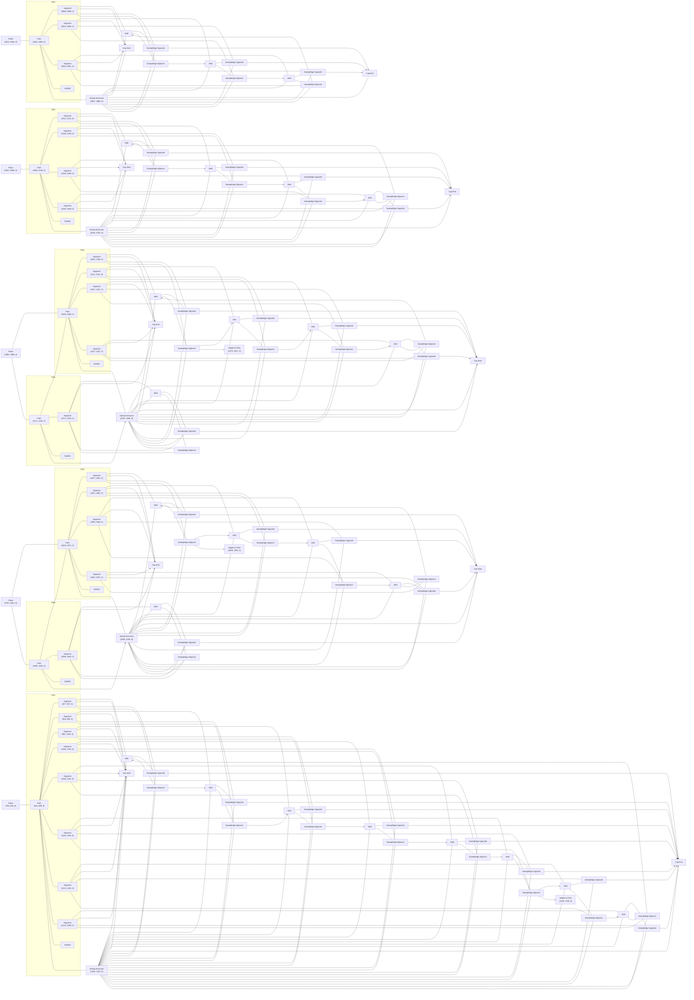

```mermaid
flowchart LR
  subgraph path2 [Path]
    2["Path<br>[831, 869, 0]"]
      %% [ProgramBodyItem { index: 10 }, VariableDeclarationDeclaration, VariableDeclarationInit, FunctionExpressionBody, FunctionExpressionBodyItem { index: 0 }, VariableDeclarationDeclaration, VariableDeclarationInit, PipeBodyItem { index: 1 }]
    3["Segment<br>[877, 927, 0]"]
      %% [ProgramBodyItem { index: 10 }, VariableDeclarationDeclaration, VariableDeclarationInit, FunctionExpressionBody, FunctionExpressionBodyItem { index: 0 }, VariableDeclarationDeclaration, VariableDeclarationInit, PipeBodyItem { index: 2 }]
    4["Segment<br>[935, 984, 0]"]
      %% [ProgramBodyItem { index: 10 }, VariableDeclarationDeclaration, VariableDeclarationInit, FunctionExpressionBody, FunctionExpressionBodyItem { index: 0 }, VariableDeclarationDeclaration, VariableDeclarationInit, PipeBodyItem { index: 3 }]
    5["Segment<br>[992, 1044, 0]"]
      %% [ProgramBodyItem { index: 10 }, VariableDeclarationDeclaration, VariableDeclarationInit, FunctionExpressionBody, FunctionExpressionBodyItem { index: 0 }, VariableDeclarationDeclaration, VariableDeclarationInit, PipeBodyItem { index: 4 }]
    6["Segment<br>[1052, 1100, 0]"]
      %% [ProgramBodyItem { index: 10 }, VariableDeclarationDeclaration, VariableDeclarationInit, FunctionExpressionBody, FunctionExpressionBodyItem { index: 0 }, VariableDeclarationDeclaration, VariableDeclarationInit, PipeBodyItem { index: 5 }]
    7["Segment<br>[1108, 1152, 0]"]
      %% [ProgramBodyItem { index: 10 }, VariableDeclarationDeclaration, VariableDeclarationInit, FunctionExpressionBody, FunctionExpressionBodyItem { index: 0 }, VariableDeclarationDeclaration, VariableDeclarationInit, PipeBodyItem { index: 6 }]
    8["Segment<br>[1160, 1205, 0]"]
      %% [ProgramBodyItem { index: 10 }, VariableDeclarationDeclaration, VariableDeclarationInit, FunctionExpressionBody, FunctionExpressionBodyItem { index: 0 }, VariableDeclarationDeclaration, VariableDeclarationInit, PipeBodyItem { index: 7 }]
    9["Segment<br>[1213, 1262, 0]"]
      %% [ProgramBodyItem { index: 10 }, VariableDeclarationDeclaration, VariableDeclarationInit, FunctionExpressionBody, FunctionExpressionBodyItem { index: 0 }, VariableDeclarationDeclaration, VariableDeclarationInit, PipeBodyItem { index: 8 }]
    10["Segment<br>[1270, 1289, 0]"]
      %% [ProgramBodyItem { index: 10 }, VariableDeclarationDeclaration, VariableDeclarationInit, FunctionExpressionBody, FunctionExpressionBodyItem { index: 0 }, VariableDeclarationDeclaration, VariableDeclarationInit, PipeBodyItem { index: 9 }]
    11[Solid2d]
  end
  subgraph path41 [Path]
    41["Path<br>[1992, 2046, 0]"]
      %% [ProgramBodyItem { index: 14 }, VariableDeclarationDeclaration, VariableDeclarationInit, PipeBodyItem { index: 1 }]
    42["Segment<br>[2052, 2105, 0]"]
      %% [ProgramBodyItem { index: 14 }, VariableDeclarationDeclaration, VariableDeclarationInit, PipeBodyItem { index: 2 }]
    43["Segment<br>[2111, 2161, 0]"]
      %% [ProgramBodyItem { index: 14 }, VariableDeclarationDeclaration, VariableDeclarationInit, PipeBodyItem { index: 3 }]
    44["Segment<br>[2167, 2221, 0]"]
      %% [ProgramBodyItem { index: 14 }, VariableDeclarationDeclaration, VariableDeclarationInit, PipeBodyItem { index: 4 }]
    45["Segment<br>[2227, 2247, 0]"]
      %% [ProgramBodyItem { index: 14 }, VariableDeclarationDeclaration, VariableDeclarationInit, PipeBodyItem { index: 5 }]
    46[Solid2d]
  end
  subgraph path47 [Path]
    47["Path<br>[2271, 2434, 0]"]
      %% [ProgramBodyItem { index: 14 }, VariableDeclarationDeclaration, VariableDeclarationInit, PipeBodyItem { index: 6 }, CallKwArg { index: 0 }]
    48["Segment<br>[2271, 2434, 0]"]
      %% [ProgramBodyItem { index: 14 }, VariableDeclarationDeclaration, VariableDeclarationInit, PipeBodyItem { index: 6 }, CallKwArg { index: 0 }]
    49[Solid2d]
  end
  subgraph path70 [Path]
    70["Path<br>[2816, 2871, 0]"]
      %% [ProgramBodyItem { index: 15 }, VariableDeclarationDeclaration, VariableDeclarationInit, PipeBodyItem { index: 1 }]
    71["Segment<br>[2877, 2931, 0]"]
      %% [ProgramBodyItem { index: 15 }, VariableDeclarationDeclaration, VariableDeclarationInit, PipeBodyItem { index: 2 }]
    72["Segment<br>[2937, 2987, 0]"]
      %% [ProgramBodyItem { index: 15 }, VariableDeclarationDeclaration, VariableDeclarationInit, PipeBodyItem { index: 3 }]
    73["Segment<br>[2993, 3046, 0]"]
      %% [ProgramBodyItem { index: 15 }, VariableDeclarationDeclaration, VariableDeclarationInit, PipeBodyItem { index: 4 }]
    74["Segment<br>[3052, 3072, 0]"]
      %% [ProgramBodyItem { index: 15 }, VariableDeclarationDeclaration, VariableDeclarationInit, PipeBodyItem { index: 5 }]
    75[Solid2d]
  end
  subgraph path76 [Path]
    76["Path<br>[3096, 3262, 0]"]
      %% [ProgramBodyItem { index: 15 }, VariableDeclarationDeclaration, VariableDeclarationInit, PipeBodyItem { index: 6 }, CallKwArg { index: 0 }]
    77["Segment<br>[3096, 3262, 0]"]
      %% [ProgramBodyItem { index: 15 }, VariableDeclarationDeclaration, VariableDeclarationInit, PipeBodyItem { index: 6 }, CallKwArg { index: 0 }]
    78[Solid2d]
  end
  subgraph path99 [Path]
    99["Path<br>[3842, 3883, 0]"]
      %% [ProgramBodyItem { index: 17 }, VariableDeclarationDeclaration, VariableDeclarationInit, PipeBodyItem { index: 1 }]
    100["Segment<br>[3889, 3909, 0]"]
      %% [ProgramBodyItem { index: 17 }, VariableDeclarationDeclaration, VariableDeclarationInit, PipeBodyItem { index: 2 }]
    101["Segment<br>[3915, 3938, 0]"]
      %% [ProgramBodyItem { index: 17 }, VariableDeclarationDeclaration, VariableDeclarationInit, PipeBodyItem { index: 3 }]
    102["Segment<br>[3944, 3951, 0]"]
      %% [ProgramBodyItem { index: 17 }, VariableDeclarationDeclaration, VariableDeclarationInit, PipeBodyItem { index: 4 }]
    103[Solid2d]
  end
  subgraph path117 [Path]
    117["Path<br>[4066, 4106, 0]"]
      %% [ProgramBodyItem { index: 18 }, VariableDeclarationDeclaration, VariableDeclarationInit, PipeBodyItem { index: 1 }]
    118["Segment<br>[4112, 4132, 0]"]
      %% [ProgramBodyItem { index: 18 }, VariableDeclarationDeclaration, VariableDeclarationInit, PipeBodyItem { index: 2 }]
    119["Segment<br>[4138, 4159, 0]"]
      %% [ProgramBodyItem { index: 18 }, VariableDeclarationDeclaration, VariableDeclarationInit, PipeBodyItem { index: 3 }]
    120["Segment<br>[4165, 4186, 0]"]
      %% [ProgramBodyItem { index: 18 }, VariableDeclarationDeclaration, VariableDeclarationInit, PipeBodyItem { index: 4 }]
    121["Segment<br>[4192, 4199, 0]"]
      %% [ProgramBodyItem { index: 18 }, VariableDeclarationDeclaration, VariableDeclarationInit, PipeBodyItem { index: 5 }]
    122[Solid2d]
  end
  1["Plane<br>[796, 823, 0]"]
    %% [ProgramBodyItem { index: 10 }, VariableDeclarationDeclaration, VariableDeclarationInit, FunctionExpressionBody, FunctionExpressionBodyItem { index: 0 }, VariableDeclarationDeclaration, VariableDeclarationInit, PipeBodyItem { index: 0 }]
  12["Sweep Extrusion<br>[1409, 1443, 0]"]
    %% [ProgramBodyItem { index: 12 }, VariableDeclarationDeclaration, VariableDeclarationInit, PipeBodyItem { index: 1 }]
  13[Wall]
    %% face_code_ref=Missing NodePath
  14[Wall]
    %% face_code_ref=Missing NodePath
  15[Wall]
    %% face_code_ref=Missing NodePath
  16[Wall]
    %% face_code_ref=Missing NodePath
  17[Wall]
    %% face_code_ref=Missing NodePath
  18[Wall]
    %% face_code_ref=Missing NodePath
  19[Wall]
    %% face_code_ref=Missing NodePath
  20[Wall]
    %% face_code_ref=Missing NodePath
  21["Cap Start"]
    %% face_code_ref=Missing NodePath
  22["Cap End"]
    %% face_code_ref=Missing NodePath
  23["SweepEdge Opposite"]
  24["SweepEdge Adjacent"]
  25["SweepEdge Opposite"]
  26["SweepEdge Adjacent"]
  27["SweepEdge Opposite"]
  28["SweepEdge Adjacent"]
  29["SweepEdge Opposite"]
  30["SweepEdge Adjacent"]
  31["SweepEdge Opposite"]
  32["SweepEdge Adjacent"]
  33["SweepEdge Opposite"]
  34["SweepEdge Adjacent"]
  35["SweepEdge Opposite"]
  36["SweepEdge Adjacent"]
  37["SweepEdge Opposite"]
  38["SweepEdge Adjacent"]
  39["EdgeCut Fillet<br>[1449, 1708, 0]"]
    %% [ProgramBodyItem { index: 12 }, VariableDeclarationDeclaration, VariableDeclarationInit, PipeBodyItem { index: 2 }]
  40["Plane<br>[1963, 1986, 0]"]
    %% [ProgramBodyItem { index: 14 }, VariableDeclarationDeclaration, VariableDeclarationInit, PipeBodyItem { index: 0 }]
  50["Sweep Extrusion<br>[2441, 2466, 0]"]
    %% [ProgramBodyItem { index: 14 }, VariableDeclarationDeclaration, VariableDeclarationInit, PipeBodyItem { index: 7 }]
  51[Wall]
    %% face_code_ref=Missing NodePath
  52[Wall]
    %% face_code_ref=Missing NodePath
  53[Wall]
    %% face_code_ref=Missing NodePath
  54[Wall]
    %% face_code_ref=Missing NodePath
  55[Wall]
    %% face_code_ref=Missing NodePath
  56["Cap Start"]
    %% face_code_ref=Missing NodePath
  57["Cap End"]
    %% face_code_ref=Missing NodePath
  58["SweepEdge Opposite"]
  59["SweepEdge Adjacent"]
  60["SweepEdge Opposite"]
  61["SweepEdge Adjacent"]
  62["SweepEdge Opposite"]
  63["SweepEdge Adjacent"]
  64["SweepEdge Opposite"]
  65["SweepEdge Adjacent"]
  66["SweepEdge Opposite"]
  67["SweepEdge Adjacent"]
  68["EdgeCut Fillet<br>[2472, 2617, 0]"]
    %% [ProgramBodyItem { index: 14 }, VariableDeclarationDeclaration, VariableDeclarationInit, PipeBodyItem { index: 8 }]
  69["Plane<br>[2787, 2810, 0]"]
    %% [ProgramBodyItem { index: 15 }, VariableDeclarationDeclaration, VariableDeclarationInit, PipeBodyItem { index: 0 }]
  79["Sweep Extrusion<br>[3269, 3294, 0]"]
    %% [ProgramBodyItem { index: 15 }, VariableDeclarationDeclaration, VariableDeclarationInit, PipeBodyItem { index: 7 }]
  80[Wall]
    %% face_code_ref=Missing NodePath
  81[Wall]
    %% face_code_ref=Missing NodePath
  82[Wall]
    %% face_code_ref=Missing NodePath
  83[Wall]
    %% face_code_ref=Missing NodePath
  84[Wall]
    %% face_code_ref=Missing NodePath
  85["Cap Start"]
    %% face_code_ref=Missing NodePath
  86["Cap End"]
    %% face_code_ref=Missing NodePath
  87["SweepEdge Opposite"]
  88["SweepEdge Adjacent"]
  89["SweepEdge Opposite"]
  90["SweepEdge Adjacent"]
  91["SweepEdge Opposite"]
  92["SweepEdge Adjacent"]
  93["SweepEdge Opposite"]
  94["SweepEdge Adjacent"]
  95["SweepEdge Opposite"]
  96["SweepEdge Adjacent"]
  97["EdgeCut Fillet<br>[3300, 3445, 0]"]
    %% [ProgramBodyItem { index: 15 }, VariableDeclarationDeclaration, VariableDeclarationInit, PipeBodyItem { index: 8 }]
  98["Plane<br>[3813, 3836, 0]"]
    %% [ProgramBodyItem { index: 17 }, VariableDeclarationDeclaration, VariableDeclarationInit, PipeBodyItem { index: 0 }]
  104["Sweep Extrusion<br>[3957, 3985, 0]"]
    %% [ProgramBodyItem { index: 17 }, VariableDeclarationDeclaration, VariableDeclarationInit, PipeBodyItem { index: 5 }]
  105[Wall]
    %% face_code_ref=Missing NodePath
  106[Wall]
    %% face_code_ref=Missing NodePath
  107[Wall]
    %% face_code_ref=Missing NodePath
  108["Cap Start"]
    %% face_code_ref=Missing NodePath
  109["Cap End"]
    %% face_code_ref=Missing NodePath
  110["SweepEdge Opposite"]
  111["SweepEdge Adjacent"]
  112["SweepEdge Opposite"]
  113["SweepEdge Adjacent"]
  114["SweepEdge Opposite"]
  115["SweepEdge Adjacent"]
  116["Plane<br>[4037, 4060, 0]"]
    %% [ProgramBodyItem { index: 18 }, VariableDeclarationDeclaration, VariableDeclarationInit, PipeBodyItem { index: 0 }]
  123["Sweep Extrusion<br>[4205, 4233, 0]"]
    %% [ProgramBodyItem { index: 18 }, VariableDeclarationDeclaration, VariableDeclarationInit, PipeBodyItem { index: 6 }]
  124[Wall]
    %% face_code_ref=Missing NodePath
  125[Wall]
    %% face_code_ref=Missing NodePath
  126[Wall]
    %% face_code_ref=Missing NodePath
  127[Wall]
    %% face_code_ref=Missing NodePath
  128["Cap Start"]
    %% face_code_ref=Missing NodePath
  129["Cap End"]
    %% face_code_ref=Missing NodePath
  130["SweepEdge Opposite"]
  131["SweepEdge Adjacent"]
  132["SweepEdge Opposite"]
  133["SweepEdge Adjacent"]
  134["SweepEdge Opposite"]
  135["SweepEdge Adjacent"]
  136["SweepEdge Opposite"]
  137["SweepEdge Adjacent"]
  1 --- 2
  2 --- 3
  2 --- 4
  2 --- 5
  2 --- 6
  2 --- 7
  2 --- 8
  2 --- 9
  2 --- 10
  2 --- 11
  2 ---- 12
  3 --- 13
  3 x--> 21
  3 --- 23
  3 --- 24
  4 --- 14
  4 x--> 21
  4 --- 25
  4 --- 26
  5 --- 15
  5 x--> 21
  5 --- 27
  5 --- 28
  6 --- 16
  6 x--> 21
  6 --- 29
  6 --- 30
  7 --- 17
  7 x--> 21
  7 --- 31
  7 --- 32
  8 --- 18
  8 x--> 21
  8 --- 33
  8 --- 34
  9 --- 19
  9 x--> 21
  9 --- 35
  9 --- 36
  10 --- 20
  10 x--> 21
  10 --- 37
  10 --- 38
  12 --- 13
  12 --- 14
  12 --- 15
  12 --- 16
  12 --- 17
  12 --- 18
  12 --- 19
  12 --- 20
  12 --- 21
  12 --- 22
  12 --- 23
  12 --- 24
  12 --- 25
  12 --- 26
  12 --- 27
  12 --- 28
  12 --- 29
  12 --- 30
  12 --- 31
  12 --- 32
  12 --- 33
  12 --- 34
  12 --- 35
  12 --- 36
  12 --- 37
  12 --- 38
  13 --- 23
  13 --- 24
  38 <--x 13
  24 <--x 14
  14 --- 25
  14 --- 26
  26 <--x 15
  15 --- 27
  15 --- 28
  28 <--x 16
  16 --- 29
  16 --- 30
  30 <--x 17
  17 --- 31
  17 --- 32
  32 <--x 18
  18 --- 33
  18 --- 34
  34 <--x 19
  19 --- 35
  19 --- 36
  36 <--x 20
  20 --- 37
  20 --- 38
  23 <--x 22
  25 <--x 22
  27 <--x 22
  29 <--x 22
  31 <--x 22
  33 <--x 22
  35 <--x 22
  37 <--x 22
  34 <--x 39
  40 --- 41
  40 --- 47
  41 --- 42
  41 --- 43
  41 --- 44
  41 --- 45
  41 --- 46
  47 --- 41
  41 ---- 50
  42 --- 54
  42 x--> 57
  42 --- 64
  42 --- 65
  43 --- 53
  43 x--> 57
  43 --- 62
  43 --- 63
  44 --- 52
  44 x--> 57
  44 --- 60
  44 --- 61
  45 --- 51
  45 x--> 57
  45 --- 58
  45 --- 59
  47 --- 48
  47 --- 49
  47 x---> 50
  48 --- 55
  48 x--> 57
  48 --- 66
  48 --- 67
  50 --- 51
  50 --- 52
  50 --- 53
  50 --- 54
  50 --- 55
  50 --- 56
  50 --- 57
  50 --- 58
  50 --- 59
  50 --- 60
  50 --- 61
  50 --- 62
  50 --- 63
  50 --- 64
  50 --- 65
  50 --- 66
  50 --- 67
  51 --- 58
  51 --- 59
  61 <--x 51
  52 --- 60
  52 --- 61
  63 <--x 52
  53 --- 62
  53 --- 63
  65 <--x 53
  59 <--x 54
  54 --- 64
  54 --- 65
  55 --- 66
  55 --- 67
  58 <--x 56
  60 <--x 56
  62 <--x 56
  64 <--x 56
  66 <--x 56
  65 <--x 68
  69 --- 70
  69 --- 76
  70 --- 71
  70 --- 72
  70 --- 73
  70 --- 74
  70 --- 75
  76 --- 70
  70 ---- 79
  71 --- 80
  71 x--> 86
  71 --- 87
  71 --- 88
  72 --- 81
  72 x--> 86
  72 --- 89
  72 --- 90
  73 --- 82
  73 x--> 86
  73 --- 91
  73 --- 92
  74 --- 83
  74 x--> 86
  74 --- 93
  74 --- 94
  76 --- 77
  76 --- 78
  76 x---> 79
  77 --- 84
  77 x--> 86
  77 --- 95
  77 --- 96
  79 --- 80
  79 --- 81
  79 --- 82
  79 --- 83
  79 --- 84
  79 --- 85
  79 --- 86
  79 --- 87
  79 --- 88
  79 --- 89
  79 --- 90
  79 --- 91
  79 --- 92
  79 --- 93
  79 --- 94
  79 --- 95
  79 --- 96
  80 --- 87
  80 --- 88
  94 <--x 80
  88 <--x 81
  81 --- 89
  81 --- 90
  90 <--x 82
  82 --- 91
  82 --- 92
  92 <--x 83
  83 --- 93
  83 --- 94
  84 --- 95
  84 --- 96
  87 <--x 85
  89 <--x 85
  91 <--x 85
  93 <--x 85
  95 <--x 85
  88 <--x 97
  98 --- 99
  99 --- 100
  99 --- 101
  99 --- 102
  99 --- 103
  99 ---- 104
  100 --- 107
  100 x--> 108
  100 --- 114
  100 --- 115
  101 --- 106
  101 x--> 108
  101 --- 112
  101 --- 113
  102 --- 105
  102 x--> 108
  102 --- 110
  102 --- 111
  104 --- 105
  104 --- 106
  104 --- 107
  104 --- 108
  104 --- 109
  104 --- 110
  104 --- 111
  104 --- 112
  104 --- 113
  104 --- 114
  104 --- 115
  105 --- 110
  105 --- 111
  113 <--x 105
  106 --- 112
  106 --- 113
  115 <--x 106
  111 <--x 107
  107 --- 114
  107 --- 115
  110 <--x 109
  112 <--x 109
  114 <--x 109
  116 --- 117
  117 --- 118
  117 --- 119
  117 --- 120
  117 --- 121
  117 --- 122
  117 ---- 123
  118 --- 124
  118 x--> 128
  118 --- 130
  118 --- 131
  119 --- 125
  119 x--> 128
  119 --- 132
  119 --- 133
  120 --- 126
  120 x--> 128
  120 --- 134
  120 --- 135
  121 --- 127
  121 x--> 128
  121 --- 136
  121 --- 137
  123 --- 124
  123 --- 125
  123 --- 126
  123 --- 127
  123 --- 128
  123 --- 129
  123 --- 130
  123 --- 131
  123 --- 132
  123 --- 133
  123 --- 134
  123 --- 135
  123 --- 136
  123 --- 137
  124 --- 130
  124 --- 131
  137 <--x 124
  131 <--x 125
  125 --- 132
  125 --- 133
  133 <--x 126
  126 --- 134
  126 --- 135
  135 <--x 127
  127 --- 136
  127 --- 137
  130 <--x 129
  132 <--x 129
  134 <--x 129
  136 <--x 129
```
