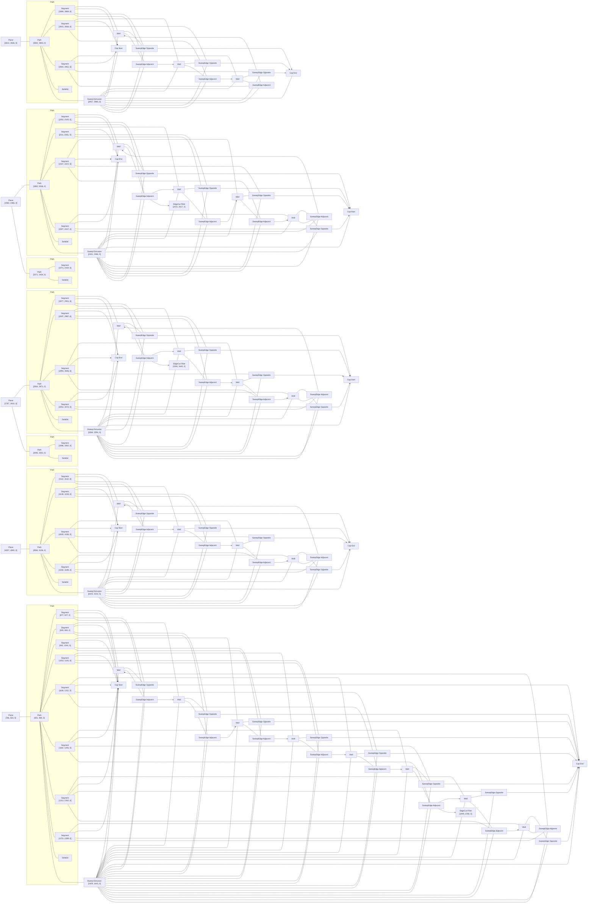

```mermaid
flowchart LR
  subgraph path2 [Path]
    2["Path<br>[831, 869, 0]"]
      %% [ProgramBodyItem { index: 10 }, VariableDeclarationDeclaration, VariableDeclarationInit, FunctionExpressionBody, FunctionExpressionBodyItem { index: 0 }, VariableDeclarationDeclaration, VariableDeclarationInit, PipeBodyItem { index: 1 }]
    3["Segment<br>[877, 927, 0]"]
      %% [ProgramBodyItem { index: 10 }, VariableDeclarationDeclaration, VariableDeclarationInit, FunctionExpressionBody, FunctionExpressionBodyItem { index: 0 }, VariableDeclarationDeclaration, VariableDeclarationInit, PipeBodyItem { index: 2 }]
    4["Segment<br>[935, 984, 0]"]
      %% [ProgramBodyItem { index: 10 }, VariableDeclarationDeclaration, VariableDeclarationInit, FunctionExpressionBody, FunctionExpressionBodyItem { index: 0 }, VariableDeclarationDeclaration, VariableDeclarationInit, PipeBodyItem { index: 3 }]
    5["Segment<br>[992, 1044, 0]"]
      %% [ProgramBodyItem { index: 10 }, VariableDeclarationDeclaration, VariableDeclarationInit, FunctionExpressionBody, FunctionExpressionBodyItem { index: 0 }, VariableDeclarationDeclaration, VariableDeclarationInit, PipeBodyItem { index: 4 }]
    6["Segment<br>[1052, 1100, 0]"]
      %% [ProgramBodyItem { index: 10 }, VariableDeclarationDeclaration, VariableDeclarationInit, FunctionExpressionBody, FunctionExpressionBodyItem { index: 0 }, VariableDeclarationDeclaration, VariableDeclarationInit, PipeBodyItem { index: 5 }]
    7["Segment<br>[1108, 1152, 0]"]
      %% [ProgramBodyItem { index: 10 }, VariableDeclarationDeclaration, VariableDeclarationInit, FunctionExpressionBody, FunctionExpressionBodyItem { index: 0 }, VariableDeclarationDeclaration, VariableDeclarationInit, PipeBodyItem { index: 6 }]
    8["Segment<br>[1160, 1205, 0]"]
      %% [ProgramBodyItem { index: 10 }, VariableDeclarationDeclaration, VariableDeclarationInit, FunctionExpressionBody, FunctionExpressionBodyItem { index: 0 }, VariableDeclarationDeclaration, VariableDeclarationInit, PipeBodyItem { index: 7 }]
    9["Segment<br>[1213, 1262, 0]"]
      %% [ProgramBodyItem { index: 10 }, VariableDeclarationDeclaration, VariableDeclarationInit, FunctionExpressionBody, FunctionExpressionBodyItem { index: 0 }, VariableDeclarationDeclaration, VariableDeclarationInit, PipeBodyItem { index: 8 }]
    10["Segment<br>[1270, 1289, 0]"]
      %% [ProgramBodyItem { index: 10 }, VariableDeclarationDeclaration, VariableDeclarationInit, FunctionExpressionBody, FunctionExpressionBodyItem { index: 0 }, VariableDeclarationDeclaration, VariableDeclarationInit, PipeBodyItem { index: 9 }]
    11[Solid2d]
  end
  subgraph path41 [Path]
    41["Path<br>[1992, 2046, 0]"]
      %% [ProgramBodyItem { index: 14 }, VariableDeclarationDeclaration, VariableDeclarationInit, PipeBodyItem { index: 1 }]
    42["Segment<br>[2052, 2105, 0]"]
      %% [ProgramBodyItem { index: 14 }, VariableDeclarationDeclaration, VariableDeclarationInit, PipeBodyItem { index: 2 }]
    43["Segment<br>[2111, 2161, 0]"]
      %% [ProgramBodyItem { index: 14 }, VariableDeclarationDeclaration, VariableDeclarationInit, PipeBodyItem { index: 3 }]
    44["Segment<br>[2167, 2221, 0]"]
      %% [ProgramBodyItem { index: 14 }, VariableDeclarationDeclaration, VariableDeclarationInit, PipeBodyItem { index: 4 }]
    45["Segment<br>[2227, 2247, 0]"]
      %% [ProgramBodyItem { index: 14 }, VariableDeclarationDeclaration, VariableDeclarationInit, PipeBodyItem { index: 5 }]
    46[Solid2d]
  end
  subgraph path47 [Path]
    47["Path<br>[2271, 2434, 0]"]
      %% [ProgramBodyItem { index: 14 }, VariableDeclarationDeclaration, VariableDeclarationInit, PipeBodyItem { index: 6 }, CallKwArg { index: 0 }]
    48["Segment<br>[2271, 2434, 0]"]
      %% [ProgramBodyItem { index: 14 }, VariableDeclarationDeclaration, VariableDeclarationInit, PipeBodyItem { index: 6 }, CallKwArg { index: 0 }]
    49[Solid2d]
  end
  subgraph path67 [Path]
    67["Path<br>[2816, 2871, 0]"]
      %% [ProgramBodyItem { index: 15 }, VariableDeclarationDeclaration, VariableDeclarationInit, PipeBodyItem { index: 1 }]
    68["Segment<br>[2877, 2931, 0]"]
      %% [ProgramBodyItem { index: 15 }, VariableDeclarationDeclaration, VariableDeclarationInit, PipeBodyItem { index: 2 }]
    69["Segment<br>[2937, 2987, 0]"]
      %% [ProgramBodyItem { index: 15 }, VariableDeclarationDeclaration, VariableDeclarationInit, PipeBodyItem { index: 3 }]
    70["Segment<br>[2993, 3046, 0]"]
      %% [ProgramBodyItem { index: 15 }, VariableDeclarationDeclaration, VariableDeclarationInit, PipeBodyItem { index: 4 }]
    71["Segment<br>[3052, 3072, 0]"]
      %% [ProgramBodyItem { index: 15 }, VariableDeclarationDeclaration, VariableDeclarationInit, PipeBodyItem { index: 5 }]
    72[Solid2d]
  end
  subgraph path73 [Path]
    73["Path<br>[3096, 3262, 0]"]
      %% [ProgramBodyItem { index: 15 }, VariableDeclarationDeclaration, VariableDeclarationInit, PipeBodyItem { index: 6 }, CallKwArg { index: 0 }]
    74["Segment<br>[3096, 3262, 0]"]
      %% [ProgramBodyItem { index: 15 }, VariableDeclarationDeclaration, VariableDeclarationInit, PipeBodyItem { index: 6 }, CallKwArg { index: 0 }]
    75[Solid2d]
  end
  subgraph path93 [Path]
    93["Path<br>[3842, 3883, 0]"]
      %% [ProgramBodyItem { index: 17 }, VariableDeclarationDeclaration, VariableDeclarationInit, PipeBodyItem { index: 1 }]
    94["Segment<br>[3889, 3909, 0]"]
      %% [ProgramBodyItem { index: 17 }, VariableDeclarationDeclaration, VariableDeclarationInit, PipeBodyItem { index: 2 }]
    95["Segment<br>[3915, 3938, 0]"]
      %% [ProgramBodyItem { index: 17 }, VariableDeclarationDeclaration, VariableDeclarationInit, PipeBodyItem { index: 3 }]
    96["Segment<br>[3944, 3951, 0]"]
      %% [ProgramBodyItem { index: 17 }, VariableDeclarationDeclaration, VariableDeclarationInit, PipeBodyItem { index: 4 }]
    97[Solid2d]
  end
  subgraph path111 [Path]
    111["Path<br>[4066, 4106, 0]"]
      %% [ProgramBodyItem { index: 18 }, VariableDeclarationDeclaration, VariableDeclarationInit, PipeBodyItem { index: 1 }]
    112["Segment<br>[4112, 4132, 0]"]
      %% [ProgramBodyItem { index: 18 }, VariableDeclarationDeclaration, VariableDeclarationInit, PipeBodyItem { index: 2 }]
    113["Segment<br>[4138, 4159, 0]"]
      %% [ProgramBodyItem { index: 18 }, VariableDeclarationDeclaration, VariableDeclarationInit, PipeBodyItem { index: 3 }]
    114["Segment<br>[4165, 4186, 0]"]
      %% [ProgramBodyItem { index: 18 }, VariableDeclarationDeclaration, VariableDeclarationInit, PipeBodyItem { index: 4 }]
    115["Segment<br>[4192, 4199, 0]"]
      %% [ProgramBodyItem { index: 18 }, VariableDeclarationDeclaration, VariableDeclarationInit, PipeBodyItem { index: 5 }]
    116[Solid2d]
  end
  1["Plane<br>[796, 823, 0]"]
    %% [ProgramBodyItem { index: 10 }, VariableDeclarationDeclaration, VariableDeclarationInit, FunctionExpressionBody, FunctionExpressionBodyItem { index: 0 }, VariableDeclarationDeclaration, VariableDeclarationInit, PipeBodyItem { index: 0 }]
  12["Sweep Extrusion<br>[1409, 1443, 0]"]
    %% [ProgramBodyItem { index: 12 }, VariableDeclarationDeclaration, VariableDeclarationInit, PipeBodyItem { index: 1 }]
  13[Wall]
    %% face_code_ref=Missing NodePath
  14[Wall]
    %% face_code_ref=Missing NodePath
  15[Wall]
    %% face_code_ref=Missing NodePath
  16[Wall]
    %% face_code_ref=Missing NodePath
  17[Wall]
    %% face_code_ref=Missing NodePath
  18[Wall]
    %% face_code_ref=Missing NodePath
  19[Wall]
    %% face_code_ref=Missing NodePath
  20[Wall]
    %% face_code_ref=Missing NodePath
  21["Cap Start"]
    %% face_code_ref=Missing NodePath
  22["Cap End"]
    %% face_code_ref=Missing NodePath
  23["SweepEdge Opposite"]
  24["SweepEdge Adjacent"]
  25["SweepEdge Opposite"]
  26["SweepEdge Adjacent"]
  27["SweepEdge Opposite"]
  28["SweepEdge Adjacent"]
  29["SweepEdge Opposite"]
  30["SweepEdge Adjacent"]
  31["SweepEdge Opposite"]
  32["SweepEdge Adjacent"]
  33["SweepEdge Opposite"]
  34["SweepEdge Adjacent"]
  35["SweepEdge Opposite"]
  36["SweepEdge Adjacent"]
  37["SweepEdge Opposite"]
  38["SweepEdge Adjacent"]
  39["EdgeCut Fillet<br>[1449, 1708, 0]"]
    %% [ProgramBodyItem { index: 12 }, VariableDeclarationDeclaration, VariableDeclarationInit, PipeBodyItem { index: 2 }]
  40["Plane<br>[1963, 1986, 0]"]
    %% [ProgramBodyItem { index: 14 }, VariableDeclarationDeclaration, VariableDeclarationInit, PipeBodyItem { index: 0 }]
  50["Sweep Extrusion<br>[2441, 2466, 0]"]
    %% [ProgramBodyItem { index: 14 }, VariableDeclarationDeclaration, VariableDeclarationInit, PipeBodyItem { index: 7 }]
  51[Wall]
    %% face_code_ref=Missing NodePath
  52[Wall]
    %% face_code_ref=Missing NodePath
  53[Wall]
    %% face_code_ref=Missing NodePath
  54[Wall]
    %% face_code_ref=Missing NodePath
  55["Cap Start"]
    %% face_code_ref=Missing NodePath
  56["Cap End"]
    %% face_code_ref=Missing NodePath
  57["SweepEdge Opposite"]
  58["SweepEdge Adjacent"]
  59["SweepEdge Opposite"]
  60["SweepEdge Adjacent"]
  61["SweepEdge Opposite"]
  62["SweepEdge Adjacent"]
  63["SweepEdge Opposite"]
  64["SweepEdge Adjacent"]
  65["EdgeCut Fillet<br>[2472, 2617, 0]"]
    %% [ProgramBodyItem { index: 14 }, VariableDeclarationDeclaration, VariableDeclarationInit, PipeBodyItem { index: 8 }]
  66["Plane<br>[2787, 2810, 0]"]
    %% [ProgramBodyItem { index: 15 }, VariableDeclarationDeclaration, VariableDeclarationInit, PipeBodyItem { index: 0 }]
  76["Sweep Extrusion<br>[3269, 3294, 0]"]
    %% [ProgramBodyItem { index: 15 }, VariableDeclarationDeclaration, VariableDeclarationInit, PipeBodyItem { index: 7 }]
  77[Wall]
    %% face_code_ref=Missing NodePath
  78[Wall]
    %% face_code_ref=Missing NodePath
  79[Wall]
    %% face_code_ref=Missing NodePath
  80[Wall]
    %% face_code_ref=Missing NodePath
  81["Cap Start"]
    %% face_code_ref=Missing NodePath
  82["Cap End"]
    %% face_code_ref=Missing NodePath
  83["SweepEdge Opposite"]
  84["SweepEdge Adjacent"]
  85["SweepEdge Opposite"]
  86["SweepEdge Adjacent"]
  87["SweepEdge Opposite"]
  88["SweepEdge Adjacent"]
  89["SweepEdge Opposite"]
  90["SweepEdge Adjacent"]
  91["EdgeCut Fillet<br>[3300, 3445, 0]"]
    %% [ProgramBodyItem { index: 15 }, VariableDeclarationDeclaration, VariableDeclarationInit, PipeBodyItem { index: 8 }]
  92["Plane<br>[3813, 3836, 0]"]
    %% [ProgramBodyItem { index: 17 }, VariableDeclarationDeclaration, VariableDeclarationInit, PipeBodyItem { index: 0 }]
  98["Sweep Extrusion<br>[3957, 3985, 0]"]
    %% [ProgramBodyItem { index: 17 }, VariableDeclarationDeclaration, VariableDeclarationInit, PipeBodyItem { index: 5 }]
  99[Wall]
    %% face_code_ref=Missing NodePath
  100[Wall]
    %% face_code_ref=Missing NodePath
  101[Wall]
    %% face_code_ref=Missing NodePath
  102["Cap Start"]
    %% face_code_ref=Missing NodePath
  103["Cap End"]
    %% face_code_ref=Missing NodePath
  104["SweepEdge Opposite"]
  105["SweepEdge Adjacent"]
  106["SweepEdge Opposite"]
  107["SweepEdge Adjacent"]
  108["SweepEdge Opposite"]
  109["SweepEdge Adjacent"]
  110["Plane<br>[4037, 4060, 0]"]
    %% [ProgramBodyItem { index: 18 }, VariableDeclarationDeclaration, VariableDeclarationInit, PipeBodyItem { index: 0 }]
  117["Sweep Extrusion<br>[4205, 4233, 0]"]
    %% [ProgramBodyItem { index: 18 }, VariableDeclarationDeclaration, VariableDeclarationInit, PipeBodyItem { index: 6 }]
  118[Wall]
    %% face_code_ref=Missing NodePath
  119[Wall]
    %% face_code_ref=Missing NodePath
  120[Wall]
    %% face_code_ref=Missing NodePath
  121[Wall]
    %% face_code_ref=Missing NodePath
  122["Cap Start"]
    %% face_code_ref=Missing NodePath
  123["Cap End"]
    %% face_code_ref=Missing NodePath
  124["SweepEdge Opposite"]
  125["SweepEdge Adjacent"]
  126["SweepEdge Opposite"]
  127["SweepEdge Adjacent"]
  128["SweepEdge Opposite"]
  129["SweepEdge Adjacent"]
  130["SweepEdge Opposite"]
  131["SweepEdge Adjacent"]
  1 --- 2
  2 --- 3
  2 --- 4
  2 --- 5
  2 --- 6
  2 --- 7
  2 --- 8
  2 --- 9
  2 --- 10
  2 --- 11
  2 ---- 12
  3 --- 13
  3 x--> 21
  3 --- 23
  3 --- 24
  4 --- 14
  4 x--> 21
  4 --- 25
  4 --- 26
  5 --- 15
  5 x--> 21
  5 --- 27
  5 --- 28
  6 --- 16
  6 x--> 21
  6 --- 29
  6 --- 30
  7 --- 17
  7 x--> 21
  7 --- 31
  7 --- 32
  8 --- 18
  8 x--> 21
  8 --- 33
  8 --- 34
  9 --- 19
  9 x--> 21
  9 --- 35
  9 --- 36
  10 --- 20
  10 x--> 21
  10 --- 37
  10 --- 38
  12 --- 13
  12 --- 14
  12 --- 15
  12 --- 16
  12 --- 17
  12 --- 18
  12 --- 19
  12 --- 20
  12 --- 21
  12 --- 22
  12 --- 23
  12 --- 24
  12 --- 25
  12 --- 26
  12 --- 27
  12 --- 28
  12 --- 29
  12 --- 30
  12 --- 31
  12 --- 32
  12 --- 33
  12 --- 34
  12 --- 35
  12 --- 36
  12 --- 37
  12 --- 38
  13 --- 23
  13 --- 24
  38 <--x 13
  24 <--x 14
  14 --- 25
  14 --- 26
  26 <--x 15
  15 --- 27
  15 --- 28
  28 <--x 16
  16 --- 29
  16 --- 30
  30 <--x 17
  17 --- 31
  17 --- 32
  32 <--x 18
  18 --- 33
  18 --- 34
  34 <--x 19
  19 --- 35
  19 --- 36
  36 <--x 20
  20 --- 37
  20 --- 38
  23 <--x 22
  25 <--x 22
  27 <--x 22
  29 <--x 22
  31 <--x 22
  33 <--x 22
  35 <--x 22
  37 <--x 22
  34 <--x 39
  40 --- 41
  40 --- 47
  41 --- 42
  41 --- 43
  41 --- 44
  41 --- 45
  41 --- 46
  41 ---- 50
  42 --- 54
  42 x--> 56
  42 --- 63
  42 --- 64
  43 --- 53
  43 x--> 56
  43 --- 61
  43 --- 62
  44 --- 52
  44 x--> 56
  44 --- 59
  44 --- 60
  45 --- 51
  45 x--> 56
  45 --- 57
  45 --- 58
  47 --- 48
  47 --- 49
  50 --- 51
  50 --- 52
  50 --- 53
  50 --- 54
  50 --- 55
  50 --- 56
  50 --- 57
  50 --- 58
  50 --- 59
  50 --- 60
  50 --- 61
  50 --- 62
  50 --- 63
  50 --- 64
  51 --- 57
  51 --- 58
  60 <--x 51
  52 --- 59
  52 --- 60
  62 <--x 52
  53 --- 61
  53 --- 62
  64 <--x 53
  58 <--x 54
  54 --- 63
  54 --- 64
  57 <--x 55
  59 <--x 55
  61 <--x 55
  63 <--x 55
  64 <--x 65
  66 --- 67
  66 --- 73
  67 --- 68
  67 --- 69
  67 --- 70
  67 --- 71
  67 --- 72
  67 ---- 76
  68 --- 77
  68 x--> 82
  68 --- 83
  68 --- 84
  69 --- 78
  69 x--> 82
  69 --- 85
  69 --- 86
  70 --- 79
  70 x--> 82
  70 --- 87
  70 --- 88
  71 --- 80
  71 x--> 82
  71 --- 89
  71 --- 90
  73 --- 74
  73 --- 75
  76 --- 77
  76 --- 78
  76 --- 79
  76 --- 80
  76 --- 81
  76 --- 82
  76 --- 83
  76 --- 84
  76 --- 85
  76 --- 86
  76 --- 87
  76 --- 88
  76 --- 89
  76 --- 90
  77 --- 83
  77 --- 84
  90 <--x 77
  84 <--x 78
  78 --- 85
  78 --- 86
  86 <--x 79
  79 --- 87
  79 --- 88
  88 <--x 80
  80 --- 89
  80 --- 90
  83 <--x 81
  85 <--x 81
  87 <--x 81
  89 <--x 81
  84 <--x 91
  92 --- 93
  93 --- 94
  93 --- 95
  93 --- 96
  93 --- 97
  93 ---- 98
  94 --- 101
  94 x--> 102
  94 --- 108
  94 --- 109
  95 --- 100
  95 x--> 102
  95 --- 106
  95 --- 107
  96 --- 99
  96 x--> 102
  96 --- 104
  96 --- 105
  98 --- 99
  98 --- 100
  98 --- 101
  98 --- 102
  98 --- 103
  98 --- 104
  98 --- 105
  98 --- 106
  98 --- 107
  98 --- 108
  98 --- 109
  99 --- 104
  99 --- 105
  107 <--x 99
  100 --- 106
  100 --- 107
  109 <--x 100
  105 <--x 101
  101 --- 108
  101 --- 109
  104 <--x 103
  106 <--x 103
  108 <--x 103
  110 --- 111
  111 --- 112
  111 --- 113
  111 --- 114
  111 --- 115
  111 --- 116
  111 ---- 117
  112 --- 118
  112 x--> 122
  112 --- 124
  112 --- 125
  113 --- 119
  113 x--> 122
  113 --- 126
  113 --- 127
  114 --- 120
  114 x--> 122
  114 --- 128
  114 --- 129
  115 --- 121
  115 x--> 122
  115 --- 130
  115 --- 131
  117 --- 118
  117 --- 119
  117 --- 120
  117 --- 121
  117 --- 122
  117 --- 123
  117 --- 124
  117 --- 125
  117 --- 126
  117 --- 127
  117 --- 128
  117 --- 129
  117 --- 130
  117 --- 131
  118 --- 124
  118 --- 125
  131 <--x 118
  125 <--x 119
  119 --- 126
  119 --- 127
  127 <--x 120
  120 --- 128
  120 --- 129
  129 <--x 121
  121 --- 130
  121 --- 131
  124 <--x 123
  126 <--x 123
  128 <--x 123
  130 <--x 123
```
