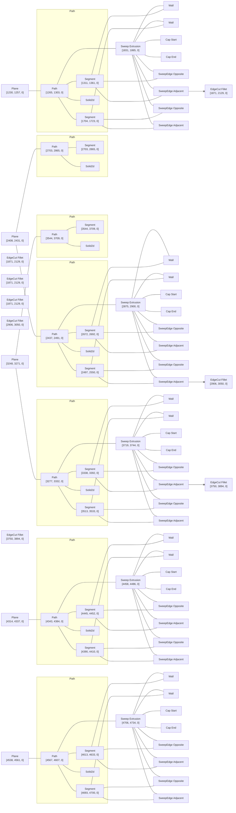

```mermaid
flowchart LR
  subgraph path2 [Path]
    2["Path<br>[1265, 1303, 0]"]
    3["Segment<br>[1311, 1361, 0]"]
    4["Segment<br>[1704, 1723, 0]"]
    5[Solid2d]
  end
  subgraph path16 [Path]
    16["Path<br>[2437, 2491, 0]"]
    17["Segment<br>[2497, 2550, 0]"]
    22["Segment<br>[2672, 2692, 0]"]
    23[Solid2d]
  end
  subgraph path24 [Path]
    24["Path<br>[2703, 2865, 0]"]
    25["Segment<br>[2703, 2865, 0]"]
    26[Solid2d]
  end
  subgraph path39 [Path]
    39["Path<br>[3277, 3332, 0]"]
    40["Segment<br>[3338, 3392, 0]"]
    41["Segment<br>[3513, 3533, 0]"]
    42[Solid2d]
  end
  subgraph path43 [Path]
    43["Path<br>[3544, 3709, 0]"]
    44["Segment<br>[3544, 3709, 0]"]
    45[Solid2d]
  end
  subgraph path58 [Path]
    58["Path<br>[4343, 4384, 0]"]
    59["Segment<br>[4390, 4410, 0]"]
    60["Segment<br>[4445, 4452, 0]"]
    61[Solid2d]
  end
  subgraph path72 [Path]
    72["Path<br>[4567, 4607, 0]"]
    73["Segment<br>[4613, 4633, 0]"]
    74["Segment<br>[4693, 4700, 0]"]
    75[Solid2d]
  end
  1["Plane<br>[1230, 1257, 0]"]
  6["Sweep Extrusion<br>[1831, 1865, 0]"]
  7[Wall]
  8[Wall]
  9["Cap Start"]
  10["Cap End"]
  11["SweepEdge Opposite"]
  12["SweepEdge Adjacent"]
  13["SweepEdge Opposite"]
  14["SweepEdge Adjacent"]
  15["Plane<br>[2408, 2431, 0]"]
  18["EdgeCut Fillet<br>[1871, 2129, 0]"]
  19["EdgeCut Fillet<br>[1871, 2129, 0]"]
  20["EdgeCut Fillet<br>[1871, 2129, 0]"]
  21["EdgeCut Fillet<br>[1871, 2129, 0]"]
  27["Sweep Extrusion<br>[2875, 2900, 0]"]
  28[Wall]
  29[Wall]
  30["Cap Start"]
  31["Cap End"]
  32["SweepEdge Opposite"]
  33["SweepEdge Adjacent"]
  34["SweepEdge Opposite"]
  35["SweepEdge Adjacent"]
  36["EdgeCut Fillet<br>[2906, 3050, 0]"]
  37["EdgeCut Fillet<br>[2906, 3050, 0]"]
  38["Plane<br>[3248, 3271, 0]"]
  46["Sweep Extrusion<br>[3719, 3744, 0]"]
  47[Wall]
  48[Wall]
  49["Cap Start"]
  50["Cap End"]
  51["SweepEdge Opposite"]
  52["SweepEdge Adjacent"]
  53["SweepEdge Opposite"]
  54["SweepEdge Adjacent"]
  55["EdgeCut Fillet<br>[3750, 3894, 0]"]
  56["EdgeCut Fillet<br>[3750, 3894, 0]"]
  57["Plane<br>[4314, 4337, 0]"]
  62["Sweep Extrusion<br>[4458, 4486, 0]"]
  63[Wall]
  64[Wall]
  65["Cap Start"]
  66["Cap End"]
  67["SweepEdge Opposite"]
  68["SweepEdge Adjacent"]
  69["SweepEdge Opposite"]
  70["SweepEdge Adjacent"]
  71["Plane<br>[4538, 4561, 0]"]
  76["Sweep Extrusion<br>[4706, 4734, 0]"]
  77[Wall]
  78[Wall]
  79["Cap Start"]
  80["Cap End"]
  81["SweepEdge Opposite"]
  82["SweepEdge Adjacent"]
  83["SweepEdge Opposite"]
  84["SweepEdge Adjacent"]
  1 --- 2
  2 --- 3
  2 --- 4
  2 ---- 6
  2 --- 5
  3 --- 7
  3 --- 11
  3 --- 12
  4 --- 8
  4 --- 13
  4 --- 14
  6 --- 7
  6 --- 8
  6 --- 9
  6 --- 10
  6 --- 11
  6 --- 12
  6 --- 13
  6 --- 14
  15 --- 16
  15 --- 24
  16 --- 17
  16 --- 22
  16 ---- 27
  16 --- 23
  17 --- 29
  17 --- 34
  17 --- 35
  12 <--x 19
  22 --- 28
  22 --- 32
  22 --- 33
  24 --- 25
  24 --- 26
  27 --- 28
  27 --- 29
  27 --- 30
  27 --- 31
  27 --- 32
  27 --- 33
  27 --- 34
  27 --- 35
  35 <--x 36
  38 --- 39
  38 --- 43
  39 --- 40
  39 --- 41
  39 ---- 46
  39 --- 42
  40 --- 47
  40 --- 51
  40 --- 52
  41 --- 48
  41 --- 53
  41 --- 54
  43 --- 44
  43 --- 45
  46 --- 47
  46 --- 48
  46 --- 49
  46 --- 50
  46 --- 51
  46 --- 52
  46 --- 53
  46 --- 54
  52 <--x 55
  57 --- 58
  58 --- 59
  58 --- 60
  58 ---- 62
  58 --- 61
  59 --- 64
  59 --- 69
  59 --- 70
  60 --- 63
  60 --- 67
  60 --- 68
  62 --- 63
  62 --- 64
  62 --- 65
  62 --- 66
  62 --- 67
  62 --- 68
  62 --- 69
  62 --- 70
  71 --- 72
  72 --- 73
  72 --- 74
  72 ---- 76
  72 --- 75
  73 --- 77
  73 --- 81
  73 --- 82
  74 --- 78
  74 --- 83
  74 --- 84
  76 --- 77
  76 --- 78
  76 --- 79
  76 --- 80
  76 --- 81
  76 --- 82
  76 --- 83
  76 --- 84
```
