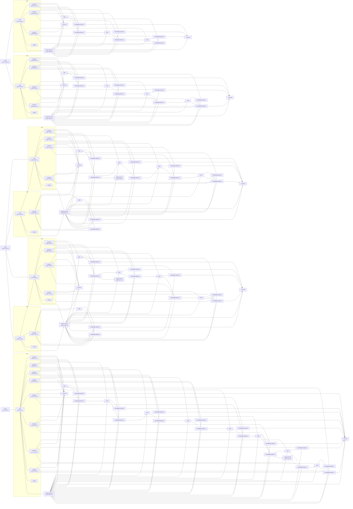

```mermaid
flowchart LR
  subgraph path2 [Path]
    2["Path<br>[795, 833, 0]"]
      %% [ProgramBodyItem { index: 10 }, VariableDeclarationDeclaration, VariableDeclarationInit, FunctionExpressionBody, FunctionExpressionBodyItem { index: 0 }, VariableDeclarationDeclaration, VariableDeclarationInit, PipeBodyItem { index: 1 }]
    3["Segment<br>[841, 891, 0]"]
      %% [ProgramBodyItem { index: 10 }, VariableDeclarationDeclaration, VariableDeclarationInit, FunctionExpressionBody, FunctionExpressionBodyItem { index: 0 }, VariableDeclarationDeclaration, VariableDeclarationInit, PipeBodyItem { index: 2 }]
    4["Segment<br>[899, 948, 0]"]
      %% [ProgramBodyItem { index: 10 }, VariableDeclarationDeclaration, VariableDeclarationInit, FunctionExpressionBody, FunctionExpressionBodyItem { index: 0 }, VariableDeclarationDeclaration, VariableDeclarationInit, PipeBodyItem { index: 3 }]
    5["Segment<br>[956, 1008, 0]"]
      %% [ProgramBodyItem { index: 10 }, VariableDeclarationDeclaration, VariableDeclarationInit, FunctionExpressionBody, FunctionExpressionBodyItem { index: 0 }, VariableDeclarationDeclaration, VariableDeclarationInit, PipeBodyItem { index: 4 }]
    6["Segment<br>[1016, 1064, 0]"]
      %% [ProgramBodyItem { index: 10 }, VariableDeclarationDeclaration, VariableDeclarationInit, FunctionExpressionBody, FunctionExpressionBodyItem { index: 0 }, VariableDeclarationDeclaration, VariableDeclarationInit, PipeBodyItem { index: 5 }]
    7["Segment<br>[1072, 1116, 0]"]
      %% [ProgramBodyItem { index: 10 }, VariableDeclarationDeclaration, VariableDeclarationInit, FunctionExpressionBody, FunctionExpressionBodyItem { index: 0 }, VariableDeclarationDeclaration, VariableDeclarationInit, PipeBodyItem { index: 6 }]
    8["Segment<br>[1124, 1169, 0]"]
      %% [ProgramBodyItem { index: 10 }, VariableDeclarationDeclaration, VariableDeclarationInit, FunctionExpressionBody, FunctionExpressionBodyItem { index: 0 }, VariableDeclarationDeclaration, VariableDeclarationInit, PipeBodyItem { index: 7 }]
    9["Segment<br>[1177, 1226, 0]"]
      %% [ProgramBodyItem { index: 10 }, VariableDeclarationDeclaration, VariableDeclarationInit, FunctionExpressionBody, FunctionExpressionBodyItem { index: 0 }, VariableDeclarationDeclaration, VariableDeclarationInit, PipeBodyItem { index: 8 }]
    10["Segment<br>[1234, 1253, 0]"]
      %% [ProgramBodyItem { index: 10 }, VariableDeclarationDeclaration, VariableDeclarationInit, FunctionExpressionBody, FunctionExpressionBodyItem { index: 0 }, VariableDeclarationDeclaration, VariableDeclarationInit, PipeBodyItem { index: 9 }]
    11[Solid2d]
  end
  subgraph path41 [Path]
    41["Path<br>[1929, 1995, 0]"]
      %% [ProgramBodyItem { index: 15 }, VariableDeclarationDeclaration, VariableDeclarationInit, PipeBodyItem { index: 0 }]
    42["Segment<br>[2001, 2054, 0]"]
      %% [ProgramBodyItem { index: 15 }, VariableDeclarationDeclaration, VariableDeclarationInit, PipeBodyItem { index: 1 }]
    43["Segment<br>[2060, 2110, 0]"]
      %% [ProgramBodyItem { index: 15 }, VariableDeclarationDeclaration, VariableDeclarationInit, PipeBodyItem { index: 2 }]
    44["Segment<br>[2116, 2170, 0]"]
      %% [ProgramBodyItem { index: 15 }, VariableDeclarationDeclaration, VariableDeclarationInit, PipeBodyItem { index: 3 }]
    45["Segment<br>[2176, 2196, 0]"]
      %% [ProgramBodyItem { index: 15 }, VariableDeclarationDeclaration, VariableDeclarationInit, PipeBodyItem { index: 4 }]
    46[Solid2d]
  end
  subgraph path47 [Path]
    47["Path<br>[2220, 2383, 0]"]
      %% [ProgramBodyItem { index: 15 }, VariableDeclarationDeclaration, VariableDeclarationInit, PipeBodyItem { index: 5 }, CallKwArg { index: 0 }]
    48["Segment<br>[2220, 2383, 0]"]
      %% [ProgramBodyItem { index: 15 }, VariableDeclarationDeclaration, VariableDeclarationInit, PipeBodyItem { index: 5 }, CallKwArg { index: 0 }]
    49[Solid2d]
  end
  subgraph path69 [Path]
    69["Path<br>[2736, 2803, 0]"]
      %% [ProgramBodyItem { index: 16 }, VariableDeclarationDeclaration, VariableDeclarationInit, PipeBodyItem { index: 0 }]
    70["Segment<br>[2809, 2863, 0]"]
      %% [ProgramBodyItem { index: 16 }, VariableDeclarationDeclaration, VariableDeclarationInit, PipeBodyItem { index: 1 }]
    71["Segment<br>[2869, 2919, 0]"]
      %% [ProgramBodyItem { index: 16 }, VariableDeclarationDeclaration, VariableDeclarationInit, PipeBodyItem { index: 2 }]
    72["Segment<br>[2925, 2978, 0]"]
      %% [ProgramBodyItem { index: 16 }, VariableDeclarationDeclaration, VariableDeclarationInit, PipeBodyItem { index: 3 }]
    73["Segment<br>[2984, 3004, 0]"]
      %% [ProgramBodyItem { index: 16 }, VariableDeclarationDeclaration, VariableDeclarationInit, PipeBodyItem { index: 4 }]
    74[Solid2d]
  end
  subgraph path75 [Path]
    75["Path<br>[3028, 3194, 0]"]
      %% [ProgramBodyItem { index: 16 }, VariableDeclarationDeclaration, VariableDeclarationInit, PipeBodyItem { index: 5 }, CallKwArg { index: 0 }]
    76["Segment<br>[3028, 3194, 0]"]
      %% [ProgramBodyItem { index: 16 }, VariableDeclarationDeclaration, VariableDeclarationInit, PipeBodyItem { index: 5 }, CallKwArg { index: 0 }]
    77[Solid2d]
  end
  subgraph path98 [Path]
    98["Path<br>[3746, 3798, 0]"]
      %% [ProgramBodyItem { index: 19 }, VariableDeclarationDeclaration, VariableDeclarationInit, PipeBodyItem { index: 0 }]
    99["Segment<br>[3804, 3824, 0]"]
      %% [ProgramBodyItem { index: 19 }, VariableDeclarationDeclaration, VariableDeclarationInit, PipeBodyItem { index: 1 }]
    100["Segment<br>[3830, 3853, 0]"]
      %% [ProgramBodyItem { index: 19 }, VariableDeclarationDeclaration, VariableDeclarationInit, PipeBodyItem { index: 2 }]
    101["Segment<br>[3859, 3866, 0]"]
      %% [ProgramBodyItem { index: 19 }, VariableDeclarationDeclaration, VariableDeclarationInit, PipeBodyItem { index: 3 }]
    102[Solid2d]
  end
  subgraph path115 [Path]
    115["Path<br>[3952, 4003, 0]"]
      %% [ProgramBodyItem { index: 20 }, VariableDeclarationDeclaration, VariableDeclarationInit, PipeBodyItem { index: 0 }]
    116["Segment<br>[4009, 4029, 0]"]
      %% [ProgramBodyItem { index: 20 }, VariableDeclarationDeclaration, VariableDeclarationInit, PipeBodyItem { index: 1 }]
    117["Segment<br>[4035, 4056, 0]"]
      %% [ProgramBodyItem { index: 20 }, VariableDeclarationDeclaration, VariableDeclarationInit, PipeBodyItem { index: 2 }]
    118["Segment<br>[4062, 4083, 0]"]
      %% [ProgramBodyItem { index: 20 }, VariableDeclarationDeclaration, VariableDeclarationInit, PipeBodyItem { index: 3 }]
    119["Segment<br>[4089, 4096, 0]"]
      %% [ProgramBodyItem { index: 20 }, VariableDeclarationDeclaration, VariableDeclarationInit, PipeBodyItem { index: 4 }]
    120[Solid2d]
  end
  1["Plane<br>[760, 787, 0]"]
    %% [ProgramBodyItem { index: 10 }, VariableDeclarationDeclaration, VariableDeclarationInit, FunctionExpressionBody, FunctionExpressionBodyItem { index: 0 }, VariableDeclarationDeclaration, VariableDeclarationInit, PipeBodyItem { index: 0 }]
  12["Sweep Extrusion<br>[1373, 1407, 0]"]
    %% [ProgramBodyItem { index: 12 }, VariableDeclarationDeclaration, VariableDeclarationInit, PipeBodyItem { index: 1 }]
  13[Wall]
    %% face_code_ref=Missing NodePath
  14[Wall]
    %% face_code_ref=Missing NodePath
  15[Wall]
    %% face_code_ref=Missing NodePath
  16[Wall]
    %% face_code_ref=Missing NodePath
  17[Wall]
    %% face_code_ref=Missing NodePath
  18[Wall]
    %% face_code_ref=Missing NodePath
  19[Wall]
    %% face_code_ref=Missing NodePath
  20[Wall]
    %% face_code_ref=Missing NodePath
  21["Cap Start"]
    %% face_code_ref=Missing NodePath
  22["Cap End"]
    %% face_code_ref=Missing NodePath
  23["SweepEdge Opposite"]
  24["SweepEdge Adjacent"]
  25["SweepEdge Opposite"]
  26["SweepEdge Adjacent"]
  27["SweepEdge Opposite"]
  28["SweepEdge Adjacent"]
  29["SweepEdge Opposite"]
  30["SweepEdge Adjacent"]
  31["SweepEdge Opposite"]
  32["SweepEdge Adjacent"]
  33["SweepEdge Opposite"]
  34["SweepEdge Adjacent"]
  35["SweepEdge Opposite"]
  36["SweepEdge Adjacent"]
  37["SweepEdge Opposite"]
  38["SweepEdge Adjacent"]
  39["EdgeCut Fillet<br>[1413, 1672, 0]"]
    %% [ProgramBodyItem { index: 12 }, VariableDeclarationDeclaration, VariableDeclarationInit, PipeBodyItem { index: 2 }]
  40["Plane<br>[1897, 1920, 0]"]
    %% [ProgramBodyItem { index: 14 }, VariableDeclarationDeclaration, VariableDeclarationInit]
  50["Sweep Extrusion<br>[2390, 2415, 0]"]
    %% [ProgramBodyItem { index: 15 }, VariableDeclarationDeclaration, VariableDeclarationInit, PipeBodyItem { index: 6 }]
  51[Wall]
    %% face_code_ref=Missing NodePath
  52[Wall]
    %% face_code_ref=Missing NodePath
  53[Wall]
    %% face_code_ref=Missing NodePath
  54[Wall]
    %% face_code_ref=Missing NodePath
  55[Wall]
    %% face_code_ref=Missing NodePath
  56["Cap Start"]
    %% face_code_ref=Missing NodePath
  57["Cap End"]
    %% face_code_ref=Missing NodePath
  58["SweepEdge Opposite"]
  59["SweepEdge Adjacent"]
  60["SweepEdge Opposite"]
  61["SweepEdge Adjacent"]
  62["SweepEdge Opposite"]
  63["SweepEdge Adjacent"]
  64["SweepEdge Opposite"]
  65["SweepEdge Adjacent"]
  66["SweepEdge Opposite"]
  67["SweepEdge Adjacent"]
  68["EdgeCut Fillet<br>[2421, 2566, 0]"]
    %% [ProgramBodyItem { index: 15 }, VariableDeclarationDeclaration, VariableDeclarationInit, PipeBodyItem { index: 7 }]
  78["Sweep Extrusion<br>[3201, 3226, 0]"]
    %% [ProgramBodyItem { index: 16 }, VariableDeclarationDeclaration, VariableDeclarationInit, PipeBodyItem { index: 6 }]
  79[Wall]
    %% face_code_ref=Missing NodePath
  80[Wall]
    %% face_code_ref=Missing NodePath
  81[Wall]
    %% face_code_ref=Missing NodePath
  82[Wall]
    %% face_code_ref=Missing NodePath
  83[Wall]
    %% face_code_ref=Missing NodePath
  84["Cap Start"]
    %% face_code_ref=Missing NodePath
  85["Cap End"]
    %% face_code_ref=Missing NodePath
  86["SweepEdge Opposite"]
  87["SweepEdge Adjacent"]
  88["SweepEdge Opposite"]
  89["SweepEdge Adjacent"]
  90["SweepEdge Opposite"]
  91["SweepEdge Adjacent"]
  92["SweepEdge Opposite"]
  93["SweepEdge Adjacent"]
  94["SweepEdge Opposite"]
  95["SweepEdge Adjacent"]
  96["EdgeCut Fillet<br>[3232, 3377, 0]"]
    %% [ProgramBodyItem { index: 16 }, VariableDeclarationDeclaration, VariableDeclarationInit, PipeBodyItem { index: 7 }]
  97["Plane<br>[3711, 3734, 0]"]
    %% [ProgramBodyItem { index: 18 }, VariableDeclarationDeclaration, VariableDeclarationInit]
  103["Sweep Extrusion<br>[3872, 3900, 0]"]
    %% [ProgramBodyItem { index: 19 }, VariableDeclarationDeclaration, VariableDeclarationInit, PipeBodyItem { index: 4 }]
  104[Wall]
    %% face_code_ref=Missing NodePath
  105[Wall]
    %% face_code_ref=Missing NodePath
  106[Wall]
    %% face_code_ref=Missing NodePath
  107["Cap Start"]
    %% face_code_ref=Missing NodePath
  108["Cap End"]
    %% face_code_ref=Missing NodePath
  109["SweepEdge Opposite"]
  110["SweepEdge Adjacent"]
  111["SweepEdge Opposite"]
  112["SweepEdge Adjacent"]
  113["SweepEdge Opposite"]
  114["SweepEdge Adjacent"]
  121["Sweep Extrusion<br>[4102, 4130, 0]"]
    %% [ProgramBodyItem { index: 20 }, VariableDeclarationDeclaration, VariableDeclarationInit, PipeBodyItem { index: 5 }]
  122[Wall]
    %% face_code_ref=Missing NodePath
  123[Wall]
    %% face_code_ref=Missing NodePath
  124[Wall]
    %% face_code_ref=Missing NodePath
  125[Wall]
    %% face_code_ref=Missing NodePath
  126["Cap Start"]
    %% face_code_ref=Missing NodePath
  127["Cap End"]
    %% face_code_ref=Missing NodePath
  128["SweepEdge Opposite"]
  129["SweepEdge Adjacent"]
  130["SweepEdge Opposite"]
  131["SweepEdge Adjacent"]
  132["SweepEdge Opposite"]
  133["SweepEdge Adjacent"]
  134["SweepEdge Opposite"]
  135["SweepEdge Adjacent"]
  1 --- 2
  2 --- 3
  2 --- 4
  2 --- 5
  2 --- 6
  2 --- 7
  2 --- 8
  2 --- 9
  2 --- 10
  2 --- 11
  2 ---- 12
  3 --- 13
  3 x--> 21
  3 --- 23
  3 --- 24
  4 --- 14
  4 x--> 21
  4 --- 25
  4 --- 26
  5 --- 15
  5 x--> 21
  5 --- 27
  5 --- 28
  6 --- 16
  6 x--> 21
  6 --- 29
  6 --- 30
  7 --- 17
  7 x--> 21
  7 --- 31
  7 --- 32
  8 --- 18
  8 x--> 21
  8 --- 33
  8 --- 34
  9 --- 19
  9 x--> 21
  9 --- 35
  9 --- 36
  10 --- 20
  10 x--> 21
  10 --- 37
  10 --- 38
  12 --- 13
  12 --- 14
  12 --- 15
  12 --- 16
  12 --- 17
  12 --- 18
  12 --- 19
  12 --- 20
  12 --- 21
  12 --- 22
  12 --- 23
  12 --- 24
  12 --- 25
  12 --- 26
  12 --- 27
  12 --- 28
  12 --- 29
  12 --- 30
  12 --- 31
  12 --- 32
  12 --- 33
  12 --- 34
  12 --- 35
  12 --- 36
  12 --- 37
  12 --- 38
  13 --- 23
  13 --- 24
  38 <--x 13
  24 <--x 14
  14 --- 25
  14 --- 26
  26 <--x 15
  15 --- 27
  15 --- 28
  28 <--x 16
  16 --- 29
  16 --- 30
  30 <--x 17
  17 --- 31
  17 --- 32
  32 <--x 18
  18 --- 33
  18 --- 34
  34 <--x 19
  19 --- 35
  19 --- 36
  36 <--x 20
  20 --- 37
  20 --- 38
  23 <--x 22
  25 <--x 22
  27 <--x 22
  29 <--x 22
  31 <--x 22
  33 <--x 22
  35 <--x 22
  37 <--x 22
  34 <--x 39
  40 --- 41
  40 --- 47
  40 --- 69
  40 --- 75
  41 --- 42
  41 --- 43
  41 --- 44
  41 --- 45
  41 --- 46
  47 --- 41
  41 ---- 50
  42 --- 54
  42 x--> 57
  42 --- 64
  42 --- 65
  43 --- 53
  43 x--> 57
  43 --- 62
  43 --- 63
  44 --- 52
  44 x--> 57
  44 --- 60
  44 --- 61
  45 --- 51
  45 x--> 57
  45 --- 58
  45 --- 59
  47 --- 48
  47 --- 49
  47 x---> 50
  48 --- 55
  48 x--> 57
  48 --- 66
  48 --- 67
  50 --- 51
  50 --- 52
  50 --- 53
  50 --- 54
  50 --- 55
  50 --- 56
  50 --- 57
  50 --- 58
  50 --- 59
  50 --- 60
  50 --- 61
  50 --- 62
  50 --- 63
  50 --- 64
  50 --- 65
  50 --- 66
  50 --- 67
  51 --- 58
  51 --- 59
  61 <--x 51
  52 --- 60
  52 --- 61
  63 <--x 52
  53 --- 62
  53 --- 63
  65 <--x 53
  59 <--x 54
  54 --- 64
  54 --- 65
  55 --- 66
  55 --- 67
  58 <--x 56
  60 <--x 56
  62 <--x 56
  64 <--x 56
  66 <--x 56
  65 <--x 68
  69 --- 70
  69 --- 71
  69 --- 72
  69 --- 73
  69 --- 74
  75 --- 69
  69 ---- 78
  70 --- 79
  70 x--> 85
  70 --- 86
  70 --- 87
  71 --- 80
  71 x--> 85
  71 --- 88
  71 --- 89
  72 --- 81
  72 x--> 85
  72 --- 90
  72 --- 91
  73 --- 82
  73 x--> 85
  73 --- 92
  73 --- 93
  75 --- 76
  75 --- 77
  75 x---> 78
  76 --- 83
  76 x--> 85
  76 --- 94
  76 --- 95
  78 --- 79
  78 --- 80
  78 --- 81
  78 --- 82
  78 --- 83
  78 --- 84
  78 --- 85
  78 --- 86
  78 --- 87
  78 --- 88
  78 --- 89
  78 --- 90
  78 --- 91
  78 --- 92
  78 --- 93
  78 --- 94
  78 --- 95
  79 --- 86
  79 --- 87
  93 <--x 79
  87 <--x 80
  80 --- 88
  80 --- 89
  89 <--x 81
  81 --- 90
  81 --- 91
  91 <--x 82
  82 --- 92
  82 --- 93
  83 --- 94
  83 --- 95
  86 <--x 84
  88 <--x 84
  90 <--x 84
  92 <--x 84
  94 <--x 84
  87 <--x 96
  97 --- 98
  97 --- 115
  98 --- 99
  98 --- 100
  98 --- 101
  98 --- 102
  98 ---- 103
  99 --- 106
  99 x--> 107
  99 --- 113
  99 --- 114
  100 --- 105
  100 x--> 107
  100 --- 111
  100 --- 112
  101 --- 104
  101 x--> 107
  101 --- 109
  101 --- 110
  103 --- 104
  103 --- 105
  103 --- 106
  103 --- 107
  103 --- 108
  103 --- 109
  103 --- 110
  103 --- 111
  103 --- 112
  103 --- 113
  103 --- 114
  104 --- 109
  104 --- 110
  112 <--x 104
  105 --- 111
  105 --- 112
  114 <--x 105
  110 <--x 106
  106 --- 113
  106 --- 114
  109 <--x 108
  111 <--x 108
  113 <--x 108
  115 --- 116
  115 --- 117
  115 --- 118
  115 --- 119
  115 --- 120
  115 ---- 121
  116 --- 122
  116 x--> 126
  116 --- 128
  116 --- 129
  117 --- 123
  117 x--> 126
  117 --- 130
  117 --- 131
  118 --- 124
  118 x--> 126
  118 --- 132
  118 --- 133
  119 --- 125
  119 x--> 126
  119 --- 134
  119 --- 135
  121 --- 122
  121 --- 123
  121 --- 124
  121 --- 125
  121 --- 126
  121 --- 127
  121 --- 128
  121 --- 129
  121 --- 130
  121 --- 131
  121 --- 132
  121 --- 133
  121 --- 134
  121 --- 135
  122 --- 128
  122 --- 129
  135 <--x 122
  129 <--x 123
  123 --- 130
  123 --- 131
  131 <--x 124
  124 --- 132
  124 --- 133
  133 <--x 125
  125 --- 134
  125 --- 135
  128 <--x 127
  130 <--x 127
  132 <--x 127
  134 <--x 127
```
