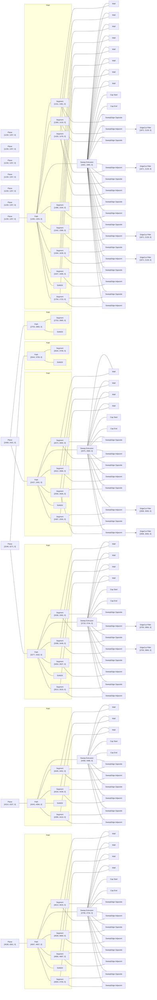

```mermaid
flowchart LR
  subgraph path8 [Path]
    8["Path<br>[1265, 1303, 0]"]
    9["Segment<br>[1311, 1361, 0]"]
    10["Segment<br>[1369, 1418, 0]"]
    11["Segment<br>[1426, 1478, 0]"]
    12["Segment<br>[1486, 1534, 0]"]
    13["Segment<br>[1542, 1586, 0]"]
    14["Segment<br>[1594, 1639, 0]"]
    15["Segment<br>[1647, 1696, 0]"]
    16["Segment<br>[1704, 1723, 0]"]
    17[Solid2d]
  end
  subgraph path46 [Path]
    46["Path<br>[2437, 2491, 0]"]
    47["Segment<br>[2497, 2550, 0]"]
    48["Segment<br>[2556, 2606, 0]"]
    49["Segment<br>[2612, 2666, 0]"]
    50["Segment<br>[2672, 2692, 0]"]
    51[Solid2d]
  end
  subgraph path52 [Path]
    52["Path<br>[2703, 2865, 0]"]
    53["Segment<br>[2703, 2865, 0]"]
    54[Solid2d]
  end
  subgraph path73 [Path]
    73["Path<br>[3277, 3332, 0]"]
    74["Segment<br>[3338, 3392, 0]"]
    75["Segment<br>[3398, 3448, 0]"]
    76["Segment<br>[3454, 3507, 0]"]
    77["Segment<br>[3513, 3533, 0]"]
    78[Solid2d]
  end
  subgraph path79 [Path]
    79["Path<br>[3544, 3709, 0]"]
    80["Segment<br>[3544, 3709, 0]"]
    81[Solid2d]
  end
  subgraph path100 [Path]
    100["Path<br>[4343, 4384, 0]"]
    101["Segment<br>[4390, 4410, 0]"]
    102["Segment<br>[4416, 4439, 0]"]
    103["Segment<br>[4445, 4452, 0]"]
    104[Solid2d]
  end
  subgraph path118 [Path]
    118["Path<br>[4567, 4607, 0]"]
    119["Segment<br>[4613, 4633, 0]"]
    120["Segment<br>[4639, 4660, 0]"]
    121["Segment<br>[4666, 4687, 0]"]
    122["Segment<br>[4693, 4700, 0]"]
    123[Solid2d]
  end
  1["Plane<br>[1230, 1257, 0]"]
  2["Plane<br>[1230, 1257, 0]"]
  3["Plane<br>[1230, 1257, 0]"]
  4["Plane<br>[1230, 1257, 0]"]
  5["Plane<br>[1230, 1257, 0]"]
  6["Plane<br>[1230, 1257, 0]"]
  7["Plane<br>[1230, 1257, 0]"]
  18["Sweep Extrusion<br>[1831, 1865, 0]"]
  19[Wall]
  20[Wall]
  21[Wall]
  22[Wall]
  23[Wall]
  24[Wall]
  25[Wall]
  26[Wall]
  27["Cap Start"]
  28["Cap End"]
  29["SweepEdge Opposite"]
  30["SweepEdge Adjacent"]
  31["SweepEdge Opposite"]
  32["SweepEdge Adjacent"]
  33["SweepEdge Opposite"]
  34["SweepEdge Adjacent"]
  35["SweepEdge Opposite"]
  36["SweepEdge Adjacent"]
  37["SweepEdge Opposite"]
  38["SweepEdge Adjacent"]
  39["SweepEdge Opposite"]
  40["SweepEdge Adjacent"]
  41["SweepEdge Opposite"]
  42["SweepEdge Adjacent"]
  43["SweepEdge Opposite"]
  44["SweepEdge Adjacent"]
  45["Plane<br>[2408, 2431, 0]"]
  55["Sweep Extrusion<br>[2875, 2900, 0]"]
  56[Wall]
  57[Wall]
  58[Wall]
  59[Wall]
  60["Cap Start"]
  61["Cap End"]
  62["SweepEdge Opposite"]
  63["SweepEdge Adjacent"]
  64["SweepEdge Opposite"]
  65["SweepEdge Adjacent"]
  66["SweepEdge Opposite"]
  67["SweepEdge Adjacent"]
  68["SweepEdge Opposite"]
  69["SweepEdge Adjacent"]
  70["EdgeCut Fillet<br>[2906, 3050, 0]"]
  71["EdgeCut Fillet<br>[2906, 3050, 0]"]
  72["Plane<br>[3248, 3271, 0]"]
  82["Sweep Extrusion<br>[3719, 3744, 0]"]
  83[Wall]
  84[Wall]
  85[Wall]
  86[Wall]
  87["Cap Start"]
  88["Cap End"]
  89["SweepEdge Opposite"]
  90["SweepEdge Adjacent"]
  91["SweepEdge Opposite"]
  92["SweepEdge Adjacent"]
  93["SweepEdge Opposite"]
  94["SweepEdge Adjacent"]
  95["SweepEdge Opposite"]
  96["SweepEdge Adjacent"]
  97["EdgeCut Fillet<br>[3750, 3894, 0]"]
  98["EdgeCut Fillet<br>[3750, 3894, 0]"]
  99["Plane<br>[4314, 4337, 0]"]
  105["Sweep Extrusion<br>[4458, 4486, 0]"]
  106[Wall]
  107[Wall]
  108[Wall]
  109["Cap Start"]
  110["Cap End"]
  111["SweepEdge Opposite"]
  112["SweepEdge Adjacent"]
  113["SweepEdge Opposite"]
  114["SweepEdge Adjacent"]
  115["SweepEdge Opposite"]
  116["SweepEdge Adjacent"]
  117["Plane<br>[4538, 4561, 0]"]
  124["Sweep Extrusion<br>[4706, 4734, 0]"]
  125[Wall]
  126[Wall]
  127[Wall]
  128[Wall]
  129["Cap Start"]
  130["Cap End"]
  131["SweepEdge Opposite"]
  132["SweepEdge Adjacent"]
  133["SweepEdge Opposite"]
  134["SweepEdge Adjacent"]
  135["SweepEdge Opposite"]
  136["SweepEdge Adjacent"]
  137["SweepEdge Opposite"]
  138["SweepEdge Adjacent"]
  139["EdgeCut Fillet<br>[1871, 2129, 0]"]
  140["EdgeCut Fillet<br>[1871, 2129, 0]"]
  141["EdgeCut Fillet<br>[1871, 2129, 0]"]
  142["EdgeCut Fillet<br>[1871, 2129, 0]"]
  7 --- 8
  8 --- 9
  8 --- 10
  8 --- 11
  8 --- 12
  8 --- 13
  8 --- 14
  8 --- 15
  8 --- 16
  8 ---- 18
  8 --- 17
  9 --- 19
  9 --- 29
  9 --- 30
  10 --- 20
  10 --- 31
  10 --- 32
  11 --- 21
  11 --- 33
  11 --- 34
  12 --- 22
  12 --- 35
  12 --- 36
  13 --- 23
  13 --- 37
  13 --- 38
  14 --- 24
  14 --- 39
  14 --- 40
  15 --- 25
  15 --- 41
  15 --- 42
  16 --- 26
  16 --- 43
  16 --- 44
  18 --- 19
  18 --- 20
  18 --- 21
  18 --- 22
  18 --- 23
  18 --- 24
  18 --- 25
  18 --- 26
  18 --- 27
  18 --- 28
  18 --- 29
  18 --- 30
  18 --- 31
  18 --- 32
  18 --- 33
  18 --- 34
  18 --- 35
  18 --- 36
  18 --- 37
  18 --- 38
  18 --- 39
  18 --- 40
  18 --- 41
  18 --- 42
  18 --- 43
  18 --- 44
  45 --- 46
  45 --- 52
  46 --- 47
  46 --- 48
  46 --- 49
  46 --- 50
  46 ---- 55
  46 --- 51
  47 --- 59
  47 --- 68
  47 --- 69
  48 --- 58
  48 --- 66
  48 --- 67
  49 --- 57
  49 --- 64
  49 --- 65
  50 --- 56
  50 --- 62
  50 --- 63
  52 --- 53
  52 --- 54
  55 --- 56
  55 --- 57
  55 --- 58
  55 --- 59
  55 --- 60
  55 --- 61
  55 --- 62
  55 --- 63
  55 --- 64
  55 --- 65
  55 --- 66
  55 --- 67
  55 --- 68
  55 --- 69
  69 <--x 70
  67 <--x 71
  72 --- 73
  72 --- 79
  73 --- 74
  73 --- 75
  73 --- 76
  73 --- 77
  73 ---- 82
  73 --- 78
  74 --- 83
  74 --- 89
  74 --- 90
  75 --- 84
  75 --- 91
  75 --- 92
  76 --- 85
  76 --- 93
  76 --- 94
  77 --- 86
  77 --- 95
  77 --- 96
  79 --- 80
  79 --- 81
  82 --- 83
  82 --- 84
  82 --- 85
  82 --- 86
  82 --- 87
  82 --- 88
  82 --- 89
  82 --- 90
  82 --- 91
  82 --- 92
  82 --- 93
  82 --- 94
  82 --- 95
  82 --- 96
  90 <--x 97
  92 <--x 98
  99 --- 100
  100 --- 101
  100 --- 102
  100 --- 103
  100 ---- 105
  100 --- 104
  101 --- 108
  101 --- 115
  101 --- 116
  102 --- 107
  102 --- 113
  102 --- 114
  103 --- 106
  103 --- 111
  103 --- 112
  105 --- 106
  105 --- 107
  105 --- 108
  105 --- 109
  105 --- 110
  105 --- 111
  105 --- 112
  105 --- 113
  105 --- 114
  105 --- 115
  105 --- 116
  117 --- 118
  118 --- 119
  118 --- 120
  118 --- 121
  118 --- 122
  118 ---- 124
  118 --- 123
  119 --- 125
  119 --- 131
  119 --- 132
  120 --- 126
  120 --- 133
  120 --- 134
  121 --- 127
  121 --- 135
  121 --- 136
  122 --- 128
  122 --- 137
  122 --- 138
  124 --- 125
  124 --- 126
  124 --- 127
  124 --- 128
  124 --- 129
  124 --- 130
  124 --- 131
  124 --- 132
  124 --- 133
  124 --- 134
  124 --- 135
  124 --- 136
  124 --- 137
  124 --- 138
  40 <--x 139
  30 <--x 140
  32 <--x 141
  38 <--x 142
```
