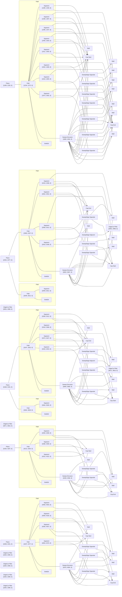

```mermaid
flowchart LR
  subgraph path2 [Path]
    2["Path<br>[1234, 1272, 0]"]
    3["Segment<br>[1280, 1330, 0]"]
    4["Segment<br>[1338, 1387, 0]"]
    5["Segment<br>[1395, 1447, 0]"]
    6["Segment<br>[1455, 1503, 0]"]
    7["Segment<br>[1511, 1555, 0]"]
    8["Segment<br>[1563, 1608, 0]"]
    9["Segment<br>[1616, 1665, 0]"]
    10["Segment<br>[1673, 1692, 0]"]
    11[Solid2d]
  end
  subgraph path31 [Path]
    31["Path<br>[2383, 2437, 0]"]
    32["Segment<br>[2443, 2496, 0]"]
    33["Segment<br>[2502, 2552, 0]"]
    34["Segment<br>[2558, 2612, 0]"]
    35["Segment<br>[2618, 2638, 0]"]
    36[Solid2d]
  end
  subgraph path37 [Path]
    37["Path<br>[2649, 2812, 0]"]
    38["Segment<br>[2649, 2812, 0]"]
    39[Solid2d]
  end
  subgraph path54 [Path]
    54["Path<br>[3197, 3252, 0]"]
    55["Segment<br>[3258, 3312, 0]"]
    56["Segment<br>[3318, 3368, 0]"]
    57["Segment<br>[3374, 3427, 0]"]
    58["Segment<br>[3433, 3453, 0]"]
    59[Solid2d]
  end
  subgraph path60 [Path]
    60["Path<br>[3464, 3630, 0]"]
    61["Segment<br>[3464, 3630, 0]"]
    62[Solid2d]
  end
  subgraph path77 [Path]
    77["Path<br>[4213, 4254, 0]"]
    78["Segment<br>[4260, 4280, 0]"]
    79["Segment<br>[4286, 4309, 0]"]
    80["Segment<br>[4315, 4322, 0]"]
    81[Solid2d]
  end
  subgraph path91 [Path]
    91["Path<br>[4437, 4477, 0]"]
    92["Segment<br>[4483, 4503, 0]"]
    93["Segment<br>[4509, 4530, 0]"]
    94["Segment<br>[4536, 4557, 0]"]
    95["Segment<br>[4563, 4570, 0]"]
    96[Solid2d]
  end
  1["Plane<br>[1199, 1226, 0]"]
  12["Sweep Extrusion<br>[1800, 1834, 0]"]
  13[Wall]
  14[Wall]
  15[Wall]
  16[Wall]
  17[Wall]
  18[Wall]
  19[Wall]
  20[Wall]
  21["Cap Start"]
  22["Cap End"]
  23["SweepEdge Opposite"]
  24["SweepEdge Opposite"]
  25["SweepEdge Opposite"]
  26["SweepEdge Opposite"]
  27["SweepEdge Opposite"]
  28["SweepEdge Opposite"]
  29["SweepEdge Opposite"]
  30["Plane<br>[2354, 2377, 0]"]
  40["Sweep Extrusion<br>[2822, 2847, 0]"]
  41[Wall]
  42[Wall]
  43[Wall]
  44[Wall]
  45["Cap Start"]
  46["Cap End"]
  47["SweepEdge Opposite"]
  48["SweepEdge Opposite"]
  49["SweepEdge Opposite"]
  50["SweepEdge Adjacent"]
  51["EdgeCut Fillet<br>[2853, 2998, 0]"]
  52["EdgeCut Fillet<br>[2853, 2998, 0]"]
  53["Plane<br>[3168, 3191, 0]"]
  63["Sweep Extrusion<br>[3640, 3665, 0]"]
  64[Wall]
  65[Wall]
  66[Wall]
  67[Wall]
  68["Cap Start"]
  69["Cap End"]
  70["SweepEdge Opposite"]
  71["SweepEdge Opposite"]
  72["SweepEdge Opposite"]
  73["SweepEdge Adjacent"]
  74["EdgeCut Fillet<br>[3671, 3816, 0]"]
  75["EdgeCut Fillet<br>[3671, 3816, 0]"]
  76["Plane<br>[4184, 4207, 0]"]
  82["Sweep Extrusion<br>[4328, 4356, 0]"]
  83[Wall]
  84[Wall]
  85[Wall]
  86["Cap Start"]
  87["Cap End"]
  88["SweepEdge Opposite"]
  89["SweepEdge Opposite"]
  90["Plane<br>[4408, 4431, 0]"]
  97["Sweep Extrusion<br>[4576, 4604, 0]"]
  98[Wall]
  99[Wall]
  100[Wall]
  101[Wall]
  102["Cap Start"]
  103["Cap End"]
  104["SweepEdge Opposite"]
  105["SweepEdge Opposite"]
  106["SweepEdge Opposite"]
  107["EdgeCut Fillet<br>[1840, 2099, 0]"]
  108["EdgeCut Fillet<br>[1840, 2099, 0]"]
  109["EdgeCut Fillet<br>[1840, 2099, 0]"]
  110["EdgeCut Fillet<br>[1840, 2099, 0]"]
  1 --- 2
  2 --- 3
  2 --- 4
  2 --- 5
  2 --- 6
  2 --- 7
  2 --- 8
  2 --- 9
  2 --- 10
  2 ---- 12
  2 --- 11
  3 --- 13
  3 x--> 21
  4 --- 14
  4 --- 23
  4 x--> 21
  5 --- 15
  5 --- 24
  5 x--> 21
  6 --- 16
  6 --- 25
  6 x--> 21
  7 --- 17
  7 --- 26
  7 x--> 21
  8 --- 18
  8 --- 27
  8 x--> 21
  9 --- 19
  9 --- 28
  9 x--> 21
  10 --- 20
  10 --- 29
  10 x--> 21
  12 --- 13
  12 --- 14
  12 --- 15
  12 --- 16
  12 --- 17
  12 --- 18
  12 --- 19
  12 --- 20
  12 --- 21
  12 --- 22
  12 --- 23
  12 --- 24
  12 --- 25
  12 --- 26
  12 --- 27
  12 --- 28
  12 --- 29
  23 <--x 14
  23 <--x 22
  24 <--x 15
  24 <--x 22
  25 <--x 16
  25 <--x 22
  26 <--x 17
  26 <--x 22
  27 <--x 18
  27 <--x 22
  28 <--x 19
  28 <--x 22
  29 <--x 20
  29 <--x 22
  30 --- 31
  30 --- 37
  31 --- 32
  31 --- 33
  31 --- 34
  31 --- 35
  31 ---- 40
  31 --- 36
  32 --- 44
  32 --- 49
  32 --- 50
  32 x--> 46
  33 --- 43
  33 --- 48
  33 x--> 46
  34 --- 42
  34 --- 47
  34 x--> 46
  35 --- 41
  35 x--> 46
  37 --- 38
  37 --- 39
  40 --- 41
  40 --- 42
  40 --- 43
  40 --- 44
  40 --- 45
  40 --- 46
  40 --- 47
  40 --- 48
  40 --- 49
  40 --- 50
  47 <--x 42
  47 <--x 45
  48 <--x 43
  48 <--x 45
  49 <--x 44
  49 <--x 45
  50 <--x 51
  53 --- 54
  53 --- 60
  54 --- 55
  54 --- 56
  54 --- 57
  54 --- 58
  54 ---- 63
  54 --- 59
  55 --- 64
  55 --- 73
  55 x--> 69
  56 --- 65
  56 --- 70
  56 x--> 69
  57 --- 66
  57 --- 71
  57 x--> 69
  58 --- 67
  58 --- 72
  58 x--> 69
  60 --- 61
  60 --- 62
  63 --- 64
  63 --- 65
  63 --- 66
  63 --- 67
  63 --- 68
  63 --- 69
  63 --- 70
  63 --- 71
  63 --- 72
  63 --- 73
  70 <--x 65
  70 <--x 68
  71 <--x 66
  71 <--x 68
  72 <--x 67
  72 <--x 68
  73 <--x 74
  76 --- 77
  77 --- 78
  77 --- 79
  77 --- 80
  77 ---- 82
  77 --- 81
  78 --- 85
  78 --- 89
  78 x--> 86
  79 --- 84
  79 --- 88
  79 x--> 86
  80 --- 83
  80 x--> 86
  82 --- 83
  82 --- 84
  82 --- 85
  82 --- 86
  82 --- 87
  82 --- 88
  82 --- 89
  88 <--x 84
  88 <--x 87
  89 <--x 85
  89 <--x 87
  90 --- 91
  91 --- 92
  91 --- 93
  91 --- 94
  91 --- 95
  91 ---- 97
  91 --- 96
  92 --- 98
  92 x--> 102
  93 --- 99
  93 --- 104
  93 x--> 102
  94 --- 100
  94 --- 105
  94 x--> 102
  95 --- 101
  95 --- 106
  95 x--> 102
  97 --- 98
  97 --- 99
  97 --- 100
  97 --- 101
  97 --- 102
  97 --- 103
  97 --- 104
  97 --- 105
  97 --- 106
  104 <--x 99
  104 <--x 103
  105 <--x 100
  105 <--x 103
  106 <--x 101
  106 <--x 103
```
