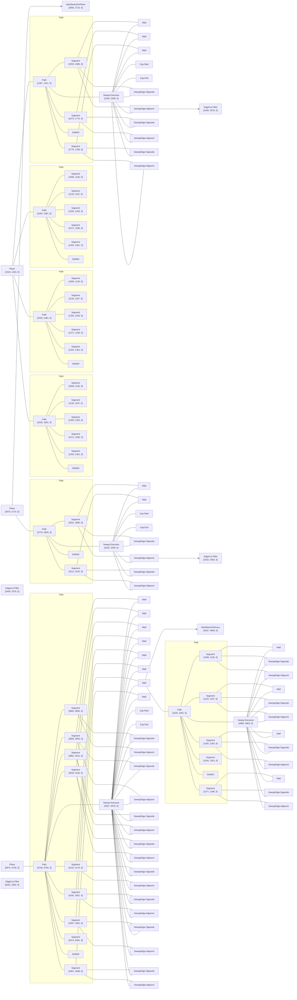

```mermaid
flowchart LR
  subgraph path2 [Path]
    2["Path<br>[1497, 1547, 0]"]
    3["Segment<br>[1553, 1585, 0]"]
    4["Segment<br>[1673, 1773, 0]"]
    5["Segment<br>[1779, 1786, 0]"]
    6[Solid2d]
  end
  subgraph path7 [Path]
    7["Path<br>[1020, 1061, 0]"]
    8["Segment<br>[1069, 1126, 0]"]
    9["Segment<br>[1134, 1197, 0]"]
    10["Segment<br>[1205, 1263, 0]"]
    11["Segment<br>[1271, 1336, 0]"]
    12["Segment<br>[1344, 1351, 0]"]
    13[Solid2d]
  end
  subgraph path14 [Path]
    14["Path<br>[1020, 1061, 0]"]
    15["Segment<br>[1069, 1126, 0]"]
    16["Segment<br>[1134, 1197, 0]"]
    17["Segment<br>[1205, 1263, 0]"]
    18["Segment<br>[1271, 1336, 0]"]
    19["Segment<br>[1344, 1351, 0]"]
    20[Solid2d]
  end
  subgraph path21 [Path]
    21["Path<br>[1020, 1061, 0]"]
    22["Segment<br>[1069, 1126, 0]"]
    23["Segment<br>[1134, 1197, 0]"]
    24["Segment<br>[1205, 1263, 0]"]
    25["Segment<br>[1271, 1336, 0]"]
    26["Segment<br>[1344, 1351, 0]"]
    27[Solid2d]
  end
  subgraph path41 [Path]
    41["Path<br>[2775, 2825, 0]"]
    42["Segment<br>[2831, 2890, 0]"]
    45["Segment<br>[3113, 3120, 0]"]
    46[Solid2d]
  end
  subgraph path57 [Path]
    57["Path<br>[3748, 3794, 0]"]
    58["Segment<br>[3800, 3850, 0]"]
    61["Segment<br>[3856, 3955, 0]"]
    62["Segment<br>[3961, 4012, 0]"]
    63["Segment<br>[4018, 4116, 0]"]
    64["Segment<br>[4122, 4175, 0]"]
    65["Segment<br>[4181, 4281, 0]"]
    66["Segment<br>[4287, 4361, 0]"]
    67["Segment<br>[4367, 4468, 0]"]
    68["Segment<br>[4474, 4481, 0]"]
    69[Solid2d]
  end
  subgraph path97 [Path]
    97["Path<br>[1020, 1061, 0]"]
    98["Segment<br>[1069, 1126, 0]"]
    99["Segment<br>[1134, 1197, 0]"]
    100["Segment<br>[1205, 1263, 0]"]
    101["Segment<br>[1271, 1336, 0]"]
    102["Segment<br>[1344, 1351, 0]"]
    103[Solid2d]
  end
  1["Plane<br>[1424, 1443, 0]"]
  28["Sweep Extrusion<br>[2349, 2399, 0]"]
  29[Wall]
  30[Wall]
  31[Wall]
  32["Cap Start"]
  33["Cap End"]
  34["SweepEdge Opposite"]
  35["SweepEdge Adjacent"]
  36["SweepEdge Opposite"]
  37["SweepEdge Adjacent"]
  38["SweepEdge Opposite"]
  39["SweepEdge Adjacent"]
  40["Plane<br>[2670, 2714, 0]"]
  43["EdgeCut Fillet<br>[2436, 2576, 0]"]
  44["EdgeCut Fillet<br>[2436, 2576, 0]"]
  47["Sweep Extrusion<br>[3165, 3209, 0]"]
  48[Wall]
  49[Wall]
  50["Cap Start"]
  51["Cap End"]
  52["SweepEdge Opposite"]
  53["SweepEdge Adjacent"]
  54["SweepEdge Opposite"]
  55["SweepEdge Adjacent"]
  56["Plane<br>[3674, 3700, 0]"]
  59["EdgeCut Fillet<br>[3252, 3382, 0]"]
  60["EdgeCut Fillet<br>[3252, 3382, 0]"]
  70["Sweep Extrusion<br>[4537, 4579, 0]"]
  71[Wall]
  72[Wall]
  73[Wall]
  74[Wall]
  75[Wall]
  76[Wall]
  77[Wall]
  78[Wall]
  79["Cap Start"]
  80["Cap End"]
  81["SweepEdge Opposite"]
  82["SweepEdge Adjacent"]
  83["SweepEdge Opposite"]
  84["SweepEdge Adjacent"]
  85["SweepEdge Opposite"]
  86["SweepEdge Adjacent"]
  87["SweepEdge Opposite"]
  88["SweepEdge Adjacent"]
  89["SweepEdge Opposite"]
  90["SweepEdge Adjacent"]
  91["SweepEdge Opposite"]
  92["SweepEdge Adjacent"]
  93["SweepEdge Opposite"]
  94["SweepEdge Adjacent"]
  95["SweepEdge Opposite"]
  96["SweepEdge Adjacent"]
  104["Sweep Extrusion<br>[4805, 4853, 0]"]
  105[Wall]
  106[Wall]
  107[Wall]
  108[Wall]
  109["SweepEdge Opposite"]
  110["SweepEdge Adjacent"]
  111["SweepEdge Opposite"]
  112["SweepEdge Adjacent"]
  113["SweepEdge Opposite"]
  114["SweepEdge Adjacent"]
  115["SweepEdge Opposite"]
  116["SweepEdge Adjacent"]
  117["StartSketchOnPlane<br>[2656, 2715, 0]"]
  118["StartSketchOnFace<br>[4637, 4669, 0]"]
  1 --- 2
  1 --- 7
  1 --- 14
  1 --- 21
  2 --- 3
  2 --- 4
  2 --- 5
  2 ---- 28
  2 --- 6
  3 --- 29
  3 --- 34
  3 --- 35
  4 --- 30
  4 --- 36
  4 --- 37
  5 --- 31
  5 --- 38
  5 --- 39
  7 --- 8
  7 --- 9
  7 --- 10
  7 --- 11
  7 --- 12
  7 --- 13
  14 --- 15
  14 --- 16
  14 --- 17
  14 --- 18
  14 --- 19
  14 --- 20
  21 --- 22
  21 --- 23
  21 --- 24
  21 --- 25
  21 --- 26
  21 --- 27
  28 --- 29
  28 --- 30
  28 --- 31
  28 --- 32
  28 --- 33
  28 --- 34
  28 --- 35
  28 --- 36
  28 --- 37
  28 --- 38
  28 --- 39
  40 --- 41
  41 --- 42
  41 --- 45
  41 ---- 47
  41 --- 46
  42 --- 48
  42 --- 52
  42 --- 53
  35 <--x 44
  45 --- 49
  45 --- 54
  45 --- 55
  47 --- 48
  47 --- 49
  47 --- 50
  47 --- 51
  47 --- 52
  47 --- 53
  47 --- 54
  47 --- 55
  56 --- 57
  57 --- 58
  57 --- 61
  57 --- 62
  57 --- 63
  57 --- 64
  57 --- 65
  57 --- 66
  57 --- 67
  57 --- 68
  57 ---- 70
  57 --- 69
  58 --- 71
  58 --- 81
  58 --- 82
  53 <--x 59
  61 --- 72
  61 --- 83
  61 --- 84
  62 --- 73
  62 --- 85
  62 --- 86
  63 --- 74
  63 --- 87
  63 --- 88
  64 --- 75
  64 --- 89
  64 --- 90
  65 --- 76
  65 --- 91
  65 --- 92
  66 --- 77
  66 --- 93
  66 --- 94
  67 --- 78
  67 --- 95
  67 --- 96
  70 --- 71
  70 --- 72
  70 --- 73
  70 --- 74
  70 --- 75
  70 --- 76
  70 --- 77
  70 --- 78
  70 --- 79
  70 --- 80
  70 --- 81
  70 --- 82
  70 --- 83
  70 --- 84
  70 --- 85
  70 --- 86
  70 --- 87
  70 --- 88
  70 --- 89
  70 --- 90
  70 --- 91
  70 --- 92
  70 --- 93
  70 --- 94
  70 --- 95
  70 --- 96
  77 --- 97
  97 --- 98
  97 --- 99
  97 --- 100
  97 --- 101
  97 --- 102
  97 ---- 104
  97 --- 103
  98 --- 105
  98 --- 109
  98 --- 110
  99 --- 106
  99 --- 111
  99 --- 112
  100 --- 107
  100 --- 113
  100 --- 114
  101 --- 108
  101 --- 115
  101 --- 116
  104 --- 105
  104 --- 106
  104 --- 107
  104 --- 108
  104 --- 109
  104 --- 110
  104 --- 111
  104 --- 112
  104 --- 113
  104 --- 114
  104 --- 115
  104 --- 116
  40 <--x 117
  77 <--x 118
```
