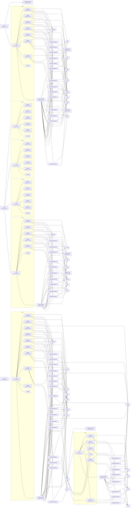

```mermaid
flowchart LR
  subgraph path6 [Path]
    6["Path<br>[1029, 1073, 0]"]
    16["Segment<br>[1081, 1121, 0]"]
    17["Segment<br>[1129, 1175, 0]"]
    22["Segment<br>[1183, 1224, 0]"]
    25["Segment<br>[1232, 1297, 0]"]
    29["Segment<br>[1305, 1312, 0]"]
    56[Solid2d]
  end
  subgraph path7 [Path]
    7["Path<br>[1029, 1073, 0]"]
    15["Segment<br>[1081, 1121, 0]"]
    19["Segment<br>[1129, 1175, 0]"]
    24["Segment<br>[1183, 1224, 0]"]
    26["Segment<br>[1232, 1297, 0]"]
    30["Segment<br>[1305, 1312, 0]"]
    58[Solid2d]
  end
  subgraph path8 [Path]
    8["Path<br>[1029, 1073, 0]"]
    13["Segment<br>[1081, 1121, 0]"]
    20["Segment<br>[1129, 1175, 0]"]
    21["Segment<br>[1183, 1224, 0]"]
    27["Segment<br>[1232, 1297, 0]"]
    32["Segment<br>[1305, 1312, 0]"]
    59[Solid2d]
  end
  subgraph path9 [Path]
    9["Path<br>[1029, 1073, 0]"]
    14["Segment<br>[1081, 1121, 0]"]
    18["Segment<br>[1129, 1175, 0]"]
    23["Segment<br>[1183, 1224, 0]"]
    28["Segment<br>[1232, 1297, 0]"]
    31["Segment<br>[1305, 1312, 0]"]
    60[Solid2d]
  end
  subgraph path10 [Path]
    10["Path<br>[1474, 1531, 0]"]
    33["Segment<br>[1537, 1569, 0]"]
    34["Segment<br>[1575, 1612, 0]"]
    35["Segment<br>[1618, 1651, 0]"]
    36["Segment<br>[1657, 1724, 0]"]
    37["Segment<br>[1730, 1737, 0]"]
    57[Solid2d]
  end
  subgraph path11 [Path]
    11["Path<br>[2768, 2824, 0]"]
    38["Segment<br>[2830, 2889, 0]"]
    39["Segment<br>[2895, 2930, 0]"]
    40["Segment<br>[2936, 2969, 0]"]
    41["Segment<br>[2975, 3034, 0]"]
    42["Segment<br>[3040, 3076, 0]"]
    43["Segment<br>[3082, 3106, 0]"]
    44["Segment<br>[3112, 3119, 0]"]
    54[Solid2d]
  end
  subgraph path12 [Path]
    12["Path<br>[3714, 3764, 0]"]
    45["Segment<br>[3770, 3820, 0]"]
    46["Segment<br>[3826, 3892, 0]"]
    47["Segment<br>[3898, 3949, 0]"]
    48["Segment<br>[3955, 4020, 0]"]
    49["Segment<br>[4026, 4079, 0]"]
    50["Segment<br>[4085, 4152, 0]"]
    51["Segment<br>[4158, 4232, 0]"]
    52["Segment<br>[4238, 4306, 0]"]
    53["Segment<br>[4312, 4319, 0]"]
    55[Solid2d]
  end
  1["Plane<br>[1403, 1420, 0]"]
  2["Plane<br>[2665, 2707, 0]"]
  3["Plane<br>[3640, 3666, 0]"]
  4["StartSketchOnPlane<br>[2651, 2708, 0]"]
  5["StartSketchOnFace<br>[4476, 4515, 0]"]
  61["Sweep Extrusion<br>[2342, 2392, 0]"]
  62["Sweep Extrusion<br>[3153, 3197, 0]"]
  63["Sweep Extrusion<br>[4375, 4417, 0]"]
  64["Sweep Extrusion<br>[4652, 4702, 0]"]
  65[Wall]
  66[Wall]
  67[Wall]
  68[Wall]
  69[Wall]
  70[Wall]
  71[Wall]
  72[Wall]
  73[Wall]
  74[Wall]
  75[Wall]
  76[Wall]
  77[Wall]
  78[Wall]
  79[Wall]
  80[Wall]
  81[Wall]
  82[Wall]
  83[Wall]
  84[Wall]
  85[Wall]
  86[Wall]
  87[Wall]
  88[Wall]
  89["Cap Start"]
  90["Cap Start"]
  91["Cap Start"]
  92["Cap End"]
  93["Cap End"]
  94["Cap End"]
  95["SweepEdge Opposite"]
  96["SweepEdge Opposite"]
  97["SweepEdge Opposite"]
  98["SweepEdge Opposite"]
  99["SweepEdge Opposite"]
  100["SweepEdge Opposite"]
  101["SweepEdge Opposite"]
  102["SweepEdge Opposite"]
  103["SweepEdge Opposite"]
  104["SweepEdge Opposite"]
  105["SweepEdge Opposite"]
  106["SweepEdge Opposite"]
  107["SweepEdge Opposite"]
  108["SweepEdge Opposite"]
  109["SweepEdge Opposite"]
  110["SweepEdge Opposite"]
  111["SweepEdge Opposite"]
  112["SweepEdge Opposite"]
  113["SweepEdge Opposite"]
  114["SweepEdge Opposite"]
  115["SweepEdge Opposite"]
  116["SweepEdge Opposite"]
  117["SweepEdge Opposite"]
  118["SweepEdge Opposite"]
  119["SweepEdge Adjacent"]
  120["SweepEdge Adjacent"]
  121["SweepEdge Adjacent"]
  122["SweepEdge Adjacent"]
  123["SweepEdge Adjacent"]
  124["SweepEdge Adjacent"]
  125["SweepEdge Adjacent"]
  126["SweepEdge Adjacent"]
  127["SweepEdge Adjacent"]
  128["SweepEdge Adjacent"]
  129["SweepEdge Adjacent"]
  130["SweepEdge Adjacent"]
  131["SweepEdge Adjacent"]
  132["SweepEdge Adjacent"]
  133["SweepEdge Adjacent"]
  134["SweepEdge Adjacent"]
  135["SweepEdge Adjacent"]
  136["SweepEdge Adjacent"]
  137["SweepEdge Adjacent"]
  138["SweepEdge Adjacent"]
  139["SweepEdge Adjacent"]
  140["SweepEdge Adjacent"]
  141["SweepEdge Adjacent"]
  142["SweepEdge Adjacent"]
  143["EdgeCut Fillet<br>[2429, 2570, 0]"]
  144["EdgeCut Fillet<br>[2429, 2570, 0]"]
  145["EdgeCut Fillet<br>[3240, 3371, 0]"]
  146["EdgeCut Fillet<br>[3240, 3371, 0]"]
  1 --- 6
  1 --- 8
  1 --- 9
  1 --- 10
  2 <--x 4
  2 --- 11
  3 --- 12
  79 x--> 5
  6 --- 16
  6 --- 17
  6 --- 22
  6 --- 25
  6 --- 29
  6 --- 56
  7 --- 15
  7 --- 19
  7 --- 24
  7 --- 26
  7 --- 30
  7 --- 58
  7 ---- 64
  79 --- 7
  8 --- 13
  8 --- 20
  8 --- 21
  8 --- 27
  8 --- 32
  8 --- 59
  9 --- 14
  9 --- 18
  9 --- 23
  9 --- 28
  9 --- 31
  9 --- 60
  10 --- 33
  10 --- 34
  10 --- 35
  10 --- 36
  10 --- 37
  10 --- 57
  10 ---- 61
  11 --- 38
  11 --- 39
  11 --- 40
  11 --- 41
  11 --- 42
  11 --- 43
  11 --- 44
  11 --- 54
  11 ---- 62
  12 --- 45
  12 --- 46
  12 --- 47
  12 --- 48
  12 --- 49
  12 --- 50
  12 --- 51
  12 --- 52
  12 --- 53
  12 --- 55
  12 ---- 63
  15 x--> 79
  15 --- 87
  15 --- 117
  15 --- 139
  19 x--> 79
  19 --- 85
  19 --- 116
  19 --- 140
  24 x--> 79
  24 --- 88
  24 --- 115
  24 --- 141
  26 x--> 79
  26 --- 86
  26 --- 118
  26 --- 142
  33 --- 84
  33 x--> 91
  33 --- 112
  33 --- 135
  34 --- 82
  34 x--> 91
  34 --- 111
  34 --- 137
  35 --- 81
  35 x--> 91
  35 --- 114
  35 --- 136
  36 --- 83
  36 x--> 91
  36 --- 113
  36 --- 138
  37 --- 80
  37 x--> 91
  37 --- 110
  37 --- 134
  38 --- 70
  38 x--> 89
  38 --- 101
  38 --- 124
  39 --- 67
  39 x--> 89
  39 --- 98
  39 --- 121
  40 --- 71
  40 x--> 89
  40 --- 95
  40 --- 122
  41 --- 69
  41 x--> 89
  41 --- 99
  41 --- 120
  42 --- 65
  42 x--> 89
  42 --- 100
  42 --- 123
  43 --- 68
  43 x--> 89
  43 --- 96
  43 --- 119
  44 --- 66
  44 x--> 89
  44 --- 97
  44 --- 125
  45 --- 76
  45 x--> 93
  45 --- 109
  45 --- 133
  46 --- 74
  46 x--> 93
  46 --- 104
  46 --- 128
  47 --- 75
  47 x--> 93
  47 --- 102
  47 --- 129
  48 --- 73
  48 x--> 93
  48 --- 106
  48 --- 132
  49 --- 72
  49 x--> 93
  49 --- 103
  49 --- 126
  50 --- 77
  50 x--> 93
  50 --- 105
  50 --- 130
  51 --- 79
  51 x--> 93
  51 --- 107
  51 --- 127
  52 --- 78
  52 x--> 93
  52 --- 108
  52 --- 131
  61 --- 80
  61 --- 81
  61 --- 82
  61 --- 83
  61 --- 84
  61 --- 91
  61 --- 94
  61 --- 110
  61 --- 111
  61 --- 112
  61 --- 113
  61 --- 114
  61 --- 134
  61 --- 135
  61 --- 136
  61 --- 137
  61 --- 138
  62 --- 65
  62 --- 66
  62 --- 67
  62 --- 68
  62 --- 69
  62 --- 70
  62 --- 71
  62 --- 89
  62 --- 92
  62 --- 95
  62 --- 96
  62 --- 97
  62 --- 98
  62 --- 99
  62 --- 100
  62 --- 101
  62 --- 119
  62 --- 120
  62 --- 121
  62 --- 122
  62 --- 123
  62 --- 124
  62 --- 125
  63 --- 72
  63 --- 73
  63 --- 74
  63 --- 75
  63 --- 76
  63 --- 77
  63 --- 78
  63 --- 79
  63 --- 90
  63 --- 93
  63 --- 102
  63 --- 103
  63 --- 104
  63 --- 105
  63 --- 106
  63 --- 107
  63 --- 108
  63 --- 109
  63 --- 126
  63 --- 127
  63 --- 128
  63 --- 129
  63 --- 130
  63 --- 131
  63 --- 132
  63 --- 133
  64 --- 85
  64 --- 86
  64 --- 87
  64 --- 88
  64 --- 115
  64 --- 116
  64 --- 117
  64 --- 118
  64 --- 139
  64 --- 140
  64 --- 141
  64 --- 142
  100 <--x 65
  123 <--x 65
  97 <--x 66
  119 <--x 66
  125 <--x 66
  98 <--x 67
  121 <--x 67
  96 <--x 68
  119 <--x 68
  123 <--x 68
  99 <--x 69
  122 <--x 69
  101 <--x 70
  125 <--x 70
  95 <--x 71
  121 <--x 71
  122 <--x 71
  103 <--x 72
  126 <--x 72
  132 <--x 72
  106 <--x 73
  129 <--x 73
  132 <--x 73
  104 <--x 74
  128 <--x 74
  133 <--x 74
  102 <--x 75
  115 <--x 75
  116 <--x 75
  117 <--x 75
  118 <--x 75
  128 <--x 75
  129 <--x 75
  109 <--x 76
  131 <--x 76
  133 <--x 76
  105 <--x 77
  126 <--x 77
  130 <--x 77
  108 <--x 78
  127 <--x 78
  131 <--x 78
  107 <--x 79
  127 <--x 79
  130 <--x 79
  110 <--x 80
  134 <--x 80
  138 <--x 80
  114 <--x 81
  136 <--x 81
  111 <--x 82
  135 <--x 82
  113 <--x 83
  136 <--x 83
  138 <--x 83
  112 <--x 84
  134 <--x 84
  135 <--x 84
  116 <--x 85
  139 <--x 85
  140 <--x 85
  118 <--x 86
  141 <--x 86
  142 <--x 86
  117 <--x 87
  139 <--x 87
  142 <--x 87
  115 <--x 88
  140 <--x 88
  141 <--x 88
  102 <--x 90
  103 <--x 90
  104 <--x 90
  105 <--x 90
  106 <--x 90
  107 <--x 90
  108 <--x 90
  109 <--x 90
  95 <--x 92
  96 <--x 92
  97 <--x 92
  98 <--x 92
  99 <--x 92
  100 <--x 92
  101 <--x 92
  110 <--x 94
  111 <--x 94
  112 <--x 94
  113 <--x 94
  114 <--x 94
  120 <--x 145
  124 <--x 146
  135 <--x 143
  137 <--x 144
```
