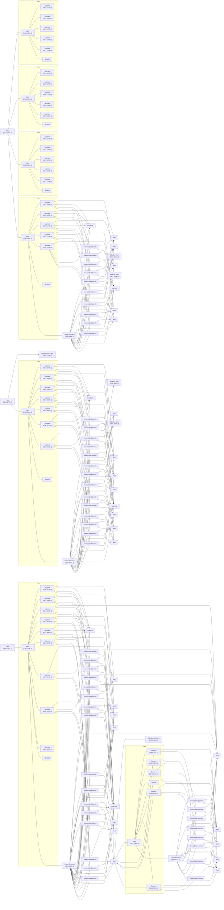

```mermaid
flowchart LR
  subgraph path6 [Path]
    6["Path<br>[1041, 1085, 0]"]
    15["Segment<br>[1093, 1133, 0]"]
    17["Segment<br>[1141, 1187, 0]"]
    23["Segment<br>[1195, 1236, 0]"]
    25["Segment<br>[1244, 1309, 0]"]
    29["Segment<br>[1317, 1324, 0]"]
    55[Solid2d]
  end
  subgraph path7 [Path]
    7["Path<br>[1041, 1085, 0]"]
    16["Segment<br>[1093, 1133, 0]"]
    19["Segment<br>[1141, 1187, 0]"]
    21["Segment<br>[1195, 1236, 0]"]
    28["Segment<br>[1244, 1309, 0]"]
    32["Segment<br>[1317, 1324, 0]"]
    56[Solid2d]
  end
  subgraph path8 [Path]
    8["Path<br>[1041, 1085, 0]"]
    13["Segment<br>[1093, 1133, 0]"]
    20["Segment<br>[1141, 1187, 0]"]
    22["Segment<br>[1195, 1236, 0]"]
    26["Segment<br>[1244, 1309, 0]"]
    31["Segment<br>[1317, 1324, 0]"]
    59[Solid2d]
  end
  subgraph path9 [Path]
    9["Path<br>[1041, 1085, 0]"]
    14["Segment<br>[1093, 1133, 0]"]
    18["Segment<br>[1141, 1187, 0]"]
    24["Segment<br>[1195, 1236, 0]"]
    27["Segment<br>[1244, 1309, 0]"]
    30["Segment<br>[1317, 1324, 0]"]
    60[Solid2d]
  end
  subgraph path10 [Path]
    10["Path<br>[1488, 1545, 0]"]
    33["Segment<br>[1551, 1583, 0]"]
    34["Segment<br>[1589, 1626, 0]"]
    35["Segment<br>[1632, 1665, 0]"]
    36["Segment<br>[1671, 1738, 0]"]
    37["Segment<br>[1744, 1751, 0]"]
    57[Solid2d]
  end
  subgraph path11 [Path]
    11["Path<br>[2784, 2840, 0]"]
    38["Segment<br>[2846, 2905, 0]"]
    39["Segment<br>[2911, 2946, 0]"]
    40["Segment<br>[2952, 2985, 0]"]
    41["Segment<br>[2991, 3050, 0]"]
    42["Segment<br>[3056, 3092, 0]"]
    43["Segment<br>[3098, 3122, 0]"]
    44["Segment<br>[3128, 3135, 0]"]
    58[Solid2d]
  end
  subgraph path12 [Path]
    12["Path<br>[3730, 3780, 0]"]
    45["Segment<br>[3786, 3836, 0]"]
    46["Segment<br>[3842, 3908, 0]"]
    47["Segment<br>[3914, 3965, 0]"]
    48["Segment<br>[3971, 4036, 0]"]
    49["Segment<br>[4042, 4095, 0]"]
    50["Segment<br>[4101, 4168, 0]"]
    51["Segment<br>[4174, 4248, 0]"]
    52["Segment<br>[4254, 4322, 0]"]
    53["Segment<br>[4328, 4335, 0]"]
    54[Solid2d]
  end
  1["Plane<br>[1417, 1434, 0]"]
  2["Plane<br>[2681, 2723, 0]"]
  3["Plane<br>[3656, 3682, 0]"]
  4["StartSketchOnPlane<br>[2667, 2724, 0]"]
  5["StartSketchOnFace<br>[4492, 4531, 0]"]
  61["Sweep Extrusion<br>[2356, 2406, 0]"]
  62["Sweep Extrusion<br>[3169, 3213, 0]"]
  63["Sweep Extrusion<br>[4391, 4433, 0]"]
  64["Sweep Extrusion<br>[4668, 4718, 0]"]
  65[Wall]
  66[Wall]
  67[Wall]
  68[Wall]
  69[Wall]
  70[Wall]
  71[Wall]
  72[Wall]
  73[Wall]
  74[Wall]
  75[Wall]
  76[Wall]
  77[Wall]
  78[Wall]
  79[Wall]
  80[Wall]
  81[Wall]
  82[Wall]
  83[Wall]
  84[Wall]
  85[Wall]
  86[Wall]
  87[Wall]
  88[Wall]
  89["Cap Start"]
  90["Cap Start"]
  91["Cap Start"]
  92["Cap End"]
  93["Cap End"]
  94["Cap End"]
  95["SweepEdge Opposite"]
  96["SweepEdge Adjacent"]
  97["SweepEdge Opposite"]
  98["SweepEdge Adjacent"]
  99["SweepEdge Opposite"]
  100["SweepEdge Adjacent"]
  101["SweepEdge Opposite"]
  102["SweepEdge Adjacent"]
  103["SweepEdge Opposite"]
  104["SweepEdge Adjacent"]
  105["SweepEdge Opposite"]
  106["SweepEdge Adjacent"]
  107["SweepEdge Opposite"]
  108["SweepEdge Adjacent"]
  109["SweepEdge Opposite"]
  110["SweepEdge Adjacent"]
  111["SweepEdge Opposite"]
  112["SweepEdge Adjacent"]
  113["SweepEdge Opposite"]
  114["SweepEdge Adjacent"]
  115["SweepEdge Opposite"]
  116["SweepEdge Adjacent"]
  117["SweepEdge Opposite"]
  118["SweepEdge Adjacent"]
  119["SweepEdge Opposite"]
  120["SweepEdge Adjacent"]
  121["SweepEdge Opposite"]
  122["SweepEdge Adjacent"]
  123["SweepEdge Opposite"]
  124["SweepEdge Adjacent"]
  125["SweepEdge Opposite"]
  126["SweepEdge Adjacent"]
  127["SweepEdge Opposite"]
  128["SweepEdge Adjacent"]
  129["SweepEdge Opposite"]
  130["SweepEdge Adjacent"]
  131["SweepEdge Opposite"]
  132["SweepEdge Adjacent"]
  133["SweepEdge Opposite"]
  134["SweepEdge Adjacent"]
  135["SweepEdge Opposite"]
  136["SweepEdge Adjacent"]
  137["SweepEdge Opposite"]
  138["SweepEdge Adjacent"]
  139["SweepEdge Opposite"]
  140["SweepEdge Adjacent"]
  141["SweepEdge Opposite"]
  142["SweepEdge Adjacent"]
  143["EdgeCut Fillet<br>[2443, 2584, 0]"]
  144["EdgeCut Fillet<br>[2443, 2584, 0]"]
  145["EdgeCut Fillet<br>[3256, 3387, 0]"]
  146["EdgeCut Fillet<br>[3256, 3387, 0]"]
  1 --- 6
  1 --- 8
  1 --- 9
  1 --- 10
  2 <--x 4
  2 --- 11
  3 --- 12
  81 x--> 5
  6 --- 15
  6 --- 17
  6 --- 23
  6 --- 25
  6 --- 29
  6 --- 55
  7 --- 16
  7 --- 19
  7 --- 21
  7 --- 28
  7 --- 32
  7 --- 56
  7 ---- 64
  81 --- 7
  8 --- 13
  8 --- 20
  8 --- 22
  8 --- 26
  8 --- 31
  8 --- 59
  9 --- 14
  9 --- 18
  9 --- 24
  9 --- 27
  9 --- 30
  9 --- 60
  10 --- 33
  10 --- 34
  10 --- 35
  10 --- 36
  10 --- 37
  10 --- 57
  10 ---- 61
  11 --- 38
  11 --- 39
  11 --- 40
  11 --- 41
  11 --- 42
  11 --- 43
  11 --- 44
  11 --- 58
  11 ---- 62
  12 --- 45
  12 --- 46
  12 --- 47
  12 --- 48
  12 --- 49
  12 --- 50
  12 --- 51
  12 --- 52
  12 --- 53
  12 --- 54
  12 ---- 63
  16 --- 73
  16 x--> 81
  16 --- 111
  16 --- 112
  19 --- 71
  19 x--> 81
  19 --- 107
  19 --- 108
  21 --- 70
  21 x--> 81
  21 --- 105
  21 --- 106
  28 --- 72
  28 x--> 81
  28 --- 109
  28 --- 110
  33 --- 69
  33 x--> 89
  33 --- 103
  33 --- 104
  34 --- 67
  34 x--> 89
  34 --- 99
  34 --- 100
  35 --- 66
  35 x--> 89
  35 --- 97
  35 --- 98
  36 --- 68
  36 x--> 89
  36 --- 101
  36 --- 102
  37 --- 65
  37 x--> 89
  37 --- 95
  37 --- 96
  38 --- 85
  38 x--> 91
  38 --- 135
  38 --- 136
  39 --- 88
  39 x--> 91
  39 --- 141
  39 --- 142
  40 --- 87
  40 x--> 91
  40 --- 139
  40 --- 140
  41 --- 82
  41 x--> 91
  41 --- 129
  41 --- 130
  42 --- 86
  42 x--> 91
  42 --- 137
  42 --- 138
  43 --- 84
  43 x--> 91
  43 --- 133
  43 --- 134
  44 --- 83
  44 x--> 91
  44 --- 131
  44 --- 132
  45 --- 78
  45 x--> 93
  45 --- 123
  45 --- 124
  46 --- 77
  46 x--> 93
  46 --- 119
  46 --- 120
  47 --- 75
  47 x--> 93
  47 --- 115
  47 --- 116
  48 --- 79
  48 x--> 93
  48 --- 125
  48 --- 126
  49 --- 74
  49 x--> 93
  49 --- 113
  49 --- 114
  50 --- 80
  50 x--> 93
  50 --- 127
  50 --- 128
  51 --- 81
  51 x--> 93
  51 --- 121
  51 --- 122
  52 --- 76
  52 x--> 93
  52 --- 117
  52 --- 118
  61 --- 65
  61 --- 66
  61 --- 67
  61 --- 68
  61 --- 69
  61 --- 89
  61 --- 92
  61 --- 95
  61 --- 96
  61 --- 97
  61 --- 98
  61 --- 99
  61 --- 100
  61 --- 101
  61 --- 102
  61 --- 103
  61 --- 104
  62 --- 82
  62 --- 83
  62 --- 84
  62 --- 85
  62 --- 86
  62 --- 87
  62 --- 88
  62 --- 91
  62 --- 94
  62 --- 129
  62 --- 130
  62 --- 131
  62 --- 132
  62 --- 133
  62 --- 134
  62 --- 135
  62 --- 136
  62 --- 137
  62 --- 138
  62 --- 139
  62 --- 140
  62 --- 141
  62 --- 142
  63 --- 74
  63 --- 75
  63 --- 76
  63 --- 77
  63 --- 78
  63 --- 79
  63 --- 80
  63 --- 81
  63 --- 90
  63 --- 93
  63 --- 113
  63 --- 114
  63 --- 115
  63 --- 116
  63 --- 117
  63 --- 118
  63 --- 119
  63 --- 120
  63 --- 121
  63 --- 122
  63 --- 123
  63 --- 124
  63 --- 125
  63 --- 126
  63 --- 127
  63 --- 128
  64 --- 70
  64 --- 71
  64 --- 72
  64 --- 73
  64 --- 105
  64 --- 106
  64 --- 107
  64 --- 108
  64 --- 109
  64 --- 110
  64 --- 111
  64 --- 112
  95 <--x 65
  96 <--x 65
  102 <--x 65
  97 <--x 66
  98 <--x 66
  100 <--x 66
  99 <--x 67
  100 <--x 67
  104 <--x 67
  98 <--x 68
  101 <--x 68
  102 <--x 68
  96 <--x 69
  103 <--x 69
  104 <--x 69
  105 <--x 70
  106 <--x 70
  108 <--x 70
  107 <--x 71
  108 <--x 71
  112 <--x 71
  106 <--x 72
  109 <--x 72
  110 <--x 72
  110 <--x 73
  111 <--x 73
  112 <--x 73
  113 <--x 74
  114 <--x 74
  126 <--x 74
  105 <--x 75
  107 <--x 75
  109 <--x 75
  111 <--x 75
  115 <--x 75
  116 <--x 75
  120 <--x 75
  117 <--x 76
  118 <--x 76
  122 <--x 76
  119 <--x 77
  120 <--x 77
  124 <--x 77
  118 <--x 78
  123 <--x 78
  124 <--x 78
  116 <--x 79
  125 <--x 79
  126 <--x 79
  114 <--x 80
  127 <--x 80
  128 <--x 80
  121 <--x 81
  122 <--x 81
  128 <--x 81
  129 <--x 82
  140 <--x 82
  131 <--x 83
  132 <--x 83
  134 <--x 83
  133 <--x 84
  134 <--x 84
  138 <--x 84
  132 <--x 85
  135 <--x 85
  136 <--x 85
  137 <--x 86
  138 <--x 86
  139 <--x 87
  140 <--x 87
  142 <--x 87
  136 <--x 88
  141 <--x 88
  142 <--x 88
  113 <--x 90
  115 <--x 90
  117 <--x 90
  119 <--x 90
  121 <--x 90
  123 <--x 90
  125 <--x 90
  127 <--x 90
  95 <--x 92
  97 <--x 92
  99 <--x 92
  101 <--x 92
  103 <--x 92
  129 <--x 94
  131 <--x 94
  133 <--x 94
  135 <--x 94
  137 <--x 94
  139 <--x 94
  141 <--x 94
  100 <--x 143
  104 <--x 144
  130 <--x 146
  136 <--x 145
```
