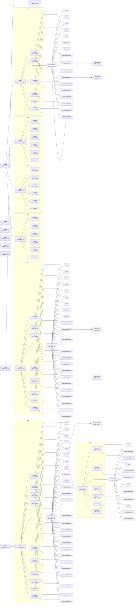

```mermaid
flowchart LR
  subgraph path7 [Path]
    7["Path<br>[1497, 1547, 0]"]
    8["Segment<br>[1553, 1585, 0]"]
    9["Segment<br>[1591, 1628, 0]"]
    10["Segment<br>[1634, 1667, 0]"]
    11["Segment<br>[1673, 1773, 0]"]
    12["Segment<br>[1779, 1786, 0]"]
    13[Solid2d]
  end
  subgraph path14 [Path]
    14["Path<br>[1020, 1061, 0]"]
    15["Segment<br>[1069, 1126, 0]"]
    16["Segment<br>[1134, 1197, 0]"]
    17["Segment<br>[1205, 1263, 0]"]
    18["Segment<br>[1271, 1336, 0]"]
    19["Segment<br>[1344, 1351, 0]"]
    20[Solid2d]
  end
  subgraph path21 [Path]
    21["Path<br>[1020, 1061, 0]"]
    22["Segment<br>[1069, 1126, 0]"]
    23["Segment<br>[1134, 1197, 0]"]
    24["Segment<br>[1205, 1263, 0]"]
    25["Segment<br>[1271, 1336, 0]"]
    26["Segment<br>[1344, 1351, 0]"]
    27[Solid2d]
  end
  subgraph path28 [Path]
    28["Path<br>[1020, 1061, 0]"]
    29["Segment<br>[1069, 1126, 0]"]
    30["Segment<br>[1134, 1197, 0]"]
    31["Segment<br>[1205, 1263, 0]"]
    32["Segment<br>[1271, 1336, 0]"]
    33["Segment<br>[1344, 1351, 0]"]
    34[Solid2d]
  end
  subgraph path54 [Path]
    54["Path<br>[2775, 2825, 0]"]
    55["Segment<br>[2831, 2890, 0]"]
    56["Segment<br>[2896, 2931, 0]"]
    57["Segment<br>[2937, 2970, 0]"]
    58["Segment<br>[2976, 3035, 0]"]
    59["Segment<br>[3041, 3077, 0]"]
    60["Segment<br>[3083, 3107, 0]"]
    61["Segment<br>[3113, 3120, 0]"]
    62[Solid2d]
  end
  subgraph path88 [Path]
    88["Path<br>[3748, 3794, 0]"]
    89["Segment<br>[3800, 3850, 0]"]
    90["Segment<br>[3856, 3955, 0]"]
    91["Segment<br>[3961, 4012, 0]"]
    92["Segment<br>[4018, 4116, 0]"]
    93["Segment<br>[4122, 4175, 0]"]
    94["Segment<br>[4181, 4281, 0]"]
    95["Segment<br>[4287, 4361, 0]"]
    96["Segment<br>[4367, 4468, 0]"]
    97["Segment<br>[4474, 4481, 0]"]
    98[Solid2d]
  end
  subgraph path126 [Path]
    126["Path<br>[1020, 1061, 0]"]
    127["Segment<br>[1069, 1126, 0]"]
    128["Segment<br>[1134, 1197, 0]"]
    129["Segment<br>[1205, 1263, 0]"]
    130["Segment<br>[1271, 1336, 0]"]
    131["Segment<br>[1344, 1351, 0]"]
    132[Solid2d]
  end
  1["Plane<br>[1424, 1443, 0]"]
  2["Plane<br>[1424, 1443, 0]"]
  3["Plane<br>[1424, 1443, 0]"]
  4["Plane<br>[1424, 1443, 0]"]
  5["Plane<br>[1424, 1443, 0]"]
  6["Plane<br>[1424, 1443, 0]"]
  35["Sweep Extrusion<br>[2349, 2399, 0]"]
  36[Wall]
  37[Wall]
  38[Wall]
  39[Wall]
  40[Wall]
  41["Cap Start"]
  42["Cap End"]
  43["SweepEdge Opposite"]
  44["SweepEdge Adjacent"]
  45["SweepEdge Opposite"]
  46["SweepEdge Adjacent"]
  47["SweepEdge Opposite"]
  48["SweepEdge Adjacent"]
  49["SweepEdge Opposite"]
  50["SweepEdge Adjacent"]
  51["SweepEdge Opposite"]
  52["SweepEdge Adjacent"]
  53["Plane<br>[2670, 2714, 0]"]
  63["Sweep Extrusion<br>[3165, 3209, 0]"]
  64[Wall]
  65[Wall]
  66[Wall]
  67[Wall]
  68[Wall]
  69[Wall]
  70[Wall]
  71["Cap Start"]
  72["Cap End"]
  73["SweepEdge Opposite"]
  74["SweepEdge Adjacent"]
  75["SweepEdge Opposite"]
  76["SweepEdge Adjacent"]
  77["SweepEdge Opposite"]
  78["SweepEdge Adjacent"]
  79["SweepEdge Opposite"]
  80["SweepEdge Adjacent"]
  81["SweepEdge Opposite"]
  82["SweepEdge Adjacent"]
  83["SweepEdge Opposite"]
  84["SweepEdge Adjacent"]
  85["SweepEdge Opposite"]
  86["SweepEdge Adjacent"]
  87["Plane<br>[3674, 3700, 0]"]
  99["Sweep Extrusion<br>[4537, 4579, 0]"]
  100[Wall]
  101[Wall]
  102[Wall]
  103[Wall]
  104[Wall]
  105[Wall]
  106[Wall]
  107[Wall]
  108["Cap Start"]
  109["Cap End"]
  110["SweepEdge Opposite"]
  111["SweepEdge Adjacent"]
  112["SweepEdge Opposite"]
  113["SweepEdge Adjacent"]
  114["SweepEdge Opposite"]
  115["SweepEdge Adjacent"]
  116["SweepEdge Opposite"]
  117["SweepEdge Adjacent"]
  118["SweepEdge Opposite"]
  119["SweepEdge Adjacent"]
  120["SweepEdge Opposite"]
  121["SweepEdge Adjacent"]
  122["SweepEdge Opposite"]
  123["SweepEdge Adjacent"]
  124["SweepEdge Opposite"]
  125["SweepEdge Adjacent"]
  133["Sweep Extrusion<br>[4805, 4853, 0]"]
  134[Wall]
  135[Wall]
  136[Wall]
  137[Wall]
  138["SweepEdge Opposite"]
  139["SweepEdge Adjacent"]
  140["SweepEdge Opposite"]
  141["SweepEdge Adjacent"]
  142["SweepEdge Opposite"]
  143["SweepEdge Adjacent"]
  144["SweepEdge Opposite"]
  145["SweepEdge Adjacent"]
  146["EdgeCut Fillet<br>[2436, 2576, 0]"]
  147["EdgeCut Fillet<br>[2436, 2576, 0]"]
  148["EdgeCut Fillet<br>[3252, 3382, 0]"]
  149["EdgeCut Fillet<br>[3252, 3382, 0]"]
  150["StartSketchOnPlane<br>[2656, 2715, 0]"]
  151["StartSketchOnFace<br>[4637, 4669, 0]"]
  1 --- 7
  1 --- 14
  1 --- 21
  1 --- 28
  7 --- 8
  7 --- 9
  7 --- 10
  7 --- 11
  7 --- 12
  7 ---- 35
  7 --- 13
  8 --- 36
  8 --- 43
  8 --- 44
  9 --- 37
  9 --- 45
  9 --- 46
  10 --- 38
  10 --- 47
  10 --- 48
  11 --- 39
  11 --- 49
  11 --- 50
  12 --- 40
  12 --- 51
  12 --- 52
  14 --- 15
  14 --- 16
  14 --- 17
  14 --- 18
  14 --- 19
  14 --- 20
  21 --- 22
  21 --- 23
  21 --- 24
  21 --- 25
  21 --- 26
  21 --- 27
  28 --- 29
  28 --- 30
  28 --- 31
  28 --- 32
  28 --- 33
  28 --- 34
  35 --- 36
  35 --- 37
  35 --- 38
  35 --- 39
  35 --- 40
  35 --- 41
  35 --- 42
  35 --- 43
  35 --- 44
  35 --- 45
  35 --- 46
  35 --- 47
  35 --- 48
  35 --- 49
  35 --- 50
  35 --- 51
  35 --- 52
  53 --- 54
  54 --- 55
  54 --- 56
  54 --- 57
  54 --- 58
  54 --- 59
  54 --- 60
  54 --- 61
  54 ---- 63
  54 --- 62
  55 --- 64
  55 --- 73
  55 --- 74
  56 --- 65
  56 --- 75
  56 --- 76
  57 --- 66
  57 --- 77
  57 --- 78
  58 --- 67
  58 --- 79
  58 --- 80
  59 --- 68
  59 --- 81
  59 --- 82
  60 --- 69
  60 --- 83
  60 --- 84
  61 --- 70
  61 --- 85
  61 --- 86
  63 --- 64
  63 --- 65
  63 --- 66
  63 --- 67
  63 --- 68
  63 --- 69
  63 --- 70
  63 --- 71
  63 --- 72
  63 --- 73
  63 --- 74
  63 --- 75
  63 --- 76
  63 --- 77
  63 --- 78
  63 --- 79
  63 --- 80
  63 --- 81
  63 --- 82
  63 --- 83
  63 --- 84
  63 --- 85
  63 --- 86
  87 --- 88
  88 --- 89
  88 --- 90
  88 --- 91
  88 --- 92
  88 --- 93
  88 --- 94
  88 --- 95
  88 --- 96
  88 --- 97
  88 ---- 99
  88 --- 98
  89 --- 100
  89 --- 110
  89 --- 111
  90 --- 101
  90 --- 112
  90 --- 113
  91 --- 102
  91 --- 114
  91 --- 115
  92 --- 103
  92 --- 116
  92 --- 117
  93 --- 104
  93 --- 118
  93 --- 119
  94 --- 105
  94 --- 120
  94 --- 121
  95 --- 106
  95 --- 122
  95 --- 123
  96 --- 107
  96 --- 124
  96 --- 125
  99 --- 100
  99 --- 101
  99 --- 102
  99 --- 103
  99 --- 104
  99 --- 105
  99 --- 106
  99 --- 107
  99 --- 108
  99 --- 109
  99 --- 110
  99 --- 111
  99 --- 112
  99 --- 113
  99 --- 114
  99 --- 115
  99 --- 116
  99 --- 117
  99 --- 118
  99 --- 119
  99 --- 120
  99 --- 121
  99 --- 122
  99 --- 123
  99 --- 124
  99 --- 125
  106 --- 126
  126 --- 127
  126 --- 128
  126 --- 129
  126 --- 130
  126 --- 131
  126 ---- 133
  126 --- 132
  127 --- 134
  127 --- 138
  127 --- 139
  128 --- 135
  128 --- 140
  128 --- 141
  129 --- 136
  129 --- 142
  129 --- 143
  130 --- 137
  130 --- 144
  130 --- 145
  133 --- 134
  133 --- 135
  133 --- 136
  133 --- 137
  133 --- 138
  133 --- 139
  133 --- 140
  133 --- 141
  133 --- 142
  133 --- 143
  133 --- 144
  133 --- 145
  46 <--x 146
  44 <--x 147
  74 <--x 148
  80 <--x 149
  53 <--x 150
  106 <--x 151
```
