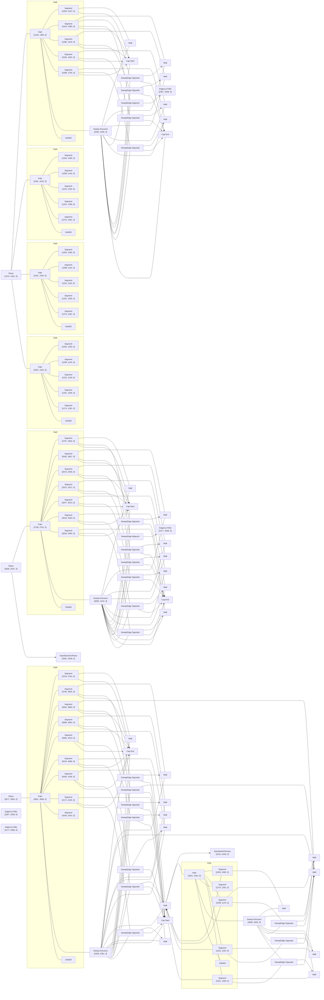

```mermaid
flowchart LR
  subgraph path2 [Path]
    2["Path<br>[1445, 1499, 0]"]
    3["Segment<br>[1505, 1537, 0]"]
    4["Segment<br>[1543, 1580, 0]"]
    5["Segment<br>[1586, 1619, 0]"]
    6["Segment<br>[1625, 1692, 0]"]
    7["Segment<br>[1698, 1705, 0]"]
    8[Solid2d]
  end
  subgraph path9 [Path]
    9["Path<br>[1001, 1042, 0]"]
    10["Segment<br>[1050, 1090, 0]"]
    11["Segment<br>[1098, 1144, 0]"]
    12["Segment<br>[1152, 1193, 0]"]
    13["Segment<br>[1201, 1266, 0]"]
    14["Segment<br>[1274, 1281, 0]"]
    15[Solid2d]
  end
  subgraph path16 [Path]
    16["Path<br>[1001, 1042, 0]"]
    17["Segment<br>[1050, 1090, 0]"]
    18["Segment<br>[1098, 1144, 0]"]
    19["Segment<br>[1152, 1193, 0]"]
    20["Segment<br>[1201, 1266, 0]"]
    21["Segment<br>[1274, 1281, 0]"]
    22[Solid2d]
  end
  subgraph path23 [Path]
    23["Path<br>[1001, 1042, 0]"]
    24["Segment<br>[1050, 1090, 0]"]
    25["Segment<br>[1098, 1144, 0]"]
    26["Segment<br>[1152, 1193, 0]"]
    27["Segment<br>[1201, 1266, 0]"]
    28["Segment<br>[1274, 1281, 0]"]
    29[Solid2d]
  end
  subgraph path44 [Path]
    44["Path<br>[2708, 2761, 0]"]
    45["Segment<br>[2767, 2826, 0]"]
    46["Segment<br>[2832, 2867, 0]"]
    47["Segment<br>[2873, 2906, 0]"]
    48["Segment<br>[2912, 2971, 0]"]
    49["Segment<br>[2977, 3013, 0]"]
    50["Segment<br>[3019, 3043, 0]"]
    51["Segment<br>[3049, 3056, 0]"]
    52[Solid2d]
  end
  subgraph path71 [Path]
    71["Path<br>[3651, 3698, 0]"]
    72["Segment<br>[3704, 3754, 0]"]
    73["Segment<br>[3760, 3826, 0]"]
    74["Segment<br>[3832, 3883, 0]"]
    75["Segment<br>[3889, 3954, 0]"]
    76["Segment<br>[3960, 4013, 0]"]
    77["Segment<br>[4019, 4086, 0]"]
    78["Segment<br>[4092, 4166, 0]"]
    79["Segment<br>[4172, 4240, 0]"]
    80["Segment<br>[4246, 4253, 0]"]
    81[Solid2d]
  end
  subgraph path100 [Path]
    100["Path<br>[1001, 1042, 0]"]
    101["Segment<br>[1050, 1090, 0]"]
    102["Segment<br>[1098, 1144, 0]"]
    103["Segment<br>[1152, 1193, 0]"]
    104["Segment<br>[1201, 1266, 0]"]
    105["Segment<br>[1274, 1281, 0]"]
    106[Solid2d]
  end
  1["Plane<br>[1374, 1391, 0]"]
  30["Sweep Extrusion<br>[2280, 2330, 0]"]
  31[Wall]
  32[Wall]
  33[Wall]
  34[Wall]
  35[Wall]
  36["Cap Start"]
  37["Cap End"]
  38["SweepEdge Opposite"]
  39["SweepEdge Opposite"]
  40["SweepEdge Opposite"]
  41["SweepEdge Opposite"]
  42["SweepEdge Adjacent"]
  43["Plane<br>[2605, 2647, 0]"]
  53["Sweep Extrusion<br>[3090, 3134, 0]"]
  54[Wall]
  55[Wall]
  56[Wall]
  57[Wall]
  58[Wall]
  59[Wall]
  60[Wall]
  61["Cap Start"]
  62["Cap End"]
  63["SweepEdge Opposite"]
  64["SweepEdge Opposite"]
  65["SweepEdge Opposite"]
  66["SweepEdge Opposite"]
  67["SweepEdge Opposite"]
  68["SweepEdge Opposite"]
  69["SweepEdge Adjacent"]
  70["Plane<br>[3577, 3603, 0]"]
  82["Sweep Extrusion<br>[4309, 4351, 0]"]
  83[Wall]
  84[Wall]
  85[Wall]
  86[Wall]
  87[Wall]
  88[Wall]
  89[Wall]
  90[Wall]
  91["Cap Start"]
  92["Cap End"]
  93["SweepEdge Opposite"]
  94["SweepEdge Opposite"]
  95["SweepEdge Opposite"]
  96["SweepEdge Opposite"]
  97["SweepEdge Opposite"]
  98["SweepEdge Opposite"]
  99["SweepEdge Opposite"]
  107["Sweep Extrusion<br>[4586, 4636, 0]"]
  108[Wall]
  109[Wall]
  110[Wall]
  111[Wall]
  112["SweepEdge Opposite"]
  113["SweepEdge Opposite"]
  114["SweepEdge Opposite"]
  115["EdgeCut Fillet<br>[2367, 2508, 0]"]
  116["EdgeCut Fillet<br>[2367, 2508, 0]"]
  117["EdgeCut Fillet<br>[3177, 3308, 0]"]
  118["EdgeCut Fillet<br>[3177, 3308, 0]"]
  119["StartSketchOnPlane<br>[2591, 2648, 0]"]
  120["StartSketchOnFace<br>[4410, 4449, 0]"]
  1 --- 2
  1 --- 9
  1 --- 16
  1 --- 23
  2 --- 3
  2 --- 4
  2 --- 5
  2 --- 6
  2 --- 7
  2 ---- 30
  2 --- 8
  3 --- 31
  3 x--> 36
  4 --- 32
  4 --- 38
  4 --- 42
  4 x--> 36
  5 --- 33
  5 --- 39
  5 x--> 36
  6 --- 34
  6 --- 40
  6 x--> 36
  7 --- 35
  7 --- 41
  7 x--> 36
  9 --- 10
  9 --- 11
  9 --- 12
  9 --- 13
  9 --- 14
  9 --- 15
  16 --- 17
  16 --- 18
  16 --- 19
  16 --- 20
  16 --- 21
  16 --- 22
  23 --- 24
  23 --- 25
  23 --- 26
  23 --- 27
  23 --- 28
  23 --- 29
  30 --- 31
  30 --- 32
  30 --- 33
  30 --- 34
  30 --- 35
  30 --- 36
  30 --- 37
  30 --- 38
  30 --- 39
  30 --- 40
  30 --- 41
  30 --- 42
  38 <--x 32
  38 <--x 37
  39 <--x 33
  39 <--x 37
  40 <--x 34
  40 <--x 37
  41 <--x 35
  41 <--x 37
  43 --- 44
  44 --- 45
  44 --- 46
  44 --- 47
  44 --- 48
  44 --- 49
  44 --- 50
  44 --- 51
  44 ---- 53
  44 --- 52
  45 --- 54
  45 --- 69
  45 x--> 61
  46 --- 55
  46 --- 63
  46 x--> 61
  47 --- 56
  47 --- 64
  47 x--> 61
  48 --- 57
  48 --- 65
  48 x--> 61
  49 --- 58
  49 --- 66
  49 x--> 61
  50 --- 59
  50 --- 67
  50 x--> 61
  51 --- 60
  51 --- 68
  51 x--> 61
  53 --- 54
  53 --- 55
  53 --- 56
  53 --- 57
  53 --- 58
  53 --- 59
  53 --- 60
  53 --- 61
  53 --- 62
  53 --- 63
  53 --- 64
  53 --- 65
  53 --- 66
  53 --- 67
  53 --- 68
  53 --- 69
  63 <--x 55
  63 <--x 62
  64 <--x 56
  64 <--x 62
  65 <--x 57
  65 <--x 62
  66 <--x 58
  66 <--x 62
  67 <--x 59
  67 <--x 62
  68 <--x 60
  68 <--x 62
  70 --- 71
  71 --- 72
  71 --- 73
  71 --- 74
  71 --- 75
  71 --- 76
  71 --- 77
  71 --- 78
  71 --- 79
  71 --- 80
  71 ---- 82
  71 --- 81
  72 --- 83
  72 x--> 92
  73 --- 84
  73 --- 93
  73 x--> 92
  74 --- 85
  74 --- 94
  74 x--> 92
  75 --- 86
  75 --- 95
  75 x--> 92
  76 --- 87
  76 --- 96
  76 x--> 92
  77 --- 88
  77 --- 97
  77 x--> 92
  78 --- 89
  78 --- 98
  78 x--> 92
  79 --- 90
  79 --- 99
  79 x--> 92
  82 --- 83
  82 --- 84
  82 --- 85
  82 --- 86
  82 --- 87
  82 --- 88
  82 --- 89
  82 --- 90
  82 --- 91
  82 --- 92
  82 --- 93
  82 --- 94
  82 --- 95
  82 --- 96
  82 --- 97
  82 --- 98
  82 --- 99
  89 --- 100
  93 <--x 84
  93 <--x 91
  94 <--x 85
  94 <--x 91
  95 <--x 86
  95 <--x 91
  96 <--x 87
  96 <--x 91
  97 <--x 88
  97 <--x 91
  98 <--x 89
  98 <--x 91
  99 <--x 90
  99 <--x 91
  100 --- 101
  100 --- 102
  100 --- 103
  100 --- 104
  100 --- 105
  100 ---- 107
  100 --- 106
  101 --- 108
  101 <--x 89
  102 --- 109
  102 --- 112
  102 <--x 89
  103 --- 110
  103 --- 113
  103 <--x 89
  104 --- 111
  104 --- 114
  104 <--x 89
  107 --- 108
  107 --- 109
  107 --- 110
  107 --- 111
  107 --- 112
  107 --- 113
  107 --- 114
  112 <--x 109
  112 <--x 85
  113 <--x 110
  113 <--x 85
  114 <--x 111
  114 <--x 85
  42 <--x 115
  69 <--x 117
  43 <--x 119
  89 <--x 120
```
