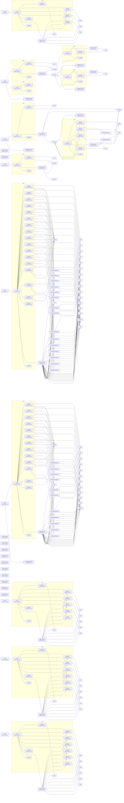

```mermaid
flowchart LR
  subgraph path2 [Path]
    2["Path<br>[265, 309, 0]"]
    3["Segment<br>[315, 379, 0]"]
    4["Segment<br>[385, 483, 0]"]
    5["Segment<br>[489, 606, 0]"]
    6["Segment<br>[612, 668, 0]"]
    7["Segment<br>[674, 681, 0]"]
    8[Solid2d]
  end
  subgraph path15 [Path]
    15["Path<br>[971, 1015, 0]"]
    16["Segment<br>[1021, 1040, 0]"]
    17["Segment<br>[1046, 1080, 0]"]
    18["Segment<br>[1086, 1137, 0]"]
    19["Segment<br>[1143, 1194, 0]"]
    20["Segment<br>[1200, 1251, 0]"]
    21["Segment<br>[1257, 1315, 0]"]
    22["Segment<br>[1321, 1370, 0]"]
    23["Segment<br>[1376, 1416, 0]"]
    24["Segment<br>[1422, 1441, 0]"]
    25["Segment<br>[1447, 1500, 0]"]
    26["Segment<br>[1506, 1555, 0]"]
    27["Segment<br>[1561, 1631, 0]"]
    28["Segment<br>[1637, 1688, 0]"]
    29["Segment<br>[1694, 1764, 0]"]
    30["Segment<br>[1770, 1821, 0]"]
    31["Segment<br>[1827, 1883, 0]"]
    32["Segment<br>[1889, 1896, 0]"]
    33[Solid2d]
  end
  subgraph path69 [Path]
    69["Path<br>[2163, 2222, 0]"]
    70["Segment<br>[2163, 2222, 0]"]
    71[Solid2d]
  end
  subgraph path76 [Path]
    76["Path<br>[2328, 2358, 0]"]
    77["Segment<br>[2364, 2383, 0]"]
    78["Segment<br>[2389, 2439, 0]"]
    79["Segment<br>[2445, 2501, 0]"]
    80["Segment<br>[2507, 2514, 0]"]
    81[Solid2d]
  end
  subgraph path91 [Path]
    91["Path<br>[2752, 2783, 0]"]
    92["Segment<br>[2789, 2834, 0]"]
    93["Segment<br>[2840, 2917, 0]"]
    94["Segment<br>[2923, 2962, 0]"]
    95["Segment<br>[2968, 3014, 0]"]
    96["Segment<br>[3020, 3045, 0]"]
    97["Segment<br>[3051, 3107, 0]"]
    98["Segment<br>[3113, 3120, 0]"]
    99[Solid2d]
  end
  subgraph path108 [Path]
    108["Path<br>[3200, 3227, 0]"]
    109["Segment<br>[3233, 3253, 0]"]
    110["Segment<br>[3259, 3302, 0]"]
    111["Segment<br>[3308, 3326, 0]"]
    112["Segment<br>[3332, 3352, 0]"]
    113["Segment<br>[3358, 3378, 0]"]
    114["Segment<br>[3384, 3424, 0]"]
    115["Segment<br>[3430, 3486, 0]"]
    116["Segment<br>[3492, 3499, 0]"]
    117[Solid2d]
  end
  subgraph path127 [Path]
    127["Path<br>[3603, 3662, 0]"]
    128["Segment<br>[3603, 3662, 0]"]
    129[Solid2d]
  end
  subgraph path130 [Path]
    130["Path<br>[3673, 3710, 0]"]
    131["Segment<br>[3673, 3710, 0]"]
    132[Solid2d]
  end
  subgraph path137 [Path]
    137["Path<br>[3857, 3895, 0]"]
    138["Segment<br>[3857, 3895, 0]"]
    139[Solid2d]
  end
  subgraph path149 [Path]
    149["Path<br>[4173, 4211, 0]"]
    150["Segment<br>[4173, 4211, 0]"]
    151[Solid2d]
  end
  subgraph path158 [Path]
    158["Path<br>[4463, 4515, 0]"]
    159["Segment<br>[4463, 4515, 0]"]
    160[Solid2d]
  end
  subgraph path166 [Path]
    166["Path<br>[4760, 4804, 0]"]
    167["Segment<br>[4810, 4850, 0]"]
    168["Segment<br>[4856, 4875, 0]"]
    169["Segment<br>[4881, 4900, 0]"]
    170["Segment<br>[4906, 4925, 0]"]
    171["Segment<br>[4931, 4956, 0]"]
    172["Segment<br>[4962, 5070, 0]"]
    173["Segment<br>[5076, 5132, 0]"]
    174["Segment<br>[5138, 5145, 0]"]
    175[Solid2d]
  end
  subgraph path185 [Path]
    185["Path<br>[5275, 5304, 0]"]
    186["Segment<br>[5310, 5331, 0]"]
    187["Segment<br>[5337, 5377, 0]"]
    188["Segment<br>[5383, 5423, 0]"]
    189["Segment<br>[5429, 5470, 0]"]
    190["Segment<br>[5476, 5498, 0]"]
    191["Segment<br>[5504, 5525, 0]"]
    192["Segment<br>[5531, 5556, 0]"]
    193["Segment<br>[5562, 5602, 0]"]
    194["Segment<br>[5608, 5649, 0]"]
    195["Segment<br>[5655, 5696, 0]"]
    196["Segment<br>[5702, 5723, 0]"]
    197["Segment<br>[5729, 5785, 0]"]
    198["Segment<br>[5791, 5798, 0]"]
    199[Solid2d]
  end
  1["Plane<br>[242, 259, 0]"]
  9["Sweep Revolve<br>[687, 717, 0]"]
  10[Wall]
  11[Wall]
  12[Wall]
  13[Wall]
  14["Plane<br>[942, 965, 0]"]
  34["Sweep Extrusion<br>[1902, 1924, 0]"]
  35[Wall]
  36[Wall]
  37[Wall]
  38[Wall]
  39[Wall]
  40[Wall]
  41[Wall]
  42[Wall]
  43[Wall]
  44[Wall]
  45[Wall]
  46[Wall]
  47[Wall]
  48[Wall]
  49[Wall]
  50[Wall]
  51["Cap Start"]
  52["Cap End"]
  53["SweepEdge Opposite"]
  54["SweepEdge Opposite"]
  55["SweepEdge Opposite"]
  56["SweepEdge Opposite"]
  57["SweepEdge Opposite"]
  58["SweepEdge Opposite"]
  59["SweepEdge Opposite"]
  60["SweepEdge Opposite"]
  61["SweepEdge Opposite"]
  62["SweepEdge Opposite"]
  63["SweepEdge Opposite"]
  64["SweepEdge Opposite"]
  65["SweepEdge Opposite"]
  66["SweepEdge Opposite"]
  67["SweepEdge Opposite"]
  68["Plane<br>[2129, 2156, 0]"]
  72["Sweep Extrusion<br>[2237, 2271, 0]"]
  73[Wall]
  74["Cap Start"]
  75["Cap End"]
  82["Sweep Extrusion<br>[2663, 2698, 0]"]
  83[Wall]
  84[Wall]
  85[Wall]
  86["SweepEdge Opposite"]
  87["SweepEdge Opposite"]
  88["Sweep Extrusion<br>[2663, 2698, 0]"]
  89["Sweep Extrusion<br>[2663, 2698, 0]"]
  90["Plane<br>[2729, 2746, 0]"]
  100["Sweep Revolve<br>[3126, 3143, 0]"]
  101[Wall]
  102[Wall]
  103[Wall]
  104[Wall]
  105[Wall]
  106[Wall]
  107["Plane<br>[3177, 3194, 0]"]
  118["Sweep Revolve<br>[3505, 3522, 0]"]
  119[Wall]
  120[Wall]
  121[Wall]
  122[Wall]
  123[Wall]
  124[Wall]
  125[Wall]
  126["Plane<br>[3566, 3596, 0]"]
  133["Sweep Extrusion<br>[3729, 3763, 0]"]
  134[Wall]
  135["Cap Start"]
  136["Cap End"]
  140["Sweep Extrusion<br>[4044, 4079, 0]"]
  141[Wall]
  142["Sweep Extrusion<br>[4044, 4079, 0]"]
  143["Sweep Extrusion<br>[4044, 4079, 0]"]
  144["Sweep Extrusion<br>[4044, 4079, 0]"]
  145["Sweep Extrusion<br>[4044, 4079, 0]"]
  146["Sweep Extrusion<br>[4044, 4079, 0]"]
  147["Sweep Extrusion<br>[4044, 4079, 0]"]
  148["Sweep Extrusion<br>[4044, 4079, 0]"]
  152["Sweep Extrusion<br>[4360, 4395, 0]"]
  153[Wall]
  154["Sweep Extrusion<br>[4360, 4395, 0]"]
  155["Sweep Extrusion<br>[4360, 4395, 0]"]
  156["Sweep Extrusion<br>[4360, 4395, 0]"]
  157["Plane<br>[4440, 4457, 0]"]
  161["Sweep Extrusion<br>[4611, 4652, 0]"]
  162[Wall]
  163["Cap Start"]
  164["Cap End"]
  165["Plane<br>[4737, 4754, 0]"]
  176["Sweep Revolve<br>[5151, 5168, 0]"]
  177[Wall]
  178[Wall]
  179[Wall]
  180[Wall]
  181[Wall]
  182[Wall]
  183[Wall]
  184["Plane<br>[5223, 5268, 0]"]
  200["Sweep Extrusion<br>[5812, 5857, 0]"]
  201[Wall]
  202[Wall]
  203[Wall]
  204[Wall]
  205[Wall]
  206[Wall]
  207[Wall]
  208[Wall]
  209[Wall]
  210[Wall]
  211[Wall]
  212[Wall]
  213["Cap Start"]
  214["Cap End"]
  215["SweepEdge Opposite"]
  216["SweepEdge Opposite"]
  217["SweepEdge Opposite"]
  218["SweepEdge Opposite"]
  219["SweepEdge Opposite"]
  220["SweepEdge Opposite"]
  221["SweepEdge Opposite"]
  222["SweepEdge Opposite"]
  223["SweepEdge Opposite"]
  224["SweepEdge Opposite"]
  225["SweepEdge Opposite"]
  226["StartSketchOnPlane<br>[2115, 2157, 0]"]
  227["StartSketchOnFace<br>[2285, 2322, 0]"]
  228["StartSketchOnPlane<br>[3552, 3597, 0]"]
  229["StartSketchOnFace<br>[3814, 3851, 0]"]
  230["StartSketchOnFace<br>[4130, 4167, 0]"]
  231["StartSketchOnPlane<br>[5209, 5269, 0]"]
  1 --- 2
  2 --- 3
  2 --- 4
  2 --- 5
  2 --- 6
  2 --- 7
  2 ---- 9
  2 --- 8
  3 --- 10
  4 --- 11
  5 --- 12
  6 --- 13
  9 --- 10
  9 --- 11
  9 --- 12
  9 --- 13
  9 <--x 4
  9 <--x 5
  9 <--x 6
  14 --- 15
  15 --- 16
  15 --- 17
  15 --- 18
  15 --- 19
  15 --- 20
  15 --- 21
  15 --- 22
  15 --- 23
  15 --- 24
  15 --- 25
  15 --- 26
  15 --- 27
  15 --- 28
  15 --- 29
  15 --- 30
  15 --- 31
  15 --- 32
  15 ---- 34
  15 --- 33
  16 --- 50
  16 --- 67
  16 x--> 51
  17 --- 49
  17 --- 66
  17 x--> 51
  18 --- 48
  18 --- 65
  18 x--> 51
  19 --- 47
  19 --- 64
  19 x--> 51
  20 --- 46
  20 --- 63
  20 x--> 51
  21 --- 45
  21 --- 62
  21 x--> 51
  22 --- 44
  22 --- 61
  22 x--> 51
  23 --- 43
  23 --- 60
  23 x--> 51
  24 --- 42
  24 --- 59
  24 x--> 51
  25 --- 41
  25 --- 58
  25 x--> 51
  26 --- 40
  26 --- 57
  26 x--> 51
  27 --- 39
  27 --- 56
  27 x--> 51
  28 --- 38
  28 --- 55
  28 x--> 51
  29 --- 37
  29 --- 54
  29 x--> 51
  30 --- 36
  30 --- 53
  30 x--> 51
  31 --- 35
  31 x--> 51
  34 --- 35
  34 --- 36
  34 --- 37
  34 --- 38
  34 --- 39
  34 --- 40
  34 --- 41
  34 --- 42
  34 --- 43
  34 --- 44
  34 --- 45
  34 --- 46
  34 --- 47
  34 --- 48
  34 --- 49
  34 --- 50
  34 --- 51
  34 --- 52
  34 --- 53
  34 --- 54
  34 --- 55
  34 --- 56
  34 --- 57
  34 --- 58
  34 --- 59
  34 --- 60
  34 --- 61
  34 --- 62
  34 --- 63
  34 --- 64
  34 --- 65
  34 --- 66
  34 --- 67
  53 <--x 36
  53 <--x 52
  54 <--x 37
  54 <--x 52
  55 <--x 38
  55 <--x 52
  56 <--x 39
  56 <--x 52
  57 <--x 40
  57 <--x 52
  58 <--x 41
  58 <--x 52
  59 <--x 42
  59 <--x 52
  60 <--x 43
  60 <--x 52
  61 <--x 44
  61 <--x 52
  62 <--x 45
  62 <--x 52
  63 <--x 46
  63 <--x 52
  64 <--x 47
  64 <--x 52
  65 <--x 48
  65 <--x 52
  66 <--x 49
  66 <--x 52
  67 <--x 50
  67 <--x 52
  68 --- 69
  69 --- 70
  69 ---- 72
  69 --- 71
  70 --- 73
  70 x--> 74
  72 --- 73
  72 --- 74
  72 --- 75
  75 --- 76
  76 --- 77
  76 --- 78
  76 --- 79
  76 --- 80
  76 ---- 82
  76 --- 81
  77 --- 85
  77 --- 87
  77 <--x 75
  78 --- 84
  78 --- 86
  78 <--x 75
  79 --- 83
  79 <--x 75
  82 --- 83
  82 --- 84
  82 --- 85
  82 --- 86
  82 --- 87
  86 <--x 84
  86 <--x 74
  87 <--x 85
  87 <--x 74
  90 --- 91
  91 --- 92
  91 --- 93
  91 --- 94
  91 --- 95
  91 --- 96
  91 --- 97
  91 --- 98
  91 ---- 100
  91 --- 99
  92 --- 101
  93 --- 102
  94 --- 103
  95 --- 104
  96 --- 105
  97 --- 106
  100 --- 101
  100 --- 102
  100 --- 103
  100 --- 104
  100 --- 105
  100 --- 106
  100 <--x 93
  100 <--x 94
  100 <--x 95
  100 <--x 96
  100 <--x 97
  107 --- 108
  108 --- 109
  108 --- 110
  108 --- 111
  108 --- 112
  108 --- 113
  108 --- 114
  108 --- 115
  108 --- 116
  108 ---- 118
  108 --- 117
  109 --- 119
  110 --- 120
  111 --- 121
  112 --- 122
  113 --- 123
  114 --- 124
  115 --- 125
  118 --- 119
  118 --- 120
  118 --- 121
  118 --- 122
  118 --- 123
  118 --- 124
  118 --- 125
  118 <--x 110
  118 <--x 111
  118 <--x 112
  118 <--x 113
  118 <--x 114
  118 <--x 115
  126 --- 127
  126 --- 130
  127 --- 128
  127 ---- 133
  127 --- 129
  128 --- 134
  128 x--> 135
  130 --- 131
  130 --- 132
  133 --- 134
  133 --- 135
  133 --- 136
  136 --- 137
  136 --- 149
  137 --- 138
  137 ---- 140
  137 --- 139
  138 --- 141
  138 <--x 136
  140 --- 141
  149 --- 150
  149 ---- 152
  149 --- 151
  150 --- 153
  150 <--x 136
  152 --- 153
  157 --- 158
  158 --- 159
  158 ---- 161
  158 --- 160
  159 --- 162
  159 x--> 163
  161 --- 162
  161 --- 163
  161 --- 164
  165 --- 166
  166 --- 167
  166 --- 168
  166 --- 169
  166 --- 170
  166 --- 171
  166 --- 172
  166 --- 173
  166 --- 174
  166 ---- 176
  166 --- 175
  167 --- 177
  168 --- 178
  169 --- 179
  170 --- 180
  171 --- 181
  172 --- 182
  173 --- 183
  176 --- 177
  176 --- 178
  176 --- 179
  176 --- 180
  176 --- 181
  176 --- 182
  176 --- 183
  176 <--x 168
  176 <--x 169
  176 <--x 170
  176 <--x 171
  176 <--x 172
  176 <--x 173
  184 --- 185
  185 --- 186
  185 --- 187
  185 --- 188
  185 --- 189
  185 --- 190
  185 --- 191
  185 --- 192
  185 --- 193
  185 --- 194
  185 --- 195
  185 --- 196
  185 --- 197
  185 --- 198
  185 ---- 200
  185 --- 199
  186 --- 212
  186 --- 225
  186 x--> 214
  187 --- 211
  187 --- 224
  187 x--> 214
  188 --- 210
  188 --- 223
  188 x--> 214
  189 --- 209
  189 --- 222
  189 x--> 214
  190 --- 208
  190 --- 221
  190 x--> 214
  191 --- 207
  191 --- 220
  191 x--> 214
  192 --- 206
  192 --- 219
  192 x--> 214
  193 --- 205
  193 --- 218
  193 x--> 214
  194 --- 204
  194 --- 217
  194 x--> 214
  195 --- 203
  195 --- 216
  195 x--> 214
  196 --- 202
  196 --- 215
  196 x--> 214
  197 --- 201
  197 x--> 214
  200 --- 201
  200 --- 202
  200 --- 203
  200 --- 204
  200 --- 205
  200 --- 206
  200 --- 207
  200 --- 208
  200 --- 209
  200 --- 210
  200 --- 211
  200 --- 212
  200 --- 213
  200 --- 214
  200 --- 215
  200 --- 216
  200 --- 217
  200 --- 218
  200 --- 219
  200 --- 220
  200 --- 221
  200 --- 222
  200 --- 223
  200 --- 224
  200 --- 225
  215 <--x 202
  215 <--x 213
  216 <--x 203
  216 <--x 213
  217 <--x 204
  217 <--x 213
  218 <--x 205
  218 <--x 213
  219 <--x 206
  219 <--x 213
  220 <--x 207
  220 <--x 213
  221 <--x 208
  221 <--x 213
  222 <--x 209
  222 <--x 213
  223 <--x 210
  223 <--x 213
  224 <--x 211
  224 <--x 213
  225 <--x 212
  225 <--x 213
  68 <--x 226
  75 <--x 227
  126 <--x 228
  136 <--x 229
  136 <--x 230
  184 <--x 231
```
