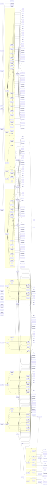

```mermaid
flowchart LR
  subgraph path2 [Path]
    2["Path<br>[264, 308, 0]"]
    3["Segment<br>[314, 360, 0]"]
    4["Segment<br>[366, 467, 0]"]
    5["Segment<br>[473, 593, 0]"]
    6["Segment<br>[599, 655, 0]"]
    7["Segment<br>[661, 668, 0]"]
    8[Solid2d]
  end
  subgraph path18 [Path]
    18["Path<br>[984, 1028, 0]"]
    19["Segment<br>[1034, 1053, 0]"]
    20["Segment<br>[1059, 1093, 0]"]
    21["Segment<br>[1099, 1183, 0]"]
    22["Segment<br>[1189, 1241, 0]"]
    23["Segment<br>[1247, 1331, 0]"]
    24["Segment<br>[1337, 1389, 0]"]
    25["Segment<br>[1395, 1477, 0]"]
    26["Segment<br>[1483, 1523, 0]"]
    27["Segment<br>[1529, 1548, 0]"]
    28["Segment<br>[1554, 1607, 0]"]
    29["Segment<br>[1613, 1695, 0]"]
    30["Segment<br>[1701, 1791, 0]"]
    31["Segment<br>[1797, 1881, 0]"]
    32["Segment<br>[1887, 1977, 0]"]
    33["Segment<br>[1983, 2067, 0]"]
    34["Segment<br>[2073, 2129, 0]"]
    35["Segment<br>[2135, 2142, 0]"]
    36[Solid2d]
  end
  subgraph path89 [Path]
    89["Path<br>[2409, 2468, 0]"]
    90["Segment<br>[2409, 2468, 0]"]
    91[Solid2d]
  end
  subgraph path98 [Path]
    98["Path<br>[2569, 2599, 0]"]
    99["Segment<br>[2605, 2624, 0]"]
    100["Segment<br>[2630, 2713, 0]"]
    101["Segment<br>[2719, 2775, 0]"]
    102["Segment<br>[2781, 2788, 0]"]
    103[Solid2d]
  end
  subgraph path117 [Path]
    117["Path<br>[3026, 3057, 0]"]
    118["Segment<br>[3063, 3108, 0]"]
    119["Segment<br>[3114, 3204, 0]"]
    120["Segment<br>[3210, 3256, 0]"]
    121["Segment<br>[3262, 3315, 0]"]
    122["Segment<br>[3321, 3346, 0]"]
    123["Segment<br>[3352, 3408, 0]"]
    124["Segment<br>[3414, 3421, 0]"]
    125[Solid2d]
  end
  subgraph path140 [Path]
    140["Path<br>[3503, 3530, 0]"]
    141["Segment<br>[3536, 3556, 0]"]
    142["Segment<br>[3562, 3605, 0]"]
    143["Segment<br>[3611, 3629, 0]"]
    144["Segment<br>[3635, 3655, 0]"]
    145["Segment<br>[3661, 3681, 0]"]
    146["Segment<br>[3687, 3735, 0]"]
    147["Segment<br>[3741, 3797, 0]"]
    148["Segment<br>[3803, 3810, 0]"]
    149[Solid2d]
  end
  subgraph path166 [Path]
    166["Path<br>[3916, 3975, 0]"]
    167["Segment<br>[3916, 3975, 0]"]
    168[Solid2d]
  end
  subgraph path169 [Path]
    169["Path<br>[3986, 4023, 0]"]
    170["Segment<br>[3986, 4023, 0]"]
    171[Solid2d]
  end
  subgraph path178 [Path]
    178["Path<br>[4165, 4203, 0]"]
    179["Segment<br>[4165, 4203, 0]"]
    180[Solid2d]
  end
  subgraph path192 [Path]
    192["Path<br>[4476, 4514, 0]"]
    193["Segment<br>[4476, 4514, 0]"]
    194[Solid2d]
  end
  subgraph path203 [Path]
    203["Path<br>[4766, 4818, 0]"]
    204["Segment<br>[4766, 4818, 0]"]
    205[Solid2d]
  end
  subgraph path213 [Path]
    213["Path<br>[5065, 5109, 0]"]
    214["Segment<br>[5115, 5155, 0]"]
    215["Segment<br>[5161, 5180, 0]"]
    216["Segment<br>[5186, 5205, 0]"]
    217["Segment<br>[5211, 5230, 0]"]
    218["Segment<br>[5236, 5261, 0]"]
    219["Segment<br>[5267, 5407, 0]"]
    220["Segment<br>[5413, 5469, 0]"]
    221["Segment<br>[5475, 5482, 0]"]
    222[Solid2d]
  end
  subgraph path239 [Path]
    239["Path<br>[5614, 5643, 0]"]
    240["Segment<br>[5649, 5670, 0]"]
    241["Segment<br>[5676, 5707, 0]"]
    242["Segment<br>[5713, 5744, 0]"]
    243["Segment<br>[5750, 5782, 0]"]
    244["Segment<br>[5788, 5810, 0]"]
    245["Segment<br>[5816, 5837, 0]"]
    246["Segment<br>[5843, 5868, 0]"]
    247["Segment<br>[5874, 5905, 0]"]
    248["Segment<br>[5911, 5943, 0]"]
    249["Segment<br>[5949, 5981, 0]"]
    250["Segment<br>[5987, 6008, 0]"]
    251["Segment<br>[6014, 6070, 0]"]
    252["Segment<br>[6076, 6083, 0]"]
    253[Solid2d]
  end
  1["Plane<br>[241, 258, 0]"]
  9["Sweep Revolve<br>[674, 706, 0]"]
  10[Wall]
  11[Wall]
  12[Wall]
  13[Wall]
  14["SweepEdge Adjacent"]
  15["SweepEdge Adjacent"]
  16["SweepEdge Adjacent"]
  17["Plane<br>[955, 978, 0]"]
  37["Sweep Extrusion<br>[2148, 2170, 0]"]
  38[Wall]
  39[Wall]
  40[Wall]
  41[Wall]
  42[Wall]
  43[Wall]
  44[Wall]
  45[Wall]
  46[Wall]
  47[Wall]
  48[Wall]
  49[Wall]
  50[Wall]
  51[Wall]
  52[Wall]
  53[Wall]
  54["Cap Start"]
  55["Cap End"]
  56["SweepEdge Opposite"]
  57["SweepEdge Adjacent"]
  58["SweepEdge Opposite"]
  59["SweepEdge Adjacent"]
  60["SweepEdge Opposite"]
  61["SweepEdge Adjacent"]
  62["SweepEdge Opposite"]
  63["SweepEdge Adjacent"]
  64["SweepEdge Opposite"]
  65["SweepEdge Adjacent"]
  66["SweepEdge Opposite"]
  67["SweepEdge Adjacent"]
  68["SweepEdge Opposite"]
  69["SweepEdge Adjacent"]
  70["SweepEdge Opposite"]
  71["SweepEdge Adjacent"]
  72["SweepEdge Opposite"]
  73["SweepEdge Adjacent"]
  74["SweepEdge Opposite"]
  75["SweepEdge Adjacent"]
  76["SweepEdge Opposite"]
  77["SweepEdge Adjacent"]
  78["SweepEdge Opposite"]
  79["SweepEdge Adjacent"]
  80["SweepEdge Opposite"]
  81["SweepEdge Adjacent"]
  82["SweepEdge Opposite"]
  83["SweepEdge Adjacent"]
  84["SweepEdge Opposite"]
  85["SweepEdge Adjacent"]
  86["SweepEdge Opposite"]
  87["SweepEdge Adjacent"]
  88["Plane<br>[2375, 2402, 0]"]
  92["Sweep Extrusion<br>[2483, 2517, 0]"]
  93[Wall]
  94["Cap Start"]
  95["Cap End"]
  96["SweepEdge Opposite"]
  97["SweepEdge Adjacent"]
  104["Sweep Extrusion<br>[2937, 2972, 0]"]
  105[Wall]
  106[Wall]
  107[Wall]
  108["SweepEdge Opposite"]
  109["SweepEdge Adjacent"]
  110["SweepEdge Opposite"]
  111["SweepEdge Adjacent"]
  112["SweepEdge Opposite"]
  113["SweepEdge Adjacent"]
  114["Sweep Extrusion<br>[2937, 2972, 0]"]
  115["Sweep Extrusion<br>[2937, 2972, 0]"]
  116["Plane<br>[3003, 3020, 0]"]
  126["Sweep Revolve<br>[3427, 3446, 0]"]
  127[Wall]
  128[Wall]
  129[Wall]
  130[Wall]
  131[Wall]
  132[Wall]
  133["SweepEdge Adjacent"]
  134["SweepEdge Adjacent"]
  135["SweepEdge Adjacent"]
  136["SweepEdge Adjacent"]
  137["SweepEdge Adjacent"]
  138["SweepEdge Adjacent"]
  139["Plane<br>[3480, 3497, 0]"]
  150["Sweep Revolve<br>[3816, 3835, 0]"]
  151[Wall]
  152[Wall]
  153[Wall]
  154[Wall]
  155[Wall]
  156[Wall]
  157[Wall]
  158["SweepEdge Adjacent"]
  159["SweepEdge Adjacent"]
  160["SweepEdge Adjacent"]
  161["SweepEdge Adjacent"]
  162["SweepEdge Adjacent"]
  163["SweepEdge Adjacent"]
  164["SweepEdge Adjacent"]
  165["Plane<br>[3879, 3909, 0]"]
  172["Sweep Extrusion<br>[4042, 4076, 0]"]
  173[Wall]
  174["Cap Start"]
  175["Cap End"]
  176["SweepEdge Opposite"]
  177["SweepEdge Adjacent"]
  181["Sweep Extrusion<br>[4352, 4387, 0]"]
  182[Wall]
  183["SweepEdge Opposite"]
  184["SweepEdge Adjacent"]
  185["Sweep Extrusion<br>[4352, 4387, 0]"]
  186["Sweep Extrusion<br>[4352, 4387, 0]"]
  187["Sweep Extrusion<br>[4352, 4387, 0]"]
  188["Sweep Extrusion<br>[4352, 4387, 0]"]
  189["Sweep Extrusion<br>[4352, 4387, 0]"]
  190["Sweep Extrusion<br>[4352, 4387, 0]"]
  191["Sweep Extrusion<br>[4352, 4387, 0]"]
  195["Sweep Extrusion<br>[4663, 4698, 0]"]
  196[Wall]
  197["SweepEdge Opposite"]
  198["SweepEdge Adjacent"]
  199["Sweep Extrusion<br>[4663, 4698, 0]"]
  200["Sweep Extrusion<br>[4663, 4698, 0]"]
  201["Sweep Extrusion<br>[4663, 4698, 0]"]
  202["Plane<br>[4743, 4760, 0]"]
  206["Sweep Extrusion<br>[4914, 4955, 0]"]
  207[Wall]
  208["Cap Start"]
  209["Cap End"]
  210["SweepEdge Opposite"]
  211["SweepEdge Adjacent"]
  212["Plane<br>[5042, 5059, 0]"]
  223["Sweep Revolve<br>[5488, 5507, 0]"]
  224[Wall]
  225[Wall]
  226[Wall]
  227[Wall]
  228[Wall]
  229[Wall]
  230[Wall]
  231["SweepEdge Adjacent"]
  232["SweepEdge Adjacent"]
  233["SweepEdge Adjacent"]
  234["SweepEdge Adjacent"]
  235["SweepEdge Adjacent"]
  236["SweepEdge Adjacent"]
  237["SweepEdge Adjacent"]
  238["Plane<br>[5562, 5607, 0]"]
  254["Sweep Extrusion<br>[6097, 6142, 0]"]
  255[Wall]
  256[Wall]
  257[Wall]
  258[Wall]
  259[Wall]
  260[Wall]
  261[Wall]
  262[Wall]
  263[Wall]
  264[Wall]
  265[Wall]
  266[Wall]
  267["Cap Start"]
  268["Cap End"]
  269["SweepEdge Opposite"]
  270["SweepEdge Adjacent"]
  271["SweepEdge Opposite"]
  272["SweepEdge Adjacent"]
  273["SweepEdge Opposite"]
  274["SweepEdge Adjacent"]
  275["SweepEdge Opposite"]
  276["SweepEdge Adjacent"]
  277["SweepEdge Opposite"]
  278["SweepEdge Adjacent"]
  279["SweepEdge Opposite"]
  280["SweepEdge Adjacent"]
  281["SweepEdge Opposite"]
  282["SweepEdge Adjacent"]
  283["SweepEdge Opposite"]
  284["SweepEdge Adjacent"]
  285["SweepEdge Opposite"]
  286["SweepEdge Adjacent"]
  287["SweepEdge Opposite"]
  288["SweepEdge Adjacent"]
  289["SweepEdge Opposite"]
  290["SweepEdge Adjacent"]
  291["SweepEdge Opposite"]
  292["SweepEdge Adjacent"]
  293["StartSketchOnPlane<br>[2361, 2403, 0]"]
  294["StartSketchOnFace<br>[2531, 2563, 0]"]
  295["StartSketchOnPlane<br>[3865, 3910, 0]"]
  296["StartSketchOnFace<br>[4127, 4159, 0]"]
  297["StartSketchOnFace<br>[4438, 4470, 0]"]
  298["StartSketchOnPlane<br>[5548, 5608, 0]"]
  1 --- 2
  2 --- 3
  2 --- 4
  2 --- 5
  2 --- 6
  2 --- 7
  2 ---- 9
  2 --- 8
  3 --- 10
  3 x--> 14
  4 --- 11
  4 --- 14
  5 --- 12
  5 --- 15
  6 --- 13
  6 --- 16
  9 --- 10
  9 --- 11
  9 --- 12
  9 --- 13
  9 <--x 3
  9 --- 14
  9 <--x 4
  9 <--x 5
  9 --- 15
  9 <--x 6
  9 --- 16
  17 --- 18
  18 --- 19
  18 --- 20
  18 --- 21
  18 --- 22
  18 --- 23
  18 --- 24
  18 --- 25
  18 --- 26
  18 --- 27
  18 --- 28
  18 --- 29
  18 --- 30
  18 --- 31
  18 --- 32
  18 --- 33
  18 --- 34
  18 --- 35
  18 ---- 37
  18 --- 36
  19 --- 53
  19 --- 86
  19 --- 87
  20 --- 52
  20 --- 84
  20 --- 85
  21 --- 51
  21 --- 82
  21 --- 83
  22 --- 50
  22 --- 80
  22 --- 81
  23 --- 49
  23 --- 78
  23 --- 79
  24 --- 48
  24 --- 76
  24 --- 77
  25 --- 47
  25 --- 74
  25 --- 75
  26 --- 46
  26 --- 72
  26 --- 73
  27 --- 45
  27 --- 70
  27 --- 71
  28 --- 44
  28 --- 68
  28 --- 69
  29 --- 43
  29 --- 66
  29 --- 67
  30 --- 42
  30 --- 64
  30 --- 65
  31 --- 41
  31 --- 62
  31 --- 63
  32 --- 40
  32 --- 60
  32 --- 61
  33 --- 39
  33 --- 58
  33 --- 59
  34 --- 38
  34 --- 56
  34 --- 57
  37 --- 38
  37 --- 39
  37 --- 40
  37 --- 41
  37 --- 42
  37 --- 43
  37 --- 44
  37 --- 45
  37 --- 46
  37 --- 47
  37 --- 48
  37 --- 49
  37 --- 50
  37 --- 51
  37 --- 52
  37 --- 53
  37 --- 54
  37 --- 55
  37 --- 56
  37 --- 57
  37 --- 58
  37 --- 59
  37 --- 60
  37 --- 61
  37 --- 62
  37 --- 63
  37 --- 64
  37 --- 65
  37 --- 66
  37 --- 67
  37 --- 68
  37 --- 69
  37 --- 70
  37 --- 71
  37 --- 72
  37 --- 73
  37 --- 74
  37 --- 75
  37 --- 76
  37 --- 77
  37 --- 78
  37 --- 79
  37 --- 80
  37 --- 81
  37 --- 82
  37 --- 83
  37 --- 84
  37 --- 85
  37 --- 86
  37 --- 87
  88 --- 89
  89 --- 90
  89 ---- 92
  89 --- 91
  90 --- 93
  90 --- 96
  90 --- 97
  92 --- 93
  92 --- 94
  92 --- 95
  92 --- 96
  92 --- 97
  95 --- 98
  98 --- 99
  98 --- 100
  98 --- 101
  98 --- 102
  98 ---- 104
  98 --- 103
  99 --- 107
  99 --- 112
  99 --- 113
  100 --- 106
  100 --- 110
  100 --- 111
  101 --- 105
  101 --- 108
  101 --- 109
  104 --- 105
  104 --- 106
  104 --- 107
  104 --- 108
  104 --- 109
  104 --- 110
  104 --- 111
  104 --- 112
  104 --- 113
  116 --- 117
  117 --- 118
  117 --- 119
  117 --- 120
  117 --- 121
  117 --- 122
  117 --- 123
  117 --- 124
  117 ---- 126
  117 --- 125
  118 --- 127
  118 --- 133
  119 --- 128
  119 --- 134
  120 --- 129
  120 --- 135
  121 --- 130
  121 --- 136
  122 --- 131
  122 --- 137
  123 --- 132
  123 --- 138
  126 --- 127
  126 --- 128
  126 --- 129
  126 --- 130
  126 --- 131
  126 --- 132
  126 <--x 118
  126 --- 133
  126 <--x 119
  126 --- 134
  126 <--x 120
  126 --- 135
  126 <--x 121
  126 --- 136
  126 <--x 122
  126 --- 137
  126 <--x 123
  126 --- 138
  139 --- 140
  140 --- 141
  140 --- 142
  140 --- 143
  140 --- 144
  140 --- 145
  140 --- 146
  140 --- 147
  140 --- 148
  140 ---- 150
  140 --- 149
  141 --- 151
  141 --- 158
  142 --- 152
  142 --- 159
  143 --- 153
  143 --- 160
  144 --- 154
  144 --- 161
  145 --- 155
  145 --- 162
  146 --- 156
  146 --- 163
  147 --- 157
  147 --- 164
  150 --- 151
  150 --- 152
  150 --- 153
  150 --- 154
  150 --- 155
  150 --- 156
  150 --- 157
  150 <--x 141
  150 --- 158
  150 <--x 142
  150 --- 159
  150 <--x 143
  150 --- 160
  150 <--x 144
  150 --- 161
  150 <--x 145
  150 --- 162
  150 <--x 146
  150 --- 163
  150 <--x 147
  150 --- 164
  165 --- 166
  165 --- 169
  166 --- 167
  166 ---- 172
  166 --- 168
  167 --- 173
  167 --- 176
  167 --- 177
  169 --- 170
  169 --- 171
  172 --- 173
  172 --- 174
  172 --- 175
  172 --- 176
  172 --- 177
  175 --- 178
  175 --- 192
  178 --- 179
  178 ---- 181
  178 --- 180
  179 --- 182
  179 --- 183
  179 --- 184
  181 --- 182
  181 --- 183
  181 --- 184
  192 --- 193
  192 ---- 195
  192 --- 194
  193 --- 196
  193 --- 197
  193 --- 198
  195 --- 196
  195 --- 197
  195 --- 198
  202 --- 203
  203 --- 204
  203 ---- 206
  203 --- 205
  204 --- 207
  204 --- 210
  204 --- 211
  206 --- 207
  206 --- 208
  206 --- 209
  206 --- 210
  206 --- 211
  212 --- 213
  213 --- 214
  213 --- 215
  213 --- 216
  213 --- 217
  213 --- 218
  213 --- 219
  213 --- 220
  213 --- 221
  213 ---- 223
  213 --- 222
  214 --- 224
  214 --- 231
  215 --- 225
  215 --- 232
  216 --- 226
  216 --- 233
  217 --- 227
  217 --- 234
  218 --- 228
  218 --- 235
  219 --- 229
  219 --- 236
  220 --- 230
  220 --- 237
  223 --- 224
  223 --- 225
  223 --- 226
  223 --- 227
  223 --- 228
  223 --- 229
  223 --- 230
  223 <--x 214
  223 --- 231
  223 <--x 215
  223 --- 232
  223 <--x 216
  223 --- 233
  223 <--x 217
  223 --- 234
  223 <--x 218
  223 --- 235
  223 <--x 219
  223 --- 236
  223 <--x 220
  223 --- 237
  238 --- 239
  239 --- 240
  239 --- 241
  239 --- 242
  239 --- 243
  239 --- 244
  239 --- 245
  239 --- 246
  239 --- 247
  239 --- 248
  239 --- 249
  239 --- 250
  239 --- 251
  239 --- 252
  239 ---- 254
  239 --- 253
  240 --- 266
  240 --- 291
  240 --- 292
  241 --- 265
  241 --- 289
  241 --- 290
  242 --- 264
  242 --- 287
  242 --- 288
  243 --- 263
  243 --- 285
  243 --- 286
  244 --- 262
  244 --- 283
  244 --- 284
  245 --- 261
  245 --- 281
  245 --- 282
  246 --- 260
  246 --- 279
  246 --- 280
  247 --- 259
  247 --- 277
  247 --- 278
  248 --- 258
  248 --- 275
  248 --- 276
  249 --- 257
  249 --- 273
  249 --- 274
  250 --- 256
  250 --- 271
  250 --- 272
  251 --- 255
  251 --- 269
  251 --- 270
  254 --- 255
  254 --- 256
  254 --- 257
  254 --- 258
  254 --- 259
  254 --- 260
  254 --- 261
  254 --- 262
  254 --- 263
  254 --- 264
  254 --- 265
  254 --- 266
  254 --- 267
  254 --- 268
  254 --- 269
  254 --- 270
  254 --- 271
  254 --- 272
  254 --- 273
  254 --- 274
  254 --- 275
  254 --- 276
  254 --- 277
  254 --- 278
  254 --- 279
  254 --- 280
  254 --- 281
  254 --- 282
  254 --- 283
  254 --- 284
  254 --- 285
  254 --- 286
  254 --- 287
  254 --- 288
  254 --- 289
  254 --- 290
  254 --- 291
  254 --- 292
  88 <--x 293
  95 <--x 294
  165 <--x 295
  175 <--x 296
  175 <--x 297
  238 <--x 298
```
