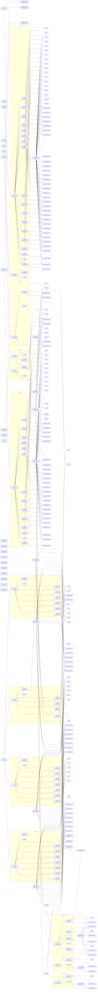

```mermaid
flowchart LR
  subgraph path7 [Path]
    7["Path<br>[266, 310, 0]"]
    8["Segment<br>[316, 362, 0]"]
    9["Segment<br>[368, 469, 0]"]
    10["Segment<br>[475, 595, 0]"]
    11["Segment<br>[601, 657, 0]"]
    12["Segment<br>[663, 670, 0]"]
    13[Solid2d]
  end
  subgraph path23 [Path]
    23["Path<br>[993, 1037, 0]"]
    24["Segment<br>[1043, 1062, 0]"]
    25["Segment<br>[1068, 1102, 0]"]
    26["Segment<br>[1108, 1192, 0]"]
    27["Segment<br>[1198, 1250, 0]"]
    28["Segment<br>[1256, 1340, 0]"]
    29["Segment<br>[1346, 1398, 0]"]
    30["Segment<br>[1404, 1486, 0]"]
    31["Segment<br>[1492, 1532, 0]"]
    32["Segment<br>[1538, 1557, 0]"]
    33["Segment<br>[1563, 1616, 0]"]
    34["Segment<br>[1622, 1704, 0]"]
    35["Segment<br>[1710, 1800, 0]"]
    36["Segment<br>[1806, 1890, 0]"]
    37["Segment<br>[1896, 1986, 0]"]
    38["Segment<br>[1992, 2076, 0]"]
    39["Segment<br>[2082, 2138, 0]"]
    40["Segment<br>[2144, 2151, 0]"]
    41[Solid2d]
  end
  subgraph path94 [Path]
    94["Path<br>[2419, 2499, 0]"]
    95["Segment<br>[2419, 2499, 0]"]
    96[Solid2d]
  end
  subgraph path103 [Path]
    103["Path<br>[2600, 2630, 0]"]
    104["Segment<br>[2636, 2655, 0]"]
    105["Segment<br>[2661, 2744, 0]"]
    106["Segment<br>[2750, 2806, 0]"]
    107["Segment<br>[2812, 2819, 0]"]
    108[Solid2d]
  end
  subgraph path121 [Path]
    121["Path<br>[3058, 3089, 0]"]
    122["Segment<br>[3095, 3140, 0]"]
    123["Segment<br>[3146, 3236, 0]"]
    124["Segment<br>[3242, 3288, 0]"]
    125["Segment<br>[3294, 3347, 0]"]
    126["Segment<br>[3353, 3378, 0]"]
    127["Segment<br>[3384, 3440, 0]"]
    128["Segment<br>[3446, 3453, 0]"]
    129[Solid2d]
  end
  subgraph path143 [Path]
    143["Path<br>[3544, 3571, 0]"]
    144["Segment<br>[3577, 3597, 0]"]
    145["Segment<br>[3603, 3646, 0]"]
    146["Segment<br>[3652, 3670, 0]"]
    147["Segment<br>[3676, 3696, 0]"]
    148["Segment<br>[3702, 3722, 0]"]
    149["Segment<br>[3728, 3776, 0]"]
    150["Segment<br>[3782, 3838, 0]"]
    151["Segment<br>[3844, 3851, 0]"]
    152[Solid2d]
  end
  subgraph path169 [Path]
    169["Path<br>[3966, 4046, 0]"]
    170["Segment<br>[3966, 4046, 0]"]
    171[Solid2d]
  end
  subgraph path172 [Path]
    172["Path<br>[4057, 4094, 0]"]
    173["Segment<br>[4057, 4094, 0]"]
    174[Solid2d]
  end
  subgraph path181 [Path]
    181["Path<br>[4236, 4274, 0]"]
    182["Segment<br>[4236, 4274, 0]"]
    183[Solid2d]
  end
  subgraph path195 [Path]
    195["Path<br>[4546, 4584, 0]"]
    196["Segment<br>[4546, 4584, 0]"]
    197[Solid2d]
  end
  subgraph path205 [Path]
    205["Path<br>[4837, 4910, 0]"]
    206["Segment<br>[4837, 4910, 0]"]
    207[Solid2d]
  end
  subgraph path214 [Path]
    214["Path<br>[5159, 5203, 0]"]
    215["Segment<br>[5209, 5249, 0]"]
    216["Segment<br>[5255, 5274, 0]"]
    217["Segment<br>[5280, 5299, 0]"]
    218["Segment<br>[5305, 5324, 0]"]
    219["Segment<br>[5330, 5355, 0]"]
    220["Segment<br>[5361, 5501, 0]"]
    221["Segment<br>[5507, 5563, 0]"]
    222["Segment<br>[5569, 5576, 0]"]
    223[Solid2d]
  end
  subgraph path240 [Path]
    240["Path<br>[5717, 5746, 0]"]
    241["Segment<br>[5752, 5773, 0]"]
    242["Segment<br>[5779, 5810, 0]"]
    243["Segment<br>[5816, 5847, 0]"]
    244["Segment<br>[5853, 5885, 0]"]
    245["Segment<br>[5891, 5913, 0]"]
    246["Segment<br>[5919, 5940, 0]"]
    247["Segment<br>[5946, 5971, 0]"]
    248["Segment<br>[5977, 6008, 0]"]
    249["Segment<br>[6014, 6046, 0]"]
    250["Segment<br>[6052, 6084, 0]"]
    251["Segment<br>[6090, 6111, 0]"]
    252["Segment<br>[6117, 6173, 0]"]
    253["Segment<br>[6179, 6186, 0]"]
    254[Solid2d]
  end
  1["Plane<br>[241, 260, 0]"]
  2["Plane<br>[241, 260, 0]"]
  3["Plane<br>[241, 260, 0]"]
  4["Plane<br>[241, 260, 0]"]
  5["Plane<br>[241, 260, 0]"]
  6["Plane<br>[241, 260, 0]"]
  14["Sweep Revolve<br>[676, 715, 0]"]
  15[Wall]
  16[Wall]
  17[Wall]
  18[Wall]
  19["SweepEdge Adjacent"]
  20["SweepEdge Adjacent"]
  21["SweepEdge Adjacent"]
  22["Plane<br>[964, 987, 0]"]
  42["Sweep Extrusion<br>[2157, 2179, 0]"]
  43[Wall]
  44[Wall]
  45[Wall]
  46[Wall]
  47[Wall]
  48[Wall]
  49[Wall]
  50[Wall]
  51[Wall]
  52[Wall]
  53[Wall]
  54[Wall]
  55[Wall]
  56[Wall]
  57[Wall]
  58[Wall]
  59["Cap Start"]
  60["Cap End"]
  61["SweepEdge Opposite"]
  62["SweepEdge Adjacent"]
  63["SweepEdge Opposite"]
  64["SweepEdge Adjacent"]
  65["SweepEdge Opposite"]
  66["SweepEdge Adjacent"]
  67["SweepEdge Opposite"]
  68["SweepEdge Adjacent"]
  69["SweepEdge Opposite"]
  70["SweepEdge Adjacent"]
  71["SweepEdge Opposite"]
  72["SweepEdge Adjacent"]
  73["SweepEdge Opposite"]
  74["SweepEdge Adjacent"]
  75["SweepEdge Opposite"]
  76["SweepEdge Adjacent"]
  77["SweepEdge Opposite"]
  78["SweepEdge Adjacent"]
  79["SweepEdge Opposite"]
  80["SweepEdge Adjacent"]
  81["SweepEdge Opposite"]
  82["SweepEdge Adjacent"]
  83["SweepEdge Opposite"]
  84["SweepEdge Adjacent"]
  85["SweepEdge Opposite"]
  86["SweepEdge Adjacent"]
  87["SweepEdge Opposite"]
  88["SweepEdge Adjacent"]
  89["SweepEdge Opposite"]
  90["SweepEdge Adjacent"]
  91["SweepEdge Opposite"]
  92["SweepEdge Adjacent"]
  93["Plane<br>[2383, 2412, 0]"]
  97["Sweep Extrusion<br>[2514, 2548, 0]"]
  98[Wall]
  99["Cap Start"]
  100["Cap End"]
  101["SweepEdge Opposite"]
  102["SweepEdge Adjacent"]
  109["Sweep Extrusion<br>[2967, 3002, 0]"]
  110[Wall]
  111[Wall]
  112[Wall]
  113["SweepEdge Opposite"]
  114["SweepEdge Adjacent"]
  115["SweepEdge Opposite"]
  116["SweepEdge Adjacent"]
  117["SweepEdge Opposite"]
  118["SweepEdge Adjacent"]
  119["Sweep Extrusion<br>[2967, 3002, 0]"]
  120["Sweep Extrusion<br>[2967, 3002, 0]"]
  130["Sweep Revolve<br>[3459, 3485, 0]"]
  131[Wall]
  132[Wall]
  133[Wall]
  134[Wall]
  135[Wall]
  136[Wall]
  137["SweepEdge Adjacent"]
  138["SweepEdge Adjacent"]
  139["SweepEdge Adjacent"]
  140["SweepEdge Adjacent"]
  141["SweepEdge Adjacent"]
  142["SweepEdge Adjacent"]
  153["Sweep Revolve<br>[3857, 3883, 0]"]
  154[Wall]
  155[Wall]
  156[Wall]
  157[Wall]
  158[Wall]
  159[Wall]
  160[Wall]
  161["SweepEdge Adjacent"]
  162["SweepEdge Adjacent"]
  163["SweepEdge Adjacent"]
  164["SweepEdge Adjacent"]
  165["SweepEdge Adjacent"]
  166["SweepEdge Adjacent"]
  167["SweepEdge Adjacent"]
  168["Plane<br>[3927, 3959, 0]"]
  175["Sweep Extrusion<br>[4113, 4147, 0]"]
  176[Wall]
  177["Cap Start"]
  178["Cap End"]
  179["SweepEdge Opposite"]
  180["SweepEdge Adjacent"]
  184["Sweep Extrusion<br>[4422, 4457, 0]"]
  185[Wall]
  186["SweepEdge Opposite"]
  187["SweepEdge Adjacent"]
  188["Sweep Extrusion<br>[4422, 4457, 0]"]
  189["Sweep Extrusion<br>[4422, 4457, 0]"]
  190["Sweep Extrusion<br>[4422, 4457, 0]"]
  191["Sweep Extrusion<br>[4422, 4457, 0]"]
  192["Sweep Extrusion<br>[4422, 4457, 0]"]
  193["Sweep Extrusion<br>[4422, 4457, 0]"]
  194["Sweep Extrusion<br>[4422, 4457, 0]"]
  198["Sweep Extrusion<br>[4732, 4767, 0]"]
  199[Wall]
  200["SweepEdge Opposite"]
  201["SweepEdge Adjacent"]
  202["Sweep Extrusion<br>[4732, 4767, 0]"]
  203["Sweep Extrusion<br>[4732, 4767, 0]"]
  204["Sweep Extrusion<br>[4732, 4767, 0]"]
  208["Sweep Extrusion<br>[5006, 5047, 0]"]
  209[Wall]
  210["Cap Start"]
  211["Cap End"]
  212["SweepEdge Opposite"]
  213["SweepEdge Adjacent"]
  224["Sweep Revolve<br>[5582, 5608, 0]"]
  225[Wall]
  226[Wall]
  227[Wall]
  228[Wall]
  229[Wall]
  230[Wall]
  231[Wall]
  232["SweepEdge Adjacent"]
  233["SweepEdge Adjacent"]
  234["SweepEdge Adjacent"]
  235["SweepEdge Adjacent"]
  236["SweepEdge Adjacent"]
  237["SweepEdge Adjacent"]
  238["SweepEdge Adjacent"]
  239["Plane<br>[5663, 5710, 0]"]
  255["Sweep Extrusion<br>[6200, 6245, 0]"]
  256[Wall]
  257[Wall]
  258[Wall]
  259[Wall]
  260[Wall]
  261[Wall]
  262[Wall]
  263[Wall]
  264[Wall]
  265[Wall]
  266[Wall]
  267[Wall]
  268["Cap Start"]
  269["Cap End"]
  270["SweepEdge Opposite"]
  271["SweepEdge Adjacent"]
  272["SweepEdge Opposite"]
  273["SweepEdge Adjacent"]
  274["SweepEdge Opposite"]
  275["SweepEdge Adjacent"]
  276["SweepEdge Opposite"]
  277["SweepEdge Adjacent"]
  278["SweepEdge Opposite"]
  279["SweepEdge Adjacent"]
  280["SweepEdge Opposite"]
  281["SweepEdge Adjacent"]
  282["SweepEdge Opposite"]
  283["SweepEdge Adjacent"]
  284["SweepEdge Opposite"]
  285["SweepEdge Adjacent"]
  286["SweepEdge Opposite"]
  287["SweepEdge Adjacent"]
  288["SweepEdge Opposite"]
  289["SweepEdge Adjacent"]
  290["SweepEdge Opposite"]
  291["SweepEdge Adjacent"]
  292["SweepEdge Opposite"]
  293["SweepEdge Adjacent"]
  294["StartSketchOnPlane<br>[2369, 2413, 0]"]
  295["StartSketchOnFace<br>[2562, 2594, 0]"]
  296["StartSketchOnPlane<br>[3913, 3960, 0]"]
  297["StartSketchOnFace<br>[4198, 4230, 0]"]
  298["StartSketchOnFace<br>[4508, 4540, 0]"]
  299["StartSketchOnPlane<br>[5649, 5711, 0]"]
  1 --- 205
  3 --- 7
  3 --- 121
  3 --- 143
  3 --- 214
  7 --- 8
  7 --- 9
  7 --- 10
  7 --- 11
  7 --- 12
  7 ---- 14
  7 --- 13
  8 --- 15
  8 x--> 19
  9 --- 16
  9 --- 19
  10 --- 17
  10 --- 20
  11 --- 18
  11 --- 21
  14 --- 15
  14 --- 16
  14 --- 17
  14 --- 18
  14 <--x 8
  14 --- 19
  14 <--x 9
  14 <--x 10
  14 --- 20
  14 <--x 11
  14 --- 21
  22 --- 23
  23 --- 24
  23 --- 25
  23 --- 26
  23 --- 27
  23 --- 28
  23 --- 29
  23 --- 30
  23 --- 31
  23 --- 32
  23 --- 33
  23 --- 34
  23 --- 35
  23 --- 36
  23 --- 37
  23 --- 38
  23 --- 39
  23 --- 40
  23 ---- 42
  23 --- 41
  24 --- 58
  24 --- 91
  24 --- 92
  25 --- 57
  25 --- 89
  25 --- 90
  26 --- 56
  26 --- 87
  26 --- 88
  27 --- 55
  27 --- 85
  27 --- 86
  28 --- 54
  28 --- 83
  28 --- 84
  29 --- 53
  29 --- 81
  29 --- 82
  30 --- 52
  30 --- 79
  30 --- 80
  31 --- 51
  31 --- 77
  31 --- 78
  32 --- 50
  32 --- 75
  32 --- 76
  33 --- 49
  33 --- 73
  33 --- 74
  34 --- 48
  34 --- 71
  34 --- 72
  35 --- 47
  35 --- 69
  35 --- 70
  36 --- 46
  36 --- 67
  36 --- 68
  37 --- 45
  37 --- 65
  37 --- 66
  38 --- 44
  38 --- 63
  38 --- 64
  39 --- 43
  39 --- 61
  39 --- 62
  42 --- 43
  42 --- 44
  42 --- 45
  42 --- 46
  42 --- 47
  42 --- 48
  42 --- 49
  42 --- 50
  42 --- 51
  42 --- 52
  42 --- 53
  42 --- 54
  42 --- 55
  42 --- 56
  42 --- 57
  42 --- 58
  42 --- 59
  42 --- 60
  42 --- 61
  42 --- 62
  42 --- 63
  42 --- 64
  42 --- 65
  42 --- 66
  42 --- 67
  42 --- 68
  42 --- 69
  42 --- 70
  42 --- 71
  42 --- 72
  42 --- 73
  42 --- 74
  42 --- 75
  42 --- 76
  42 --- 77
  42 --- 78
  42 --- 79
  42 --- 80
  42 --- 81
  42 --- 82
  42 --- 83
  42 --- 84
  42 --- 85
  42 --- 86
  42 --- 87
  42 --- 88
  42 --- 89
  42 --- 90
  42 --- 91
  42 --- 92
  93 --- 94
  94 --- 95
  94 ---- 97
  94 --- 96
  95 --- 98
  95 --- 101
  95 --- 102
  97 --- 98
  97 --- 99
  97 --- 100
  97 --- 101
  97 --- 102
  100 --- 103
  103 --- 104
  103 --- 105
  103 --- 106
  103 --- 107
  103 ---- 109
  103 --- 108
  104 --- 112
  104 --- 117
  104 --- 118
  105 --- 111
  105 --- 115
  105 --- 116
  106 --- 110
  106 --- 113
  106 --- 114
  109 --- 110
  109 --- 111
  109 --- 112
  109 --- 113
  109 --- 114
  109 --- 115
  109 --- 116
  109 --- 117
  109 --- 118
  121 --- 122
  121 --- 123
  121 --- 124
  121 --- 125
  121 --- 126
  121 --- 127
  121 --- 128
  121 ---- 130
  121 --- 129
  122 --- 131
  122 --- 137
  123 --- 132
  123 --- 138
  124 --- 133
  124 --- 139
  125 --- 134
  125 --- 140
  126 --- 135
  126 --- 141
  127 --- 136
  127 --- 142
  130 --- 131
  130 --- 132
  130 --- 133
  130 --- 134
  130 --- 135
  130 --- 136
  130 <--x 122
  130 --- 137
  130 <--x 123
  130 --- 138
  130 <--x 124
  130 --- 139
  130 <--x 125
  130 --- 140
  130 <--x 126
  130 --- 141
  130 <--x 127
  130 --- 142
  143 --- 144
  143 --- 145
  143 --- 146
  143 --- 147
  143 --- 148
  143 --- 149
  143 --- 150
  143 --- 151
  143 ---- 153
  143 --- 152
  144 --- 154
  144 --- 161
  145 --- 155
  145 --- 162
  146 --- 156
  146 --- 163
  147 --- 157
  147 --- 164
  148 --- 158
  148 --- 165
  149 --- 159
  149 --- 166
  150 --- 160
  150 --- 167
  153 --- 154
  153 --- 155
  153 --- 156
  153 --- 157
  153 --- 158
  153 --- 159
  153 --- 160
  153 <--x 144
  153 --- 161
  153 <--x 145
  153 --- 162
  153 <--x 146
  153 --- 163
  153 <--x 147
  153 --- 164
  153 <--x 148
  153 --- 165
  153 <--x 149
  153 --- 166
  153 <--x 150
  153 --- 167
  168 --- 169
  168 --- 172
  169 --- 170
  169 ---- 175
  169 --- 171
  170 --- 176
  170 --- 179
  170 --- 180
  172 --- 173
  172 --- 174
  175 --- 176
  175 --- 177
  175 --- 178
  175 --- 179
  175 --- 180
  178 --- 181
  178 --- 195
  181 --- 182
  181 ---- 184
  181 --- 183
  182 --- 185
  182 --- 186
  182 --- 187
  184 --- 185
  184 --- 186
  184 --- 187
  195 --- 196
  195 ---- 198
  195 --- 197
  196 --- 199
  196 --- 200
  196 --- 201
  198 --- 199
  198 --- 200
  198 --- 201
  205 --- 206
  205 ---- 208
  205 --- 207
  206 --- 209
  206 --- 212
  206 --- 213
  208 --- 209
  208 --- 210
  208 --- 211
  208 --- 212
  208 --- 213
  214 --- 215
  214 --- 216
  214 --- 217
  214 --- 218
  214 --- 219
  214 --- 220
  214 --- 221
  214 --- 222
  214 ---- 224
  214 --- 223
  215 --- 225
  215 --- 232
  216 --- 226
  216 --- 233
  217 --- 227
  217 --- 234
  218 --- 228
  218 --- 235
  219 --- 229
  219 --- 236
  220 --- 230
  220 --- 237
  221 --- 231
  221 --- 238
  224 --- 225
  224 --- 226
  224 --- 227
  224 --- 228
  224 --- 229
  224 --- 230
  224 --- 231
  224 <--x 215
  224 --- 232
  224 <--x 216
  224 --- 233
  224 <--x 217
  224 --- 234
  224 <--x 218
  224 --- 235
  224 <--x 219
  224 --- 236
  224 <--x 220
  224 --- 237
  224 <--x 221
  224 --- 238
  239 --- 240
  240 --- 241
  240 --- 242
  240 --- 243
  240 --- 244
  240 --- 245
  240 --- 246
  240 --- 247
  240 --- 248
  240 --- 249
  240 --- 250
  240 --- 251
  240 --- 252
  240 --- 253
  240 ---- 255
  240 --- 254
  241 --- 267
  241 --- 292
  241 --- 293
  242 --- 266
  242 --- 290
  242 --- 291
  243 --- 265
  243 --- 288
  243 --- 289
  244 --- 264
  244 --- 286
  244 --- 287
  245 --- 263
  245 --- 284
  245 --- 285
  246 --- 262
  246 --- 282
  246 --- 283
  247 --- 261
  247 --- 280
  247 --- 281
  248 --- 260
  248 --- 278
  248 --- 279
  249 --- 259
  249 --- 276
  249 --- 277
  250 --- 258
  250 --- 274
  250 --- 275
  251 --- 257
  251 --- 272
  251 --- 273
  252 --- 256
  252 --- 270
  252 --- 271
  255 --- 256
  255 --- 257
  255 --- 258
  255 --- 259
  255 --- 260
  255 --- 261
  255 --- 262
  255 --- 263
  255 --- 264
  255 --- 265
  255 --- 266
  255 --- 267
  255 --- 268
  255 --- 269
  255 --- 270
  255 --- 271
  255 --- 272
  255 --- 273
  255 --- 274
  255 --- 275
  255 --- 276
  255 --- 277
  255 --- 278
  255 --- 279
  255 --- 280
  255 --- 281
  255 --- 282
  255 --- 283
  255 --- 284
  255 --- 285
  255 --- 286
  255 --- 287
  255 --- 288
  255 --- 289
  255 --- 290
  255 --- 291
  255 --- 292
  255 --- 293
  93 <--x 294
  100 <--x 295
  168 <--x 296
  178 <--x 297
  178 <--x 298
  239 <--x 299
```
