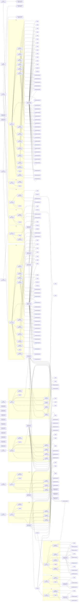

```mermaid
flowchart LR
  subgraph path2 [Path]
    2["Path<br>[266, 310, 0]"]
    3["Segment<br>[316, 362, 0]"]
    4["Segment<br>[368, 469, 0]"]
    5["Segment<br>[475, 595, 0]"]
    6["Segment<br>[601, 657, 0]"]
    7["Segment<br>[663, 670, 0]"]
    8[Solid2d]
  end
  subgraph path18 [Path]
    18["Path<br>[993, 1037, 0]"]
    19["Segment<br>[1043, 1062, 0]"]
    20["Segment<br>[1108, 1192, 0]"]
    21["Segment<br>[1198, 1250, 0]"]
    22["Segment<br>[1256, 1340, 0]"]
    23["Segment<br>[1346, 1398, 0]"]
    24["Segment<br>[1404, 1486, 0]"]
    25["Segment<br>[1492, 1532, 0]"]
    26["Segment<br>[1622, 1704, 0]"]
    27["Segment<br>[1710, 1800, 0]"]
    28["Segment<br>[1806, 1890, 0]"]
    29["Segment<br>[1896, 1986, 0]"]
    30["Segment<br>[1992, 2076, 0]"]
    31["Segment<br>[2082, 2138, 0]"]
    32["Segment<br>[2144, 2151, 0]"]
    33[Solid2d]
  end
  subgraph path77 [Path]
    77["Path<br>[2419, 2499, 0]"]
    78["Segment<br>[2419, 2499, 0]"]
    79[Solid2d]
  end
  subgraph path86 [Path]
    86["Path<br>[2600, 2630, 0]"]
    87["Segment<br>[2636, 2655, 0]"]
    88["Segment<br>[2661, 2744, 0]"]
    89["Segment<br>[2750, 2806, 0]"]
    90["Segment<br>[2812, 2819, 0]"]
    91[Solid2d]
  end
  subgraph path105 [Path]
    105["Path<br>[3058, 3089, 0]"]
    106["Segment<br>[3095, 3140, 0]"]
    107["Segment<br>[3242, 3288, 0]"]
    108["Segment<br>[3294, 3347, 0]"]
    109["Segment<br>[3353, 3378, 0]"]
    110["Segment<br>[3446, 3453, 0]"]
    111[Solid2d]
  end
  subgraph path122 [Path]
    122["Path<br>[3544, 3571, 0]"]
    123["Segment<br>[3577, 3597, 0]"]
    124["Segment<br>[3728, 3776, 0]"]
    125["Segment<br>[3782, 3838, 0]"]
    126["Segment<br>[3844, 3851, 0]"]
    127[Solid2d]
  end
  subgraph path136 [Path]
    136["Path<br>[3966, 4046, 0]"]
    137["Segment<br>[3966, 4046, 0]"]
    138[Solid2d]
  end
  subgraph path139 [Path]
    139["Path<br>[4057, 4094, 0]"]
    140["Segment<br>[4057, 4094, 0]"]
    141[Solid2d]
  end
  subgraph path148 [Path]
    148["Path<br>[4236, 4274, 0]"]
    149["Segment<br>[4236, 4274, 0]"]
    150[Solid2d]
  end
  subgraph path162 [Path]
    162["Path<br>[4546, 4584, 0]"]
    163["Segment<br>[4546, 4584, 0]"]
    164[Solid2d]
  end
  subgraph path173 [Path]
    173["Path<br>[4837, 4910, 0]"]
    174["Segment<br>[4837, 4910, 0]"]
    175[Solid2d]
  end
  subgraph path183 [Path]
    183["Path<br>[5159, 5203, 0]"]
    184["Segment<br>[5209, 5249, 0]"]
    185["Segment<br>[5361, 5501, 0]"]
    186["Segment<br>[5507, 5563, 0]"]
    187["Segment<br>[5569, 5576, 0]"]
    188[Solid2d]
  end
  subgraph path197 [Path]
    197["Path<br>[5717, 5746, 0]"]
    198["Segment<br>[5752, 5773, 0]"]
    199["Segment<br>[5779, 5810, 0]"]
    200["Segment<br>[5816, 5847, 0]"]
    201["Segment<br>[5853, 5885, 0]"]
    202["Segment<br>[5891, 5913, 0]"]
    203["Segment<br>[5977, 6008, 0]"]
    204["Segment<br>[6014, 6046, 0]"]
    205["Segment<br>[6052, 6084, 0]"]
    206["Segment<br>[6090, 6111, 0]"]
    207["Segment<br>[6179, 6186, 0]"]
    208[Solid2d]
  end
  1["Plane<br>[241, 260, 0]"]
  9["Sweep Revolve<br>[676, 715, 0]"]
  10[Wall]
  11[Wall]
  12[Wall]
  13[Wall]
  14["SweepEdge Adjacent"]
  15["SweepEdge Adjacent"]
  16["SweepEdge Adjacent"]
  17["Plane<br>[964, 987, 0]"]
  34["Sweep Extrusion<br>[2157, 2179, 0]"]
  35[Wall]
  36[Wall]
  37[Wall]
  38[Wall]
  39[Wall]
  40[Wall]
  41[Wall]
  42[Wall]
  43[Wall]
  44[Wall]
  45[Wall]
  46[Wall]
  47[Wall]
  48["Cap Start"]
  49["Cap End"]
  50["SweepEdge Opposite"]
  51["SweepEdge Adjacent"]
  52["SweepEdge Opposite"]
  53["SweepEdge Adjacent"]
  54["SweepEdge Opposite"]
  55["SweepEdge Adjacent"]
  56["SweepEdge Opposite"]
  57["SweepEdge Adjacent"]
  58["SweepEdge Opposite"]
  59["SweepEdge Adjacent"]
  60["SweepEdge Opposite"]
  61["SweepEdge Adjacent"]
  62["SweepEdge Opposite"]
  63["SweepEdge Adjacent"]
  64["SweepEdge Opposite"]
  65["SweepEdge Adjacent"]
  66["SweepEdge Opposite"]
  67["SweepEdge Adjacent"]
  68["SweepEdge Opposite"]
  69["SweepEdge Adjacent"]
  70["SweepEdge Opposite"]
  71["SweepEdge Adjacent"]
  72["SweepEdge Opposite"]
  73["SweepEdge Adjacent"]
  74["SweepEdge Opposite"]
  75["SweepEdge Adjacent"]
  76["Plane<br>[2383, 2412, 0]"]
  80["Sweep Extrusion<br>[2514, 2548, 0]"]
  81[Wall]
  82["Cap Start"]
  83["Cap End"]
  84["SweepEdge Opposite"]
  85["SweepEdge Adjacent"]
  92["Sweep Extrusion<br>[2967, 3002, 0]"]
  93[Wall]
  94[Wall]
  95[Wall]
  96["SweepEdge Opposite"]
  97["SweepEdge Adjacent"]
  98["SweepEdge Opposite"]
  99["SweepEdge Adjacent"]
  100["SweepEdge Opposite"]
  101["SweepEdge Adjacent"]
  102["Sweep Extrusion<br>[2967, 3002, 0]"]
  103["Sweep Extrusion<br>[2967, 3002, 0]"]
  104["Plane<br>[3033, 3052, 0]"]
  112["Sweep Revolve<br>[3459, 3485, 0]"]
  113[Wall]
  114[Wall]
  115[Wall]
  116[Wall]
  117["SweepEdge Adjacent"]
  118["SweepEdge Adjacent"]
  119["SweepEdge Adjacent"]
  120["SweepEdge Adjacent"]
  121["Plane<br>[3519, 3538, 0]"]
  128["Sweep Revolve<br>[3857, 3883, 0]"]
  129[Wall]
  130[Wall]
  131[Wall]
  132["SweepEdge Adjacent"]
  133["SweepEdge Adjacent"]
  134["SweepEdge Adjacent"]
  135["Plane<br>[3927, 3959, 0]"]
  142["Sweep Extrusion<br>[4113, 4147, 0]"]
  143[Wall]
  144["Cap Start"]
  145["Cap End"]
  146["SweepEdge Opposite"]
  147["SweepEdge Adjacent"]
  151["Sweep Extrusion<br>[4422, 4457, 0]"]
  152[Wall]
  153["SweepEdge Opposite"]
  154["SweepEdge Adjacent"]
  155["Sweep Extrusion<br>[4422, 4457, 0]"]
  156["Sweep Extrusion<br>[4422, 4457, 0]"]
  157["Sweep Extrusion<br>[4422, 4457, 0]"]
  158["Sweep Extrusion<br>[4422, 4457, 0]"]
  159["Sweep Extrusion<br>[4422, 4457, 0]"]
  160["Sweep Extrusion<br>[4422, 4457, 0]"]
  161["Sweep Extrusion<br>[4422, 4457, 0]"]
  165["Sweep Extrusion<br>[4732, 4767, 0]"]
  166[Wall]
  167["SweepEdge Opposite"]
  168["SweepEdge Adjacent"]
  169["Sweep Extrusion<br>[4732, 4767, 0]"]
  170["Sweep Extrusion<br>[4732, 4767, 0]"]
  171["Sweep Extrusion<br>[4732, 4767, 0]"]
  172["Plane<br>[4812, 4831, 0]"]
  176["Sweep Extrusion<br>[5006, 5047, 0]"]
  177[Wall]
  178["Cap Start"]
  179["Cap End"]
  180["SweepEdge Opposite"]
  181["SweepEdge Adjacent"]
  182["Plane<br>[5134, 5153, 0]"]
  189["Sweep Revolve<br>[5582, 5608, 0]"]
  190[Wall]
  191[Wall]
  192[Wall]
  193["SweepEdge Adjacent"]
  194["SweepEdge Adjacent"]
  195["SweepEdge Adjacent"]
  196["Plane<br>[5663, 5710, 0]"]
  209["Sweep Extrusion<br>[6200, 6245, 0]"]
  210[Wall]
  211[Wall]
  212[Wall]
  213[Wall]
  214[Wall]
  215[Wall]
  216[Wall]
  217[Wall]
  218[Wall]
  219["Cap Start"]
  220["Cap End"]
  221["SweepEdge Opposite"]
  222["SweepEdge Adjacent"]
  223["SweepEdge Opposite"]
  224["SweepEdge Adjacent"]
  225["SweepEdge Opposite"]
  226["SweepEdge Adjacent"]
  227["SweepEdge Opposite"]
  228["SweepEdge Adjacent"]
  229["SweepEdge Opposite"]
  230["SweepEdge Adjacent"]
  231["SweepEdge Opposite"]
  232["SweepEdge Adjacent"]
  233["SweepEdge Opposite"]
  234["SweepEdge Adjacent"]
  235["SweepEdge Opposite"]
  236["SweepEdge Adjacent"]
  237["SweepEdge Opposite"]
  238["SweepEdge Adjacent"]
  239["StartSketchOnPlane<br>[2369, 2413, 0]"]
  240["StartSketchOnFace<br>[2562, 2594, 0]"]
  241["StartSketchOnPlane<br>[3913, 3960, 0]"]
  242["StartSketchOnFace<br>[4198, 4230, 0]"]
  243["StartSketchOnFace<br>[4508, 4540, 0]"]
  244["StartSketchOnPlane<br>[5649, 5711, 0]"]
  1 --- 2
  2 --- 3
  2 --- 4
  2 --- 5
  2 --- 6
  2 --- 7
  2 ---- 9
  2 --- 8
  3 --- 10
  3 x--> 14
  4 --- 11
  4 --- 14
  5 --- 12
  5 --- 15
  6 --- 13
  6 --- 16
  9 --- 10
  9 --- 11
  9 --- 12
  9 --- 13
  9 <--x 3
  9 --- 14
  9 <--x 4
  9 <--x 5
  9 --- 15
  9 <--x 6
  9 --- 16
  17 --- 18
  18 --- 19
  18 --- 20
  18 --- 21
  18 --- 22
  18 --- 23
  18 --- 24
  18 --- 25
  18 --- 26
  18 --- 27
  18 --- 28
  18 --- 29
  18 --- 30
  18 --- 31
  18 --- 32
  18 ---- 34
  18 --- 33
  19 --- 47
  19 --- 74
  19 --- 75
  20 --- 46
  20 --- 72
  20 --- 73
  21 --- 45
  21 --- 70
  21 --- 71
  22 --- 44
  22 --- 68
  22 --- 69
  23 --- 43
  23 --- 66
  23 --- 67
  24 --- 42
  24 --- 64
  24 --- 65
  25 --- 41
  25 --- 62
  25 --- 63
  26 --- 40
  26 --- 60
  26 --- 61
  27 --- 39
  27 --- 58
  27 --- 59
  28 --- 38
  28 --- 56
  28 --- 57
  29 --- 37
  29 --- 54
  29 --- 55
  30 --- 36
  30 --- 52
  30 --- 53
  31 --- 35
  31 --- 50
  31 --- 51
  34 --- 35
  34 --- 36
  34 --- 37
  34 --- 38
  34 --- 39
  34 --- 40
  34 --- 41
  34 --- 42
  34 --- 43
  34 --- 44
  34 --- 45
  34 --- 46
  34 --- 47
  34 --- 48
  34 --- 49
  34 --- 50
  34 --- 51
  34 --- 52
  34 --- 53
  34 --- 54
  34 --- 55
  34 --- 56
  34 --- 57
  34 --- 58
  34 --- 59
  34 --- 60
  34 --- 61
  34 --- 62
  34 --- 63
  34 --- 64
  34 --- 65
  34 --- 66
  34 --- 67
  34 --- 68
  34 --- 69
  34 --- 70
  34 --- 71
  34 --- 72
  34 --- 73
  34 --- 74
  34 --- 75
  76 --- 77
  77 --- 78
  77 ---- 80
  77 --- 79
  78 --- 81
  78 --- 84
  78 --- 85
  80 --- 81
  80 --- 82
  80 --- 83
  80 --- 84
  80 --- 85
  83 --- 86
  86 --- 87
  86 --- 88
  86 --- 89
  86 --- 90
  86 ---- 92
  86 --- 91
  87 --- 95
  87 --- 100
  87 --- 101
  88 --- 94
  88 --- 98
  88 --- 99
  89 --- 93
  89 --- 96
  89 --- 97
  92 --- 93
  92 --- 94
  92 --- 95
  92 --- 96
  92 --- 97
  92 --- 98
  92 --- 99
  92 --- 100
  92 --- 101
  104 --- 105
  105 --- 106
  105 --- 107
  105 --- 108
  105 --- 109
  105 --- 110
  105 ---- 112
  105 --- 111
  106 --- 113
  106 --- 117
  107 --- 114
  107 --- 118
  108 --- 115
  108 --- 119
  109 --- 116
  109 --- 120
  112 --- 113
  112 --- 114
  112 --- 115
  112 --- 116
  112 <--x 106
  112 --- 117
  112 <--x 107
  112 --- 118
  112 <--x 108
  112 --- 119
  112 <--x 109
  112 --- 120
  121 --- 122
  122 --- 123
  122 --- 124
  122 --- 125
  122 --- 126
  122 ---- 128
  122 --- 127
  123 --- 129
  123 --- 132
  124 --- 130
  124 --- 133
  125 --- 131
  125 --- 134
  128 --- 129
  128 --- 130
  128 --- 131
  128 <--x 123
  128 --- 132
  128 <--x 124
  128 --- 133
  128 <--x 125
  128 --- 134
  135 --- 136
  135 --- 139
  136 --- 137
  136 ---- 142
  136 --- 138
  137 --- 143
  137 --- 146
  137 --- 147
  139 --- 140
  139 --- 141
  142 --- 143
  142 --- 144
  142 --- 145
  142 --- 146
  142 --- 147
  145 --- 148
  145 --- 162
  148 --- 149
  148 ---- 151
  148 --- 150
  149 --- 152
  149 --- 153
  149 --- 154
  151 --- 152
  151 --- 153
  151 --- 154
  162 --- 163
  162 ---- 165
  162 --- 164
  163 --- 166
  163 --- 167
  163 --- 168
  165 --- 166
  165 --- 167
  165 --- 168
  172 --- 173
  173 --- 174
  173 ---- 176
  173 --- 175
  174 --- 177
  174 --- 180
  174 --- 181
  176 --- 177
  176 --- 178
  176 --- 179
  176 --- 180
  176 --- 181
  182 --- 183
  183 --- 184
  183 --- 185
  183 --- 186
  183 --- 187
  183 ---- 189
  183 --- 188
  184 --- 190
  184 --- 193
  185 --- 191
  185 --- 194
  186 --- 192
  186 --- 195
  189 --- 190
  189 --- 191
  189 --- 192
  189 <--x 184
  189 --- 193
  189 <--x 185
  189 --- 194
  189 <--x 186
  189 --- 195
  196 --- 197
  197 --- 198
  197 --- 199
  197 --- 200
  197 --- 201
  197 --- 202
  197 --- 203
  197 --- 204
  197 --- 205
  197 --- 206
  197 --- 207
  197 ---- 209
  197 --- 208
  198 --- 218
  198 --- 237
  198 --- 238
  199 --- 217
  199 --- 235
  199 --- 236
  200 --- 216
  200 --- 233
  200 --- 234
  201 --- 215
  201 --- 231
  201 --- 232
  202 --- 214
  202 --- 229
  202 --- 230
  203 --- 213
  203 --- 227
  203 --- 228
  204 --- 212
  204 --- 225
  204 --- 226
  205 --- 211
  205 --- 223
  205 --- 224
  206 --- 210
  206 --- 221
  206 --- 222
  209 --- 210
  209 --- 211
  209 --- 212
  209 --- 213
  209 --- 214
  209 --- 215
  209 --- 216
  209 --- 217
  209 --- 218
  209 --- 219
  209 --- 220
  209 --- 221
  209 --- 222
  209 --- 223
  209 --- 224
  209 --- 225
  209 --- 226
  209 --- 227
  209 --- 228
  209 --- 229
  209 --- 230
  209 --- 231
  209 --- 232
  209 --- 233
  209 --- 234
  209 --- 235
  209 --- 236
  209 --- 237
  209 --- 238
  76 <--x 239
  83 <--x 240
  135 <--x 241
  145 <--x 242
  145 <--x 243
  196 <--x 244
```
