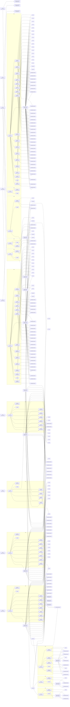

```mermaid
flowchart LR
  subgraph path2 [Path]
    2["Path<br>[266, 310, 0]"]
    3["Segment<br>[316, 380, 0]"]
    4["Segment<br>[386, 513, 0]"]
    5["Segment<br>[519, 665, 0]"]
    6["Segment<br>[671, 727, 0]"]
    7["Segment<br>[733, 740, 0]"]
    8[Solid2d]
  end
  subgraph path18 [Path]
    18["Path<br>[1063, 1107, 0]"]
    19["Segment<br>[1113, 1132, 0]"]
    20["Segment<br>[1138, 1172, 0]"]
    21["Segment<br>[1178, 1262, 0]"]
    22["Segment<br>[1268, 1319, 0]"]
    23["Segment<br>[1325, 1409, 0]"]
    24["Segment<br>[1415, 1473, 0]"]
    25["Segment<br>[1479, 1561, 0]"]
    26["Segment<br>[1567, 1607, 0]"]
    27["Segment<br>[1613, 1632, 0]"]
    28["Segment<br>[1638, 1691, 0]"]
    29["Segment<br>[1697, 1779, 0]"]
    30["Segment<br>[1785, 1884, 0]"]
    31["Segment<br>[1890, 1974, 0]"]
    32["Segment<br>[1980, 2079, 0]"]
    33["Segment<br>[2085, 2169, 0]"]
    34["Segment<br>[2175, 2231, 0]"]
    35["Segment<br>[2237, 2244, 0]"]
    36[Solid2d]
  end
  subgraph path89 [Path]
    89["Path<br>[2512, 2592, 0]"]
    90["Segment<br>[2512, 2592, 0]"]
    91[Solid2d]
  end
  subgraph path98 [Path]
    98["Path<br>[2693, 2723, 0]"]
    99["Segment<br>[2729, 2748, 0]"]
    100["Segment<br>[2754, 2837, 0]"]
    101["Segment<br>[2843, 2899, 0]"]
    102["Segment<br>[2905, 2912, 0]"]
    103[Solid2d]
  end
  subgraph path115 [Path]
    115["Path<br>[3151, 3182, 0]"]
    116["Segment<br>[3188, 3233, 0]"]
    117["Segment<br>[3239, 3345, 0]"]
    118["Segment<br>[3351, 3390, 0]"]
    119["Segment<br>[3396, 3442, 0]"]
    120["Segment<br>[3448, 3473, 0]"]
    121["Segment<br>[3479, 3535, 0]"]
    122["Segment<br>[3541, 3548, 0]"]
    123[Solid2d]
  end
  subgraph path138 [Path]
    138["Path<br>[3639, 3666, 0]"]
    139["Segment<br>[3672, 3692, 0]"]
    140["Segment<br>[3698, 3741, 0]"]
    141["Segment<br>[3747, 3765, 0]"]
    142["Segment<br>[3771, 3791, 0]"]
    143["Segment<br>[3797, 3817, 0]"]
    144["Segment<br>[3823, 3871, 0]"]
    145["Segment<br>[3877, 3933, 0]"]
    146["Segment<br>[3939, 3946, 0]"]
    147[Solid2d]
  end
  subgraph path164 [Path]
    164["Path<br>[4061, 4141, 0]"]
    165["Segment<br>[4061, 4141, 0]"]
    166[Solid2d]
  end
  subgraph path167 [Path]
    167["Path<br>[4152, 4189, 0]"]
    168["Segment<br>[4152, 4189, 0]"]
    169[Solid2d]
  end
  subgraph path176 [Path]
    176["Path<br>[4331, 4369, 0]"]
    177["Segment<br>[4331, 4369, 0]"]
    178[Solid2d]
  end
  subgraph path183 [Path]
    183["Path<br>[4641, 4679, 0]"]
    184["Segment<br>[4641, 4679, 0]"]
    185[Solid2d]
  end
  subgraph path191 [Path]
    191["Path<br>[4932, 5005, 0]"]
    192["Segment<br>[4932, 5005, 0]"]
    193[Solid2d]
  end
  subgraph path201 [Path]
    201["Path<br>[5254, 5298, 0]"]
    202["Segment<br>[5304, 5344, 0]"]
    203["Segment<br>[5350, 5369, 0]"]
    204["Segment<br>[5375, 5394, 0]"]
    205["Segment<br>[5400, 5419, 0]"]
    206["Segment<br>[5425, 5450, 0]"]
    207["Segment<br>[5456, 5596, 0]"]
    208["Segment<br>[5602, 5658, 0]"]
    209["Segment<br>[5664, 5671, 0]"]
    210[Solid2d]
  end
  subgraph path227 [Path]
    227["Path<br>[5812, 5841, 0]"]
    228["Segment<br>[5847, 5868, 0]"]
    229["Segment<br>[5874, 5905, 0]"]
    230["Segment<br>[5911, 5942, 0]"]
    231["Segment<br>[5948, 5980, 0]"]
    232["Segment<br>[5986, 6008, 0]"]
    233["Segment<br>[6014, 6035, 0]"]
    234["Segment<br>[6041, 6066, 0]"]
    235["Segment<br>[6072, 6103, 0]"]
    236["Segment<br>[6109, 6141, 0]"]
    237["Segment<br>[6147, 6179, 0]"]
    238["Segment<br>[6185, 6206, 0]"]
    239["Segment<br>[6212, 6268, 0]"]
    240["Segment<br>[6274, 6281, 0]"]
    241[Solid2d]
  end
  1["Plane<br>[241, 260, 0]"]
  9["Sweep Revolve<br>[746, 785, 0]"]
  10[Wall]
  11[Wall]
  12[Wall]
  13[Wall]
  14["SweepEdge Adjacent"]
  15["SweepEdge Adjacent"]
  16["SweepEdge Adjacent"]
  17["Plane<br>[1034, 1057, 0]"]
  37["Sweep Extrusion<br>[2250, 2272, 0]"]
  38[Wall]
  39[Wall]
  40[Wall]
  41[Wall]
  42[Wall]
  43[Wall]
  44[Wall]
  45[Wall]
  46[Wall]
  47[Wall]
  48[Wall]
  49[Wall]
  50[Wall]
  51[Wall]
  52[Wall]
  53[Wall]
  54["Cap Start"]
  55["Cap End"]
  56["SweepEdge Opposite"]
  57["SweepEdge Adjacent"]
  58["SweepEdge Opposite"]
  59["SweepEdge Adjacent"]
  60["SweepEdge Opposite"]
  61["SweepEdge Adjacent"]
  62["SweepEdge Opposite"]
  63["SweepEdge Adjacent"]
  64["SweepEdge Opposite"]
  65["SweepEdge Adjacent"]
  66["SweepEdge Opposite"]
  67["SweepEdge Adjacent"]
  68["SweepEdge Opposite"]
  69["SweepEdge Adjacent"]
  70["SweepEdge Opposite"]
  71["SweepEdge Adjacent"]
  72["SweepEdge Opposite"]
  73["SweepEdge Adjacent"]
  74["SweepEdge Opposite"]
  75["SweepEdge Adjacent"]
  76["SweepEdge Opposite"]
  77["SweepEdge Adjacent"]
  78["SweepEdge Opposite"]
  79["SweepEdge Adjacent"]
  80["SweepEdge Opposite"]
  81["SweepEdge Adjacent"]
  82["SweepEdge Opposite"]
  83["SweepEdge Adjacent"]
  84["SweepEdge Opposite"]
  85["SweepEdge Adjacent"]
  86["SweepEdge Opposite"]
  87["SweepEdge Adjacent"]
  88["Plane<br>[2476, 2505, 0]"]
  92["Sweep Extrusion<br>[2607, 2641, 0]"]
  93[Wall]
  94["Cap Start"]
  95["Cap End"]
  96["SweepEdge Opposite"]
  97["SweepEdge Adjacent"]
  104["Sweep Extrusion<br>[3060, 3095, 0]"]
  105[Wall]
  106[Wall]
  107[Wall]
  108["SweepEdge Opposite"]
  109["SweepEdge Adjacent"]
  110["SweepEdge Opposite"]
  111["SweepEdge Adjacent"]
  112["SweepEdge Opposite"]
  113["SweepEdge Adjacent"]
  114["Plane<br>[3126, 3145, 0]"]
  124["Sweep Revolve<br>[3554, 3580, 0]"]
  125[Wall]
  126[Wall]
  127[Wall]
  128[Wall]
  129[Wall]
  130[Wall]
  131["SweepEdge Adjacent"]
  132["SweepEdge Adjacent"]
  133["SweepEdge Adjacent"]
  134["SweepEdge Adjacent"]
  135["SweepEdge Adjacent"]
  136["SweepEdge Adjacent"]
  137["Plane<br>[3614, 3633, 0]"]
  148["Sweep Revolve<br>[3952, 3978, 0]"]
  149[Wall]
  150[Wall]
  151[Wall]
  152[Wall]
  153[Wall]
  154[Wall]
  155[Wall]
  156["SweepEdge Adjacent"]
  157["SweepEdge Adjacent"]
  158["SweepEdge Adjacent"]
  159["SweepEdge Adjacent"]
  160["SweepEdge Adjacent"]
  161["SweepEdge Adjacent"]
  162["SweepEdge Adjacent"]
  163["Plane<br>[4022, 4054, 0]"]
  170["Sweep Extrusion<br>[4208, 4242, 0]"]
  171[Wall]
  172["Cap Start"]
  173["Cap End"]
  174["SweepEdge Opposite"]
  175["SweepEdge Adjacent"]
  179["Sweep Extrusion<br>[4517, 4552, 0]"]
  180[Wall]
  181["SweepEdge Opposite"]
  182["SweepEdge Adjacent"]
  186["Sweep Extrusion<br>[4827, 4862, 0]"]
  187[Wall]
  188["SweepEdge Opposite"]
  189["SweepEdge Adjacent"]
  190["Plane<br>[4907, 4926, 0]"]
  194["Sweep Extrusion<br>[5101, 5142, 0]"]
  195[Wall]
  196["Cap Start"]
  197["Cap End"]
  198["SweepEdge Opposite"]
  199["SweepEdge Adjacent"]
  200["Plane<br>[5229, 5248, 0]"]
  211["Sweep Revolve<br>[5677, 5703, 0]"]
  212[Wall]
  213[Wall]
  214[Wall]
  215[Wall]
  216[Wall]
  217[Wall]
  218[Wall]
  219["SweepEdge Adjacent"]
  220["SweepEdge Adjacent"]
  221["SweepEdge Adjacent"]
  222["SweepEdge Adjacent"]
  223["SweepEdge Adjacent"]
  224["SweepEdge Adjacent"]
  225["SweepEdge Adjacent"]
  226["Plane<br>[5758, 5805, 0]"]
  242["Sweep Extrusion<br>[6295, 6340, 0]"]
  243[Wall]
  244[Wall]
  245[Wall]
  246[Wall]
  247[Wall]
  248[Wall]
  249[Wall]
  250[Wall]
  251[Wall]
  252[Wall]
  253[Wall]
  254[Wall]
  255["Cap Start"]
  256["Cap End"]
  257["SweepEdge Opposite"]
  258["SweepEdge Adjacent"]
  259["SweepEdge Opposite"]
  260["SweepEdge Adjacent"]
  261["SweepEdge Opposite"]
  262["SweepEdge Adjacent"]
  263["SweepEdge Opposite"]
  264["SweepEdge Adjacent"]
  265["SweepEdge Opposite"]
  266["SweepEdge Adjacent"]
  267["SweepEdge Opposite"]
  268["SweepEdge Adjacent"]
  269["SweepEdge Opposite"]
  270["SweepEdge Adjacent"]
  271["SweepEdge Opposite"]
  272["SweepEdge Adjacent"]
  273["SweepEdge Opposite"]
  274["SweepEdge Adjacent"]
  275["SweepEdge Opposite"]
  276["SweepEdge Adjacent"]
  277["SweepEdge Opposite"]
  278["SweepEdge Adjacent"]
  279["SweepEdge Opposite"]
  280["SweepEdge Adjacent"]
  281["StartSketchOnPlane<br>[2462, 2506, 0]"]
  282["StartSketchOnFace<br>[2655, 2687, 0]"]
  283["StartSketchOnPlane<br>[4008, 4055, 0]"]
  284["StartSketchOnFace<br>[4293, 4325, 0]"]
  285["StartSketchOnFace<br>[4603, 4635, 0]"]
  286["StartSketchOnPlane<br>[5744, 5806, 0]"]
  1 --- 2
  2 --- 3
  2 --- 4
  2 --- 5
  2 --- 6
  2 --- 7
  2 ---- 9
  2 --- 8
  3 --- 10
  3 x--> 14
  4 --- 11
  4 --- 14
  5 --- 12
  5 --- 15
  6 --- 13
  6 --- 16
  9 --- 10
  9 --- 11
  9 --- 12
  9 --- 13
  9 <--x 3
  9 --- 14
  9 <--x 4
  9 <--x 5
  9 --- 15
  9 <--x 6
  9 --- 16
  17 --- 18
  18 --- 19
  18 --- 20
  18 --- 21
  18 --- 22
  18 --- 23
  18 --- 24
  18 --- 25
  18 --- 26
  18 --- 27
  18 --- 28
  18 --- 29
  18 --- 30
  18 --- 31
  18 --- 32
  18 --- 33
  18 --- 34
  18 --- 35
  18 ---- 37
  18 --- 36
  19 --- 53
  19 --- 86
  19 --- 87
  20 --- 52
  20 --- 84
  20 --- 85
  21 --- 51
  21 --- 82
  21 --- 83
  22 --- 50
  22 --- 80
  22 --- 81
  23 --- 49
  23 --- 78
  23 --- 79
  24 --- 48
  24 --- 76
  24 --- 77
  25 --- 47
  25 --- 74
  25 --- 75
  26 --- 46
  26 --- 72
  26 --- 73
  27 --- 45
  27 --- 70
  27 --- 71
  28 --- 44
  28 --- 68
  28 --- 69
  29 --- 43
  29 --- 66
  29 --- 67
  30 --- 42
  30 --- 64
  30 --- 65
  31 --- 41
  31 --- 62
  31 --- 63
  32 --- 40
  32 --- 60
  32 --- 61
  33 --- 39
  33 --- 58
  33 --- 59
  34 --- 38
  34 --- 56
  34 --- 57
  37 --- 38
  37 --- 39
  37 --- 40
  37 --- 41
  37 --- 42
  37 --- 43
  37 --- 44
  37 --- 45
  37 --- 46
  37 --- 47
  37 --- 48
  37 --- 49
  37 --- 50
  37 --- 51
  37 --- 52
  37 --- 53
  37 --- 54
  37 --- 55
  37 --- 56
  37 --- 57
  37 --- 58
  37 --- 59
  37 --- 60
  37 --- 61
  37 --- 62
  37 --- 63
  37 --- 64
  37 --- 65
  37 --- 66
  37 --- 67
  37 --- 68
  37 --- 69
  37 --- 70
  37 --- 71
  37 --- 72
  37 --- 73
  37 --- 74
  37 --- 75
  37 --- 76
  37 --- 77
  37 --- 78
  37 --- 79
  37 --- 80
  37 --- 81
  37 --- 82
  37 --- 83
  37 --- 84
  37 --- 85
  37 --- 86
  37 --- 87
  88 --- 89
  89 --- 90
  89 ---- 92
  89 --- 91
  90 --- 93
  90 --- 96
  90 --- 97
  92 --- 93
  92 --- 94
  92 --- 95
  92 --- 96
  92 --- 97
  95 --- 98
  98 --- 99
  98 --- 100
  98 --- 101
  98 --- 102
  98 ---- 104
  98 --- 103
  99 --- 107
  99 --- 112
  99 --- 113
  100 --- 106
  100 --- 110
  100 --- 111
  101 --- 105
  101 --- 108
  101 --- 109
  104 --- 105
  104 --- 106
  104 --- 107
  104 --- 108
  104 --- 109
  104 --- 110
  104 --- 111
  104 --- 112
  104 --- 113
  114 --- 115
  115 --- 116
  115 --- 117
  115 --- 118
  115 --- 119
  115 --- 120
  115 --- 121
  115 --- 122
  115 ---- 124
  115 --- 123
  116 --- 125
  116 --- 131
  117 --- 126
  117 --- 132
  118 --- 127
  118 --- 133
  119 --- 128
  119 --- 134
  120 --- 129
  120 --- 135
  121 --- 130
  121 --- 136
  124 --- 125
  124 --- 126
  124 --- 127
  124 --- 128
  124 --- 129
  124 --- 130
  124 <--x 116
  124 --- 131
  124 <--x 117
  124 --- 132
  124 <--x 118
  124 --- 133
  124 <--x 119
  124 --- 134
  124 <--x 120
  124 --- 135
  124 <--x 121
  124 --- 136
  137 --- 138
  138 --- 139
  138 --- 140
  138 --- 141
  138 --- 142
  138 --- 143
  138 --- 144
  138 --- 145
  138 --- 146
  138 ---- 148
  138 --- 147
  139 --- 149
  139 --- 156
  140 --- 150
  140 --- 157
  141 --- 151
  141 --- 158
  142 --- 152
  142 --- 159
  143 --- 153
  143 --- 160
  144 --- 154
  144 --- 161
  145 --- 155
  145 --- 162
  148 --- 149
  148 --- 150
  148 --- 151
  148 --- 152
  148 --- 153
  148 --- 154
  148 --- 155
  148 <--x 139
  148 --- 156
  148 <--x 140
  148 --- 157
  148 <--x 141
  148 --- 158
  148 <--x 142
  148 --- 159
  148 <--x 143
  148 --- 160
  148 <--x 144
  148 --- 161
  148 <--x 145
  148 --- 162
  163 --- 164
  163 --- 167
  164 --- 165
  164 ---- 170
  164 --- 166
  165 --- 171
  165 --- 174
  165 --- 175
  167 --- 168
  167 --- 169
  170 --- 171
  170 --- 172
  170 --- 173
  170 --- 174
  170 --- 175
  173 --- 176
  173 --- 183
  176 --- 177
  176 ---- 179
  176 --- 178
  177 --- 180
  177 --- 181
  177 --- 182
  179 --- 180
  179 --- 181
  179 --- 182
  183 --- 184
  183 ---- 186
  183 --- 185
  184 --- 187
  184 --- 188
  184 --- 189
  186 --- 187
  186 --- 188
  186 --- 189
  190 --- 191
  191 --- 192
  191 ---- 194
  191 --- 193
  192 --- 195
  192 --- 198
  192 --- 199
  194 --- 195
  194 --- 196
  194 --- 197
  194 --- 198
  194 --- 199
  200 --- 201
  201 --- 202
  201 --- 203
  201 --- 204
  201 --- 205
  201 --- 206
  201 --- 207
  201 --- 208
  201 --- 209
  201 ---- 211
  201 --- 210
  202 --- 212
  202 --- 219
  203 --- 213
  203 --- 220
  204 --- 214
  204 --- 221
  205 --- 215
  205 --- 222
  206 --- 216
  206 --- 223
  207 --- 217
  207 --- 224
  208 --- 218
  208 --- 225
  211 --- 212
  211 --- 213
  211 --- 214
  211 --- 215
  211 --- 216
  211 --- 217
  211 --- 218
  211 <--x 202
  211 --- 219
  211 <--x 203
  211 --- 220
  211 <--x 204
  211 --- 221
  211 <--x 205
  211 --- 222
  211 <--x 206
  211 --- 223
  211 <--x 207
  211 --- 224
  211 <--x 208
  211 --- 225
  226 --- 227
  227 --- 228
  227 --- 229
  227 --- 230
  227 --- 231
  227 --- 232
  227 --- 233
  227 --- 234
  227 --- 235
  227 --- 236
  227 --- 237
  227 --- 238
  227 --- 239
  227 --- 240
  227 ---- 242
  227 --- 241
  228 --- 254
  228 --- 279
  228 --- 280
  229 --- 253
  229 --- 277
  229 --- 278
  230 --- 252
  230 --- 275
  230 --- 276
  231 --- 251
  231 --- 273
  231 --- 274
  232 --- 250
  232 --- 271
  232 --- 272
  233 --- 249
  233 --- 269
  233 --- 270
  234 --- 248
  234 --- 267
  234 --- 268
  235 --- 247
  235 --- 265
  235 --- 266
  236 --- 246
  236 --- 263
  236 --- 264
  237 --- 245
  237 --- 261
  237 --- 262
  238 --- 244
  238 --- 259
  238 --- 260
  239 --- 243
  239 --- 257
  239 --- 258
  242 --- 243
  242 --- 244
  242 --- 245
  242 --- 246
  242 --- 247
  242 --- 248
  242 --- 249
  242 --- 250
  242 --- 251
  242 --- 252
  242 --- 253
  242 --- 254
  242 --- 255
  242 --- 256
  242 --- 257
  242 --- 258
  242 --- 259
  242 --- 260
  242 --- 261
  242 --- 262
  242 --- 263
  242 --- 264
  242 --- 265
  242 --- 266
  242 --- 267
  242 --- 268
  242 --- 269
  242 --- 270
  242 --- 271
  242 --- 272
  242 --- 273
  242 --- 274
  242 --- 275
  242 --- 276
  242 --- 277
  242 --- 278
  242 --- 279
  242 --- 280
  88 <--x 281
  95 <--x 282
  163 <--x 283
  173 <--x 284
  173 <--x 285
  226 <--x 286
```
