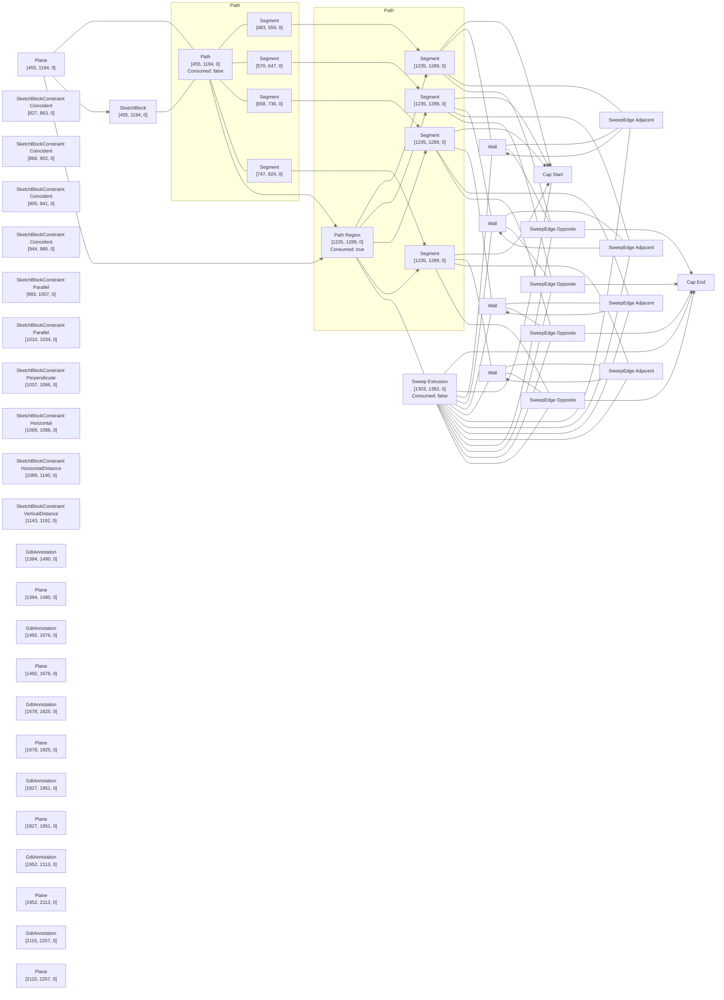

```mermaid
flowchart LR
  subgraph path7 [Path]
    7["Path<br>[455, 1194, 0]<br>Consumed: false"]
      %% [ProgramBodyItem { index: 0 }, VariableDeclarationDeclaration, VariableDeclarationInit]
    10["Segment<br>[483, 559, 0]"]
      %% [ProgramBodyItem { index: 0 }, VariableDeclarationDeclaration, VariableDeclarationInit, SketchBlockBody, SketchBlockBodyItem { index: 0 }, VariableDeclarationDeclaration, VariableDeclarationInit]
    11["Segment<br>[570, 647, 0]"]
      %% [ProgramBodyItem { index: 0 }, VariableDeclarationDeclaration, VariableDeclarationInit, SketchBlockBody, SketchBlockBodyItem { index: 1 }, VariableDeclarationDeclaration, VariableDeclarationInit]
    12["Segment<br>[658, 736, 0]"]
      %% [ProgramBodyItem { index: 0 }, VariableDeclarationDeclaration, VariableDeclarationInit, SketchBlockBody, SketchBlockBodyItem { index: 2 }, VariableDeclarationDeclaration, VariableDeclarationInit]
    13["Segment<br>[747, 824, 0]"]
      %% [ProgramBodyItem { index: 0 }, VariableDeclarationDeclaration, VariableDeclarationInit, SketchBlockBody, SketchBlockBodyItem { index: 3 }, VariableDeclarationDeclaration, VariableDeclarationInit]
  end
  subgraph path24 [Path]
    24["Path Region<br>[1235, 1289, 0]<br>Consumed: true"]
      %% [ProgramBodyItem { index: 2 }, VariableDeclarationDeclaration, VariableDeclarationInit]
    25["Segment<br>[1235, 1289, 0]"]
      %% [ProgramBodyItem { index: 2 }, VariableDeclarationDeclaration, VariableDeclarationInit]
    26["Segment<br>[1235, 1289, 0]"]
      %% [ProgramBodyItem { index: 2 }, VariableDeclarationDeclaration, VariableDeclarationInit]
    27["Segment<br>[1235, 1289, 0]"]
      %% [ProgramBodyItem { index: 2 }, VariableDeclarationDeclaration, VariableDeclarationInit]
    28["Segment<br>[1235, 1289, 0]"]
      %% [ProgramBodyItem { index: 2 }, VariableDeclarationDeclaration, VariableDeclarationInit]
  end
  1["Cap End"]
    %% face_code_ref=Missing NodePath
  2["Cap Start"]
    %% face_code_ref=Missing NodePath
  3[Wall]
    %% face_code_ref=Missing NodePath
  4[Wall]
    %% face_code_ref=Missing NodePath
  5[Wall]
    %% face_code_ref=Missing NodePath
  6[Wall]
    %% face_code_ref=Missing NodePath
  8["Plane<br>[455, 1194, 0]"]
    %% [ProgramBodyItem { index: 0 }, VariableDeclarationDeclaration, VariableDeclarationInit]
  9["SketchBlock<br>[455, 1194, 0]"]
    %% [ProgramBodyItem { index: 0 }, VariableDeclarationDeclaration, VariableDeclarationInit]
  14["SketchBlockConstraint Coincident<br>[827, 863, 0]"]
    %% [ProgramBodyItem { index: 0 }, VariableDeclarationDeclaration, VariableDeclarationInit, SketchBlockBody, SketchBlockBodyItem { index: 4 }, ExpressionStatementExpr]
  15["SketchBlockConstraint Coincident<br>[866, 902, 0]"]
    %% [ProgramBodyItem { index: 0 }, VariableDeclarationDeclaration, VariableDeclarationInit, SketchBlockBody, SketchBlockBodyItem { index: 5 }, ExpressionStatementExpr]
  16["SketchBlockConstraint Coincident<br>[905, 941, 0]"]
    %% [ProgramBodyItem { index: 0 }, VariableDeclarationDeclaration, VariableDeclarationInit, SketchBlockBody, SketchBlockBodyItem { index: 6 }, ExpressionStatementExpr]
  17["SketchBlockConstraint Coincident<br>[944, 980, 0]"]
    %% [ProgramBodyItem { index: 0 }, VariableDeclarationDeclaration, VariableDeclarationInit, SketchBlockBody, SketchBlockBodyItem { index: 7 }, ExpressionStatementExpr]
  18["SketchBlockConstraint Parallel<br>[983, 1007, 0]"]
    %% [ProgramBodyItem { index: 0 }, VariableDeclarationDeclaration, VariableDeclarationInit, SketchBlockBody, SketchBlockBodyItem { index: 8 }, ExpressionStatementExpr]
  19["SketchBlockConstraint Parallel<br>[1010, 1034, 0]"]
    %% [ProgramBodyItem { index: 0 }, VariableDeclarationDeclaration, VariableDeclarationInit, SketchBlockBody, SketchBlockBodyItem { index: 9 }, ExpressionStatementExpr]
  20["SketchBlockConstraint Perpendicular<br>[1037, 1066, 0]"]
    %% [ProgramBodyItem { index: 0 }, VariableDeclarationDeclaration, VariableDeclarationInit, SketchBlockBody, SketchBlockBodyItem { index: 10 }, ExpressionStatementExpr]
  21["SketchBlockConstraint Horizontal<br>[1069, 1086, 0]"]
    %% [ProgramBodyItem { index: 0 }, VariableDeclarationDeclaration, VariableDeclarationInit, SketchBlockBody, SketchBlockBodyItem { index: 11 }, ExpressionStatementExpr]
  22["SketchBlockConstraint HorizontalDistance<br>[1089, 1140, 0]"]
    %% [ProgramBodyItem { index: 0 }, VariableDeclarationDeclaration, VariableDeclarationInit, SketchBlockBody, SketchBlockBodyItem { index: 12 }, ExpressionStatementExpr]
  23["SketchBlockConstraint VerticalDistance<br>[1143, 1192, 0]"]
    %% [ProgramBodyItem { index: 0 }, VariableDeclarationDeclaration, VariableDeclarationInit, SketchBlockBody, SketchBlockBodyItem { index: 13 }, ExpressionStatementExpr]
  29["Sweep Extrusion<br>[1303, 1392, 0]<br>Consumed: false"]
    %% [ProgramBodyItem { index: 3 }, VariableDeclarationDeclaration, VariableDeclarationInit]
  30["GdtAnnotation<br>[1394, 1490, 0]"]
    %% [ProgramBodyItem { index: 4 }, ExpressionStatementExpr]
  31["Plane<br>[1394, 1490, 0]"]
    %% [ProgramBodyItem { index: 4 }, ExpressionStatementExpr]
  32["GdtAnnotation<br>[1492, 1676, 0]"]
    %% [ProgramBodyItem { index: 5 }, ExpressionStatementExpr]
  33["Plane<br>[1492, 1676, 0]"]
    %% [ProgramBodyItem { index: 5 }, ExpressionStatementExpr]
  34["GdtAnnotation<br>[1678, 1825, 0]"]
    %% [ProgramBodyItem { index: 6 }, ExpressionStatementExpr]
  35["Plane<br>[1678, 1825, 0]"]
    %% [ProgramBodyItem { index: 6 }, ExpressionStatementExpr]
  36["GdtAnnotation<br>[1827, 1951, 0]"]
    %% [ProgramBodyItem { index: 7 }, ExpressionStatementExpr]
  37["Plane<br>[1827, 1951, 0]"]
    %% [ProgramBodyItem { index: 7 }, ExpressionStatementExpr]
  38["GdtAnnotation<br>[1952, 2113, 0]"]
    %% [ProgramBodyItem { index: 8 }, ExpressionStatementExpr]
  39["Plane<br>[1952, 2113, 0]"]
    %% [ProgramBodyItem { index: 8 }, ExpressionStatementExpr]
  40["GdtAnnotation<br>[2115, 2257, 0]"]
    %% [ProgramBodyItem { index: 9 }, ExpressionStatementExpr]
  41["Plane<br>[2115, 2257, 0]"]
    %% [ProgramBodyItem { index: 9 }, ExpressionStatementExpr]
  42["SweepEdge Adjacent"]
  43["SweepEdge Adjacent"]
  44["SweepEdge Adjacent"]
  45["SweepEdge Adjacent"]
  46["SweepEdge Opposite"]
  47["SweepEdge Opposite"]
  48["SweepEdge Opposite"]
  49["SweepEdge Opposite"]
  29 --- 1
  46 <--x 1
  47 <--x 1
  48 <--x 1
  49 <--x 1
  25 <--x 2
  26 <--x 2
  27 <--x 2
  28 <--x 2
  29 --- 2
  25 --- 3
  29 --- 3
  3 --- 42
  42 <--x 3
  3 --- 46
  26 --- 4
  29 --- 4
  4 --- 43
  43 <--x 4
  4 --- 47
  27 --- 5
  29 --- 5
  5 --- 44
  44 <--x 5
  5 --- 48
  28 --- 6
  29 --- 6
  6 --- 45
  45 <--x 6
  6 --- 49
  8 --- 7
  9 --- 7
  7 --- 10
  7 --- 11
  7 --- 12
  7 --- 13
  7 <--x 24
  8 <--x 9
  8 <--x 24
  10 <--x 25
  11 <--x 26
  12 <--x 27
  13 <--x 28
  24 <--x 25
  24 <--x 26
  24 <--x 27
  24 <--x 28
  24 ---- 29
  25 --- 42
  25 --- 46
  26 --- 43
  26 --- 47
  27 --- 44
  27 --- 48
  28 --- 45
  28 --- 49
  29 --- 42
  29 --- 43
  29 --- 44
  29 --- 45
  29 --- 46
  29 --- 47
  29 --- 48
  29 --- 49
```
