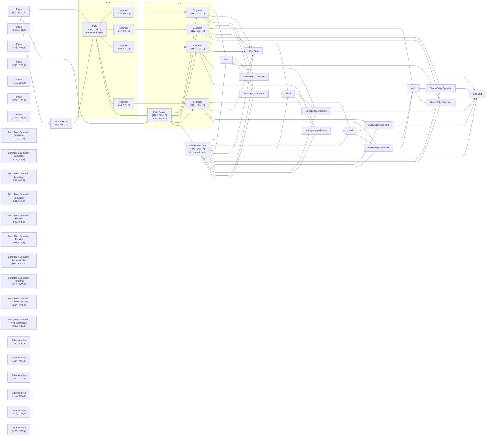

```mermaid
flowchart LR
  subgraph path2 [Path]
    2["Path<br>[402, 1141, 0]<br>Consumed: false"]
      %% [ProgramBodyItem { index: 0 }, VariableDeclarationDeclaration, VariableDeclarationInit]
    3["Segment<br>[430, 506, 0]"]
      %% [ProgramBodyItem { index: 0 }, VariableDeclarationDeclaration, VariableDeclarationInit, SketchBlockBody, SketchBlockBodyItem { index: 0 }, VariableDeclarationDeclaration, VariableDeclarationInit]
    4["Segment<br>[517, 594, 0]"]
      %% [ProgramBodyItem { index: 0 }, VariableDeclarationDeclaration, VariableDeclarationInit, SketchBlockBody, SketchBlockBodyItem { index: 1 }, VariableDeclarationDeclaration, VariableDeclarationInit]
    5["Segment<br>[605, 683, 0]"]
      %% [ProgramBodyItem { index: 0 }, VariableDeclarationDeclaration, VariableDeclarationInit, SketchBlockBody, SketchBlockBodyItem { index: 2 }, VariableDeclarationDeclaration, VariableDeclarationInit]
    6["Segment<br>[694, 771, 0]"]
      %% [ProgramBodyItem { index: 0 }, VariableDeclarationDeclaration, VariableDeclarationInit, SketchBlockBody, SketchBlockBodyItem { index: 3 }, VariableDeclarationDeclaration, VariableDeclarationInit]
  end
  subgraph path7 [Path]
    7["Path Region<br>[1182, 1236, 0]<br>Consumed: true"]
      %% [ProgramBodyItem { index: 2 }, VariableDeclarationDeclaration, VariableDeclarationInit]
    8["Segment<br>[1182, 1236, 0]"]
      %% [ProgramBodyItem { index: 2 }, VariableDeclarationDeclaration, VariableDeclarationInit]
    9["Segment<br>[1182, 1236, 0]"]
      %% [ProgramBodyItem { index: 2 }, VariableDeclarationDeclaration, VariableDeclarationInit]
    10["Segment<br>[1182, 1236, 0]"]
      %% [ProgramBodyItem { index: 2 }, VariableDeclarationDeclaration, VariableDeclarationInit]
    11["Segment<br>[1182, 1236, 0]"]
      %% [ProgramBodyItem { index: 2 }, VariableDeclarationDeclaration, VariableDeclarationInit]
  end
  1["Plane<br>[402, 1141, 0]"]
    %% [ProgramBodyItem { index: 0 }, VariableDeclarationDeclaration, VariableDeclarationInit]
  12["Sweep Extrusion<br>[1250, 1339, 0]<br>Consumed: false"]
    %% [ProgramBodyItem { index: 3 }, VariableDeclarationDeclaration, VariableDeclarationInit]
  13[Wall]
    %% face_code_ref=Missing NodePath
  14[Wall]
    %% face_code_ref=Missing NodePath
  15[Wall]
    %% face_code_ref=Missing NodePath
  16[Wall]
    %% face_code_ref=Missing NodePath
  17["Cap Start"]
    %% face_code_ref=Missing NodePath
  18["Cap End"]
    %% face_code_ref=Missing NodePath
  19["SweepEdge Opposite"]
  20["SweepEdge Adjacent"]
  21["SweepEdge Opposite"]
  22["SweepEdge Adjacent"]
  23["SweepEdge Opposite"]
  24["SweepEdge Adjacent"]
  25["SweepEdge Opposite"]
  26["SweepEdge Adjacent"]
  27["Plane<br>[1340, 1487, 0]"]
    %% [ProgramBodyItem { index: 4 }, ExpressionStatementExpr]
  28["Plane<br>[1488, 1584, 0]"]
    %% [ProgramBodyItem { index: 5 }, ExpressionStatementExpr]
  29["Plane<br>[1585, 1709, 0]"]
    %% [ProgramBodyItem { index: 6 }, ExpressionStatementExpr]
  30["Plane<br>[1710, 1871, 0]"]
    %% [ProgramBodyItem { index: 7 }, ExpressionStatementExpr]
  31["Plane<br>[1872, 2125, 0]"]
    %% [ProgramBodyItem { index: 8 }, ExpressionStatementExpr]
  32["Plane<br>[2126, 2268, 0]"]
    %% [ProgramBodyItem { index: 9 }, ExpressionStatementExpr]
  33["SketchBlock<br>[402, 1141, 0]"]
    %% [ProgramBodyItem { index: 0 }, VariableDeclarationDeclaration, VariableDeclarationInit]
  34["SketchBlockConstraint Coincident<br>[774, 810, 0]"]
    %% [ProgramBodyItem { index: 0 }, VariableDeclarationDeclaration, VariableDeclarationInit, SketchBlockBody, SketchBlockBodyItem { index: 4 }, ExpressionStatementExpr]
  35["SketchBlockConstraint Coincident<br>[813, 849, 0]"]
    %% [ProgramBodyItem { index: 0 }, VariableDeclarationDeclaration, VariableDeclarationInit, SketchBlockBody, SketchBlockBodyItem { index: 5 }, ExpressionStatementExpr]
  36["SketchBlockConstraint Coincident<br>[852, 888, 0]"]
    %% [ProgramBodyItem { index: 0 }, VariableDeclarationDeclaration, VariableDeclarationInit, SketchBlockBody, SketchBlockBodyItem { index: 6 }, ExpressionStatementExpr]
  37["SketchBlockConstraint Coincident<br>[891, 927, 0]"]
    %% [ProgramBodyItem { index: 0 }, VariableDeclarationDeclaration, VariableDeclarationInit, SketchBlockBody, SketchBlockBodyItem { index: 7 }, ExpressionStatementExpr]
  38["SketchBlockConstraint Parallel<br>[930, 954, 0]"]
    %% [ProgramBodyItem { index: 0 }, VariableDeclarationDeclaration, VariableDeclarationInit, SketchBlockBody, SketchBlockBodyItem { index: 8 }, ExpressionStatementExpr]
  39["SketchBlockConstraint Parallel<br>[957, 981, 0]"]
    %% [ProgramBodyItem { index: 0 }, VariableDeclarationDeclaration, VariableDeclarationInit, SketchBlockBody, SketchBlockBodyItem { index: 9 }, ExpressionStatementExpr]
  40["SketchBlockConstraint Perpendicular<br>[984, 1013, 0]"]
    %% [ProgramBodyItem { index: 0 }, VariableDeclarationDeclaration, VariableDeclarationInit, SketchBlockBody, SketchBlockBodyItem { index: 10 }, ExpressionStatementExpr]
  41["SketchBlockConstraint Horizontal<br>[1016, 1033, 0]"]
    %% [ProgramBodyItem { index: 0 }, VariableDeclarationDeclaration, VariableDeclarationInit, SketchBlockBody, SketchBlockBodyItem { index: 11 }, ExpressionStatementExpr]
  42["SketchBlockConstraint HorizontalDistance<br>[1036, 1087, 0]"]
    %% [ProgramBodyItem { index: 0 }, VariableDeclarationDeclaration, VariableDeclarationInit, SketchBlockBody, SketchBlockBodyItem { index: 12 }, ExpressionStatementExpr]
  43["SketchBlockConstraint VerticalDistance<br>[1090, 1139, 0]"]
    %% [ProgramBodyItem { index: 0 }, VariableDeclarationDeclaration, VariableDeclarationInit, SketchBlockBody, SketchBlockBodyItem { index: 13 }, ExpressionStatementExpr]
  44["GdtAnnotation<br>[1340, 1487, 0]"]
    %% [ProgramBodyItem { index: 4 }, ExpressionStatementExpr]
  45["GdtAnnotation<br>[1488, 1584, 0]"]
    %% [ProgramBodyItem { index: 5 }, ExpressionStatementExpr]
  46["GdtAnnotation<br>[1585, 1709, 0]"]
    %% [ProgramBodyItem { index: 6 }, ExpressionStatementExpr]
  47["GdtAnnotation<br>[1710, 1871, 0]"]
    %% [ProgramBodyItem { index: 7 }, ExpressionStatementExpr]
  48["GdtAnnotation<br>[1872, 2125, 0]"]
    %% [ProgramBodyItem { index: 8 }, ExpressionStatementExpr]
  49["GdtAnnotation<br>[2126, 2268, 0]"]
    %% [ProgramBodyItem { index: 9 }, ExpressionStatementExpr]
  1 --- 2
  1 <--x 7
  1 <--x 33
  2 --- 3
  2 --- 4
  2 --- 5
  2 --- 6
  2 <--x 7
  33 --- 2
  3 <--x 8
  4 <--x 9
  5 <--x 10
  6 <--x 11
  7 <--x 8
  7 <--x 9
  7 <--x 10
  7 <--x 11
  7 ---- 12
  8 --- 16
  8 x--> 17
  8 --- 25
  8 --- 26
  9 --- 13
  9 x--> 17
  9 --- 19
  9 --- 20
  10 --- 15
  10 x--> 17
  10 --- 23
  10 --- 24
  11 --- 14
  11 x--> 17
  11 --- 21
  11 --- 22
  12 --- 13
  12 --- 14
  12 --- 15
  12 --- 16
  12 --- 17
  12 --- 18
  12 --- 19
  12 --- 20
  12 --- 21
  12 --- 22
  12 --- 23
  12 --- 24
  12 --- 25
  12 --- 26
  13 --- 19
  13 --- 20
  22 <--x 13
  14 --- 21
  14 --- 22
  24 <--x 14
  15 --- 23
  15 --- 24
  26 <--x 15
  20 <--x 16
  16 --- 25
  16 --- 26
  19 <--x 18
  21 <--x 18
  23 <--x 18
  25 <--x 18
```
