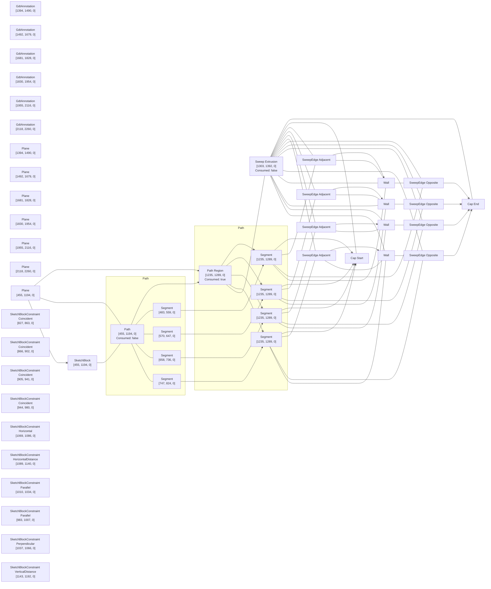

```mermaid
flowchart LR
  subgraph path9 [Path]
    9["Path Region<br>[1235, 1289, 0]<br>Consumed: true"]
      %% [ProgramBodyItem { index: 2 }, VariableDeclarationDeclaration, VariableDeclarationInit]
    18["Segment<br>[1235, 1289, 0]"]
      %% [ProgramBodyItem { index: 2 }, VariableDeclarationDeclaration, VariableDeclarationInit]
    19["Segment<br>[1235, 1289, 0]"]
      %% [ProgramBodyItem { index: 2 }, VariableDeclarationDeclaration, VariableDeclarationInit]
    20["Segment<br>[1235, 1289, 0]"]
      %% [ProgramBodyItem { index: 2 }, VariableDeclarationDeclaration, VariableDeclarationInit]
    21["Segment<br>[1235, 1289, 0]"]
      %% [ProgramBodyItem { index: 2 }, VariableDeclarationDeclaration, VariableDeclarationInit]
  end
  subgraph path10 [Path]
    10["Path<br>[455, 1194, 0]<br>Consumed: false"]
      %% [ProgramBodyItem { index: 0 }, VariableDeclarationDeclaration, VariableDeclarationInit]
    22["Segment<br>[483, 559, 0]"]
      %% [ProgramBodyItem { index: 0 }, VariableDeclarationDeclaration, VariableDeclarationInit, SketchBlockBody, SketchBlockBodyItem { index: 0 }, VariableDeclarationDeclaration, VariableDeclarationInit]
    23["Segment<br>[570, 647, 0]"]
      %% [ProgramBodyItem { index: 0 }, VariableDeclarationDeclaration, VariableDeclarationInit, SketchBlockBody, SketchBlockBodyItem { index: 1 }, VariableDeclarationDeclaration, VariableDeclarationInit]
    24["Segment<br>[658, 736, 0]"]
      %% [ProgramBodyItem { index: 0 }, VariableDeclarationDeclaration, VariableDeclarationInit, SketchBlockBody, SketchBlockBodyItem { index: 2 }, VariableDeclarationDeclaration, VariableDeclarationInit]
    25["Segment<br>[747, 824, 0]"]
      %% [ProgramBodyItem { index: 0 }, VariableDeclarationDeclaration, VariableDeclarationInit, SketchBlockBody, SketchBlockBodyItem { index: 3 }, VariableDeclarationDeclaration, VariableDeclarationInit]
  end
  1["Cap End"]
    %% face_code_ref=Missing NodePath
  2["Cap Start"]
    %% face_code_ref=Missing NodePath
  3["GdtAnnotation<br>[1394, 1490, 0]"]
    %% [ProgramBodyItem { index: 4 }, ExpressionStatementExpr]
  4["GdtAnnotation<br>[1492, 1679, 0]"]
    %% [ProgramBodyItem { index: 5 }, ExpressionStatementExpr]
  5["GdtAnnotation<br>[1681, 1828, 0]"]
    %% [ProgramBodyItem { index: 6 }, ExpressionStatementExpr]
  6["GdtAnnotation<br>[1830, 1954, 0]"]
    %% [ProgramBodyItem { index: 7 }, ExpressionStatementExpr]
  7["GdtAnnotation<br>[1955, 2116, 0]"]
    %% [ProgramBodyItem { index: 8 }, ExpressionStatementExpr]
  8["GdtAnnotation<br>[2118, 2260, 0]"]
    %% [ProgramBodyItem { index: 9 }, ExpressionStatementExpr]
  11["Plane<br>[1394, 1490, 0]"]
    %% [ProgramBodyItem { index: 4 }, ExpressionStatementExpr]
  12["Plane<br>[1492, 1679, 0]"]
    %% [ProgramBodyItem { index: 5 }, ExpressionStatementExpr]
  13["Plane<br>[1681, 1828, 0]"]
    %% [ProgramBodyItem { index: 6 }, ExpressionStatementExpr]
  14["Plane<br>[1830, 1954, 0]"]
    %% [ProgramBodyItem { index: 7 }, ExpressionStatementExpr]
  15["Plane<br>[1955, 2116, 0]"]
    %% [ProgramBodyItem { index: 8 }, ExpressionStatementExpr]
  16["Plane<br>[2118, 2260, 0]"]
    %% [ProgramBodyItem { index: 9 }, ExpressionStatementExpr]
  17["Plane<br>[455, 1194, 0]"]
    %% [ProgramBodyItem { index: 0 }, VariableDeclarationDeclaration, VariableDeclarationInit]
  26["SketchBlock<br>[455, 1194, 0]"]
    %% [ProgramBodyItem { index: 0 }, VariableDeclarationDeclaration, VariableDeclarationInit]
  27["SketchBlockConstraint Coincident<br>[827, 863, 0]"]
    %% [ProgramBodyItem { index: 0 }, VariableDeclarationDeclaration, VariableDeclarationInit, SketchBlockBody, SketchBlockBodyItem { index: 4 }, ExpressionStatementExpr]
  28["SketchBlockConstraint Coincident<br>[866, 902, 0]"]
    %% [ProgramBodyItem { index: 0 }, VariableDeclarationDeclaration, VariableDeclarationInit, SketchBlockBody, SketchBlockBodyItem { index: 5 }, ExpressionStatementExpr]
  29["SketchBlockConstraint Coincident<br>[905, 941, 0]"]
    %% [ProgramBodyItem { index: 0 }, VariableDeclarationDeclaration, VariableDeclarationInit, SketchBlockBody, SketchBlockBodyItem { index: 6 }, ExpressionStatementExpr]
  30["SketchBlockConstraint Coincident<br>[944, 980, 0]"]
    %% [ProgramBodyItem { index: 0 }, VariableDeclarationDeclaration, VariableDeclarationInit, SketchBlockBody, SketchBlockBodyItem { index: 7 }, ExpressionStatementExpr]
  31["SketchBlockConstraint Horizontal<br>[1069, 1086, 0]"]
    %% [ProgramBodyItem { index: 0 }, VariableDeclarationDeclaration, VariableDeclarationInit, SketchBlockBody, SketchBlockBodyItem { index: 11 }, ExpressionStatementExpr]
  32["SketchBlockConstraint HorizontalDistance<br>[1089, 1140, 0]"]
    %% [ProgramBodyItem { index: 0 }, VariableDeclarationDeclaration, VariableDeclarationInit, SketchBlockBody, SketchBlockBodyItem { index: 12 }, ExpressionStatementExpr]
  33["SketchBlockConstraint Parallel<br>[1010, 1034, 0]"]
    %% [ProgramBodyItem { index: 0 }, VariableDeclarationDeclaration, VariableDeclarationInit, SketchBlockBody, SketchBlockBodyItem { index: 9 }, ExpressionStatementExpr]
  34["SketchBlockConstraint Parallel<br>[983, 1007, 0]"]
    %% [ProgramBodyItem { index: 0 }, VariableDeclarationDeclaration, VariableDeclarationInit, SketchBlockBody, SketchBlockBodyItem { index: 8 }, ExpressionStatementExpr]
  35["SketchBlockConstraint Perpendicular<br>[1037, 1066, 0]"]
    %% [ProgramBodyItem { index: 0 }, VariableDeclarationDeclaration, VariableDeclarationInit, SketchBlockBody, SketchBlockBodyItem { index: 10 }, ExpressionStatementExpr]
  36["SketchBlockConstraint VerticalDistance<br>[1143, 1192, 0]"]
    %% [ProgramBodyItem { index: 0 }, VariableDeclarationDeclaration, VariableDeclarationInit, SketchBlockBody, SketchBlockBodyItem { index: 13 }, ExpressionStatementExpr]
  37["Sweep Extrusion<br>[1303, 1392, 0]<br>Consumed: false"]
    %% [ProgramBodyItem { index: 3 }, VariableDeclarationDeclaration, VariableDeclarationInit]
  38["SweepEdge Adjacent"]
  39["SweepEdge Adjacent"]
  40["SweepEdge Adjacent"]
  41["SweepEdge Adjacent"]
  42["SweepEdge Opposite"]
  43["SweepEdge Opposite"]
  44["SweepEdge Opposite"]
  45["SweepEdge Opposite"]
  46[Wall]
    %% face_code_ref=Missing NodePath
  47[Wall]
    %% face_code_ref=Missing NodePath
  48[Wall]
    %% face_code_ref=Missing NodePath
  49[Wall]
    %% face_code_ref=Missing NodePath
  37 --- 1
  42 <--x 1
  43 <--x 1
  44 <--x 1
  45 <--x 1
  18 <--x 2
  19 <--x 2
  20 <--x 2
  21 <--x 2
  37 --- 2
  10 x--> 9
  17 x--> 9
  9 <--x 18
  9 <--x 19
  9 <--x 20
  9 <--x 21
  9 ---- 37
  17 --- 10
  10 --- 22
  10 --- 23
  10 --- 24
  10 --- 25
  26 --- 10
  17 <--x 26
  22 x--> 18
  18 --- 38
  18 --- 42
  18 --- 46
  23 x--> 19
  19 --- 39
  19 --- 43
  19 --- 47
  24 x--> 20
  20 --- 40
  20 --- 44
  20 --- 48
  25 x--> 21
  21 --- 41
  21 --- 45
  21 --- 49
  37 --- 38
  37 --- 39
  37 --- 40
  37 --- 41
  37 --- 42
  37 --- 43
  37 --- 44
  37 --- 45
  37 --- 46
  37 --- 47
  37 --- 48
  37 --- 49
  46 --- 38
  38 x--> 46
  39 x--> 47
  47 --- 39
  40 x--> 48
  48 --- 40
  41 x--> 49
  49 --- 41
  46 --- 42
  47 --- 43
  48 --- 44
  49 --- 45
```
