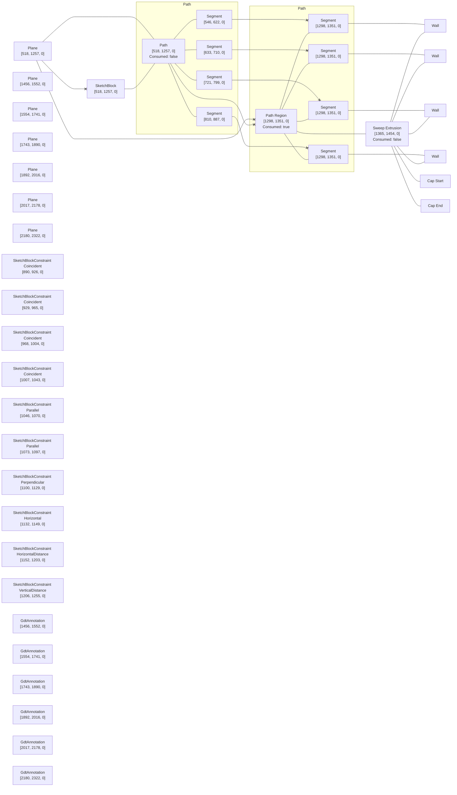

```mermaid
flowchart LR
  subgraph path2 [Path]
    2["Path<br>[518, 1257, 0]<br>Consumed: false"]
      %% [ProgramBodyItem { index: 0 }, VariableDeclarationDeclaration, VariableDeclarationInit]
    3["Segment<br>[546, 622, 0]"]
      %% [ProgramBodyItem { index: 0 }, VariableDeclarationDeclaration, VariableDeclarationInit, SketchBlockBody, SketchBlockBodyItem { index: 0 }, VariableDeclarationDeclaration, VariableDeclarationInit]
    4["Segment<br>[633, 710, 0]"]
      %% [ProgramBodyItem { index: 0 }, VariableDeclarationDeclaration, VariableDeclarationInit, SketchBlockBody, SketchBlockBodyItem { index: 1 }, VariableDeclarationDeclaration, VariableDeclarationInit]
    5["Segment<br>[721, 799, 0]"]
      %% [ProgramBodyItem { index: 0 }, VariableDeclarationDeclaration, VariableDeclarationInit, SketchBlockBody, SketchBlockBodyItem { index: 2 }, VariableDeclarationDeclaration, VariableDeclarationInit]
    6["Segment<br>[810, 887, 0]"]
      %% [ProgramBodyItem { index: 0 }, VariableDeclarationDeclaration, VariableDeclarationInit, SketchBlockBody, SketchBlockBodyItem { index: 3 }, VariableDeclarationDeclaration, VariableDeclarationInit]
  end
  subgraph path7 [Path]
    7["Path Region<br>[1298, 1351, 0]<br>Consumed: true"]
      %% [ProgramBodyItem { index: 2 }, VariableDeclarationDeclaration, VariableDeclarationInit]
    8["Segment<br>[1298, 1351, 0]"]
      %% [ProgramBodyItem { index: 2 }, VariableDeclarationDeclaration, VariableDeclarationInit]
    9["Segment<br>[1298, 1351, 0]"]
      %% [ProgramBodyItem { index: 2 }, VariableDeclarationDeclaration, VariableDeclarationInit]
    10["Segment<br>[1298, 1351, 0]"]
      %% [ProgramBodyItem { index: 2 }, VariableDeclarationDeclaration, VariableDeclarationInit]
    11["Segment<br>[1298, 1351, 0]"]
      %% [ProgramBodyItem { index: 2 }, VariableDeclarationDeclaration, VariableDeclarationInit]
  end
  1["Plane<br>[518, 1257, 0]"]
    %% [ProgramBodyItem { index: 0 }, VariableDeclarationDeclaration, VariableDeclarationInit]
  12["Sweep Extrusion<br>[1365, 1454, 0]<br>Consumed: false"]
    %% [ProgramBodyItem { index: 3 }, VariableDeclarationDeclaration, VariableDeclarationInit]
  13[Wall]
    %% face_code_ref=Missing NodePath
  14[Wall]
    %% face_code_ref=Missing NodePath
  15[Wall]
    %% face_code_ref=Missing NodePath
  16[Wall]
    %% face_code_ref=Missing NodePath
  17["Cap Start"]
    %% face_code_ref=Missing NodePath
  18["Cap End"]
    %% face_code_ref=Missing NodePath
  19["Plane<br>[1456, 1552, 0]"]
    %% [ProgramBodyItem { index: 4 }, ExpressionStatementExpr]
  20["Plane<br>[1554, 1741, 0]"]
    %% [ProgramBodyItem { index: 5 }, ExpressionStatementExpr]
  21["Plane<br>[1743, 1890, 0]"]
    %% [ProgramBodyItem { index: 6 }, ExpressionStatementExpr]
  22["Plane<br>[1892, 2016, 0]"]
    %% [ProgramBodyItem { index: 7 }, ExpressionStatementExpr]
  23["Plane<br>[2017, 2178, 0]"]
    %% [ProgramBodyItem { index: 8 }, ExpressionStatementExpr]
  24["Plane<br>[2180, 2322, 0]"]
    %% [ProgramBodyItem { index: 9 }, ExpressionStatementExpr]
  25["SketchBlock<br>[518, 1257, 0]"]
    %% [ProgramBodyItem { index: 0 }, VariableDeclarationDeclaration, VariableDeclarationInit]
  26["SketchBlockConstraint Coincident<br>[890, 926, 0]"]
    %% [ProgramBodyItem { index: 0 }, VariableDeclarationDeclaration, VariableDeclarationInit, SketchBlockBody, SketchBlockBodyItem { index: 4 }, ExpressionStatementExpr]
  27["SketchBlockConstraint Coincident<br>[929, 965, 0]"]
    %% [ProgramBodyItem { index: 0 }, VariableDeclarationDeclaration, VariableDeclarationInit, SketchBlockBody, SketchBlockBodyItem { index: 5 }, ExpressionStatementExpr]
  28["SketchBlockConstraint Coincident<br>[968, 1004, 0]"]
    %% [ProgramBodyItem { index: 0 }, VariableDeclarationDeclaration, VariableDeclarationInit, SketchBlockBody, SketchBlockBodyItem { index: 6 }, ExpressionStatementExpr]
  29["SketchBlockConstraint Coincident<br>[1007, 1043, 0]"]
    %% [ProgramBodyItem { index: 0 }, VariableDeclarationDeclaration, VariableDeclarationInit, SketchBlockBody, SketchBlockBodyItem { index: 7 }, ExpressionStatementExpr]
  30["SketchBlockConstraint Parallel<br>[1046, 1070, 0]"]
    %% [ProgramBodyItem { index: 0 }, VariableDeclarationDeclaration, VariableDeclarationInit, SketchBlockBody, SketchBlockBodyItem { index: 8 }, ExpressionStatementExpr]
  31["SketchBlockConstraint Parallel<br>[1073, 1097, 0]"]
    %% [ProgramBodyItem { index: 0 }, VariableDeclarationDeclaration, VariableDeclarationInit, SketchBlockBody, SketchBlockBodyItem { index: 9 }, ExpressionStatementExpr]
  32["SketchBlockConstraint Perpendicular<br>[1100, 1129, 0]"]
    %% [ProgramBodyItem { index: 0 }, VariableDeclarationDeclaration, VariableDeclarationInit, SketchBlockBody, SketchBlockBodyItem { index: 10 }, ExpressionStatementExpr]
  33["SketchBlockConstraint Horizontal<br>[1132, 1149, 0]"]
    %% [ProgramBodyItem { index: 0 }, VariableDeclarationDeclaration, VariableDeclarationInit, SketchBlockBody, SketchBlockBodyItem { index: 11 }, ExpressionStatementExpr]
  34["SketchBlockConstraint HorizontalDistance<br>[1152, 1203, 0]"]
    %% [ProgramBodyItem { index: 0 }, VariableDeclarationDeclaration, VariableDeclarationInit, SketchBlockBody, SketchBlockBodyItem { index: 12 }, ExpressionStatementExpr]
  35["SketchBlockConstraint VerticalDistance<br>[1206, 1255, 0]"]
    %% [ProgramBodyItem { index: 0 }, VariableDeclarationDeclaration, VariableDeclarationInit, SketchBlockBody, SketchBlockBodyItem { index: 13 }, ExpressionStatementExpr]
  36["GdtAnnotation<br>[1456, 1552, 0]"]
    %% [ProgramBodyItem { index: 4 }, ExpressionStatementExpr]
  37["GdtAnnotation<br>[1554, 1741, 0]"]
    %% [ProgramBodyItem { index: 5 }, ExpressionStatementExpr]
  38["GdtAnnotation<br>[1743, 1890, 0]"]
    %% [ProgramBodyItem { index: 6 }, ExpressionStatementExpr]
  39["GdtAnnotation<br>[1892, 2016, 0]"]
    %% [ProgramBodyItem { index: 7 }, ExpressionStatementExpr]
  40["GdtAnnotation<br>[2017, 2178, 0]"]
    %% [ProgramBodyItem { index: 8 }, ExpressionStatementExpr]
  41["GdtAnnotation<br>[2180, 2322, 0]"]
    %% [ProgramBodyItem { index: 9 }, ExpressionStatementExpr]
  1 --- 2
  1 <--x 7
  1 <--x 25
  2 --- 3
  2 --- 4
  2 --- 5
  2 --- 6
  2 <--x 7
  25 --- 2
  3 <--x 8
  4 <--x 9
  5 <--x 10
  6 <--x 11
  7 --- 8
  7 --- 9
  7 --- 10
  7 --- 11
  7 ---- 12
  8 --- 13
  9 --- 14
  10 --- 15
  11 --- 16
  12 --- 13
  12 --- 14
  12 --- 15
  12 --- 16
  12 --- 17
  12 --- 18
```
