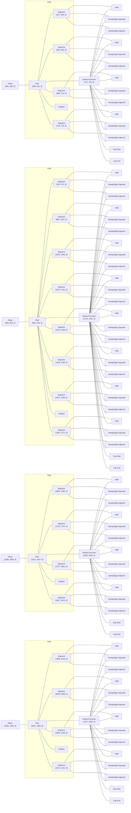

```mermaid
flowchart LR
  subgraph path2 [Path]
    2["Path<br>[586, 621, 0]"]
    3["Segment<br>[627, 650, 0]"]
    4["Segment<br>[656, 682, 0]"]
    5["Segment<br>[688, 712, 0]"]
    6["Segment<br>[718, 725, 0]"]
    7[Solid2d]
  end
  subgraph path24 [Path]
    24["Path<br>[862, 916, 0]"]
    25["Segment<br>[924, 972, 0]"]
    26["Segment<br>[980, 1012, 0]"]
    27["Segment<br>[1020, 1068, 0]"]
    28["Segment<br>[1076, 1101, 0]"]
    29["Segment<br>[1109, 1158, 0]"]
    30["Segment<br>[1166, 1199, 0]"]
    31["Segment<br>[1207, 1256, 0]"]
    32["Segment<br>[1264, 1271, 0]"]
    33[Solid2d]
  end
  subgraph path62 [Path]
    62["Path<br>[1614, 1657, 0]"]
    63["Segment<br>[1663, 1696, 0]"]
    64["Segment<br>[1702, 1751, 0]"]
    65["Segment<br>[1757, 1801, 0]"]
    66["Segment<br>[1807, 1814, 0]"]
    67[Solid2d]
  end
  subgraph path84 [Path]
    84["Path<br>[1951, 1993, 0]"]
    85["Segment<br>[1999, 2033, 0]"]
    86["Segment<br>[2039, 2089, 0]"]
    87["Segment<br>[2095, 2138, 0]"]
    88["Segment<br>[2144, 2151, 0]"]
    89[Solid2d]
  end
  1["Plane<br>[561, 580, 0]"]
  8["Sweep Extrusion<br>[731, 754, 0]"]
  9[Wall]
  10[Wall]
  11[Wall]
  12[Wall]
  13["Cap Start"]
  14["Cap End"]
  15["SweepEdge Opposite"]
  16["SweepEdge Adjacent"]
  17["SweepEdge Opposite"]
  18["SweepEdge Adjacent"]
  19["SweepEdge Opposite"]
  20["SweepEdge Adjacent"]
  21["SweepEdge Opposite"]
  22["SweepEdge Adjacent"]
  23["Plane<br>[835, 854, 0]"]
  34["Sweep Extrusion<br>[1279, 1302, 0]"]
  35[Wall]
  36[Wall]
  37[Wall]
  38[Wall]
  39[Wall]
  40[Wall]
  41[Wall]
  42[Wall]
  43["Cap Start"]
  44["Cap End"]
  45["SweepEdge Opposite"]
  46["SweepEdge Adjacent"]
  47["SweepEdge Opposite"]
  48["SweepEdge Adjacent"]
  49["SweepEdge Opposite"]
  50["SweepEdge Adjacent"]
  51["SweepEdge Opposite"]
  52["SweepEdge Adjacent"]
  53["SweepEdge Opposite"]
  54["SweepEdge Adjacent"]
  55["SweepEdge Opposite"]
  56["SweepEdge Adjacent"]
  57["SweepEdge Opposite"]
  58["SweepEdge Adjacent"]
  59["SweepEdge Opposite"]
  60["SweepEdge Adjacent"]
  61["Plane<br>[1589, 1608, 0]"]
  68["Sweep Extrusion<br>[1820, 1843, 0]"]
  69[Wall]
  70[Wall]
  71[Wall]
  72[Wall]
  73["Cap Start"]
  74["Cap End"]
  75["SweepEdge Opposite"]
  76["SweepEdge Adjacent"]
  77["SweepEdge Opposite"]
  78["SweepEdge Adjacent"]
  79["SweepEdge Opposite"]
  80["SweepEdge Adjacent"]
  81["SweepEdge Opposite"]
  82["SweepEdge Adjacent"]
  83["Plane<br>[1926, 1945, 0]"]
  90["Sweep Extrusion<br>[2157, 2180, 0]"]
  91[Wall]
  92[Wall]
  93[Wall]
  94[Wall]
  95["Cap Start"]
  96["Cap End"]
  97["SweepEdge Opposite"]
  98["SweepEdge Adjacent"]
  99["SweepEdge Opposite"]
  100["SweepEdge Adjacent"]
  101["SweepEdge Opposite"]
  102["SweepEdge Adjacent"]
  103["SweepEdge Opposite"]
  104["SweepEdge Adjacent"]
  1 --- 2
  2 --- 3
  2 --- 4
  2 --- 5
  2 --- 6
  2 ---- 8
  2 --- 7
  3 --- 9
  3 --- 15
  3 --- 16
  4 --- 10
  4 --- 17
  4 --- 18
  5 --- 11
  5 --- 19
  5 --- 20
  6 --- 12
  6 --- 21
  6 --- 22
  8 --- 9
  8 --- 10
  8 --- 11
  8 --- 12
  8 --- 13
  8 --- 14
  8 --- 15
  8 --- 16
  8 --- 17
  8 --- 18
  8 --- 19
  8 --- 20
  8 --- 21
  8 --- 22
  23 --- 24
  24 --- 25
  24 --- 26
  24 --- 27
  24 --- 28
  24 --- 29
  24 --- 30
  24 --- 31
  24 --- 32
  24 ---- 34
  24 --- 33
  25 --- 42
  25 --- 59
  25 --- 60
  26 --- 41
  26 --- 57
  26 --- 58
  27 --- 40
  27 --- 55
  27 --- 56
  28 --- 39
  28 --- 53
  28 --- 54
  29 --- 38
  29 --- 51
  29 --- 52
  30 --- 37
  30 --- 49
  30 --- 50
  31 --- 36
  31 --- 47
  31 --- 48
  32 --- 35
  32 --- 45
  32 --- 46
  34 --- 35
  34 --- 36
  34 --- 37
  34 --- 38
  34 --- 39
  34 --- 40
  34 --- 41
  34 --- 42
  34 --- 43
  34 --- 44
  34 --- 45
  34 --- 46
  34 --- 47
  34 --- 48
  34 --- 49
  34 --- 50
  34 --- 51
  34 --- 52
  34 --- 53
  34 --- 54
  34 --- 55
  34 --- 56
  34 --- 57
  34 --- 58
  34 --- 59
  34 --- 60
  61 --- 62
  62 --- 63
  62 --- 64
  62 --- 65
  62 --- 66
  62 ---- 68
  62 --- 67
  63 --- 72
  63 --- 81
  63 --- 82
  64 --- 71
  64 --- 79
  64 --- 80
  65 --- 70
  65 --- 77
  65 --- 78
  66 --- 69
  66 --- 75
  66 --- 76
  68 --- 69
  68 --- 70
  68 --- 71
  68 --- 72
  68 --- 73
  68 --- 74
  68 --- 75
  68 --- 76
  68 --- 77
  68 --- 78
  68 --- 79
  68 --- 80
  68 --- 81
  68 --- 82
  83 --- 84
  84 --- 85
  84 --- 86
  84 --- 87
  84 --- 88
  84 ---- 90
  84 --- 89
  85 --- 91
  85 --- 97
  85 --- 98
  86 --- 92
  86 --- 99
  86 --- 100
  87 --- 93
  87 --- 101
  87 --- 102
  88 --- 94
  88 --- 103
  88 --- 104
  90 --- 91
  90 --- 92
  90 --- 93
  90 --- 94
  90 --- 95
  90 --- 96
  90 --- 97
  90 --- 98
  90 --- 99
  90 --- 100
  90 --- 101
  90 --- 102
  90 --- 103
  90 --- 104
```
