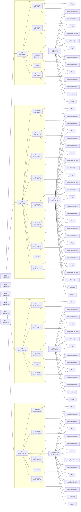

```mermaid
flowchart LR
  subgraph path7 [Path]
    7["Path<br>[586, 621, 0]"]
    8["Segment<br>[627, 650, 0]"]
    9["Segment<br>[656, 682, 0]"]
    10["Segment<br>[688, 712, 0]"]
    11["Segment<br>[718, 725, 0]"]
    12[Solid2d]
  end
  subgraph path28 [Path]
    28["Path<br>[862, 916, 0]"]
    29["Segment<br>[924, 972, 0]"]
    30["Segment<br>[980, 1012, 0]"]
    31["Segment<br>[1020, 1068, 0]"]
    32["Segment<br>[1076, 1101, 0]"]
    33["Segment<br>[1109, 1158, 0]"]
    34["Segment<br>[1166, 1199, 0]"]
    35["Segment<br>[1207, 1256, 0]"]
    36["Segment<br>[1264, 1271, 0]"]
    37[Solid2d]
  end
  subgraph path65 [Path]
    65["Path<br>[1614, 1657, 0]"]
    66["Segment<br>[1663, 1696, 0]"]
    67["Segment<br>[1702, 1751, 0]"]
    68["Segment<br>[1757, 1801, 0]"]
    69["Segment<br>[1807, 1814, 0]"]
    70[Solid2d]
  end
  subgraph path86 [Path]
    86["Path<br>[1951, 1993, 0]"]
    87["Segment<br>[1999, 2033, 0]"]
    88["Segment<br>[2039, 2089, 0]"]
    89["Segment<br>[2095, 2138, 0]"]
    90["Segment<br>[2144, 2151, 0]"]
    91[Solid2d]
  end
  1["Plane<br>[561, 580, 0]"]
  2["Plane<br>[561, 580, 0]"]
  3["Plane<br>[561, 580, 0]"]
  4["Plane<br>[561, 580, 0]"]
  5["Plane<br>[561, 580, 0]"]
  6["Plane<br>[561, 580, 0]"]
  13["Sweep Extrusion<br>[731, 754, 0]"]
  14[Wall]
  15[Wall]
  16[Wall]
  17[Wall]
  18["Cap Start"]
  19["Cap End"]
  20["SweepEdge Opposite"]
  21["SweepEdge Adjacent"]
  22["SweepEdge Opposite"]
  23["SweepEdge Adjacent"]
  24["SweepEdge Opposite"]
  25["SweepEdge Adjacent"]
  26["SweepEdge Opposite"]
  27["SweepEdge Adjacent"]
  38["Sweep Extrusion<br>[1279, 1302, 0]"]
  39[Wall]
  40[Wall]
  41[Wall]
  42[Wall]
  43[Wall]
  44[Wall]
  45[Wall]
  46[Wall]
  47["Cap Start"]
  48["Cap End"]
  49["SweepEdge Opposite"]
  50["SweepEdge Adjacent"]
  51["SweepEdge Opposite"]
  52["SweepEdge Adjacent"]
  53["SweepEdge Opposite"]
  54["SweepEdge Adjacent"]
  55["SweepEdge Opposite"]
  56["SweepEdge Adjacent"]
  57["SweepEdge Opposite"]
  58["SweepEdge Adjacent"]
  59["SweepEdge Opposite"]
  60["SweepEdge Adjacent"]
  61["SweepEdge Opposite"]
  62["SweepEdge Adjacent"]
  63["SweepEdge Opposite"]
  64["SweepEdge Adjacent"]
  71["Sweep Extrusion<br>[1820, 1843, 0]"]
  72[Wall]
  73[Wall]
  74[Wall]
  75[Wall]
  76["Cap Start"]
  77["Cap End"]
  78["SweepEdge Opposite"]
  79["SweepEdge Adjacent"]
  80["SweepEdge Opposite"]
  81["SweepEdge Adjacent"]
  82["SweepEdge Opposite"]
  83["SweepEdge Adjacent"]
  84["SweepEdge Opposite"]
  85["SweepEdge Adjacent"]
  92["Sweep Extrusion<br>[2157, 2180, 0]"]
  93[Wall]
  94[Wall]
  95[Wall]
  96[Wall]
  97["Cap Start"]
  98["Cap End"]
  99["SweepEdge Opposite"]
  100["SweepEdge Adjacent"]
  101["SweepEdge Opposite"]
  102["SweepEdge Adjacent"]
  103["SweepEdge Opposite"]
  104["SweepEdge Adjacent"]
  105["SweepEdge Opposite"]
  106["SweepEdge Adjacent"]
  1 --- 7
  1 --- 28
  1 --- 65
  1 --- 86
  7 --- 8
  7 --- 9
  7 --- 10
  7 --- 11
  7 ---- 13
  7 --- 12
  8 --- 14
  8 --- 20
  8 --- 21
  9 --- 15
  9 --- 22
  9 --- 23
  10 --- 16
  10 --- 24
  10 --- 25
  11 --- 17
  11 --- 26
  11 --- 27
  13 --- 14
  13 --- 15
  13 --- 16
  13 --- 17
  13 --- 18
  13 --- 19
  13 --- 20
  13 --- 21
  13 --- 22
  13 --- 23
  13 --- 24
  13 --- 25
  13 --- 26
  13 --- 27
  28 --- 29
  28 --- 30
  28 --- 31
  28 --- 32
  28 --- 33
  28 --- 34
  28 --- 35
  28 --- 36
  28 ---- 38
  28 --- 37
  29 --- 46
  29 --- 63
  29 --- 64
  30 --- 45
  30 --- 61
  30 --- 62
  31 --- 44
  31 --- 59
  31 --- 60
  32 --- 43
  32 --- 57
  32 --- 58
  33 --- 42
  33 --- 55
  33 --- 56
  34 --- 41
  34 --- 53
  34 --- 54
  35 --- 40
  35 --- 51
  35 --- 52
  36 --- 39
  36 --- 49
  36 --- 50
  38 --- 39
  38 --- 40
  38 --- 41
  38 --- 42
  38 --- 43
  38 --- 44
  38 --- 45
  38 --- 46
  38 --- 47
  38 --- 48
  38 --- 49
  38 --- 50
  38 --- 51
  38 --- 52
  38 --- 53
  38 --- 54
  38 --- 55
  38 --- 56
  38 --- 57
  38 --- 58
  38 --- 59
  38 --- 60
  38 --- 61
  38 --- 62
  38 --- 63
  38 --- 64
  65 --- 66
  65 --- 67
  65 --- 68
  65 --- 69
  65 ---- 71
  65 --- 70
  66 --- 75
  66 --- 84
  66 --- 85
  67 --- 74
  67 --- 82
  67 --- 83
  68 --- 73
  68 --- 80
  68 --- 81
  69 --- 72
  69 --- 78
  69 --- 79
  71 --- 72
  71 --- 73
  71 --- 74
  71 --- 75
  71 --- 76
  71 --- 77
  71 --- 78
  71 --- 79
  71 --- 80
  71 --- 81
  71 --- 82
  71 --- 83
  71 --- 84
  71 --- 85
  86 --- 87
  86 --- 88
  86 --- 89
  86 --- 90
  86 ---- 92
  86 --- 91
  87 --- 93
  87 --- 99
  87 --- 100
  88 --- 94
  88 --- 101
  88 --- 102
  89 --- 95
  89 --- 103
  89 --- 104
  90 --- 96
  90 --- 105
  90 --- 106
  92 --- 93
  92 --- 94
  92 --- 95
  92 --- 96
  92 --- 97
  92 --- 98
  92 --- 99
  92 --- 100
  92 --- 101
  92 --- 102
  92 --- 103
  92 --- 104
  92 --- 105
  92 --- 106
```
