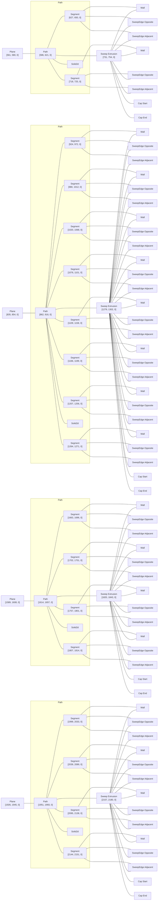

```mermaid
flowchart LR
  subgraph path2 [Path]
    2["Path<br>[586, 621, 0]"]
    3["Segment<br>[627, 650, 0]"]
    4["Segment<br>[718, 725, 0]"]
    5[Solid2d]
  end
  subgraph path16 [Path]
    16["Path<br>[862, 916, 0]"]
    17["Segment<br>[924, 972, 0]"]
    18["Segment<br>[980, 1012, 0]"]
    19["Segment<br>[1020, 1068, 0]"]
    20["Segment<br>[1076, 1101, 0]"]
    21["Segment<br>[1109, 1158, 0]"]
    22["Segment<br>[1166, 1199, 0]"]
    23["Segment<br>[1207, 1256, 0]"]
    24["Segment<br>[1264, 1271, 0]"]
    25[Solid2d]
  end
  subgraph path54 [Path]
    54["Path<br>[1614, 1657, 0]"]
    55["Segment<br>[1663, 1696, 0]"]
    56["Segment<br>[1702, 1751, 0]"]
    57["Segment<br>[1757, 1801, 0]"]
    58["Segment<br>[1807, 1814, 0]"]
    59[Solid2d]
  end
  subgraph path76 [Path]
    76["Path<br>[1951, 1993, 0]"]
    77["Segment<br>[1999, 2033, 0]"]
    78["Segment<br>[2039, 2089, 0]"]
    79["Segment<br>[2095, 2138, 0]"]
    80["Segment<br>[2144, 2151, 0]"]
    81[Solid2d]
  end
  1["Plane<br>[561, 580, 0]"]
  6["Sweep Extrusion<br>[731, 754, 0]"]
  7[Wall]
  8[Wall]
  9["Cap Start"]
  10["Cap End"]
  11["SweepEdge Opposite"]
  12["SweepEdge Adjacent"]
  13["SweepEdge Opposite"]
  14["SweepEdge Adjacent"]
  15["Plane<br>[835, 854, 0]"]
  26["Sweep Extrusion<br>[1279, 1302, 0]"]
  27[Wall]
  28[Wall]
  29[Wall]
  30[Wall]
  31[Wall]
  32[Wall]
  33[Wall]
  34[Wall]
  35["Cap Start"]
  36["Cap End"]
  37["SweepEdge Opposite"]
  38["SweepEdge Adjacent"]
  39["SweepEdge Opposite"]
  40["SweepEdge Adjacent"]
  41["SweepEdge Opposite"]
  42["SweepEdge Adjacent"]
  43["SweepEdge Opposite"]
  44["SweepEdge Adjacent"]
  45["SweepEdge Opposite"]
  46["SweepEdge Adjacent"]
  47["SweepEdge Opposite"]
  48["SweepEdge Adjacent"]
  49["SweepEdge Opposite"]
  50["SweepEdge Adjacent"]
  51["SweepEdge Opposite"]
  52["SweepEdge Adjacent"]
  53["Plane<br>[1589, 1608, 0]"]
  60["Sweep Extrusion<br>[1820, 1843, 0]"]
  61[Wall]
  62[Wall]
  63[Wall]
  64[Wall]
  65["Cap Start"]
  66["Cap End"]
  67["SweepEdge Opposite"]
  68["SweepEdge Adjacent"]
  69["SweepEdge Opposite"]
  70["SweepEdge Adjacent"]
  71["SweepEdge Opposite"]
  72["SweepEdge Adjacent"]
  73["SweepEdge Opposite"]
  74["SweepEdge Adjacent"]
  75["Plane<br>[1926, 1945, 0]"]
  82["Sweep Extrusion<br>[2157, 2180, 0]"]
  83[Wall]
  84[Wall]
  85[Wall]
  86[Wall]
  87["Cap Start"]
  88["Cap End"]
  89["SweepEdge Opposite"]
  90["SweepEdge Adjacent"]
  91["SweepEdge Opposite"]
  92["SweepEdge Adjacent"]
  93["SweepEdge Opposite"]
  94["SweepEdge Adjacent"]
  95["SweepEdge Opposite"]
  96["SweepEdge Adjacent"]
  1 --- 2
  2 --- 3
  2 --- 4
  2 ---- 6
  2 --- 5
  3 --- 7
  3 --- 11
  3 --- 12
  4 --- 8
  4 --- 13
  4 --- 14
  6 --- 7
  6 --- 8
  6 --- 9
  6 --- 10
  6 --- 11
  6 --- 12
  6 --- 13
  6 --- 14
  15 --- 16
  16 --- 17
  16 --- 18
  16 --- 19
  16 --- 20
  16 --- 21
  16 --- 22
  16 --- 23
  16 --- 24
  16 ---- 26
  16 --- 25
  17 --- 34
  17 --- 51
  17 --- 52
  18 --- 33
  18 --- 49
  18 --- 50
  19 --- 32
  19 --- 47
  19 --- 48
  20 --- 31
  20 --- 45
  20 --- 46
  21 --- 30
  21 --- 43
  21 --- 44
  22 --- 29
  22 --- 41
  22 --- 42
  23 --- 28
  23 --- 39
  23 --- 40
  24 --- 27
  24 --- 37
  24 --- 38
  26 --- 27
  26 --- 28
  26 --- 29
  26 --- 30
  26 --- 31
  26 --- 32
  26 --- 33
  26 --- 34
  26 --- 35
  26 --- 36
  26 --- 37
  26 --- 38
  26 --- 39
  26 --- 40
  26 --- 41
  26 --- 42
  26 --- 43
  26 --- 44
  26 --- 45
  26 --- 46
  26 --- 47
  26 --- 48
  26 --- 49
  26 --- 50
  26 --- 51
  26 --- 52
  53 --- 54
  54 --- 55
  54 --- 56
  54 --- 57
  54 --- 58
  54 ---- 60
  54 --- 59
  55 --- 64
  55 --- 73
  55 --- 74
  56 --- 63
  56 --- 71
  56 --- 72
  57 --- 62
  57 --- 69
  57 --- 70
  58 --- 61
  58 --- 67
  58 --- 68
  60 --- 61
  60 --- 62
  60 --- 63
  60 --- 64
  60 --- 65
  60 --- 66
  60 --- 67
  60 --- 68
  60 --- 69
  60 --- 70
  60 --- 71
  60 --- 72
  60 --- 73
  60 --- 74
  75 --- 76
  76 --- 77
  76 --- 78
  76 --- 79
  76 --- 80
  76 ---- 82
  76 --- 81
  77 --- 83
  77 --- 89
  77 --- 90
  78 --- 84
  78 --- 91
  78 --- 92
  79 --- 85
  79 --- 93
  79 --- 94
  80 --- 86
  80 --- 95
  80 --- 96
  82 --- 83
  82 --- 84
  82 --- 85
  82 --- 86
  82 --- 87
  82 --- 88
  82 --- 89
  82 --- 90
  82 --- 91
  82 --- 92
  82 --- 93
  82 --- 94
  82 --- 95
  82 --- 96
```
