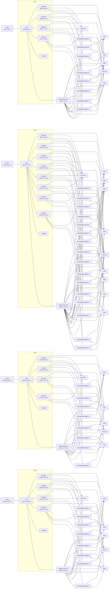

```mermaid
flowchart LR
  subgraph path5 [Path]
    5["Path<br>[585, 620, 0]"]
    9["Segment<br>[626, 649, 0]"]
    10["Segment<br>[655, 681, 0]"]
    11["Segment<br>[687, 711, 0]"]
    12["Segment<br>[717, 724, 0]"]
    32[Solid2d]
  end
  subgraph path6 [Path]
    6["Path<br>[859, 913, 0]"]
    13["Segment<br>[921, 962, 0]"]
    14["Segment<br>[970, 1002, 0]"]
    15["Segment<br>[1010, 1051, 0]"]
    16["Segment<br>[1059, 1084, 0]"]
    17["Segment<br>[1092, 1134, 0]"]
    18["Segment<br>[1142, 1175, 0]"]
    19["Segment<br>[1183, 1225, 0]"]
    20["Segment<br>[1233, 1240, 0]"]
    31[Solid2d]
  end
  subgraph path7 [Path]
    7["Path<br>[1553, 1596, 0]"]
    21["Segment<br>[1602, 1635, 0]"]
    22["Segment<br>[1641, 1683, 0]"]
    23["Segment<br>[1689, 1733, 0]"]
    24["Segment<br>[1739, 1746, 0]"]
    29[Solid2d]
  end
  subgraph path8 [Path]
    8["Path<br>[1881, 1923, 0]"]
    25["Segment<br>[1929, 1963, 0]"]
    26["Segment<br>[1969, 2012, 0]"]
    27["Segment<br>[2018, 2061, 0]"]
    28["Segment<br>[2067, 2074, 0]"]
    30[Solid2d]
  end
  1["Plane<br>[562, 579, 0]"]
  2["Plane<br>[834, 851, 0]"]
  3["Plane<br>[1530, 1547, 0]"]
  4["Plane<br>[1858, 1875, 0]"]
  33["Sweep Extrusion<br>[730, 753, 0]"]
  34["Sweep Extrusion<br>[1248, 1271, 0]"]
  35["Sweep Extrusion<br>[1752, 1775, 0]"]
  36["Sweep Extrusion<br>[2080, 2103, 0]"]
  37[Wall]
  38[Wall]
  39[Wall]
  40[Wall]
  41[Wall]
  42[Wall]
  43[Wall]
  44[Wall]
  45[Wall]
  46[Wall]
  47[Wall]
  48[Wall]
  49[Wall]
  50[Wall]
  51[Wall]
  52[Wall]
  53[Wall]
  54[Wall]
  55[Wall]
  56[Wall]
  57["Cap Start"]
  58["Cap Start"]
  59["Cap Start"]
  60["Cap Start"]
  61["Cap End"]
  62["Cap End"]
  63["Cap End"]
  64["Cap End"]
  65["SweepEdge Opposite"]
  66["SweepEdge Opposite"]
  67["SweepEdge Opposite"]
  68["SweepEdge Opposite"]
  69["SweepEdge Opposite"]
  70["SweepEdge Opposite"]
  71["SweepEdge Opposite"]
  72["SweepEdge Opposite"]
  73["SweepEdge Opposite"]
  74["SweepEdge Opposite"]
  75["SweepEdge Opposite"]
  76["SweepEdge Opposite"]
  77["SweepEdge Opposite"]
  78["SweepEdge Opposite"]
  79["SweepEdge Opposite"]
  80["SweepEdge Opposite"]
  81["SweepEdge Opposite"]
  82["SweepEdge Opposite"]
  83["SweepEdge Opposite"]
  84["SweepEdge Opposite"]
  85["SweepEdge Adjacent"]
  86["SweepEdge Adjacent"]
  87["SweepEdge Adjacent"]
  88["SweepEdge Adjacent"]
  89["SweepEdge Adjacent"]
  90["SweepEdge Adjacent"]
  91["SweepEdge Adjacent"]
  92["SweepEdge Adjacent"]
  93["SweepEdge Adjacent"]
  94["SweepEdge Adjacent"]
  95["SweepEdge Adjacent"]
  96["SweepEdge Adjacent"]
  97["SweepEdge Adjacent"]
  98["SweepEdge Adjacent"]
  99["SweepEdge Adjacent"]
  100["SweepEdge Adjacent"]
  101["SweepEdge Adjacent"]
  102["SweepEdge Adjacent"]
  103["SweepEdge Adjacent"]
  104["SweepEdge Adjacent"]
  1 --- 5
  2 --- 6
  3 --- 7
  4 --- 8
  5 --- 9
  5 --- 10
  5 --- 11
  5 --- 12
  5 --- 32
  5 ---- 33
  6 --- 13
  6 --- 14
  6 --- 15
  6 --- 16
  6 --- 17
  6 --- 18
  6 --- 19
  6 --- 20
  6 --- 31
  6 ---- 34
  7 --- 21
  7 --- 22
  7 --- 23
  7 --- 24
  7 --- 29
  7 ---- 35
  8 --- 25
  8 --- 26
  8 --- 27
  8 --- 28
  8 --- 30
  8 ---- 36
  9 --- 40
  9 x--> 57
  9 --- 66
  9 --- 85
  10 --- 38
  10 x--> 57
  10 --- 65
  10 --- 88
  11 --- 37
  11 x--> 57
  11 --- 68
  11 --- 87
  12 --- 39
  12 x--> 57
  12 --- 67
  12 --- 86
  13 --- 53
  13 x--> 60
  13 --- 80
  13 --- 102
  14 --- 54
  14 x--> 60
  14 --- 79
  14 --- 99
  15 --- 51
  15 x--> 60
  15 --- 84
  15 --- 98
  16 --- 50
  16 x--> 60
  16 --- 77
  16 --- 101
  17 --- 52
  17 x--> 60
  17 --- 82
  17 --- 97
  18 --- 55
  18 x--> 60
  18 --- 81
  18 --- 103
  19 --- 56
  19 x--> 60
  19 --- 83
  19 --- 104
  20 --- 49
  20 x--> 60
  20 --- 78
  20 --- 100
  21 --- 43
  21 x--> 58
  21 --- 69
  21 --- 89
  22 --- 41
  22 x--> 58
  22 --- 71
  22 --- 90
  23 --- 42
  23 x--> 58
  23 --- 72
  23 --- 91
  24 --- 44
  24 x--> 58
  24 --- 70
  24 --- 92
  25 --- 46
  25 x--> 59
  25 --- 76
  25 --- 93
  26 --- 47
  26 x--> 59
  26 --- 74
  26 --- 96
  27 --- 45
  27 x--> 59
  27 --- 73
  27 --- 94
  28 --- 48
  28 x--> 59
  28 --- 75
  28 --- 95
  33 --- 37
  33 --- 38
  33 --- 39
  33 --- 40
  33 --- 57
  33 --- 61
  33 --- 65
  33 --- 66
  33 --- 67
  33 --- 68
  33 --- 85
  33 --- 86
  33 --- 87
  33 --- 88
  34 --- 49
  34 --- 50
  34 --- 51
  34 --- 52
  34 --- 53
  34 --- 54
  34 --- 55
  34 --- 56
  34 --- 60
  34 --- 64
  34 --- 77
  34 --- 78
  34 --- 79
  34 --- 80
  34 --- 81
  34 --- 82
  34 --- 83
  34 --- 84
  34 --- 97
  34 --- 98
  34 --- 99
  34 --- 100
  34 --- 101
  34 --- 102
  34 --- 103
  34 --- 104
  35 --- 41
  35 --- 42
  35 --- 43
  35 --- 44
  35 --- 58
  35 --- 62
  35 --- 69
  35 --- 70
  35 --- 71
  35 --- 72
  35 --- 89
  35 --- 90
  35 --- 91
  35 --- 92
  36 --- 45
  36 --- 46
  36 --- 47
  36 --- 48
  36 --- 59
  36 --- 63
  36 --- 73
  36 --- 74
  36 --- 75
  36 --- 76
  36 --- 93
  36 --- 94
  36 --- 95
  36 --- 96
  68 <--x 37
  87 <--x 37
  88 <--x 37
  65 <--x 38
  85 <--x 38
  88 <--x 38
  67 <--x 39
  86 <--x 39
  87 <--x 39
  66 <--x 40
  85 <--x 40
  86 <--x 40
  71 <--x 41
  89 <--x 41
  90 <--x 41
  72 <--x 42
  90 <--x 42
  91 <--x 42
  69 <--x 43
  89 <--x 43
  92 <--x 43
  70 <--x 44
  91 <--x 44
  92 <--x 44
  73 <--x 45
  94 <--x 45
  96 <--x 45
  76 <--x 46
  93 <--x 46
  95 <--x 46
  74 <--x 47
  93 <--x 47
  96 <--x 47
  75 <--x 48
  94 <--x 48
  95 <--x 48
  78 <--x 49
  100 <--x 49
  104 <--x 49
  77 <--x 50
  98 <--x 50
  101 <--x 50
  84 <--x 51
  98 <--x 51
  99 <--x 51
  82 <--x 52
  97 <--x 52
  101 <--x 52
  80 <--x 53
  100 <--x 53
  102 <--x 53
  79 <--x 54
  99 <--x 54
  102 <--x 54
  81 <--x 55
  97 <--x 55
  103 <--x 55
  83 <--x 56
  103 <--x 56
  104 <--x 56
  65 <--x 61
  66 <--x 61
  67 <--x 61
  68 <--x 61
  69 <--x 62
  70 <--x 62
  71 <--x 62
  72 <--x 62
  73 <--x 63
  74 <--x 63
  75 <--x 63
  76 <--x 63
  77 <--x 64
  78 <--x 64
  79 <--x 64
  80 <--x 64
  81 <--x 64
  82 <--x 64
  83 <--x 64
  84 <--x 64
```
