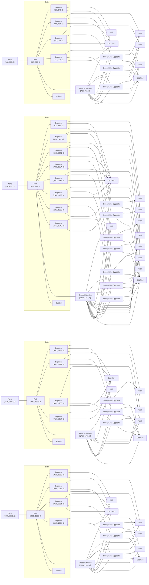

```mermaid
flowchart LR
  subgraph path2 [Path]
    2["Path<br>[585, 620, 0]"]
    3["Segment<br>[626, 649, 0]"]
    4["Segment<br>[655, 681, 0]"]
    5["Segment<br>[687, 711, 0]"]
    6["Segment<br>[717, 724, 0]"]
    7[Solid2d]
  end
  subgraph path19 [Path]
    19["Path<br>[859, 913, 0]"]
    20["Segment<br>[921, 962, 0]"]
    21["Segment<br>[970, 1002, 0]"]
    22["Segment<br>[1010, 1051, 0]"]
    23["Segment<br>[1059, 1084, 0]"]
    24["Segment<br>[1092, 1134, 0]"]
    25["Segment<br>[1142, 1175, 0]"]
    26["Segment<br>[1183, 1225, 0]"]
    27["Segment<br>[1233, 1240, 0]"]
    28[Solid2d]
  end
  subgraph path48 [Path]
    48["Path<br>[1553, 1596, 0]"]
    49["Segment<br>[1602, 1635, 0]"]
    50["Segment<br>[1641, 1683, 0]"]
    51["Segment<br>[1689, 1733, 0]"]
    52["Segment<br>[1739, 1746, 0]"]
    53[Solid2d]
  end
  subgraph path65 [Path]
    65["Path<br>[1881, 1923, 0]"]
    66["Segment<br>[1929, 1963, 0]"]
    67["Segment<br>[1969, 2012, 0]"]
    68["Segment<br>[2018, 2061, 0]"]
    69["Segment<br>[2067, 2074, 0]"]
    70[Solid2d]
  end
  1["Plane<br>[562, 579, 0]"]
  8["Sweep Extrusion<br>[730, 753, 0]"]
  9[Wall]
  10[Wall]
  11[Wall]
  12[Wall]
  13["Cap Start"]
  14["Cap End"]
  15["SweepEdge Opposite"]
  16["SweepEdge Opposite"]
  17["SweepEdge Opposite"]
  18["Plane<br>[834, 851, 0]"]
  29["Sweep Extrusion<br>[1248, 1271, 0]"]
  30[Wall]
  31[Wall]
  32[Wall]
  33[Wall]
  34[Wall]
  35[Wall]
  36[Wall]
  37[Wall]
  38["Cap Start"]
  39["Cap End"]
  40["SweepEdge Opposite"]
  41["SweepEdge Opposite"]
  42["SweepEdge Opposite"]
  43["SweepEdge Opposite"]
  44["SweepEdge Opposite"]
  45["SweepEdge Opposite"]
  46["SweepEdge Opposite"]
  47["Plane<br>[1530, 1547, 0]"]
  54["Sweep Extrusion<br>[1752, 1775, 0]"]
  55[Wall]
  56[Wall]
  57[Wall]
  58[Wall]
  59["Cap Start"]
  60["Cap End"]
  61["SweepEdge Opposite"]
  62["SweepEdge Opposite"]
  63["SweepEdge Opposite"]
  64["Plane<br>[1858, 1875, 0]"]
  71["Sweep Extrusion<br>[2080, 2103, 0]"]
  72[Wall]
  73[Wall]
  74[Wall]
  75[Wall]
  76["Cap Start"]
  77["Cap End"]
  78["SweepEdge Opposite"]
  79["SweepEdge Opposite"]
  80["SweepEdge Opposite"]
  1 --- 2
  2 --- 3
  2 --- 4
  2 --- 5
  2 --- 6
  2 ---- 8
  2 --- 7
  3 --- 9
  3 x--> 13
  4 --- 10
  4 --- 15
  4 x--> 13
  5 --- 11
  5 --- 16
  5 x--> 13
  6 --- 12
  6 --- 17
  6 x--> 13
  8 --- 9
  8 --- 10
  8 --- 11
  8 --- 12
  8 --- 13
  8 --- 14
  8 --- 15
  8 --- 16
  8 --- 17
  15 <--x 10
  15 <--x 14
  16 <--x 11
  16 <--x 14
  17 <--x 12
  17 <--x 14
  18 --- 19
  19 --- 20
  19 --- 21
  19 --- 22
  19 --- 23
  19 --- 24
  19 --- 25
  19 --- 26
  19 --- 27
  19 ---- 29
  19 --- 28
  20 --- 37
  20 --- 46
  20 x--> 38
  21 --- 36
  21 --- 45
  21 x--> 38
  22 --- 35
  22 --- 44
  22 x--> 38
  23 --- 34
  23 --- 43
  23 x--> 38
  24 --- 33
  24 --- 42
  24 x--> 38
  25 --- 32
  25 --- 41
  25 x--> 38
  26 --- 31
  26 --- 40
  26 x--> 38
  27 --- 30
  27 x--> 38
  29 --- 30
  29 --- 31
  29 --- 32
  29 --- 33
  29 --- 34
  29 --- 35
  29 --- 36
  29 --- 37
  29 --- 38
  29 --- 39
  29 --- 40
  29 --- 41
  29 --- 42
  29 --- 43
  29 --- 44
  29 --- 45
  29 --- 46
  40 <--x 31
  40 <--x 39
  41 <--x 32
  41 <--x 39
  42 <--x 33
  42 <--x 39
  43 <--x 34
  43 <--x 39
  44 <--x 35
  44 <--x 39
  45 <--x 36
  45 <--x 39
  46 <--x 37
  46 <--x 39
  47 --- 48
  48 --- 49
  48 --- 50
  48 --- 51
  48 --- 52
  48 ---- 54
  48 --- 53
  49 --- 58
  49 --- 63
  49 x--> 59
  50 --- 57
  50 --- 62
  50 x--> 59
  51 --- 56
  51 --- 61
  51 x--> 59
  52 --- 55
  52 x--> 59
  54 --- 55
  54 --- 56
  54 --- 57
  54 --- 58
  54 --- 59
  54 --- 60
  54 --- 61
  54 --- 62
  54 --- 63
  61 <--x 56
  61 <--x 60
  62 <--x 57
  62 <--x 60
  63 <--x 58
  63 <--x 60
  64 --- 65
  65 --- 66
  65 --- 67
  65 --- 68
  65 --- 69
  65 ---- 71
  65 --- 70
  66 --- 72
  66 x--> 76
  67 --- 73
  67 --- 78
  67 x--> 76
  68 --- 74
  68 --- 79
  68 x--> 76
  69 --- 75
  69 --- 80
  69 x--> 76
  71 --- 72
  71 --- 73
  71 --- 74
  71 --- 75
  71 --- 76
  71 --- 77
  71 --- 78
  71 --- 79
  71 --- 80
  78 <--x 73
  78 <--x 77
  79 <--x 74
  79 <--x 77
  80 <--x 75
  80 <--x 77
```
